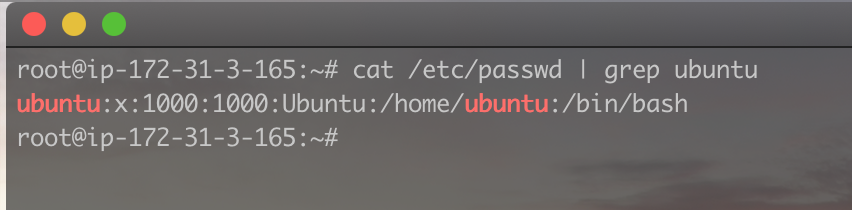

# Basic Linux commands

### Part 1 - File Manipulation

- `sudo`  
   This command is used by non root users to run tasks/commands that reqiure root or administrative privelidge.
  
- `pwd`  
   This command is used to print the current or present working directory .
  
- `cd`  
   This command is used to change the current directory. It is usully used with the name of the directory that needs to be changed to.
  
- `ls`  
  The list command is used to list the content of a directory. This command can be used with several flags for example:

  - ls -a : lists hidden files in a directory.
  - ls -lh : lists the files in a directory and their size.
  - ls - R list the files in a directory as well as the files in all sub directorys.

  

- `cat`  
   The `cat` command is used to read the content of a file. It can also be used to merge the contents of multiple files.
  
- `cp`  
   The `cp` command is used to copy contents of a file, a file itself or even a directory. When used with the `-R` flag, it can copy the content of an entire directory from one location to another.
  
- `mv`  
   This command is used to move files from one location to another. It can also be used to rename a file.
  
- `mkdir`  
   The `mkdir` command is used to create a new directory.
  
- `rmdir`  
   This command is used to remove or delete an empty directory.
  
- `rm`  
   The is command is used to remove or delete a file from a directory.
  
- `touch`  
   This command is used to create an empty file on Linux. Alternatively, we can use vi/vim (a text editor) to create a file and then add some conntents  
  
- `locate`  
   The `locate` command is used to search for a file in the file directory. Using this command with the flag `-i` makes the search string not case sensitive, and it can also be used with wildcards such as `*` to make the search more dynamic. For example `sudo locate *.txt`  
  
- `find`
  This is very similar to the `locate` command. The `find` command is also used to search for a file in directory using different attributes such as -name, -d directory etc.
  
- `grep`  
   The `grep` command or global regular expression command also helps in searching for files or contents of a directory. It can be used it several other commands such as `cat`, `ls` etc. It can be used to limit or streamline the output of our search to something more specific. It comes in very handy when going through large texts.  
   For example, running the command `cat /etc/passwd` would list a lot of contents about users of the system. But with the `grep` command, it can be limited to a particular user with the following command `cat /etc/passwd | grep ubuntu`
  
- `df`  
   This command is used to print useful information about the disk on the linux machine.
  
