# Designing a 3-Tier Web Application using NFS in AWS

In the last project, we designed a Web Application using Logical Volume Management (LVM). In this section, we will build on that by creating a web application and configuring the server's storage to be accessed over the network by other servers. In other words, we will configure to storage to be accessed by several servers simultanously.

Network File System (NFS) is a distributed file system protocol that allows a user on a client computer to access files over a network as if the files were on the local hard drive. It is commonly used in UNIX and Linux environments for sharing files and directories between machines.

It is commonly used for various purposes, such as centralizing user home directories, sharing software installations across multiple servers, and facilitating data sharing in clustered environments. In this project, we will be using NFS for file sharing. The diagram below depicits the architecure we will be creating.

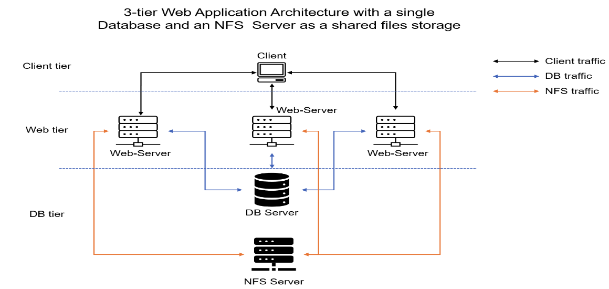

**<ins>Project Requirements</ins>**  
To implement the architecture above, the following would be required:

1. An AWS Account
2. EC2 Instances  
   a. Linux Red Hat for the Web Servers (3)
   b. Ubuntu Linux for the Database (1)
   c. Linux Red Hat for the NFS Storage (1)
3. GitHub account

Let's start by configure the NFS Storage.

### Part 1 - Creating and configuring the NFS Storage

For this, we will be using a specific version of Red Hat Linux (RHEL-8.6.0_HVM-20220503-x86_64-2-Hourly2-GP2) The Image ID is **ami-035c5dc086849b5de**.

1.  To begin, let's provision the `Storage Server` using the RHEL-8.6.0_HVM-20220503-x86_64-2-Hourly2-GP2 image. From your AWS Console, click AMI under the Images menu. From the dropdown menu just before the search bar by the top right corner, select Public Images, and then search for the image using the ami - ami-035c5dc086849b5de. This should filter the Public Images to this one we are interested in. Select the image and the click Launch Instance from AMI button.
    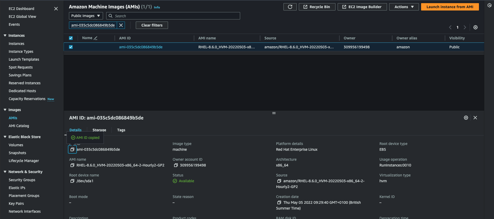
2.  Next, we will attach Three (3) Volumes, 4GB each to the `Storage Server`. This would be used to confirgure the LVM. Remember, the Volumes must be created in the same AZ as the Storage Server.
    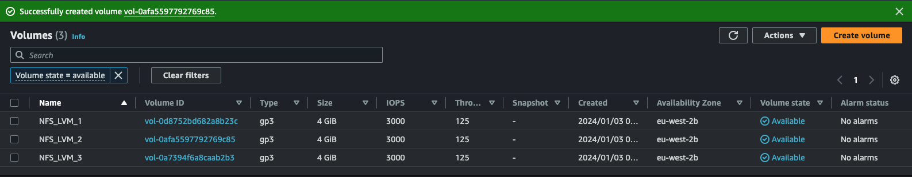
3.  After attaching the volumes to our `Storage Server`, ssh to the server and then configure the LVM.
    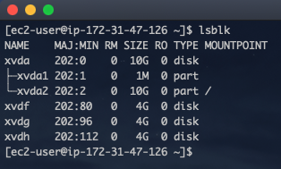

        The image above shows the attached volumes.

4.  Now, let's configure the LVM by using the `pvcreate` commands.
    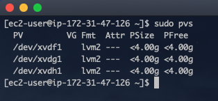
5.  Next, we group the volumes and name it `nfs_vg`, then we create three (3) logical volumes using the `lvcreate` command. For this project, let's name the logical volumes `lv-opts`, `lv-apps` and `lv-logs`.  
    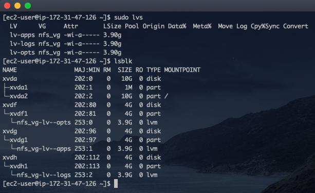
6.  In the previous projects, we used the `ext4` file system. However, we will be using the `xfs` file system this time around. XFS (eXtended File System) is a high-performance, scalable file system designed for Unix and Unix-like operating systems. This file system is well suited for NFS applications. To create the `xfs` extentions, run the code below:
    > sudo mkfs -t xfs /dev/nfs_vg/lv-opts  
    > sudo mkfs -t xfs /dev/nfs_vg/lv-apps  
    > sudo mkfs -t xfs /dev/nfs_vg/lv-logs
7.  Now, lets create the mount points for the logical volumes as follows: - /mnt - The root directory for the mount points - /mnt/logs for `lv-logs` - /mnt/apps for `lv-apps` - /mnt/opts for `lv-opts`  
     Remember to back up the /var/logs directory beofore mounting it to `lv-logs`.
    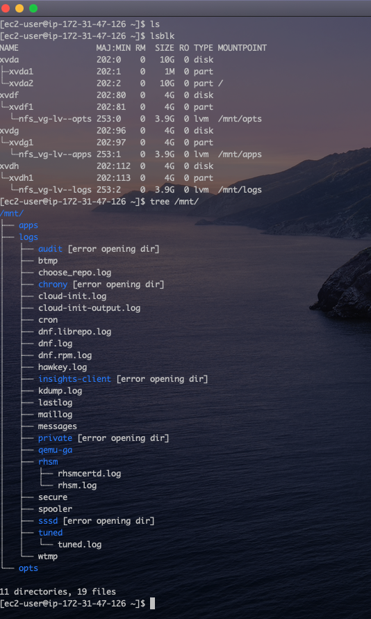  
    The image aboves shows the mount points for the LMVs, as well as the directory structure for our mount points.

8.  The next step will be to update the `/etc/fstab` file to automatically mount our newly created file systems at startup.
    The modified `/etc/fstab` file show look like the image below. However, use the `blkid` command to retrieve the UUID for your drives.
    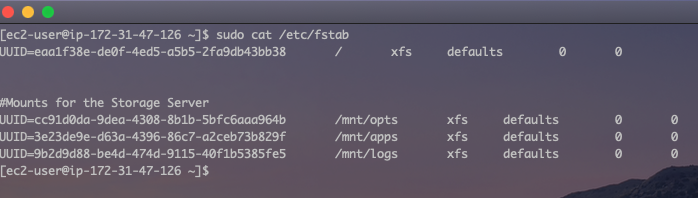
9.  Now mount the drives by running the command `sudo mount -a` and then `sudo systemctl daemon-reload`. Confirm everything looks good by running `df -h`.
    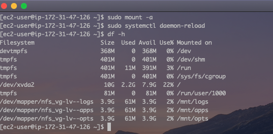

We've configure the LVM on our `Storage Server`, now let's configure NFS.

10. Let's install the NFS utils, and then start the NFS service. > `bash

    > sudo yum -y update
    > sudo yum install nfs-utils -y
    > sudo systemctl start nfs-server
    > sudo systemctl enable nfs-server
    > sudo systemctl status nfs-server

    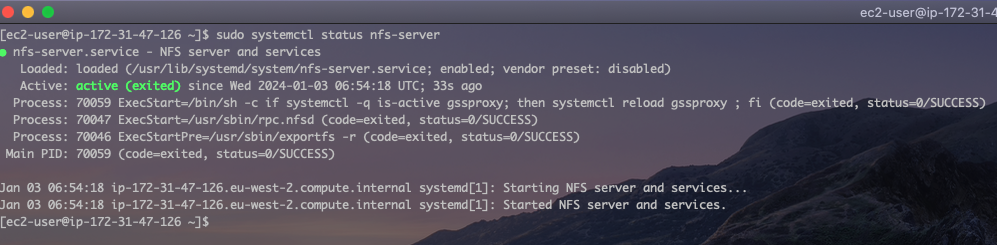

11. Next, we need to edit the permissions of the mount directories to make them accessible by the web servers.

    > ```bash
    > sudo chown -R nobody: /mnt/apps
    > sudo chown -R nobody: /mnt/logs
    > sudo chown -R nobody: /mnt/opt
    >
    > sudo chmod -R 764 /mnt/apps
    > sudo chmod -R 764 /mnt/logs
    > sudo chmod -R 764 /mnt/opt
    >
    > ```

    The first set of commands change the ownership of the folders to the `Nobody` user. To confirm that user exists, run the command `sudo cat /etc/passwd | grep nobody`.  
    The second set of commands change the permission different users and groups have to the folders. The 7 signifies Read Write and Execute permission to the owner, the 6 signifies Read and Write permission to the group, while 4 signifies just Read permission to others.

12. Next, we will edit the `/etc/exports` file. This file defines which directories are exported, who can access them, and what level of access they have. Let's edit the file with the following code below:

    > ```bash
    > /mnt/apps 172.31.32.0/20(rw,sync,no_all_squash,no_root_squash)
    > /mnt/logs 172.31.32.0/20(rw,sync,no_all_squash,no_root_squash)
    > /mnt/opts 172.31.32.0/20(rw,sync,no_all_squash,no_root_squash)
    > ```

    - The the code above, we used the subnet CIDR `172.31.32.0/20` to give permission to all ip address within that subnet. You can also provide the exact ip address for the servers if you wish.
    - `rw` - Grants read and write access to the NFS clients
    - `sync` - Synchronizes changes to the file system before replying to the client. This ensures that changes are committed to stable storage before a write operation is considered complete.
    - `no_all_squash` - Disables the "all_squash" option. By default, NFS maps all users to the anonymous user (typically "nobody"). This option preserves the original user and group identities.
    - `no_root_squash` - Disables the "root_squash" option. By default, NFS prevents the root user on the client from having root access on the exported directory. This option allows the root user on the client to have root access.

13. After editing the `/etc/exports` file, we need to refresh or re export all entries listed in the file. This will make the confirguration take effect. We also need to restart the NFS server to ensure all changes are effected.  
     `sudo systemctl restart nfs-server`  
     `sudo exportfc -arv`  
     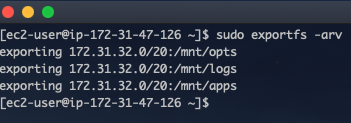

        After all has been done, we can confirm the ports NFS is running on with the command `rcpinfo -p | grep nfs`

    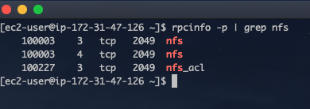

14. Finally, we need to configure the security group for the nfs server and open the following ports. This will enable the nfs clients connect to the nfs server.
    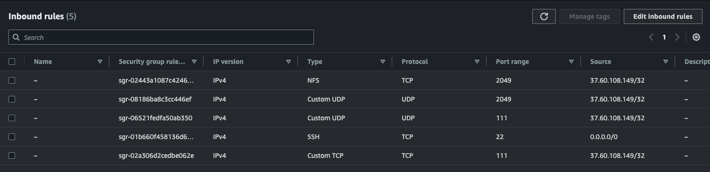

### Part 2 - Creating and Configuring the Database Server.

In this section, we will provison an EC2 Instance running Ubuntu and then install MySQL Server. I wont go over the steps involved in provisioning the server as well as install MySQL Server. I will however, go over the steps of creating the database that would be used by the Web Servers.
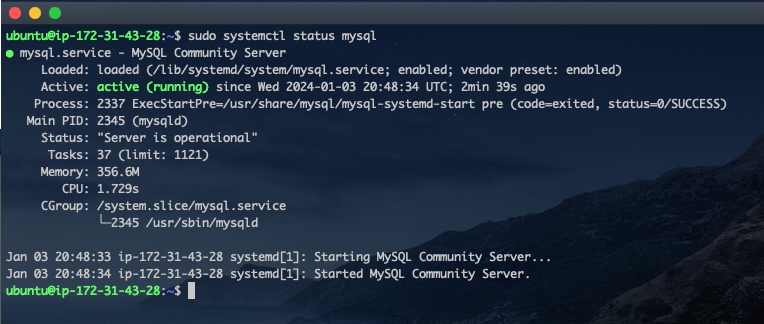
MySQL has already been installed and running as seen above. Now, let's create the database. For this project, we will be creating a database called `tooling`, and configuring the database to be accessed by all ip address running within a specific subnet CIDR. In this case `172.31.32.0/20`

- Let's start by creating the user `webaccess`, and grant the user `CREATE` permission.
  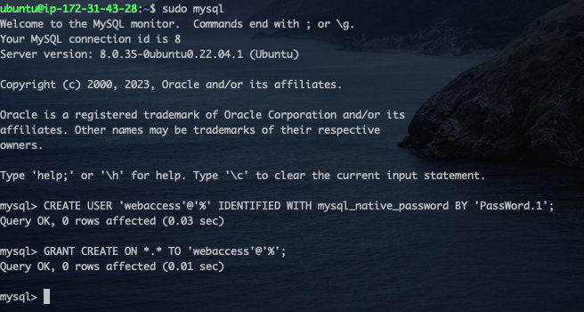
- Next, we log into the `mysql` console as the newly created `webaccess` user and then create the database `tooling`.
  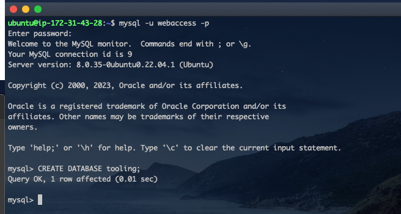

  And our Database has been created. Remember to edit the `/etc/mysql/mysql.conf.d/msqld.cnf` file to allow access from remote servers.

### Part 3 - Creating and Configuring the Web Servers
