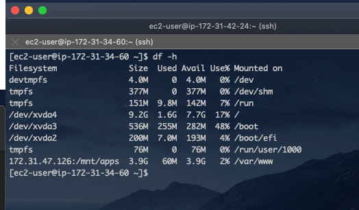
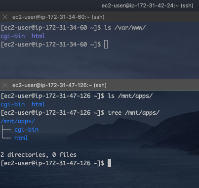
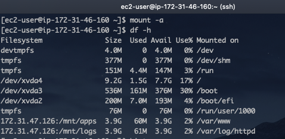
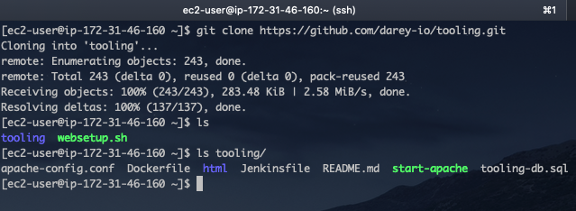
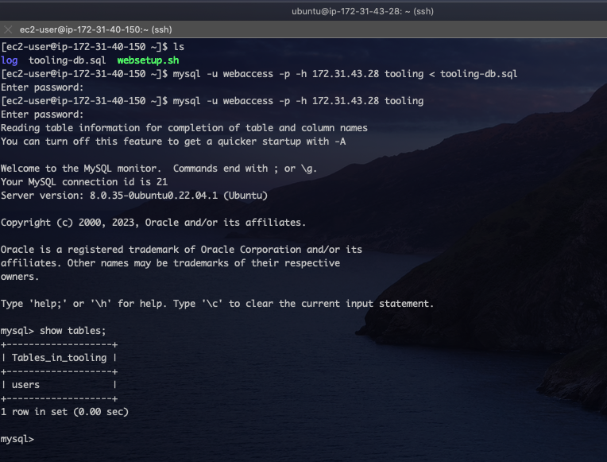
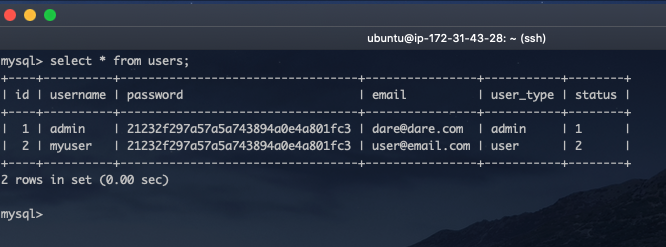
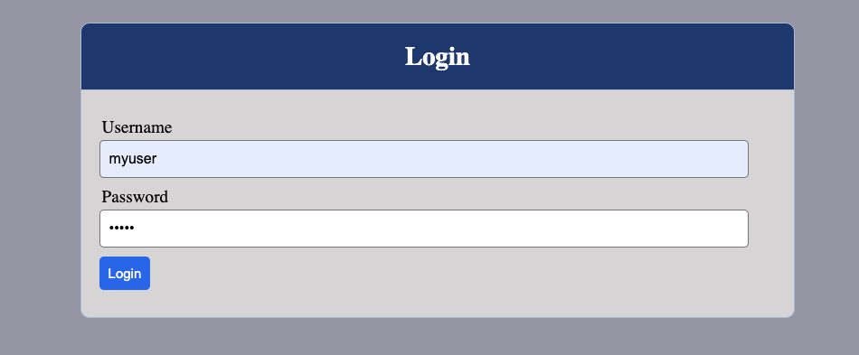
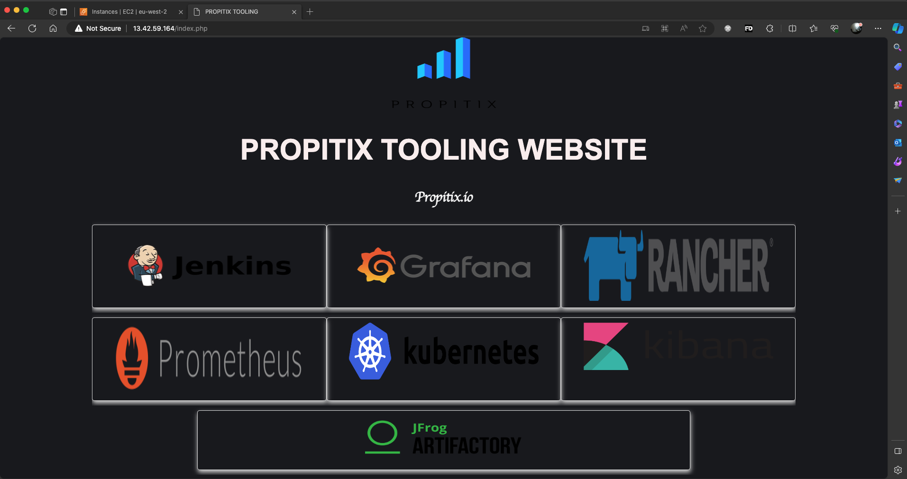

# Designing a 3-Tier Web Application using NFS in AWS

In the last project, we designed a Web Application using Logical Volume Management (LVM). In this section, we will build on that by creating a web application and configuring the server's storage to be accessed over the network by other servers. In other words, we will configure to storage to be accessed by several servers simultanously.

Network File System (NFS) is a distributed file system protocol that allows a user on a client computer to access files over a network as if the files were on the local hard drive. It is commonly used in UNIX and Linux environments for sharing files and directories between machines.

It is commonly used for various purposes, such as centralizing user home directories, sharing software installations across multiple servers, and facilitating data sharing in clustered environments. In this project, we will be using NFS for file sharing. The diagram below depicits the architecure we will be creating.


**<ins>Project Requirements</ins>**  
To implement the architecture above, the following would be required:

1. An AWS Account
2. EC2 Instances  
   a. Linux Red Hat for the Web Servers (3)
   b. Ubuntu Linux for the Database (1)
   c. Linux Red Hat for the NFS Storage (1)
3. GitHub account

Let's start by configure the NFS Storage.

### Part 1 - Creating and configuring the NFS Storage

For this, we will be using a specific version of Red Hat Linux (RHEL-8.6.0_HVM-20220503-x86_64-2-Hourly2-GP2) The Image ID is **ami-035c5dc086849b5de**.

1.  To begin, let's provision the `Storage Server` using the RHEL-8.6.0_HVM-20220503-x86_64-2-Hourly2-GP2 image. From your AWS Console, click AMI under the Images menu. From the dropdown menu just before the search bar by the top right corner, select Public Images, and then search for the image using the ami - ami-035c5dc086849b5de. This should filter the Public Images to this one we are interested in. Select the image and the click Launch Instance from AMI button.
    
2.  Next, we will attach Three (3) Volumes, 4GB each to the `Storage Server`. This would be used to confirgure the LVM. Remember, the Volumes must be created in the same AZ as the Storage Server.
    
3.  After attaching the volumes to our `Storage Server`, ssh to the server and then configure the LVM.
      
    The image above shows the attached volumes.

4.  Now, let's configure the LVM by using the `pvcreate` commands.
    
5.  Next, we group the volumes and name it `nfs_vg`, then we create three (3) logical volumes using the `lvcreate` command. For this project, let's name the logical volumes `lv-opts`, `lv-apps` and `lv-logs`.  
    
6.  In the previous projects, we used the `ext4` file system. However, we will be using the `xfs` file system this time around. XFS (eXtended File System) is a high-performance, scalable file system designed for Unix and Unix-like operating systems. This file system is well suited for NFS applications. To create the `xfs` extentions, run the code below:
    > sudo mkfs -t xfs /dev/nfs_vg/lv-opts  
    > sudo mkfs -t xfs /dev/nfs_vg/lv-apps  
    > sudo mkfs -t xfs /dev/nfs_vg/lv-logs
7.  Now, lets create the mount points for the logical volumes as follows: - /mnt - The root directory for the mount points - /mnt/logs for `lv-logs` - /mnt/apps for `lv-apps` - /mnt/opts for `lv-opts`  
     Remember to back up the /var/logs directory beofore mounting it to `lv-logs`.
      
    The image aboves shows the mount points for the LMVs, as well as the directory structure for our mount points.

8.  The next step will be to update the `/etc/fstab` file to automatically mount our newly created file systems at startup.
    The modified `/etc/fstab` file show look like the image below. However, use the `blkid` command to retrieve the UUID for your drives.
    
9.  Now mount the drives by running the command `sudo mount -a` and then `sudo systemctl daemon-reload`. Confirm everything looks good by running `df -h`.

    

We've configure the LVM on our `Storage Server`, now let's configure NFS.

10. Let's install the NFS utils, and then start the NFS service. > `bash

    > sudo yum -y update
    > sudo yum install nfs-utils -y
    > sudo systemctl start nfs-server
    > sudo systemctl enable nfs-server
    > sudo systemctl status nfs-server

    

11. Next, we need to edit the permissions of the mount directories to make them accessible by the web servers.

    > ```bash
    > sudo chown -R nobody: /mnt/apps
    > sudo chown -R nobody: /mnt/logs
    > sudo chown -R nobody: /mnt/opt
    >
    > sudo chmod -R 764 /mnt/apps
    > sudo chmod -R 764 /mnt/logs
    > sudo chmod -R 764 /mnt/opt
    >
    > ```

    The first set of commands change the ownership of the folders to the `Nobody` user. To confirm that user exists, run the command `sudo cat /etc/passwd | grep nobody`.  
    The second set of commands change the permission different users and groups have to the folders. The 7 signifies Read Write and Execute permission to the owner, the 6 signifies Read and Write permission to the group, while 4 signifies just Read permission to others.

12. Next, we will edit the `/etc/exports` file. This file defines which directories are exported, who can access them, and what level of access they have. Let's edit the file with the following code below:

    > ```bash
    > /mnt/apps 172.31.32.0/20(rw,sync,no_all_squash,no_root_squash)
    > /mnt/logs 172.31.32.0/20(rw,sync,no_all_squash,no_root_squash)
    > /mnt/opts 172.31.32.0/20(rw,sync,no_all_squash,no_root_squash)
    > ```

    - The the code above, we used the subnet CIDR `172.31.32.0/20` to give permission to all ip address within that subnet. You can also provide the exact ip address for the servers if you wish.
    - `rw` - Grants read and write access to the NFS clients
    - `sync` - Synchronizes changes to the file system before replying to the client. This ensures that changes are committed to stable storage before a write operation is considered complete.
    - `no_all_squash` - Disables the "all_squash" option. By default, NFS maps all users to the anonymous user (typically "nobody"). This option preserves the original user and group identities.
    - `no_root_squash` - Disables the "root_squash" option. By default, NFS prevents the root user on the client from having root access on the exported directory. This option allows the root user on the client to have root access.

13. After editing the `/etc/exports` file, we need to refresh or re export all entries listed in the file. This will make the confirguration take effect. We also need to restart the NFS server to ensure all changes are effected.  
     `sudo systemctl restart nfs-server`  
     `sudo exportfs -arv`  
     

        After all has been done, we can confirm the ports NFS is running on with the command `rcpinfo -p | grep nfs`

    

14. Finally, we need to configure the security group for the nfs server and open the following ports. This will enable the nfs clients connect to the nfs server.
    

### Part 2 - Creating and Configuring the Database Server.

In this section, we will provison an EC2 Instance running Ubuntu and then install MySQL Server. I wont go over the steps involved in provisioning the server as well as install MySQL Server. I will however, go over the steps of creating the database that would be used by the Web Servers.


MySQL has already been installed and running as seen above. Now, let's create the database. For this project, we will be creating a database called `tooling`, and configuring the database to be accessed by all ip address running within a specific subnet CIDR. In this case `172.31.32.0/20`

- Let's start by creating the user `webaccess`, and grant the user `CREATE` permission.
  
- Next, we log into the `mysql` console as the newly created `webaccess` user and then create the database `tooling`.
  

  And our Database has been created. Remember to edit the `/etc/mysql/mysql.conf.d/msqld.cnf` file to allow access from remote servers and also open port `3306` in the security group.

### Part 3 - Creating and Configuring the Web Servers

In this section, we will be creating three(3) Web Servers to host our website. The servers will all access the same files and well as connect to the same database. Let's begin.

- The first step is to provision three (3) EC2 Instances running Red Hat Linux. Ensure the Web Servers are provisioned in the same AZ or subnet as the NFS Server `172.31.32.0/20`
- Next, we connet to the instances via ssh and install the nfs client. This can be done by running the command below:  
  `sudo yum -y update` and  
  `sudo yum install nfs-utils nfs4-acl-tools -y`
- The next step will be to create a directory where the web application will be hosted, and then mount that directory to the `/mnt/apps` on the nfs server. To do this, let's run the following commands:  
   `sudo mkdir /var/www`  
   `sudo mount -t nfs -o rw,nosuid 172.31.47.126:/mnt/apps /var/www`

  - `mount -t nfs`. This is used to mount a file system, and th `-t` specifices the file system type to be mounted. In the case, we are mounnting the `nfs` file system.
  - `-o rw,nosuid`. This specifies the mount options. `rw` signifies read-write access, and `nosuid` prevents the execution og setuid programs.
  - `172.31.47.126:/mnt/apps`. This is the private IP Address of the nfs server, and `/mnt/apps` is the exported directory on the nfs server, and the location we intend hosting web application data.
  - `/var/www`. The local directory on the client where the NFS share will be mounted.

        The confirm the directory was mounted properly by running the `df -h` command.

      
    From the image above, we can see our directory `/var/www` has been mounted on the nfs server's `/mnt/apps` location.

- The next step will be to make this change persist even after a system reboot. We do this by modifying the `/etc/fstab` file with the code below:

  > ```bash
  > 172.31.47.126:/mnt/apps /var/www nfs defaults 0 0
  > ```

  then reload a devices by running `mount -a`.

Our nfs client has now been configured to access files from the nfs server as if the files are in the local directory. Now, lets install Apache and PhP for the web application.

- Install Apache and PhP by running the codes below:

  > sudo yum install httpd -y

  > sudo dnf install https://dl.fedoraproject.org/pub/epel/epel-release-latest-8.noarch.rpm

  > sudo dnf install dnf-utils http://rpms.remirepo.net/enterprise/remi-release-8.rpm

  > sudo dnf module reset php

  > sudo dnf module enable php:remi-7.4

  > sudo dnf install php php-opcache php-gd php-curl php-mysqlnd mysql -y

  > sudo systemctl start php-fpm

  > sudo systemctl enable php-fpm

  > sudo setsebool -P httpd_execmem 1

- Now, let's repeat the steps above for the other two (2) web servers. Beginging from installing the nfs client to installing apache and php. Lot's of repetitive configurations, and creating a bash script to automate this step would be extremely useful especially if there needed to provision 10 or more servers. Let's do that with the code below.

  > ```bash
  > !# /bin/bash
  > set -e
  > set -o pipefail
  >
  > echo "Setting up the Web Server................"
  > echo "Installing the NFS client"
  > sudo yum install nfs-utils nfs4-acl-tools -y
  > echo " "
  > echo "NFS client installed sucessfully...."
  > echo " "
  > echo "Creating the web application directory, and mounting it to the nfs server"
  > sudo mkdir /var/www
  > sudo mount -t nfs -o rw,nosuid 172.31.47.126:/mnt/apps /var/www
  > echo " "
  > echo "Directory mounted. Confirm below"
  > echo ""
  > df -h
  > echo " "
  > echo "Modifying the /ect/fstab file"
  > sudo echo "# The NFS mount information" >> /etc/fstab
  > echo "172.31.47.126:/mnt/apps /var/www nfs defaults 0 0" | sudo tee -a /etc/fstab
  > mount -a
  > echo "The file has been edited and entries mounted sucessfully."
  > echo " "
  > echo "Installing Apache and Php"
  > sudo yum install httpd -y
  > sudo dnf install https://dl.fedoraproject.org/pub/epel/epel-release-latest-8.noarch.rpm -y
  > sudo dnf module reset php
  > sudo dnf install php php-opcache php-gd php-curl php-mysqlnd -y
  > sudo systemctl start httpd
  > sudo systemctl enable httpd
  > sudo systemctl start php-fpm
  > sudo systemctl enable php-fpm
  > sudo setsebool -P httpd_execmem 1
  > echo " "
  > echo "Web Server has now been configured"
  > ```

  Save the file as` websetup.sh`, give the file execute perimission and then run the script.
  After this is done, log into the `NFS SERVER` and confirm we have the apache files in the `/mnt/apps` directory.  
  

- We also need to mount the Web Server log files to the nfs server's /mnt/logs export. To do this, we run the command below and and then modifify the `/etc/fstab` file accordingly.

  > sudo mount -t nfs -o rw,nosuid 172.31.47.126:/mnt/logs /var/log/httpd/

  > Append `172.31.47.126:/mnt/logs	/var/log/httpd	nfs	defaults	0	0` to the `/etc/fstab file`

  > mount -a  
  >   
  > Do this for the other two(2) web servers also.

The next step is to deploy our web application to the webserver. For this project, we will be using a tooling website by darey.io. The website can be fond in the [Darey.io Github Account](https://github.com/darey-io/tooling). Let's begin.

- The first step is to install git in our local system and then clone the repository
  
- Next, we copy the `html` folder from the cloned repository to our `/var/www` location. Note we need to do this just once, and the other servers will automatically have access the the `html` folder as the `/var/www` is now shared by all the web servers. This is one benefit of using `nfs` file system.
- For the application to connect to the `tooling` database we created earlier we need to make some changes to our application. Let's do the following:

  - Navigate to `/var/www/html/functions.php` and edit the file with a text editor. Ensure you use the privete ip address of the database server as well as the username and password for the database user you created earlier.

    > ```php
    > // connect to database
    > $db = mysqli_connect('172.31.43.28', 'webaccess', 'PassWord.1', 'tooling');
    > ```

  - Next, we use the `tooling-db.sql` script provided in the git repository to configure the database. From the any of the web servers, run the following command.

        > mysql -u webaccess -p -h 172.31.43.28 tooling < tooling-db.sql

        You will be prompted for the password, and the script will be executed. to confirm, log in to the mysql console and run the command `SHOW TABLES;`

    

    From the image above, we can see our `users` table has been created.

  - Still in the `mysql` console, lets run the scrip below to insert a record to the `users` table.

    > ```sql
    > INSERT INTO `users` (
    >   `id`,
    >   `username`,
    >   `password`,
    >   `email`,
    >   `user_type`,
    >   `status`
    > )
    > VALUES (
    >   2,
    >   'myuser',
    >   '21232f297a57a5a743894a0e4a801fc3',
    >   'user@email.com',
    >   'user',
    >   '2'
    > );
    > ```

    

    You should now have two records in the user table. One from the `tooling-db.sql` script and the second record we created now.

- It's now time to connect to our web application. Open the your web browser and visit `http://13.42.59.164/index.php`. Note the you have to specify the public address of any of the webservers.
  
  Provide the username `myuser` and password `admin`


**An there you have it. We've sucessfully deployed a web application on three(3) web servers using the Network File System**.
