# Continuous Integration and Continuous Delivery (CI/CD) with Jenkins

Continuous Integration (CI) and Continuous Delivery (CD) are software development practices that aim to improve the efficiency and reliability of the software development process. Jenkins is a popular open-source automation server that facilitates CI/CD by automating various stages of the software development lifecycle.

In the previous project, we created the architecture below, where we configured a Network File System/Storgae (NFS) to act as a file server to three (3) web servers. We also provisioned a database to sever the web servers, and then, we deployed a web application hosted on a GitHub repository.


In this project, we will introduce a Jenkins server to automate the deployment of the same application whenever the developers make a change to the source code by adding a feature to the application or fixing a bug.
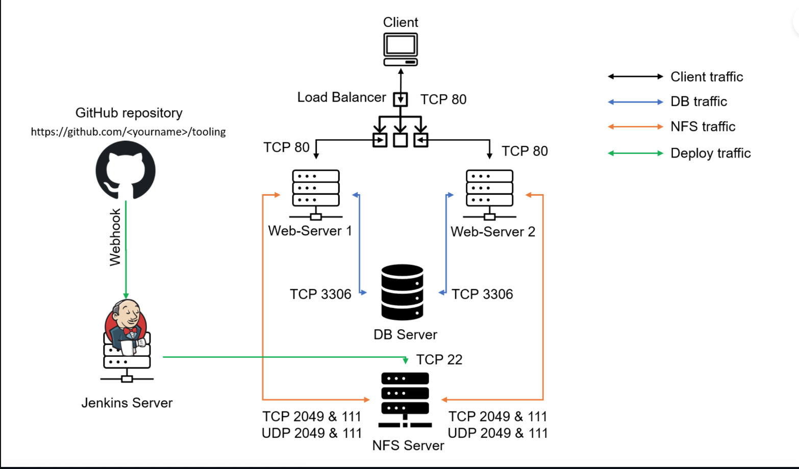

Let's begin with provisioning the Jekins Server.

### Part 1 - Installing Jenkins

1.  We will be installing Jenkins on an EC2 Instance running on Ubuntu Server 20. I'll be using T2.small instance type. The T2.micro works, but it could get really slow depending on the job you Jenkins is running. Provision the EC2 Instance then ssh into the server.
2.  From the linux console, run the following commands to install Jenkins and it's dependencies. Java is a major prerequiste to installing Jenkins.

         sudo apt -y update
         sudo apt install openjdk-17-jdk

    There are so many version of java. This `default-jdk-headless` installs the default version of the OpenJDK Java Development Kit without the graphical user interface. You can run `sudo apt search jdk` to see the list of available jdk libraries. We can check the version of java that was installed by running the command `java -version`.

    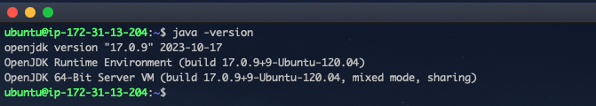

3.  Now, its time to install Jenkins. First, we need to add the Jenkins repository to our system so we can fetch the Jenkins packages from this repository.

        sudo wget -O /usr/share/keyrings/jenkins-keyring.asc \
        https://pkg.jenkins.io/debian-stable/jenkins.io-2023.key

        echo deb [signed-by=/usr/share/keyrings/jenkins-keyring.asc] \
        https://pkg.jenkins.io/debian-stable binary/ | sudo tee \
        /etc/apt/sources.list.d/jenkins.list > /dev/null

        sudo apt-get update

        sudo apt-get install jenkins -y

    The above installation details was gotten from the officail jenkins documenation from the website [jenkins.io](https://www.jenkins.io/). It's necessary to regularly obtain these installtion details from the official source as things can be moved around, and there are different links for different operating systems.
    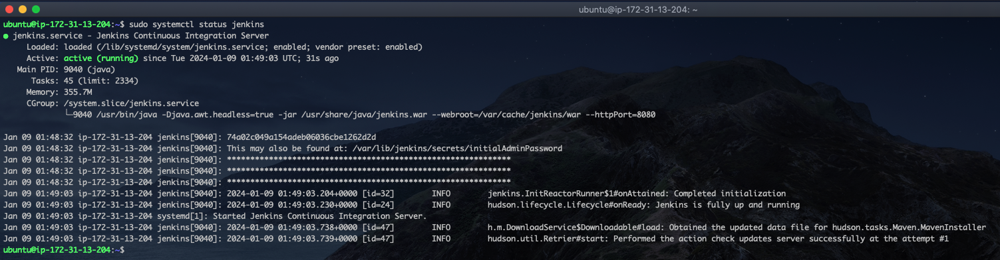
    The imgae above shows jenkins have been installed successfully, and the service is up and running.

4.  By default, Jenkins run on port 8080, and this has to be enabled from our EC2 Instance securtiy group. Once the port is opened, open your we browser and enter `http://<YOur-Server-Public-IP:8080>`. My Jenkins Server public ip is `18.169.106.131`
    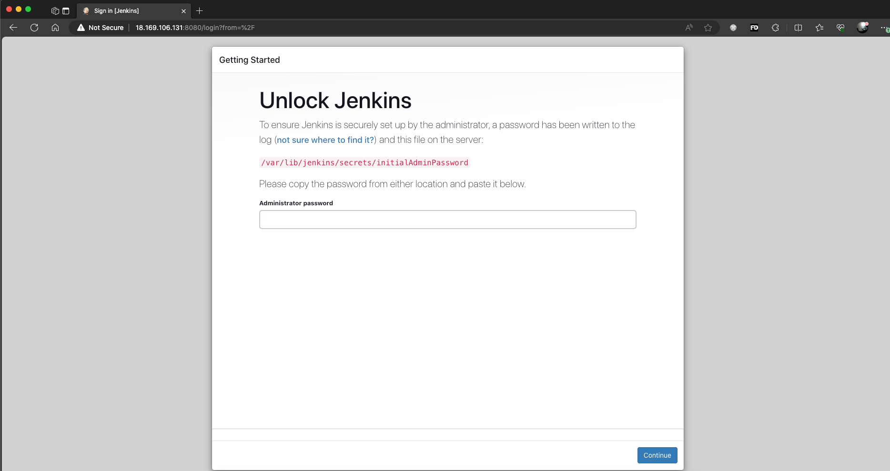
5.  Now, provide the default password for the initial log in. The path locate the default password should be provided on the webpage and it is ususallu located a `/var/lib/jenkins/secrets/initialAdminPassword`. To view the password, run the command below:

        sudo cat /var/lib/jenkins/secrets/initialAdminPassword

    Copy and paste the password to unlock Jenkins.

6.  Now, lets start configuring Jenkins with the requried plugis. In the screen below, select `Install Suggested Plugins`.
    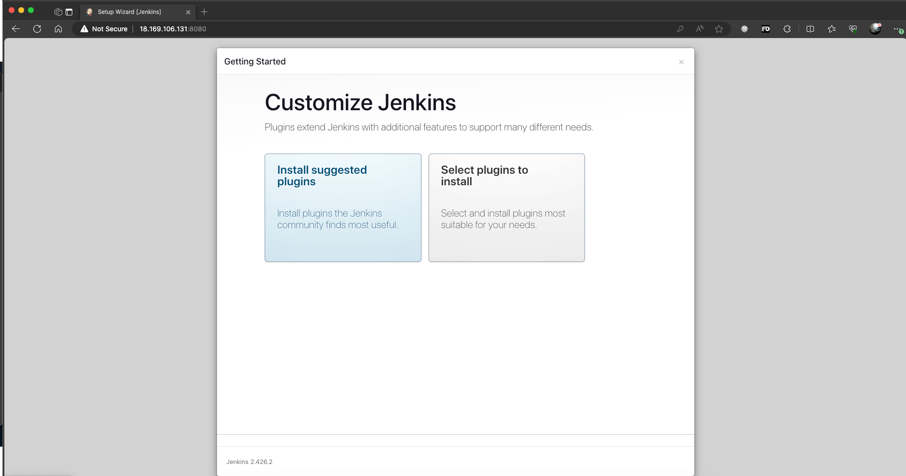
7.  After the plugin have been installed, you would be asked to create an Admin. Please create the admin account and remember the username and password, as it would be used to log into jenkins subsequently. The next page would by the Jenkins URL. Please note that the EC2 Public address was used here, and that address is bound to change. However, just save and finish the set up.
    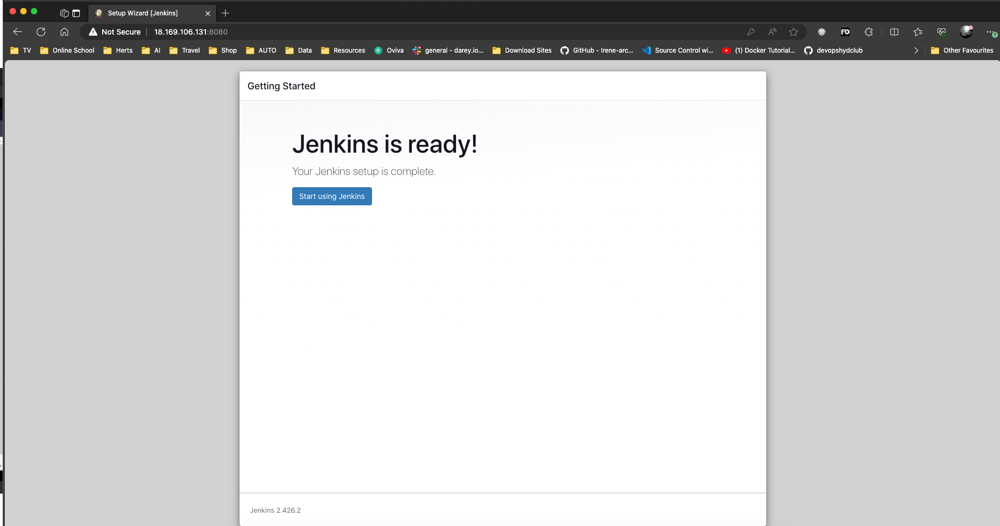

    We've sucessfully installed Jenkins and done completed the initial setup.

### Part 2 - Confirgure Jenkins to retrieve source codes from GitHub using Webhooks.

In GitHub, webhooks are a way for repositories to notify external systems about events that occur within the repository. Webhooks provide a mechanism to automatically trigger an action or actions in response to events like pushes, pull requests, issues, and more. Instead of manually polling the GitHub repository for changes, the repository can send an HTTP POST payload to a specified URL (our Jenkins Server) whenever a relevant event occurs.
So basically, with GitHub Webhooks, we can configure Jenkins to automatically build codes from a repository whenever a developer commits some codes to that repository.  
Let's begin by configuring Webooks in GitHub.

1. Navigate to the [Tooling repository](https://github.com/darey-io/tooling) by Darey.io. In a separate tab, navigate to your own github account, and make sure you are signed it.
2. In the Tooling repository above, click on the fork repository to create a copy in your github account. In the create fork window, ensure you unselect "Copy Master Branch Alone". This will ensure all branches other than the master branch if any is also copied.
   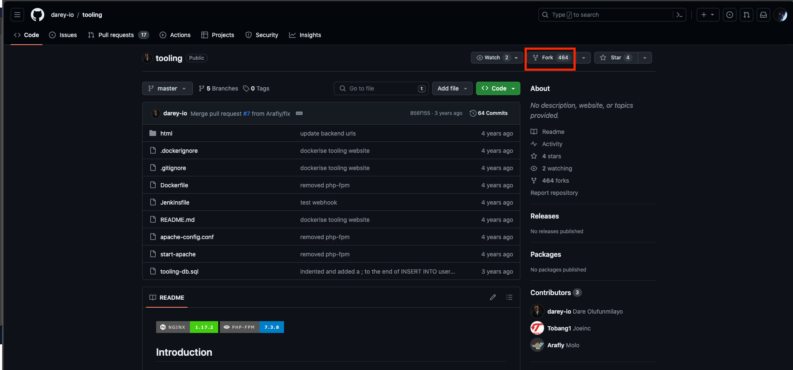
3. Now navgate to the forked repository on your GitHub Account. In the top menu, select settings, and then select WebHooks from the menu displayed on the left part of the page.
   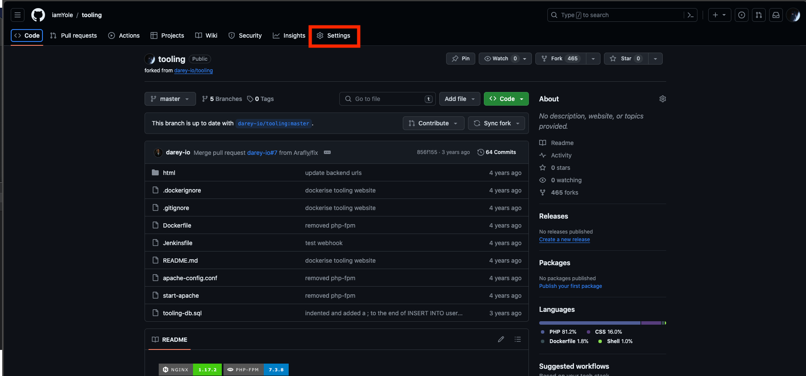

   Click on Add Webhooks

   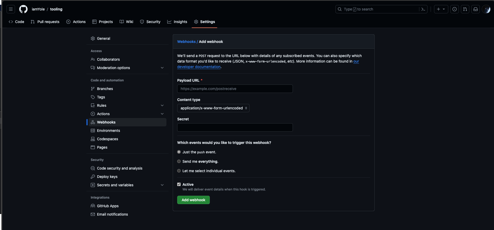

4. On the Webhook page, enter your Jenkins Server URL followed by `github-webhook/` in the payload text, and then select application/json in the content type. The final output should be like what's in the image below.
   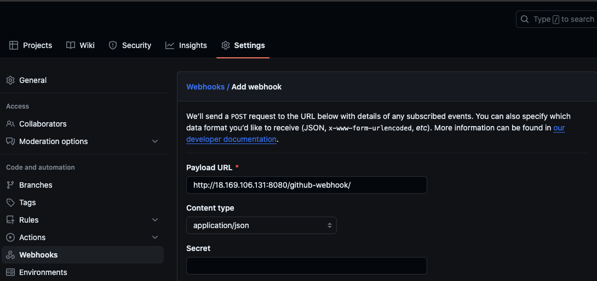
   You can also select the type of event you want to trigger this webhook. For this, we would leave it at the default push. Click on Add Webhook, and it's been added already.
5. The next step is to connect our Jenkins to our github acconts. Let's copy the Tooling Repository's URL to the clipboard as seen in the image below, then go back to Jenkins.
   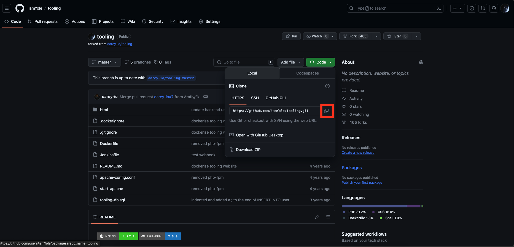.
   In Jenkins, click on New Item, give the job any name, and then select freestyle project then ok.
   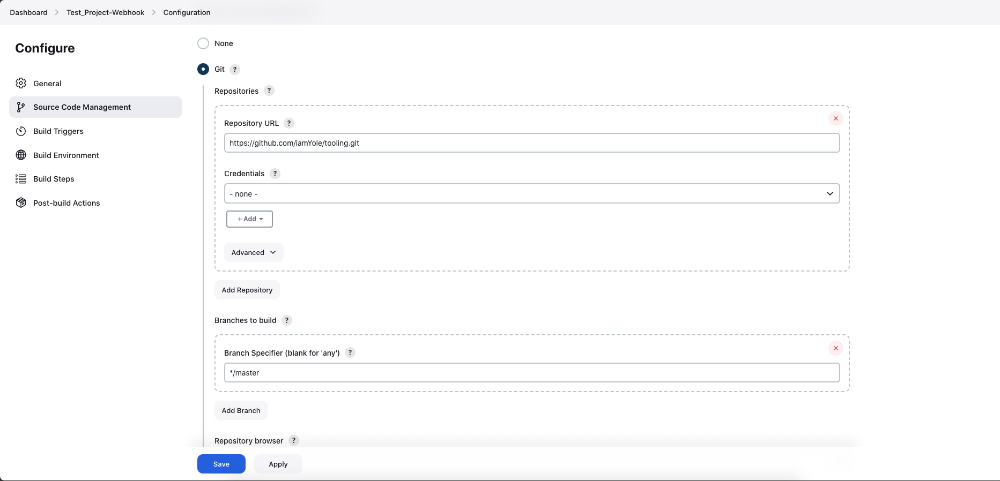
   As seen in the image above, select source code management, click on Git, and then paste the Tooling repo's URL. Since this repository is hosted using public, not credential need to be provided. Save this, and in the next page that comes up, click build now.
   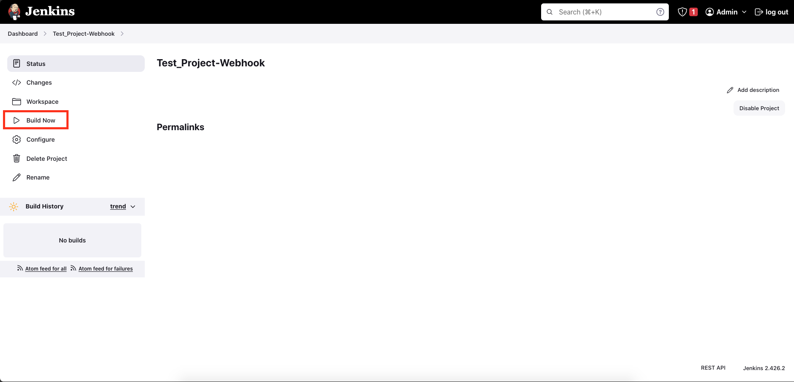
6. After the job has been built, you would see the build number `#1` by the left of the screen. If it's green, that means the build was sucessful, the red if it wasn't. Click on the build #1 and then the console output. You should see something similar to the image below:
   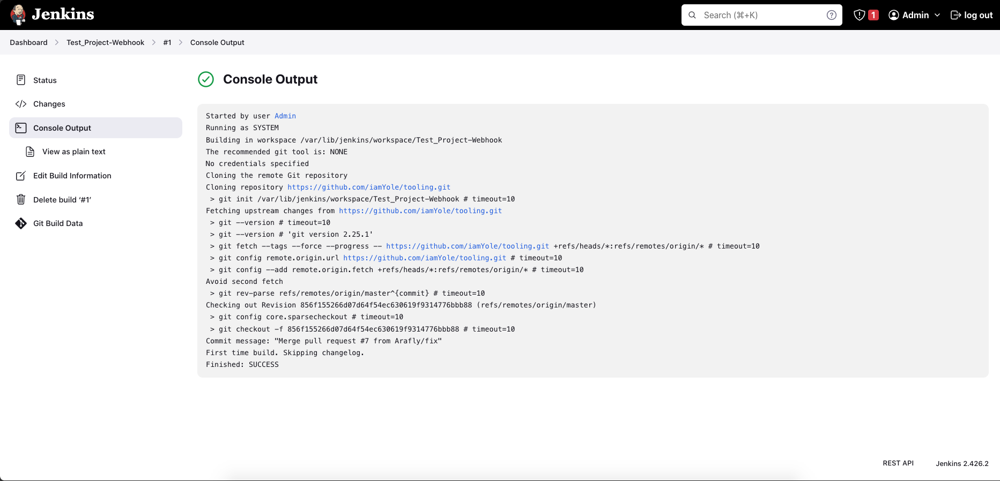
   This shows our Jenkins is connected to that GitHub repository. However, the build we did doesn't achieve anything. First, we have to manaully initial the build by clicking the build now, and there haven't been any changes on the Tooling repository.
7. Now, let's confirgure our the job we created to build automatically when there is a change to our Tooling reporsitory.

   - Go back to the Jenkins dashboard, and the click on the job you created.  
     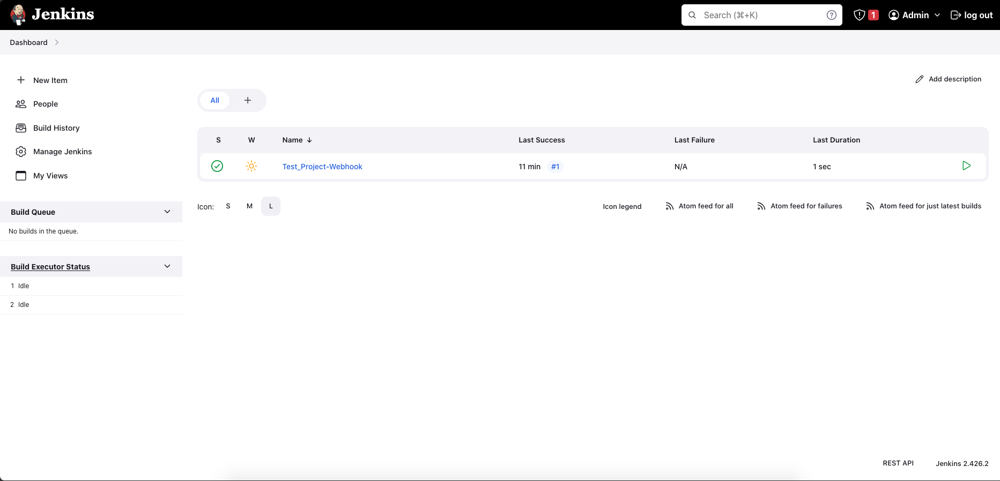
   - From the left pane, click on configure. Scroll down to build triggers, and select `GitHub hook trigger for GITScm polling`
     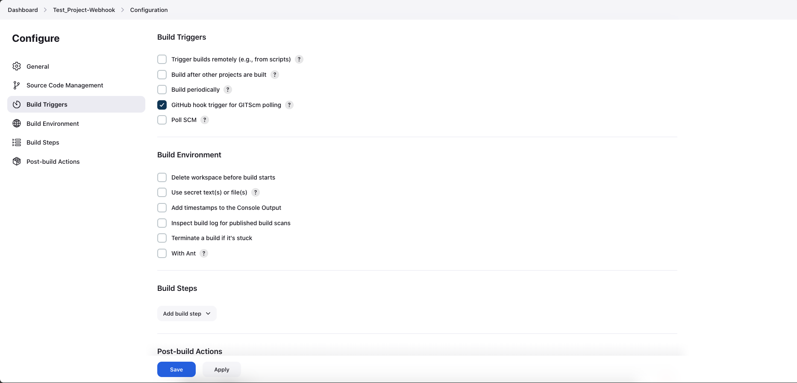
   - Next, on the same page scroll down to Post build action, click on the dropdown arrow and select Archive the artifacts. In the text box provided, just type in `**` and then click save.
     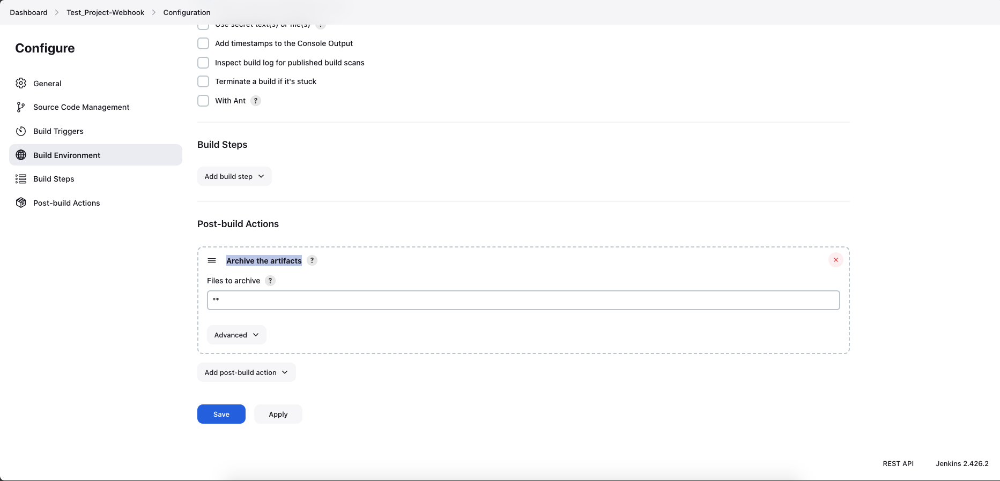

8. Now, lets make some changes to our source code, commit the changes and then watch the Job automatically build the code from the github repository as soon as it get's notification of a change to the repository.

- Clone the Tooling repository. This can be done on any computer, your local system or the jenkins server.
- Navigate to the html folder and then create a new html file. I called mine job.html. Open the file and type in the following.
  > ```html
  > <html>
  >   <head>
  >     <title>Test</title>
  >   </head>
  >   <body>
  >     <h1>My First CI/CD Job</h1>
  >   </body>
  > </html>
  > ```
- Commit the changes and the push the changes to the remote repository. Alternatively, you can create a file directly from the repository on github and then save the changes.

9. Once the commit has been made and the newly created file pushed to github, go to the Jenkins Server, and without doing anything, you would see a new build will start automatically. From the build details, click on Pooling Log to see the time and other details of this build.
   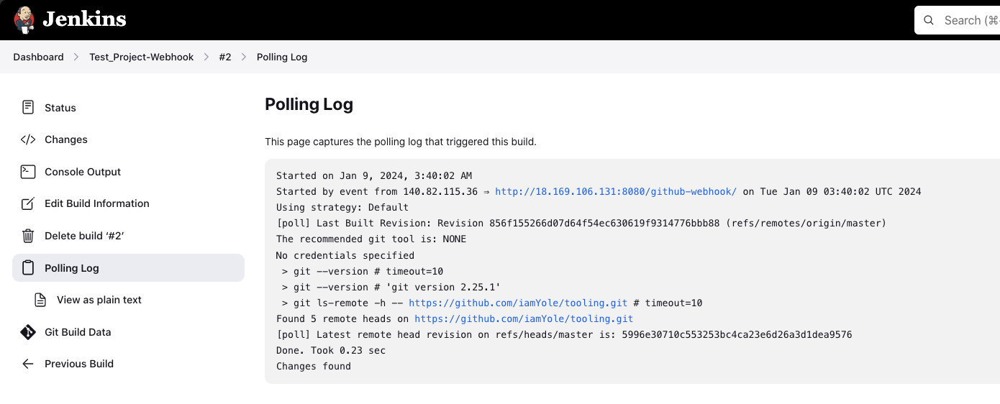
10. By default, all the artifacts are stored locally on the jenkins Server. you can view them by navigating to `/var/lib/jenkis/jobs`. This location is where all the created job and the files for each build is stored.
    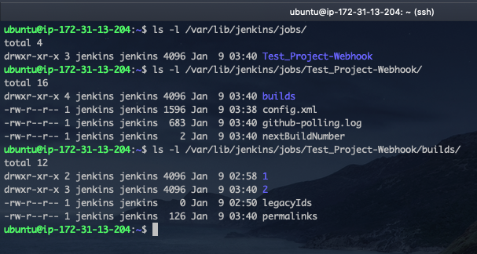

### Part 3 - Configure Jenkins to copy files to NFS server via SSH

Remember, automation is at the heart of everything we do in Jenkins. In the previous set, we created a new file from our local machine and pushed it to github. However, our web application is hosted on a WebServer miles aware in one AWS Datacenter. In this section, we will instruct Jenkins to download the file we created and copy it to the NFS server we created in the last project to store our web application files. Let's begin.

1. First, we need to install a plugin on jenkins `Publish Over SSH`. Let's navigate to the dashboard select Manage Jenkins and choose Manage Plugins menu item. Click on `Available Plugin` and search for `Publish Over SSH`.
2. After installing the plugin, go back to the dashboard and click on manage jenkins againg. This time, click select System under the System configuration menu.
   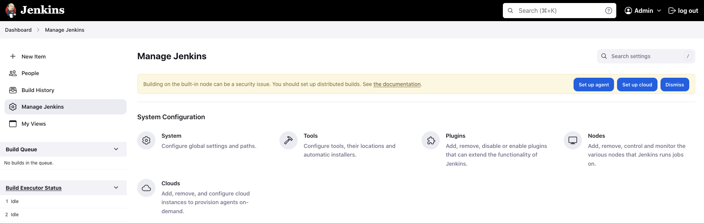
3. Scroll down to the 'Publish Over SSH' Option. We need to configure the plugin to be able to connection to our NFS server automatically.

   - First, we need to provide the security key we normally to log into he NFS Server via SSH. You can copy and paste the content of the key file to the key textbox, or your save a copy of that key file in a secure location on the Jenkins Server. I like the second option, so we do that.
   - Navigate to the `/var/lib/jenkins` directory on your jenkins server, create a dirctory called `keys`, and the save a copy of the key in that folder. please see below  
     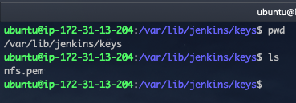
   - Now, back to the Jenkins site, provide the path to this key in the path textbox
     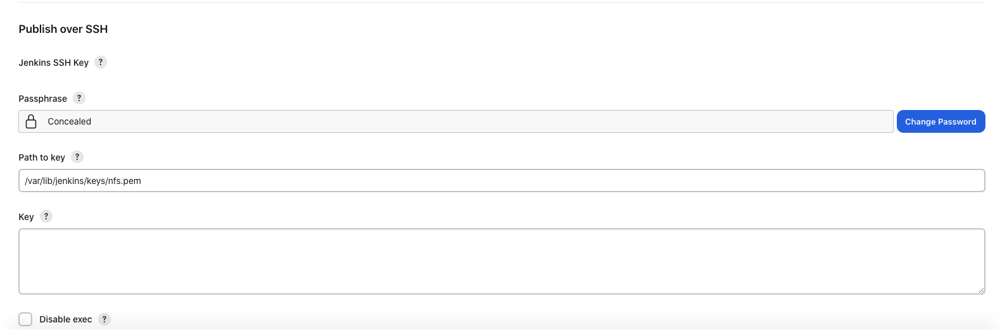
   - Next, click on Add SSH Server and provide the following information:

     - Name - Type in `NFS_SERVER`
     - Hostname: Type in the Private Ip of your NFS_SERVR
     - Username: Type in `ec2-user`. As we used a RedHat Server for our NFS, the username to login is ec2-user
     - Remote Directory: Type in `/mnt/apps`. That's the location we created on our server to store files for our web application

       Test the connection to make sure it works before saving and navigating out of the window.

   - After confirming the connection is ok, save and go back to the job created earlier, then select Configure. Scroll down and add another post build action. This time around, select `Send build artifacts over SSH`. The `NFS_SERVER` should be selected by default.
   - In the transfer set > Source file section, type in `**`. This is to copy all files from the git repository to the location we specified earlier `/mnt/apps`.
   - Save the configuration and make a minor change to the `job.html` file create earlier.

     > ```html
     > <html>
     >   <head>
     >     <title>Test</title>
     >   </head>
     >   <body>
     >     <center>
     >       <h1>My First CI/CD Job</h1>
     >       <p>
     >         We have sucessfully deployed our application from githup to our
     >         NFS_SERVER without connecting to either the web_severs or the
     >         NFS_Server.
     >       </p>
     >       <p>
     >         Subsequently, we don't even have to log into jenkins as the job
     >         has been configured to run whenever the developers make a change
     >         to the source code.
     >       </p>
     >     </center>
     >   </body>
     > </html>
     > ```

   - Save, commint and the push the file to github. Go back to the Jenkins site and notice a third build started automatically.
     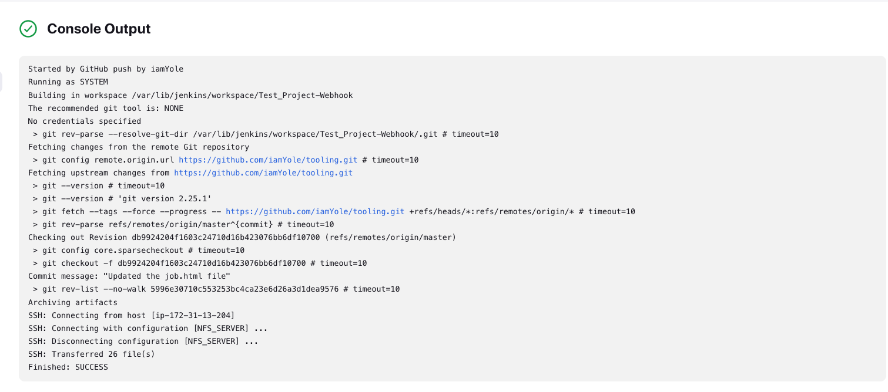
     Observe the output in the image above, you can see it says 26 files Transferred to the NFS_SERVER and it ended with a SUCCESS message. That means everything worked fine.
   - Now, open your web browser and type the `http://<Your-Web-Server-Public-Ip/job.html>`. You should see the newly created web page.
     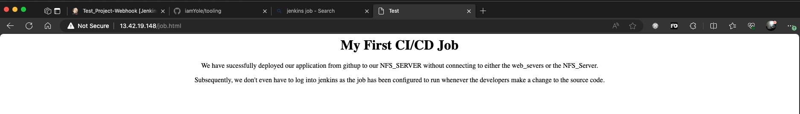

### And there you have it.
