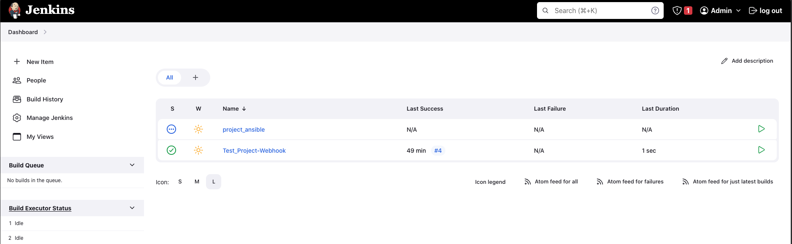
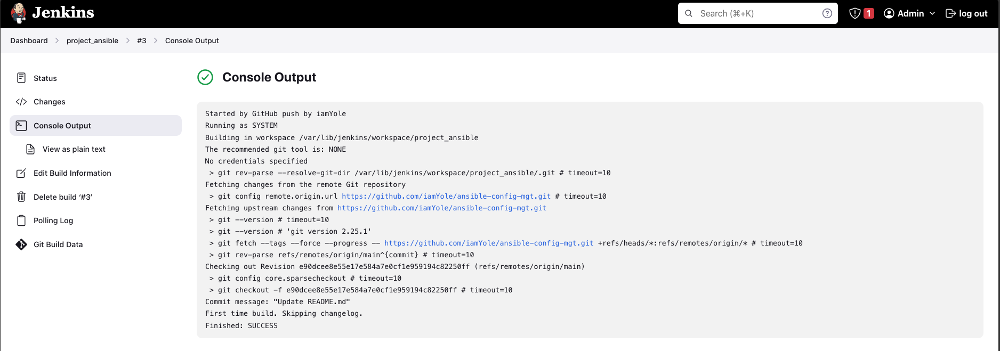
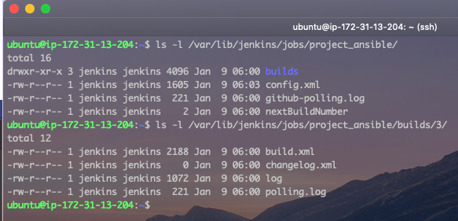

# Ansible - Automating simple tasks with Ansible

Ansible is a powerful open-source automation tool that is commonly used in DevOps practices for configuration management, application deployment, and task automation. It simplifies complex tasks, enables infrastructure as code (IaC), and promotes consistency across environments. Here are some frequently use cases for ansible by DevOps Engineers:

1. **Infrastructure as Code (IaC):** Ansible allows you to define your infrastructure in a declarative manner using YAML files, which are easy to read and understand. In addition to creating and defining infrastructures, the state of these infrastructures can also be managed by ansible.
2. **Configuration Management:** Ansible helps in managing the configuration of servers and infrastructure components.
3. **Automation of Repetitive Tasks:** DevOps involves a lot of repetitive tasks like software deployments, updates, and system configurations. Ansible playbooks can automate these tasks, reducing the risk of human error and saving time.
4. **Application Deployment:** Ansible can be used to automate the deployment of applications, ensuring consistency across different environments. Ansible playbooks can be written to deploy applications, update configurations, and handle other deployment-related tasks.

This would be a basic introduction to ansible where we will start by installing ansible, and then create playbooks to automate simple tasks. Let's begin.

### Part 1 - Installing and Configuring Ansible on an AWS EC2 Instance

Before we begin, let do the following:

- SSH to the Jenkins Server we created in the previous project [CI/CD With Jenkins](https://github.com/iamYole/DIO-Projects/tree/main/Project%2011%20-%20CI%20CD%20With%20Jenkins). We will installing Ansible on the same sever.
- Log into your GitHub accoount, and create a new repository caled `ansible-config-mgt`
- Create a webhook from the `ansible-config-mgt` repository to Jenkins. This was also done in the [CI/CD With Jenkins](https://github.com/iamYole/DIO-Projects/tree/main/Project%2011%20-%20CI%20CD%20With%20Jenkins)

1.  SSH to the Jenkins Server and install ansible by running the commands below:

        sudo apt update

        sudo apt insall ansible -y

    
    The image above shows Ansible verison 2.9.6 has been installed sucessfully.

2.  Now, in log into Jenkins, create a new Freestyle Project called `project-ansible`.
    
3.  Configure the project to automatically build the source codes in the `ansible-config-mgt` upon every commit. Take the steps below to do this

    - Go to the configuration settings of the `project-ansible`,
    - Navigate to Source Code Management, select Git and then copy the URL for the `ansible-config-mgt` into the Repository URL. Ensure the branch on Jenkins and that of the `ansible-config-mgt` are the same. I had to change my branch from `/master` to `/main` on Jenkins.
    - Next, we scroll down to Build Triggers and select `GitHub hook trigger for GITScm polling`
    - In the Post Build Action step, select `Archive the artifacts` from the drop down menu and then type in `**` to archieve all the file, and then save.
    - Test this by writing a breif description of what we want to achieve in the README.md file.
      
      This step has been completed sucessfully.

4.  From the Jenkins Server, we can see our artifacts are saved locally on the server.
    

### Part 2 - Prepare your IDE to start coding for Ansible

In this project, we would be using Visual Studio Code Integrated Development Environment (IDE).
In this step, we need to do the following in preparation of the next:

- Downloand and Install VS Code
- Configure Git and GitHUb on VS Code
- Clone the `ansible-config-mgt` repository using VS Code.

Now, let's being writing our ansible playbooks.

### Part 3 - Writing Ansible Playbooks.
