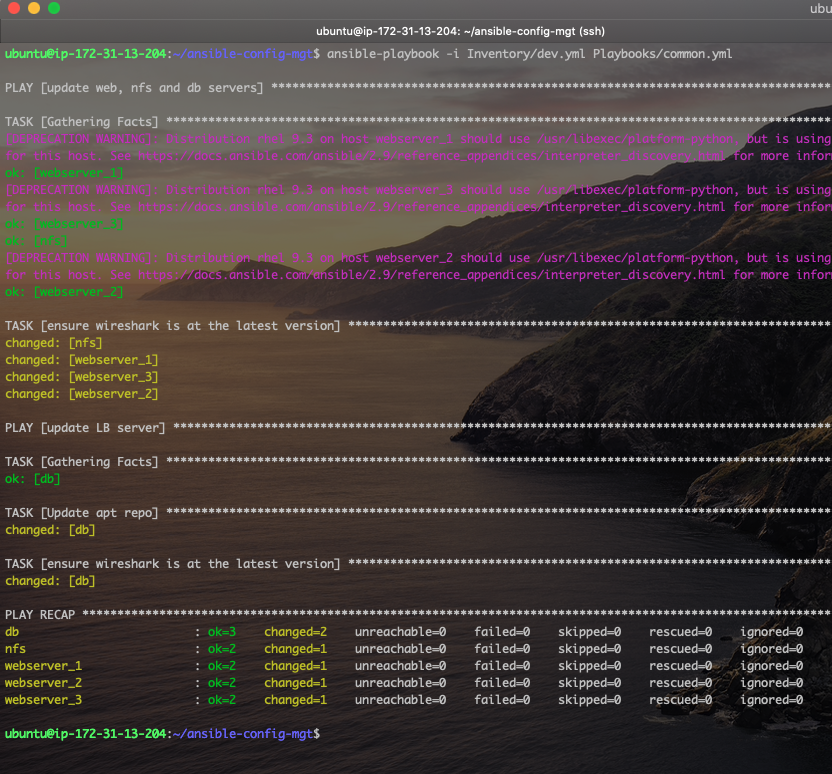

# Ansible - Automating simple tasks with Ansible

Ansible is a powerful open-source automation tool that is commonly used in DevOps practices for configuration management, application deployment, and task automation. It simplifies complex tasks, enables infrastructure as code (IaC), and promotes consistency across environments. Here are some frequently use cases for ansible by DevOps Engineers:

1. **Infrastructure as Code (IaC):** Ansible allows you to define your infrastructure in a declarative manner using YAML files, which are easy to read and understand. In addition to creating and defining infrastructures, the state of these infrastructures can also be managed by ansible.
2. **Configuration Management:** Ansible helps in managing the configuration of servers and infrastructure components.
3. **Automation of Repetitive Tasks:** DevOps involves a lot of repetitive tasks like software deployments, updates, and system configurations. Ansible playbooks can automate these tasks, reducing the risk of human error and saving time.
4. **Application Deployment:** Ansible can be used to automate the deployment of applications, ensuring consistency across different environments. Ansible playbooks can be written to deploy applications, update configurations, and handle other deployment-related tasks.

This would be a basic introduction to ansible where we will start by installing ansible, and then create playbooks to automate simple tasks. Let's begin.

### Part 1 - Installing and Configuring Ansible on an AWS EC2 Instance

Before we begin, let do the following:

- SSH to the Jenkins Server we created in the previous project [CI/CD With Jenkins](https://github.com/iamYole/DIO-Projects/tree/main/Project%2011%20-%20CI%20CD%20With%20Jenkins). We will installing Ansible on the same sever.
- Log into your GitHub accoount, and create a new repository caled `ansible-config-mgt`
- Create a webhook from the `ansible-config-mgt` repository to Jenkins. This was also done in the [CI/CD With Jenkins](https://github.com/iamYole/DIO-Projects/tree/main/Project%2011%20-%20CI%20CD%20With%20Jenkins)

1.  SSH to the Jenkins Server and install ansible by running the commands below:

        sudo apt update

        sudo apt insall ansible -y

    

    The image above shows Ansible verison 2.9.6 has been installed sucessfully.

2.  Now, in log into Jenkins, create a new Freestyle Project called `project-ansible`.
    
3.  Configure the project to automatically build the source codes in the `ansible-config-mgt` upon every commit. Take the steps below to do this

    - Go to the configuration settings of the `project-ansible`,
    - Navigate to Source Code Management, select Git and then copy the URL for the `ansible-config-mgt` into the Repository URL. Ensure the branch on Jenkins and that of the `ansible-config-mgt` are the same. I had to change my branch from `/master` to `/main` on Jenkins.
    - Next, we scroll down to Build Triggers and select `GitHub hook trigger for GITScm polling`
    - In the Post Build Action step, select `Archive the artifacts` from the drop down menu and then type in `**` to archieve all the file, and then save.
    - Test this by writing a breif description of what we want to achieve in the README.md file.
      
      This step has been completed sucessfully.

4.  From the Jenkins Server, we can see our artifacts are saved locally on the server.
    

### Part 2 - Prepare your IDE to start coding for Ansible

In this project, we would be using Visual Studio Code Integrated Development Environment (IDE).
In this step, we need to do the following in preparation of the next:

- Downloand and Install VS Code
- Configure Git and GitHUb on VS Code
- Clone the `ansible-config-mgt` repository using VS Code.

Now, let's being writing our ansible playbooks.

### Part 3 - Begin Ansible Development.

Now, let's explore how we can use ansigble for some simple tasks. But before then, let's create a branch in our `ansible-config-mgt` repository. This branch will be used for development of new features. I called my new branch `features/prj-12`.

1. On your local machine clone the ansible-config-mgt` repository, and checkout the newly created branch.
2. Create two directories `playbooks` and `inventory`. The `playbooks` directory would be used to store all playbooks, while the `inventory` directory would be used to organise the hosts.
3. Within the playbook directory, create a file and save it as `common.yml`.
4. withing the inventory directory, create an inventory file for each envirnment (Development, Stagings, testing and Production).

   

   The image above shows the directory structure explained above in VS Code

In Ansible, an inventory file is a text file that contains information about the hosts (servers or network devices) that Ansible will manage. This file is used to define the target machines and organize them into groups. Ansible uses this inventory information to determine where and how to execute tasks defined in playbooks.  
Also, Ansible uses port 22 by default which means it needs to ssh to target servers from our Ansible Server and while connecting via ssh, the security key needs to be provided. There, we need not point ansible to the location our the security key(s) required to connect to the target machines.

5. On the Ansible Server, we need to create a directory to store the key files. Please note that the key files should not be stored in a git repository for security reasons. In this project, i'll by storing my key files in the following newly created repository `/home/keys/`

6. Let's create an Inventory file. In the `inventory/dev.yml `file, write the code below

   > ```yml
   > all:
   >   hosts:
   >     webserver_1:
   >       ansible_host: 172.31.40.150
   >       ansible_user: ec2-user
   >       ansible_ssh_private_key_file: /home/keys/dio_key.pem
   >     webserver_2:
   >       ansible_host: 172.31.37.142
   >       ansible_user: ec2-user
   >       ansible_ssh_private_key_file: /home/keys/dio_key.pem
   >     webserver_3:
   >       ansible_host: 172.31.40.123
   >       ansible_user: ec2-user
   >       ansible_ssh_private_key_file: /home/keys/dio_key.pem
   >     db:
   >       ansible_host: 172.31.43.28
   >       ansible_user: ubuntu
   >       ansible_ssh_private_key_file: /home/keys/dio_key.pem
   >     nfs:
   >       ansible_host: 172.31.47.126
   >       ansible_user: ec2-user
   >       ansible_ssh_private_key_file: /home/keys/dio_key.pem
   >
   >   children:
   >     webservers:
   >       hosts:
   >         webserver_1:
   >         webserver_2:
   >         webserver_3:
   >     dbservers:
   >       hosts:
   >         db:
   >     nfsserver:
   >       hosts:
   >         nfs:
   >     org:
   >       children:
   >         nfsserver:
   >         dbservers:
   >         webservers:
   > ```

   Please replace the IP Addresses above with the IP Address of your servers.
   The inventory file above defines 5 hosts/targets: `webserver_1,webserver_2,webserver_3,db and nfs.` Each host was defined with their IP Address, host username and a location to the security key for connecting via ssh to the target.

   The second section of the file groups the targets into groups for easy management. A `webservers` was created to managed all the webservers. This would make performing web server related tasks easy. A second group `dbservers` was created. This group has just one target, `db`. But more database servers can easily be added by defining a new host and addint the host the this group. Again, this will make performing database related task easy. The `nfsserver` group was created to manage the `nfs` target. Finally, I grouped all the groups above to a parent group called `org`. This group can be used to perform tasks required for all the targets such as OS update or firewall configurations.

   From the inventory above, we can see the one security key is used to connect to all the servers, but they location of the key was provided 5 times. We can simplify the code by storing the key location in a variable, and providing the variable name in place actual key location. Imagine we have to change to location of the key in the future, we will haev to update the key location 5 times as against just updating the variable defination just once. Let's optimise the above code the take advantage of variables. Modify the `inventory/dev.yml` file with the code below

   > ```yml
   > all:
   >   vars:
   >     ansible_ssh_private_key_file: /home/keys/dio_key.pem
   >
   >   hosts:
   >     webserver_1:
   >       ansible_host: 172.31.40.150
   >       ansible_user: ec2-user
   >     webserver_2:
   >       ansible_host: 172.31.37.142
   >       ansible_user: ec2-user
   >     webserver_3:
   >       ansible_host: 172.31.40.123
   >       ansible_user: ec2-user
   >     db:
   >       ansible_host: 172.31.43.28
   >       ansible_user: ubuntu
   >     nfs:
   >       ansible_host: 172.31.47.126
   >       ansible_user: ec2-user
   >
   >   children:
   >     webservers:
   >       hosts:
   >         webserver_1:
   >         webserver_2:
   >         webserver_3:
   >     dbservers:
   >       hosts: db
   >     nfsserver:
   >       hosts: nfs
   >     org:
   >       children:
   >         nfsserver:
   >         dbservers:
   >         webservers:
   > ```

7. Now, let's create a simple playbook. In the `playbooks/common.yml` file, write the code below.

   > ```yml
   > ---
   > - name: update web, nfs and db servers
   >   hosts: webservers:nfs
   >   become: yes
   >   tasks:
   >     - name: ensure wireshark is at the latest version
   >       yum:
   >         name: wireshark
   >         state: latest
   >
   > - name: update DB server
   >   hosts: db
   >   become: yes
   >   tasks:
   >     - name: Update apt repo
   >       apt:
   >         update_cache: yes
   >
   > - name: ensure wireshark is at the latest version
   >   apt:
   >     name: wireshark
   >     state: latest
   > ```

   The playbook above performs a very simple task. Install wireshark if not already installed, or update it to the latest if installed, but not running the latest version.

8. Now save the changes to the `ansible-config-mgt` repository on your local machine, commit and push the changes to GitHub.
9. SSH to your Ansible Server, clone the `ansible-config-mgt` repository and create a folder to store the security keys.
   

When copin the content of your private kay, ensure everything is copied, and be careful not to copy any extra key after`-----END RSA PRIVATE KEY-----`. Also ensure the user running the ansible code has permission to the file and no one else. Typically, a permission of `400` should work fine.

10. From your local machine, checkout to the main branch, review the code and them merge the `features/prj-12` branch to the main branch and then commit and push the code to GitHub. This will also trigger the job in Jenkins to build, but no major changes is being done from Jenkins at the moment, just the artifacts are saved to a location.

### Part 4 - Testing and running our first Ansible Playbook.

Before we start running our playbooks, let's ensure the inventory file is properly defined by ping all the host. If we get a success message, then we are good to go.

1.  SSH into your anisble server ensure all the other servers are up and running.
2.  In your Ansible Server, navigate to the cloned repository `cd ansible-config-mgt`, then run the code below:

        ansible all -m ping -i Inventory/dev.yml

3.  The command your should the sucess message, but may also see a message asking `Are you sure you want to continue connecting (yes/no/[fingerprint])?`. To by pass this going forward, we need to update the ansible config file.
4.  Let's configure ansible to stop asking that question everytime.
    - Swith to the root user by running the command `sudo -i`.
    - Swith to the ansible directory at `/etc/ansible`
    - Create a backup of the current `ansible.cfg` file byt running the code `cp ansible.cfg ansible.cfg_backup`
    - Now open the config file from your favority text edit and and search for the `host_key_checking=False` line.
    - Uncomment that line and change the value to False if it isn't false by default.
    - Clear the screen and log out of the `root` user
5.  Now, lets go back to our loned repository `cd ansible-config-mgt` and run the command to ping all the servers again.

        ansible all -m ping -i Inventory/dev.yml

    

    We should see all the servers had the pong response from the ping request.

6.  Now, lets run our playbook by running the command below:

            ansible-playbook -i Inventory/dev.yml Playbooks/common.yml

    

    From the screenshot above, the `common.yml` playbook first attemted connection the the `webservers and nfs` target, checked if wireshark was installed, and then installed it. It also did the same for the `db` server.  
    The reason for the separation was because the `common.yml` we created two task, one to update our servers running `RedHat`, and another to update the Servers running `Ubuntu`. But at the PLAY RECAP section, ansible gave us a nice summary of all the servers and the status `changed`, meaning there were changes made to the server based on the playbook.

7.  Let's ssh to the targets and confirm `wireshark` has indeed been installed.
      
    A screenshot of our dbserver running `ubuntu` confirming wireshark is installed.
      
    A screenshot of one of our webservers running `RedHat` confirming wireshark is installed.
8.  Now, lets run the `common.yml` playbook again and obeserve what happens.
    

    We can see that for the servers running `RedHat`, not changes where made because they are already running the latest version of wireshark. However, we will always see a change to the `dbserver` not because ansible is not installed, but because the play updates the cache based on our defination of the playbook `update_cache: yes`.

### Part 4b - Playing with Ansible Playbook.

Now, lets modify our current `common.yml` playbook to also change the timezone for our servers to America/New York.

- First, lets confirm the current time for our webserver by running the commmand `timedatectl`
  
- Now, from your local machine, update the `common.yml` file with the code below, commit and push the code to GitHub.

  > ```yml
  > ---
  > - name: update web, nfs and db servers
  >   hosts: webservers:nfs
  >   become: yes
  >   tasks:
  >     - name: ensure wireshark is at the latest version
  >       yum:
  >         name: wireshark
  >         state: latest
  >
  > - name: Change Timezone on Web Servers alone
  >   hosts: webservers
  >   become: yes
  >   tasks:
  >     - name: Set the time zone to America/New_York
  >       command: timedatectl set-timezone America/New_York
  >
  > - name: update DB server
  >   hosts: db
  >   become: yes
  >   tasks:
  >     - name: Update apt repo
  >       apt:
  >         update_cache: yes
  >
  > - name: ensure wireshark is at the latest version
  >   apt:
  >     name: wireshark
  >     state: latest
  > ```

- From the Ansible server, pull the new changes and run the playbook again.
  

  From the above, we can see only the webservers received the change as the nfs server was not included in the targets for the task of changing the time zone.

- We can log back into any of the webservers to reconfirm the timezone has been changed.
    
  And there you have it. I ran the command again and we can see the timezone is now changed to `America/New YorK`

#### And that's all for this project.
