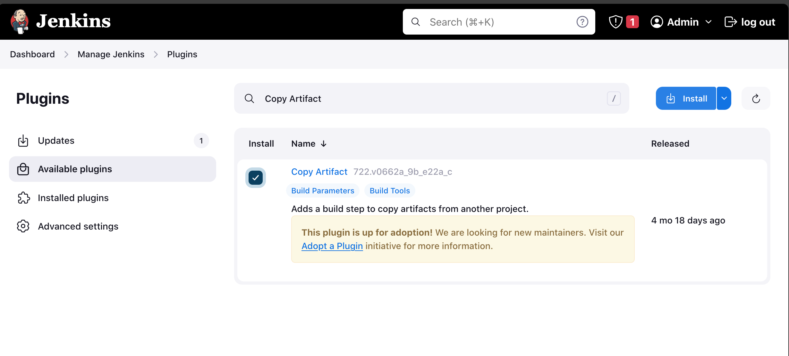
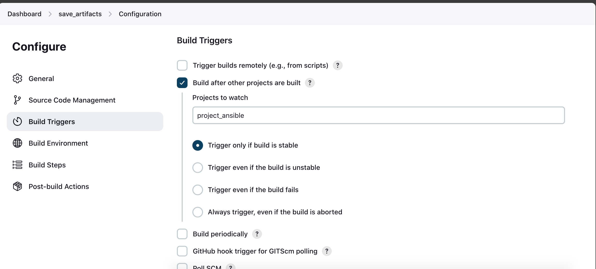
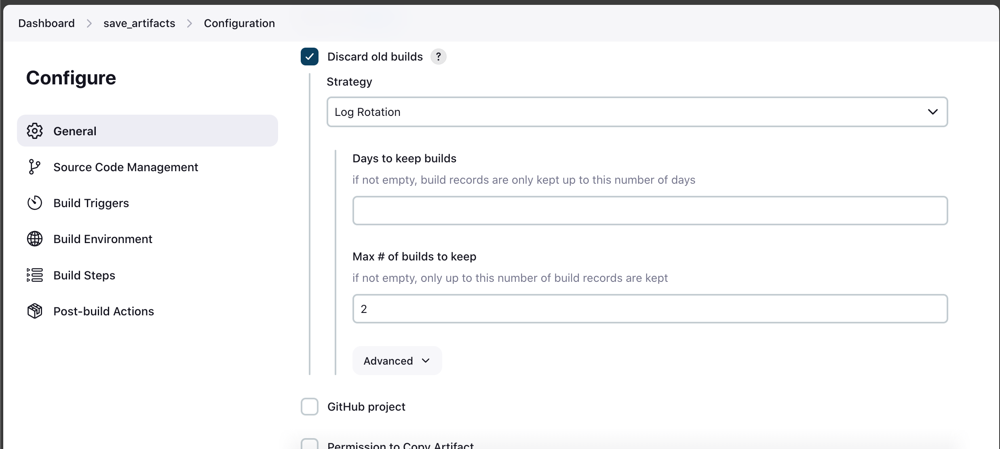
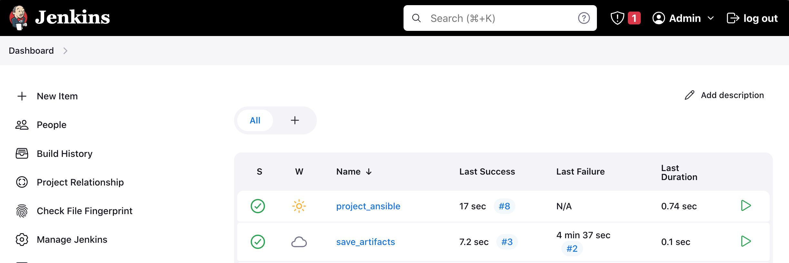
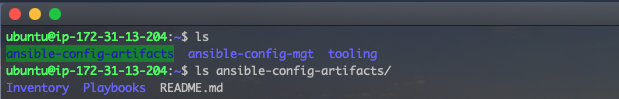

# Ansible Imports and Assignments.

In Ansible, imports and assignments are essential concepts that we can use to organize and structure our playbooks efficiently. They help break down complex tasks into smaller, manageable components and promote code reuse.

But before we begin, remember the in the previous project [Ansible (Automating simple tasks with Ansible)](https://github.com/iamYole/DIO-Projects/tree/main/Project%2012%20-%20Automating%20simple%20tasks%20with%20Ansible), we created a Jenkins job to automatically archive the artifacts on every commit. This isn't exactly ideals as in no time, we will run out of disk space.

Using a new plugin `Copy Artifact`, we can confirgire Jenkins to copy our artifacts to a directory of our choice and keep a speicied number of artifacts. For example, with the plugin, we can instruct jenkins to keep only the last 3 copies of our artifacts and automatically delete older artifacts as new ones are being created.

Let's begin:

### Part 1 - Enhancing the Jenkins Job

- Lets start by creating the direcotry we want our artifacts copied to.
  > `sudo mkdir /home/ubuntu/ansible-config-artifacts`
- Change the permission of the directory so Jenkins can copy and delete files to the directory without any issues:
  > `chmod -R 0777 /home/ubuntu/ansible-config-artifacts`
- Log into Jenkins and install the plugin `Copy Artifact`
  - From the dashboard, click Manage Jenkins
  - Click Available Plugins
  - Then search for `Copy Artifact`
  - Select the plugin and then install it without restarting.
    
- Back to in the Jenkins dasboard, create a new job called `save_artifacts`. This job will be triggered on completion of the anible job created earlier.
- After creating the `save_artifacts` job, in the configuration page, scroll to Build Triggers and select `Build after other projects are built`, then select the project you want this to watch. In case, I want this to build on completion of the `project_ansible` job i created earlier.
  
- Still in the configuration page, scroll and locate Discard Old builds, and then select 2 in the Max # of builds to keep.
  
- Still in the configuration page, scroll to build steps and add a build step. Select `Copy artifacts from another project`, select the project name, Latest sucess build, and in the Target directory, type in `/home/ubuntu/ansible-config-artifacts`, then save the configuration.

Now let's test this by making a little change to the readme.md file in our `ansible-config-mgt` on GitHub. We should see the newly created job executing immediately after the first job comletes successfully.

From the screenshot above, we can see the `project_ansible` completed, and then the `save_artifacts` ran immediately. All these happened without any manual intervention. Also, if we navigate to the `/home/ubuntu/ansible-config-artifacts` directory, we will see the artifacts copied automatically.

### Part 2 - Recatoring the Ansible code by Importing other playbooks
