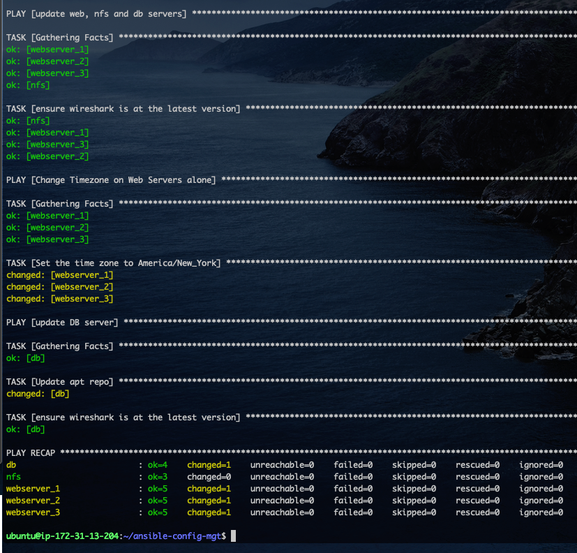

# Ansible Imports and Assignments.

In Ansible, imports and assignments are essential concepts that we can use to organize and structure our playbooks efficiently. They help break down complex tasks into smaller, manageable components and promote code reuse.

But before we begin, remember the in the previous project [Ansible (Automating simple tasks with Ansible)](https://github.com/iamYole/DIO-Projects/tree/main/Project%2012%20-%20Automating%20simple%20tasks%20with%20Ansible), we created a Jenkins job to automatically archive the artifacts on every commit. This isn't exactly ideals as in no time, we will run out of disk space.

Using a new plugin `Copy Artifact`, we can confirgire Jenkins to copy our artifacts to a directory of our choice and keep a speicied number of artifacts. For example, with the plugin, we can instruct jenkins to keep only the last 3 copies of our artifacts and automatically delete older artifacts as new ones are being created.

Let's begin:

### Part 1 - Enhancing the Jenkins Job

- Lets start by creating the direcotry we want our artifacts copied to.
  > `sudo mkdir /home/ubuntu/ansible-config-artifacts`
- Change the permission of the directory so Jenkins can copy and delete files to the directory without any issues:
  > `chmod -R 0777 /home/ubuntu/ansible-config-artifacts`
- Log into Jenkins and install the plugin `Copy Artifact`
  - From the dashboard, click Manage Jenkins
  - Click Available Plugins
  - Then search for `Copy Artifact`
  - Select the plugin and then install it without restarting.
    
- Back to in the Jenkins dasboard, create a new job called `save_artifacts`. This job will be triggered on completion of the anible job created earlier.
- After creating the `save_artifacts` job, in the configuration page, scroll to Build Triggers and select `Build after other projects are built`, then select the project you want this to watch. In case, I want this to build on completion of the `project_ansible` job i created earlier.
  
- Still in the configuration page, scroll and locate Discard Old builds, and then select 2 in the Max # of builds to keep.
  
- Still in the configuration page, scroll to build steps and add a build step. Select `Copy artifacts from another project`, select the project name, Latest sucess build, and in the Target directory, type in `/home/ubuntu/ansible-config-artifacts`, then save the configuration.

Now let's test this by making a little change to the readme.md file in our `ansible-config-mgt` on GitHub. We should see the newly created job executing immediately after the first job comletes successfully.

From the screenshot above, we can see the `project_ansible` completed, and then the `save_artifacts` ran immediately. All these happened without any manual intervention. Also, if we navigate to the `/home/ubuntu/ansible-config-artifacts` directory, we will see the artifacts copied automatically.


### Part 2 - Using Imports in Ansible

#### Recatoring the Ansible code by Importing other playbooks

In the previous project [Ansible (Automating simple tasks with Ansible)](https://github.com/iamYole/DIO-Projects/tree/main/Project%2012%20-%20Automating%20simple%20tasks%20with%20Ansible), we wrote all our task in one playbook `common.yml`. This however is not sustainable when dealing with so many servers running on different operating system, and each with different requirments and tasks to accomplish.

A more effient way is to breakdown or organise our playbooks into multiple files in a logical manner. For instance, we can have a file the works with a specific OS `RedHat` or `Windows` for instance, another file that deals strictly with `webservers` or another file that deals with servers in a particular location.

This can be done by using the **Import** feature of ansible. Let's see how this works by refactoring our code as follows:

1. Within the Playbooks directory, create a new file and name it `site.yml`. This will be the entry point, or the file all other playbooks are called from.
2. Create a new directory in the root directory and name it `static-assignments`. This directory would store all other playbooks.
3. Move the `Playbooks/common.yml` to the newly created `static-assignments` directory. Your directory structure should look like the image below.

   

4. Now, let's import the `common.yml` file into the `site.yml` using the code below.
   > ```yml
   > ---
   > - hosts: all
   > - import_playbook: ../static-assignments/common.yml
   > ```
5. To test this works, run the code below just as we did in the previous project

   > `ansible-playbook -i Inventory/dev.yml Playbooks/site.yml`

   

   As expected, we were able to run the tasks defined in the `static-assignments/common.yml` from the `Playbooks/site.yml` with the help of the import command.

6. Now, let's create a new playbook in the `static-assignments` directory and name it `del.yml`. This playbook will do delete wireshake and change the timezone for the webservers back to Europe/London. Update the `site.yml` file to the new playbook created and run then run the playbook.
   
7. Now SSh to other servers and confirm wireshark has been uninstalled, and for the web servers confirm the timezone has also changed.

     
    wireshark no longer installed on our db server  
     
   Wireshark no longer installed on our webserver, and the timezone has been changed to Europe/London.

### Part 3 - Using Roles in Ansible

#### Configure UAT webservers with a Role

Now, let's do some proper configuration tasks with ansible. For this part, we need to provision to new EC2 Instances and called them Web_UAT-1 and Web_UAT-2. Both servers would be running REDHAT Linux 9.

1. To create a Role in Ansible, we must first create a `roles/` directory relativel to the playbook file or in `/etc/ansible/` directory.

   Ansible has a tool `ansible-galaxy` that can create the required structure for us. However, since we are creating our playbooks from our local machine and then pushing to GitHub, we will be creating this structure manually.

2. Let's create a directory structure that looks like the image below.
   
3. Update the `Inventory/uat.yml` file with the code below:

   > ```yml
   > all:
   >   vars:
   >     ansible_ssh_private_key_file: /home/keys/dio_key.pem
   >
   >   hosts:
   >     web_uat_1:
   >       ansible_host: 172.31.39.30
   >       ansible_user: ec2-user
   >     web_uat_2:
   >       ansible_host: 172.31.36.175
   >       ansible_user: ec2-user
   >
   >   children:
   >     uat-webservers:
   >       hosts:
   >         web_uat_1:
   >         web_uat_2:
   > ```

4. Let's ping these new targets to make sure they are reachable and the inventory file was created properly.

   

   Our web_uat_1 and web_uat_2 responded with a sucess message. Things are looking good.

5. Now, let's make a change to the `/etc/ansible/ansible.cfg` file by uncommenting the `roles_path` option.

   - `sudo vim /etc/ansible/ansible.cfg`
   - In the text editor, uncomment the `roles_path` option and change the path to `/home/ubuntu/ansible-config-mgt/roles`.
   - Save the changes and exit the editor.

6. It's time to start configuring our webserver. We will be making the following changes:

   - Installing and Configuring Apache (httpd)
   - Cloning the [Tooling Website](https://github.com/darey-io/tooling) from GitHub.
   - Ensure the webiste is deployed to the correct location `/var/www/html` on both servers
   - Start the httpd service.  
     Let's do all this my writing the code below to the `tasks/main.yml` file.

   > ```yml
   > ---
   > - name: install apache
   >   become: true
   >   ansible.builtin.yum:
   >     name: "httpd"
   >     state: present
   >
   > - name: install git
   >   become: true
   >   ansible.builtin.yum:
   >     name: "git"
   >     state: present
   >
   > - name: clone a repo
   >   become: true
   >   ansible.builtin.git:
   >     repo: https://github.com/darey-io/tooling
   >     dest: /var/www/html
   >     force: yes
   >
   > - name: copy html content to one level up
   >   become: true
   >     command: cp -r /var/www/html/html/ /var/www/
   >
   > - name: Start service httpd, if not started
   >   become: true
   >   ansible.builtin.service:
   >     name: httpd
   >     state: started
   >
   > - name: recursively remove /var/www/html/html/ directory
   >   become: true
   >   ansible.builtin.file:
   >     path: /var/www/html/html
   >     state: absent
   >
   > ```

### Part 4 - Referencing the Webservers Role

In the previous section, we created the `webservers` role. It's time to reference the role.

1. In the `static-assignments` directory, create a playbook called `uat-webservers.yml` and the add the following code.

   > ```yml
   > ---
   > - hosts: uat-webservers
   >   roles:
   >     - webservers
   > ```

2. Next, we need to update the entry point to this ansible project `site.yml`. Let's add the code below to the file.
   > ```yml
   > ---
   > - hosts: all
   > - import_playbook: ../static-assignments/common.yml
   >
   > - hosts: uat-webservers
   > - import_playbook: ../static-assignments/uat-webservers.yml
   > ```

### Part 5 - Now, let's test the Roles.

1. From your local machine, save, commit and push the `ansible-config-mgt` repository to GitHub
2. From the Jenkins Server, pull the latest changes to the the repository, and then run the playbook to configure both the `dev` and `staging` servers.

   > `ansible-playbook -i Inventory/uat.yml Playbooks/site.yml`

   

   The image above shows the webservers have been configured and the website deployed.

3. Let's confirm this by opening a web browser and entering the address
   `http://<UAT-WEBSERVER-Public-IP>/index.php`
   .
4. We can also ssh into the uat-webservers to confirm the files we downloaded from github and saved to the correct repository.
   .

Amazing. This same step could be used to provision 100 webservers without connecting to them via ssh as seen here.
