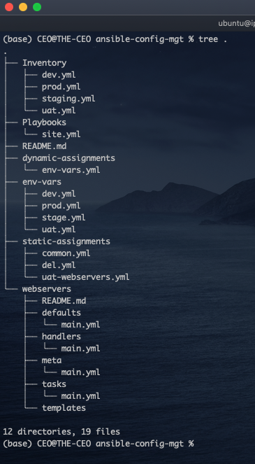

# More on Ansible 2 (Dynamic Assignments(Include) and Community Roles)

In the previous project [More on Ansible (Imports and Assignments)](<https://github.com/iamYole/DIO-Projects/tree/main/Project%2013%20-%20More%20on%20Ansible%20(Imports%20and%20Assignments)>), we explored the **Include** statement as well as **Roles** in Ansible. Using the `ansible-config-mgt` repository, we will building on our knowledge by exploring the **Include** statement as well as some **Community Roles**.

In Ansible, the **include** and **import** statements are used for including external content (such as tasks, variables, or other YAML files) into playbooks. Let's look as some difference between both statements:

- The include statement is processed at runtime, and the included content is evaluated in the order it appears in the playbook. The **import** statement on the other hand is processed during the parsing phase, allowing for better control over the order of execution.
- Variables defined in an **included file** with include are available in the scope of the entire playbook, while Variables defined in an **imported file** with import have a more localized scope.
- With **include**, tasks are added to the existing list of tasks in the playbook, while with **import**, tasks from the imported file replace the current list of tasks in the playbook.
- As the **Include** statement process files during runtime, it can be seen as a Dynamice Assignment, while the **Import** statement is static as the files are processed before runtime.

In summary, while both **include** and **import** statements allows us to include external content. **Import** provides more control over the inclusion process and is often preferred for larger, more complex playbooks then include which is simpler and more suitable for basic use cases.

### Part 1 - Restructuring our Repository for Dynamic Assignment

- From GitHub, create a new branch in your `ansible-config-mgt` repository and name it `dynamic-assignments`.
- In the `dynamic-assignments` directory, create a new file and name it `env-vars.yml`.
- Since we will be using this ansible project to configure different servers in multiple enviroment, it would be nice to have directory to store the enviroment variables (ip addresses, servernames etc) for each environment. Now, create a new directory called `env-vars`.
- Within the `env-vars`, create YAML files to store the variables for each environment; `dev.yml`, `stage.yml` etc.

  Your folder structure should look like this:

  

### Part 2 - Introducing Dynamic Assignments

- Copy and paste the code below to the `dynamic-assignments/env-vars.yml` file.

  > ```yml
  > ---
  > - name: collate variables from env specific file, if it exists
  >   hosts: all
  >   tasks:
  >     - name: looping through list of available files
  >       include_vars: "{{ item }}"
  >       with_first_found:
  >         - files:
  >             - dev.yml
  >             - stage.yml
  >             - prod.yml
  >             - uat.yml
  >           paths:
  >             - "{{ playbook_dir }}/../env-vars"
  >       tags:
  >         - always
  > ```

  Now, let's breakdown the code in this file to understand what it is doing:

  - First of all, the purpose of this code is to dynamically load environment-specific variables, ensuring that the playbook uses the correct configurations based on the target environment (dev, stage, prod, etc.).
  - `include_vars`: As we explained above, this module is used to dynamically load variables from files during a playbook execution.
  - `with_first_found`: This line of code loops through the file names (dev.yml, stage.yml etc), searching for the first file found, and store the file in the placeholder `{{ item }}`.
  - `paths`: This is the location the `with_first_found` will search for the files in.
  - The `{{ playbook_dir }}` is a special variable in Ansible playbooks that represents the absolute path to the directory containing the current playbook being executed.

- Now, let's upate the `site.yml` file with the code below to make use of the dynamic assignment structure.

  > ```yml
  > ---
  > - hosts: all
  > - name: Include dynamic variables
  >   tasks:
  >     import_playbook: ../static-assignments/common.yml
  >     include: ../dynamic-assignments/env-vars.yml
  >   tags:
  >     - always
  >
  > - hosts: uat-webservers
  > - name: Webservers Assignments
  >   import_playbook: ../static-assignments/uat-webservers.yml
  > ```

  Let's breakdown the code in the `site.yml` file.

  We definded two different plays here each targetting different hosts and performing different tasks.

  **Play 1:**

  - Applies to all hosts
  - Runs the general task defined in the `common.yml` file with the `Import_playbook` module.
  - Dynamically include the varibales defined in the `dynamic-assignmens/env-vars.yml` file.
  - Tags: Specifiny always here ensures this task run always

  **Play 2:**

  - Applies only to the `uat-webservers`
  - Runs the task defined in the `static-assignments/uat-webservers.yml` file. Recall, this file doesn't have the tasks definations. Instead, it uses the role module to call the tasks defined in the `webservers/task.main.yml` file.

  **Key Points:**

  - **Modularity**: The playbook is organized into separate plays for different purposes and target hosts.
  - **Reusability**: It leverages reusable playbooks (common.yml and uat-webservers.yml) for specific tasks targeted at different servers.

### Part 3 - Ansible Community Roles

Ansible Community Roles are pre-built Ansible roles that are developed and shared by the Ansible community through Ansible Galaxy. [Ansible Galaxy](https://galaxy.ansible.com/ui/) is a web-based platform for finding, sharing, and managing Ansible content. It provides a centralized repository of roles, playbooks, and collections that users can leverage to automate various tasks and configurations.

We've been using our local machine to develope the code for the ansible project. However, since we will be installing some community roles on our Jenkins Server, ensure the cloned repository is confirgured to push changes to GitHub.

- From the Jenkins Server, navigate to `ansible-config-mgt` repository.
- Configure the Jenkins Server to be able to push commits to GitHub. This can be done by following the instructions on [Connecting to GitHub with SSH](https://docs.github.com/en/authentication/connecting-to-github-with-ssh)
- Run these commands from the `ansible-config-mgt` repository.

  > `git pull`: to download the latest changes to the Jenkins Server local Repo

  > `git branch`: to confirm the current branch

  > `git branch roles-feature` to create a new branch

  > `git switch roles-feature`: to switch to the newly created branch

        Note: if you've configure your Jenikns Server to connect to GitHub via SSH, then you will need to clone the directory using the ssh url, and not the https url.

- Inside the `roles-feature` branch, create a new directory called `roles`
  
- Navigate into the newly created directory, and run the code below to download a new MySQL Role
  > `ansible-galaxy install geerlingguy.mysql`
- Rename the downloaded folder to mysql.
  
- Push the changes back to GitHub and then Pull the changes to your local machine. This would make it easir writing and modifying the YAML codes on VS Code.
- Back to your local machine and having pulled the newly created files, navigate to `roles/mysql/defaults/main.yml` to make the following modifications:

  > ```yml
  > # Databases.
  > mysql_databases:
  >   - name: tooling
  >     collation: utf8_general_ci
  >     encoding: utf8
  >     replicate: 1
  >
  > # Users.
  > mysql_users:
  >   - name: webaccess
  >     host: 0.0.0.0
  >     password: PassWord.1
  >     priv: "*.*:ALL, GRANT"
  > ```

        The code above creates a databse called tooling and a user with the details specified.

- Add the provision a new EC2 Instance running Ubuntu 22 and add the host to the `Inventory/uat.yml` as shown below:
  

- In the `static-assignments` directory, create a new file for the mysql_role and call it `db.yml`. Copy and paste the code below in the `static-assignments/uat-dbserver.yml` file.

  > ```yml
  > ---
  > - hosts: database_servers
  >   roles:
  >     - mysql
  > ```

- Finally, we need to edit the `Playbooks/site.yml` file. The final file should look this:

  

Let's save and commit the changes to GitHub. Log back to the Jenkins Server, pull the changes and test our ansible playbook.

### Part 3b : Testing the MySQL ROLE

- From the Jenkins Server, switch to the `features-role` branch, and then pull the recently pushed changes from GitHub.

  

- Before we test the playbook, let's first ping the uat_servers to make sure they are up and running.
  
- Now, let's run the `Playbooks/site.yml` file to configure the `uat servers`.
