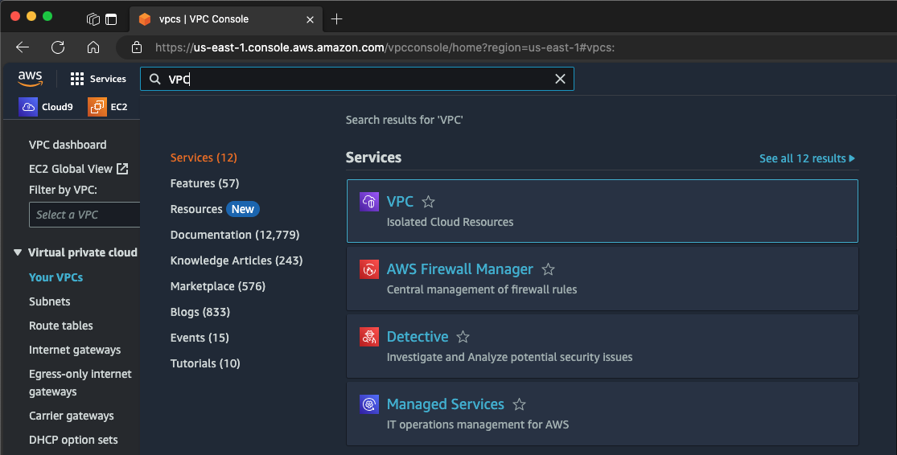
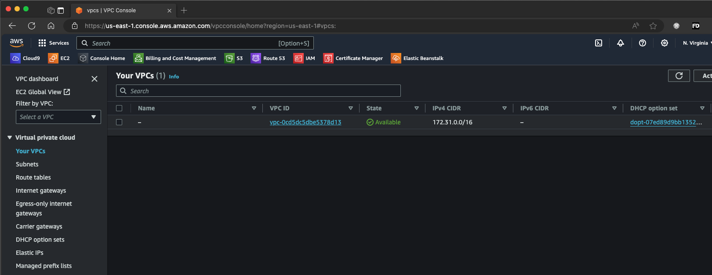

# Implementing Networking Concepts in AWS (VPC, Subnets, IG, NAT, Routing, etc

Implementing networking concepts in AWS involves setting up and configuring various AWS services to build a scalable, secure, and efficient network infrastructure. Below are some key networking concepts in AWS:

- Virtual Private Cloud (VPC),
- Subnet,
- Internet Gateway,
- Domain Name System - DNS,
- Natwork Address Transaltion (NAT), etc,

We will be create some of the items mentioned above in this project and brield mentation and explain some not mention above. Let's begin.

### Part 1 - Creating a VPC

In AWS, a Virtual Private Cloud (VPC) is a virtual network dedicated to your AWS account. It provides a logically isolated section of the AWS Cloud where you can launch AWS resources in a virtual network that you define. With a VPC, you have control over your network environment, including IP address ranges, subnets, route tables, and network gateways. AWS comes pre-configured with a default VPC for each region which can be configured.  
To View this,

- Login in to your AWS Account
- From the top left corner of the page, click on services and then search for `VPC`
  
- Click on the VPC menu, and on the left pane, select `Your VPC` sub menu under the `Virtual private cloud menu`.
  
  From this page, you can see the default VPC, the VPCID, and other basic settings of the VPC.

#### Creating a New VPC
