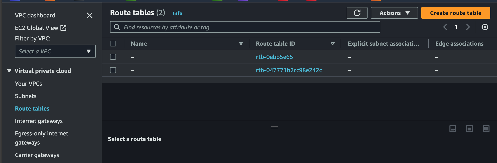
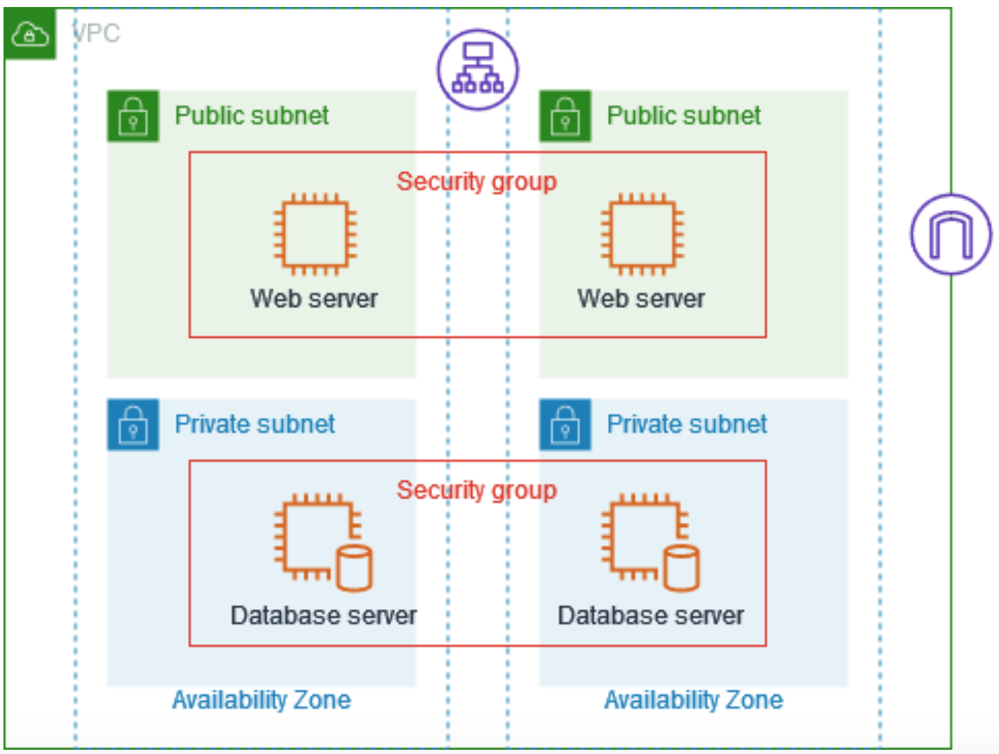

# Implementing Networking Concepts in AWS (VPC, Subnets, IG, NAT, Routing, etc

Implementing networking concepts in AWS involves setting up and configuring various AWS services to build a scalable, secure, and efficient network infrastructure. Below are some key networking concepts in AWS:

- Virtual Private Cloud (VPC),
- Subnet,
- Internet Gateway,
- Domain Name System - DNS,
- Natwork Address Transaltion (NAT), etc,

We will be create some of the items mentioned above in this project and brield mentation and explain some not mention above. Let's begin.

### Part 1 - Creating a VPC

In AWS, a Virtual Private Cloud (VPC) is a virtual network dedicated to your AWS account. It provides a logically isolated section of the AWS Cloud where you can launch AWS resources in a virtual network that you define. With a VPC, you have control over your network environment, including IP address ranges, subnets, route tables, and network gateways. AWS comes pre-configured with a default VPC for each region which can be configured.  
To View this,

- Login in to your AWS Account
- From the top left corner of the page, click on services and then search for `VPC`
  
- Click on the VPC menu, and on the left pane, select `Your VPC` sub menu under the `Virtual private cloud menu`.
  
  From this page, you can see the default VPC, the VPCID, and other basic settings of the VPC.

#### Creating a New VPC

- In the top right corner of the `Your VPC` sub menu, click on create VPC.
- On the `Create VPC` page, select VPC only, give your VPC a name, and type in `10.0.0.0/16` in the IPV4 CIDR, and then create the VPC.
  
- This will create a VPC with no Subnet or Internet Gatway. From the Image below, you can see the resource map section is quite empty. After we've fully configured the VPC, we will revisit the resource Map.
  

#### Creating the Subnets

Subnets are used to divide a larger network into smaller, more manageable segments. Each subnet can operates as an independent unit within the overall network. Subnets can also be public (allows external traffic from the Internet) as well as private (Cannont connect outside the VPC, no Internet traffic). We will be creating both private and public subnets.

- In my current AWS Region (eu-west-2), the default vpc comes with 3 subnets, 1 for each Availablity Zone.
  
- For our `dio-vpc`, we will be creating 4 subnets, 2 private and 2 public with the details below:

  | Subnet Name   | Visibility | Availablity Zone | CIDIR Block |
  | ------------- | ---------- | ---------------- | ----------- |
  | subnet-pub-1  | Public     | eu-west-2a       | 10.0.2.0/24 |
  | subnet-pub-2  | Public     | eu-west-2b       | 10.0.4.0/24 |
  | subnet-priv-1 | Private    | eu-west-2a       | 10.0.1.0/24 |
  | subnet-priv-2 | Private    | eu-west-2b       | 10.0.3.0/24 |

  - Click on `Create Subnet` from the top right corner of the page, and then create 4 subnets using details in the table above. Ensure the subnets are created in the `dio-vpc`.  
    

- After all 4 subnets have been created, we can see our subnets and the number of IPs in each subnets as well as the AZz in the image below.
  

  We've sucessfully created our Subnets, and we can setup our EC2 Instance in any of these subnets. However, the subnets for now don't have access to the internet. Let's fix this.

#### Setting up the Public and Private Subnets

In the previous section, we created 4 subnets. As described above, subnets are segements of our network. Our network could be liked to a big house, while subnets are smaller rooms within the house. Within the rooms, some will doors that can lead one outside the house (Public) while others will only have doors to other rooms within the house (Private).

Public subnets are for resourset like web servers, load balancers etc that we want the public to have access to, while Private subnets are for resources like database, file server etc that we don't want the public to have access to.

In this section, we will be creating/configuring 2 public subnets from the 4 subnets created above, while retaining the remining 2 as private subnets.

#### Internet Gatway (IG)

Making a subnet public is as simple as adding an Internet Gatway to the subnet. An Internet Gateway is a networking device that serves as a portal or bridge between a local network and the internet. It enables communication between devices within a local network, such as computers, servers, and other connected devices, and the broader internet. Let's create our IG and attach some subnets to it to make them private.

- In the left pane of the VPC console, select Internet Gatways.
- At the top right corner of the screen, select Create Internet Gateway.
  
- Give your Internet Gateway a name(`dio-IGW`) and create the IG.
- Add the newly created IG to our VPC by clicking on the Attach to VPC button..
  

#### Route Table

A route table is a key component of the Virtual Private Cloud (VPC) networking infrastructure. A route table contains a set of rules, called routes, that are used to determine where network traffic is directed. Each subnet in a VPC must be associated with a route table, and the table controls the traffic leaving the subnet.

In order for our Internet Gateway to direct traffic from the internet in and out of our subnets, we need to create a route table to direct these traffic accordingly.

- Also from the left corner of the VPC console, select Route Tables.
- We will see two route tables on created by our default VPC and the other created automatically when we created our `dio-VPC`.
- Let's create a new route table that would allow for internet connection by select Create route table from the top right corner of the screen.
  
- In the create route table page, give the route table a name `dio-pubRT`, and select the VPC we want to associate the route table with, and the create the route table.
  
- Once the route table has been created, click on `Edit Routes`, then add a new route with the details below:
  | Destination | Target |
  | ------------- | ---------- |
  | 0.0.0.0/0 | Internet Gateway|

  Select the newly created Internet gateway in the field below.
  

- Our `dio-pubRT` now has two routes. One to route all local traffic(`10.0.0.0/16`) to the default route table, an the other to route all traffic `0.0.0.0/0` to the Internet Gateway we created.

  

- Now, we need to attach/associate this route table to our subnets that needs access to the internet `subnet-pub-1` and `subnet-pub-2`.
  - Still in the route table page, select `Subnet Association`, and then `Edit Subnet associations`.
  - Select the two public subnets we want to connect to the internet, and then save.
    

Now, we've sucessfully created and configured our VPS with 4 subnets, and enabling Public access to two of the subnets while making the other two subnets private. We can also create EC2 Intances and place them in each subnet depending on if they require access to the internet or not.

### Part 2 - NAT Gateways and Private Subnets

In the section above, we configured our Public and Private Subnets. The private subnets had no way of connecting to the internet and are to be used for network resources like Database Servers, Backend Application Servers for processing Buisness Logic etc.
However, there are instances where these severs would require internet access. For example, software installation updating patches etc. For this to be possible, we need to introduce something called a NAT Gateway to our private subnets.

A Network Address Translation (NAT) Gateway is a managed AWS service that allows instances in a private subnet to initiate outbound traffic to the internet while preventing unsolicited inbound traffic from reaching those instances. The instances in the private subnet sends outbound traffic to the NAT gateway. The NAT gateway will be responsible for sending the request to the internet, and when the response is received, the NAT gatway redirects the response back to the Instance within the private subnet. In other words, NAT Gateways act as intermediaries or middlemen between instances in a private subnet and the internet.

Now, lets create a NAT gateway for our private subnets:

- In order to use a NAT gateway, we first need to create an `Elastic IP` address. It's important to note that `Elastic IP` address in AWS are not free, so be mindful of the cost before doing this.
- From the left pane of the VPC console, select Elastic IPs, and the from the top right corner of the screen, click on `Allocate Elastic IP Address`.
  
- Select your region, give the Elastic IP a tag for easy identification, and the Allocate.
  
- Now, let's create our NAT gateway. From the left pane in the VPC console, select NAT Gatways, and then from the top right corner, click on the `Create NAT gateway` button.
  
- In the `Create NAT gateway` page, let's give our NAT gateway a name and then select any of our **Public Subnets**. Also select the Elastic IP we created earlier an then save.
  

          The NAT gateway should be created in any of our Public subnets, as would need access to the internet.

- Now, just as we associated our public subnets to the Internet gateway through a route table, we need to assign our private subnets to this NAT gateway.
- From the left pane on the VPC console, select route table, and then create a new route table called `dio-privRT`.
- From the `dio-privRT`, click on the subnet association, and then add our `subnet-priv-1` and `subnet-priv-2` subnets to this route table.
  .
- Next, we go to the route section, and the edit routes. Add the route `0.0.0.0/0` to direct all traffic to the NAT gatway and then save.
  

**We've now created our NAT gateways to handle outboud traffics from our private subnets.**

#### The VPC Resource Map.

As promised from the begining, now lets go back to the VPC and view the Resource Map.

- From the left Pane of the VPC Console, click on Your VPCs, and the select the VPC you created.
- In the buttom part of the page, you will see the resoure map showing our subnets, route tables as well as IG and NAT GW. The Resource Map will also show how traffic flows from each subnet.

Remember to delete all resource to avoid unnecessary costs.

### Part 3 - Security Groups and Network ACLs

In Amazon Web Services (AWS), both Security Groups and Network Access Control Lists (Network ACLs) are used to control the traffic flow to and from resources within a Virtual Private Cloud (VPC). However, they operate at different levels of the networking stack and have distinct functionalities. Let's explore the differences between Security Groups and Network ACLs:

| Security Groups                                                                                                                                                                       | Network Access Control Lists ( ACLs)                                                                                                                       |
| ------------------------------------------------------------------------------------------------------------------------------------------------------------------------------------- | ---------------------------------------------------------------------------------------------------------------------------------------------------------- |
| Security Groups operate at the transport layer (Layer 4) of the OSI model. TCP and UDP.                                                                                               | Network ACLs operate at the network layer (Layer 3) of the OSI model.                                                                                      |
| Security Groups are associated with individual EC2 instances.                                                                                                                         | Network ACLs are associated with subnets within a VPC.                                                                                                     |
| Security Groups are stateful, meaning if you allow inbound traffic, the corresponding outbound traffic is automatically allowed, and vice versa.                                      | Network ACLs are stateless. In contrast to Security Groups, if you allow inbound traffic, you need to explicitly allow the corresponding outbound traffic. |
| By default, all inbound and outbound traffic is denied. You explicitly define inbound and outbound rules to allow specific types of traffic based on protocols, ports, and IP ranges. | Network ACLs support both allow and deny rules for inbound and outbound traffic. Unlike Security Groups, deny rules need to be explicitly defined.         |
| Inbound and outbound rules are evaluated separately. If there is an explicit allow rule for the traffic, it is permitted; otherwise, it is denied.                                    | Rules are processed in order, and the first rule that matches the traffic is applied. Once a rule is matched, no further rules are evaluated.              |
|                                                                                                                                                                                       | You need to explicitly define rules for inbound response traffic. Network ACLs do not dynamically adjust like Security Groups.                             |

**Security Group**

**Network ACL**

### Part 4 - VPC Peering and VPC Connection

Virtual Private Cloud (VPC) connection and peering are networking features in Amazon Web Services (AWS) that enables the connection of two VPCs, allowing them to communicate with each other as if they were part of the same network. VPC peering simplifies network connectivity between VPCs, facilitating resource sharing, collaboration, and integration across different environments.

There are two primary types of VPC connections:

1. **Site-to-Site VPC Connection**: This is mostly used when a company is conneting their secured on-premise network to AWS cloud.
   
2. **VPC Connection between two AWS clients**: AWS Client VPN provided secure remote access to the cloud network for individual users or devices. It enables secure connectivity for remote employees, partners, or contractos to access resources in the VPC securely.
   
