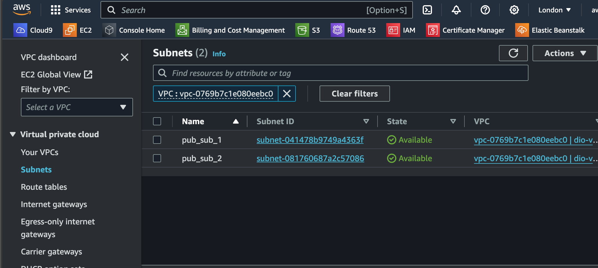
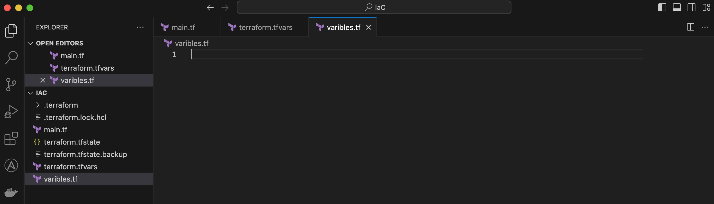

# Infrastructure as a Code (IaC) using Terraform in AWS

nfrastructure as Code (IaC) is a methodology that involves managing and provisioning computing infrastructure through machine-readable script files, rather than through physical hardware configuration or interactive configuration tools. With IaC, you describe your infrastructure's configuration using a high-level programming language or a domain-specific language (DSL), and then use a tool to automate the provisioning and management of those resources.

**Terraform** is an open-source Infrastructure as Code (IaC) tool developed by _HashiCorp_. It allows users to define and provision infrastructure resources in a declarative configuration language. With Terraform, you can manage and automate the deployment of infrastructure across various cloud providers such as AWS, as well as on-premises environments.

In the previous project [Implementing Networking Concepts in AWS](https://github.com/iamYole/DIO-Projects/tree/main/Project%2015%20-%20Networking%20in%20AWS), we designed an architecture consisting of a VPC with public and private subnets, and then we created several EC2 Instances for the public and private subnets. The architecture was created by clicking through several windowns and menus in the AWS Console. In this project, we will be designing the same architecture, but using Terraform IaC.

### Part 1 - The prerequisites

Before we begin, there are some prerequisites that needs to be completed:

- Install Terraform
- Create an _IAM User_ in AWS and an _Access Key_
- Install AWS CLI on a local maching
- Configure the created _IAM User_ to have programatic and adminstrative access to your AWS Console

### Part 2 - Creating the Infrastructure

Let's start by creating the VPC.

- Create a folder called IaC, and within the folder, create a file called main.tf. I'll be using VS Code editor for the code.
  

- In the main.tf file, copy and paste the code below:

> ```bash
> provider "aws" {
>  region = "eu-west-2"
> }
>
> # Create VPC
>  resource "aws_vpc" "dio-vpc" {
>  cidr_block                     = "172.16.0.0/16"
>  enable_dns_support             = "true"
>  enable_dns_hostnames           = "true"
>
>  tags {
>    Name = "dio-vpc"
>  }
> }
> ```

- The code above creates a VPC called `dio-vpc` in AWS region `eu-west-2`. You can choose any region of your choice. The VPC is created using the CIDR Block `172.16.0.0/16`.

- The next step is to initialise the workspace for Terraform to download the necessary plugins to create the resources. To do this, from the terminal, navigate the the directory location or open the terminal window from VS Code and then run `terraform init`.

  

- The workspace has been initialised, and Terraform has created a new directory within the workspace called `.terraform` as well as some .tf files to hold the state of our resources at all time.

- After Terraform has initialised the workspace, its we can start creating our resources using code. To confirm our code has been properly written, we can run `terraform validate`. This should give a success message if there are no syntax errors or it will return an error massage.
- If the configuration has been validated sucessfully, the next step is to run `terraform plan`. This command is used to generate an execution plan. It helps you understand what changes Terraform will make to your infrastructure before actually applying those changes.

  
  From the Image above, we can see that 1 resource would be created/add, 0 would be changed/modified and 0 would be destrory.

        It is very important to run this command before applying any changes. That is because some modifications to the configuration file can just change some settings, while some will delete the resource completely, and recreate it again. Hence inspecting the outcome of the terraform plan command can be very helpful.

- If we are satisfied with the changes to be made, we simply run `terraform apply`. This command will execute the execution plan generated by the `terraform apply` command. This command with create the actual resources on AWS.
- Now, run the `terraform apply` command and verify a VPC named `dio-vpc` has been created on AWS in the region specified.

  

  From the image above, it took just 12sec to create VPC after running the terraform apply command. Now the VPC is pretty empty, and we will appriciate the value of IaC more when deploying multiple resources.
  

Now, let's create the subnets:

- In the `main.tf` file, copy and paste the code below:

  > ```bash
  > # Create public subnets1
  > resource "aws_subnet" "pub_sub_1" {
  >   vpc_id                  = aws_vpc.dio-vpc.id
  >   cidr_block              = "172.16.0.0/24"
  >   map_public_ip_on_launch = true
  >   availability_zone       = "eu-west-2a"
  >
  >  tags = {
  >     Name = "pub_sub_1"
  >  }
  >
  > }
  >
  > # Create public subnet2
  > resource "aws_subnet" "pub_sub_2" {
  >   vpc_id                  = aws_vpc.dio-vpc.id
  >   cidr_block              = "172.16.1.0/24"
  >   map_public_ip_on_launch = true
  >   availability_zone       = "eu-west-2b"
  > }
  >
  >  tags = {
  >      Name = "pub_sub_2"
  > }
  > ```

- The code above created two subnets titeled `pub_sub_1` and `pub_sub_2` using the vpc_id of `dio-vpc` created initially.
- Again, run the `terraform validate`, `terraform plan`, and then `terraform apply` to create the subnets.
  

### Part 3 - Refactoring the Code

In the previous section, created a VPC and two subnets, but values of several attibutes were hard coded. For example, the values of the region and availablity zone were hard coded. We can make the code look better and easier to manage by introducing variables.

Now, let's run `terraform destory` to delete everything we've created so far, and then recreate the infrastructure using a well written configuration insted. Confirm the VPC and subnets have been deleted from the AWS Console and let's start again.

- Let's start by creating a variable for the region. Delete the contents of the `main.tf` file, and replace them with the code below:

  > ```bash
  > variable "region" {
  >     default = "eu-west-2"
  > }
  >
  > variable "vpc_cidr" {
  >     default = "172.16.0.0/16"
  > }
  >
  > variable "enable_dns_support" {
  >     default = "true"
  > }
  >
  >  variable "enable_dns_hostnames" {
  >     default = "true"
  > }
  >
  >  provider "aws" {
  >     region = var.region
  > }
  >
  >  # Create VPC
  >  resource "aws_vpc" "main" {
  >     cidr_block           = var.vpc_cidr
  >     enable_dns_support   = var.enable_dns_support
  >     enable_dns_hostnames = var.enable_dns_hostnames
  >  }
  > ```

  The code above will produce the same execution plan as the previous code, but we've been able to take advantage of variables in defining some attributes such as region, cidr etc. With this, we can easily change the region our infrastructure will be created in by modifying just one line of code.

- Now, let's create the subnets. While doing this, another interesting concept would be introduced. In AWS, each region has a min of 2 availablitiy zone and up to a max of 5 in some regions. Instead of creating a variable for each availability zone, we will be introducing loops and data sources in terraform.
- In the `main.tf` file, copy and paste the code below

  > ```bash
  > #Get list of availability zones
  > data "aws_availability_zones" "available" {
  >     state = "available"
  > }
  >
  > # Create public subnet1
  > resource "aws_subnet" "pub_sub" {
  >     count                   = 2
  >     vpc_id                  = aws_vpc.vio_vpc.id
  >     cidr_block              = "172.16.1.0/24"
  >     map_public_ip_on_launch = true
  >     availability_zone       = data.aws_availability_zones.available.names[count.index]
  >
  > tags = {
  >       Name = "pub_sub_${count.index + 1}"
  >  }
  >
  > }
  > ```

  In the code above, we created a variable called `count` within the subnet block. The variable has a value of 2 meaning we would be creating two subnets. The value for the availablity zone also takes advantage of the data source created above the subnet creation. `data.aws_availability_zones.available` returns the names of all the availablity zones in the region, then adding the `[count.index]` returns the name of the first and second availability*zone. We could also specify 3 if we want a subnet in three of the availablity zones in `eu-west-2`. Lastly, the `tags` is used to name each subnet. `"pub_sub*${count.index + 1}"` is will name each subnet appending a number (1 or 2) to "pub*sub*".

- With the code above, we will have a runtime error because the first iteration will create the first subnet using the hard coding value of `172.16.1.0/24`. The code will attempt to create the second subnet using the same hard coding subnet, and that's when we will encounter an error. To fix this, we will be using a function `cidrsubnet()`.
- Now, let's modify the code below

  > `cidr_block = "172.16.1.0/24"`

  with

  > `cidr_block = cidrsubnet(var.vpc_cidr, 8, count.index+1)`

  This new line is using the _cidrsubnet_ function to dynamically generate CIDR blocks for subnets within a larger CIDR block. Let's break down the components:

  - `var.vpc_cidr`: This variable was defined earlier representing the CIDR block of the VPC `172.16.0.0/16`.
  - `8`: This is the subnet mask length or the number of bits used for the network portion of the subnet. In CIDR notation, it represents a subnet with 2^8 (256) IP addresses. So, each subnet created will have 256 IP addresses.
  - `count.index + 1`: Each iteration starts at 0 and the next 1. Adding + 1 to `count.index` makes the network address start at 1 instead of 0. So our subnet network address would be:
    - 172.16.1.0/24
    - 172.16.2.0/24
  - Terrform has a nice tool to test this out. From the console, type `terraform console` to start the terraform console.
  - In the terraform console, type `cidrsubnet("172.16.0.0/16", 4, 1)` to see the addresses the network address that would be created.

    

- Since we are optimizing the codes, we could as well remove the hard coded count of 2. Imagine if we decide to change the region and then create 4 subnets instead 2, that would require a lot of changes to our code. To fix this, we will be introducing the `length()` function to our code.
- Let's replace the line of code below:

  > `count  = 2`

  with

  > `count = length(data.aws_availability_zones.available.names)`

  The new line of code will return the number of available availablity zones on the region. For the region I selected `eu-west-2`, there are three AZz `["eu-west-2a", "eu-west-2b", "eu-west-2c"]`

- We can sucessfully run the code with no errors. However, this is going to create 3 subnets, but we wnat just 2.
- To fix the new issue and limit the subnets created to just 2, we will be introducing a new variable in our `main.tf` file.
  > ```bash
  >  variable "preferred_number_of_public_subnets" {
  >      default = 2
  > }
  >
  > ```
- Now let update the line below:

  > `count = length(data.aws_availability_zones.available.names)`

  with

  > ```bash
  > count                   = var.preferred_number_of_public_subnets == null ? length(data.aws_availability_zones.available.names) : var.preferred_number_of_public_subnets
  > ```

  - If `var.preferred_number_of_public_subnets` is null, it uses `length(data.aws_availability_zones.available.names)` to determine the number of subnets to create.
  - If `var.preferred_number_of_public_subnets` is not null, it uses the specified value for count.

- We've been able to refactor our code to take advantage of dynamic variables.
- Let's make sure the there are no errors by running `terraform validate`, and then `terraform plan`.
  

### Variables and Tfvars files

In the section above, we definded several variable with our `main.tf` file. However, Terraform has a file that can be used specifically for variables called `.tfvars` file. In this section, we will take advantage of this by creating a two new files, `variables.tf` and `terraform.tfvars`.

This will make our code more readable and easier to manage as we won't be having a single file with a long line of code. Our workspace should now contain the following files:


In the `variavles.tf` file, copy and paste the code below:

> ```bash
> variable "region" {
>  default = "eu-west-2"
> }
>
> variable "vpc_cidr" {
>  default = "172.16.0.0/16"
> }
>
> variable "enable_dns_support" {
>  default = "true"
> }
>
> variable "enable_dns_hostnames" {
>  default = "true"
> }
>
> variable "preferred_number_of_public_subnets" {
>  default = null
> }
> ```

In the `terraform.tvars` file, copy and paste the code below:

> ```bash
> region = "eu-west-2"
>
> vpc_cidr = "172.16.0.0/16"
>
> enable_dns_support = "true"
>
> enable_dns_hostnames = "true"
>
> preferred_number_of_public_subnets = 2
>
> ```

In the `main.tf` file, delete the exiting contents, copy and then paste the followng:

> ```bash
>
> # Get list of availability zones
> data "aws_availability_zones" "available" {
>  state = "available"
> }
>
> provider "aws" {
>  region = var.region
> }
>
> # Create VPC
> resource "aws_vpc" "dio-vpc" {
>  cidr_block           = var.vpc_cidr
>  enable_dns_support   = var.enable_dns_support
>  enable_dns_hostnames = var.enable_dns_support
>
>  tags = {
>    Name = "dio-vpc"
>  }
>
> }
>
> # Create public subnets
> resource "aws_subnet" "public" {
>  count                   = var.preferred_number_of_public_subnets == null ? length(data.aws_availability_zones.available.names) : var.preferred_number_of_public_subnets
>  vpc_id                  = aws_vpc.main.id
>  cidr_block              = cidrsubnet(var.vpc_cidr, 4, count.index + 1)
>  map_public_ip_on_launch = true
>  availability_zone       = data.aws_availability_zones.available.names[count.index]
>
>  tags = {
>    Name = "pub_sub_${count.index}"
>  }
> }
>
> ```

We now have our files properly structured. Let's validate the code by running `terraform validate`.


Let's run `terraform plan` to see the execution plan, and if we are ok with the plan.


As expected, we are adding/creating 3 new resouces (`VPC` and `two Subnets`). Modifying 0 and destroying 0.

If we are with the plan above, we can run `terraform apply` and let's see how many seconds it would take to create the resources.


The resources have been created. Let's log into the AWS console to verify.


`dio-vpc` created with two subnets `pub_sub_0` and `pub_sub_1`.


The CIDR for both subnets are `172.16.16.0/20` and `172.16.32.0/20`. Both subnets created in `eu-west-2a` and `eu-west-2b`.

Now this is all good, but i'll like to modify following:

- Subnet names changed to `pub_sub_01` and `pub_sub_02`.
- Subnets created in the CIDR of `172.16.1.0/24` and `172.16.2.0/24`.

To do this, let's modify the following:

- `cidr_block  = cidrsubnet(var.vpc_cidr, 4, count.index + 1)`
- `cidr_block  = cidrsubnet(var.vpc_cidr, 8, count.index + 1)`

and

- `Name = "pub_sub_${count.index}"`
- `Name = "pub_sub_${count.index + 1}"`

then run `terraform plan`

We can see that the script is going to delete the entire subnets, and then recreate it. The modification introduce requires a new subnet to be created,and that's what terrafor is doing. In this situation, we can go ahead as we won't be loosing an data. If this were to be a webserver with userdata or a database with saved data, we will want to take steps to backup exiting files before proceeding.

Now, let's run `terraform apply` to implement the changes.


And there you have it.


