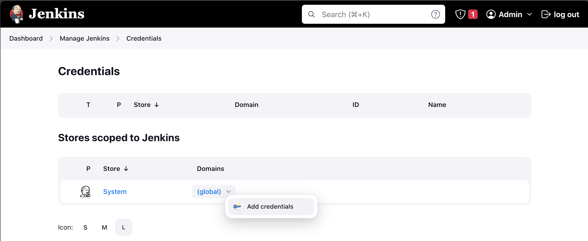
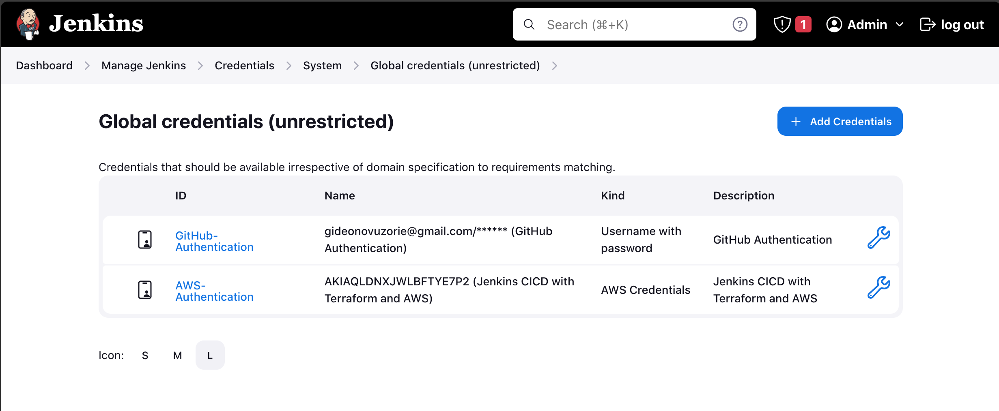

# Implementing CICD Pipleline for Terraform using Jenkins

CI/CD (Continuous Integration/Continuous Deployment) pipelines are a set of practices, principles, and tools that automate the process of building, testing, and deploying software changes. These pipelines aim to increase the efficiency, reliability, and speed of software development and delivery. The CI/CD process is typically divided into two main stages:

- **Continuous Integration (CI):**
  - **Integration**: Developers regularly merge their code changes into a shared repository (version control system), ensuring that the codebase is continuously integrated.
  - **Automated Builds**: Automated build tools compile the source code, run unit tests, and generate executable artifacts. This ensures that the integrated codebase is always in a buildable and testable state.
- **Continuous Deployment/Delivery (CD):**
  - **Continuous Deployment:** Automatically deploying the application to production environments after passing automated tests. This is common for web applications or services where rapid and frequent deployments are feasible.
  - **Continuous Delivery:** Similar to continuous deployment but stops short of automatically deploying to production. Instead, the deployment to production is triggered manually or by a specific condition. This is often preferred for applications that require additional manual approval or validation before going live.

Jenkins is an open-source automation server that helps automate the building, testing, and deployment of code. CI/CD pipelines using Jenkins provide a systematic and automated way to deliver software changes quickly and reliably.

In this project, we will be writing CICD pipeline to automate the creation of cloud infrastrutures using Terraform. The pipelines would be created in Jenkins.

### Part 1 - Setting up the environment (Docker)

In the [CI/CD With Jenkins](https://github.com/iamYole/DIO-Projects/blob/main/Project%2011%20-%20CI%20CD%20With%20Jenkins/README.md) Project, we saw how to Install and Configure Jenkins. In this project however, we would be using Docker to build our Jenkins Server and the Terraform CLI.  
Let's begin:

- Luanch an EC2 Instance called `Jenkins_Server` running Ubuntu Linux.
- Install Docker Engine. Follow the instruction from the official website on how to [Install Docker Engine on Ubuntu](https://docs.docker.com/engine/install/ubuntu/).
- In the `Jenkins_Server`, create a directory called `terraform-with-cloud`.
- Inside the `terraform-with-cloud` directory, create a file called `Dockerfile`.
- Copy and paste the code below into the `Dockerfile` file.
  > ```docker
  > # Use the official Jenkins base image
  > FROM jenkins/jenkins:lts
  >
  > # Create a label the Image
  > LABEL name = "Jenkins/terraform"
  > LABEL author = "darey.io"
  >
  > # Switch to the root user to install additional packages
  > USER root
  >
  > # Install necessary tools and dependencies (e.g., Git, unzip, wget, software-properties-common)
  > RUN apt-get update && apt-get install -y \
  >   git \
  >   unzip \
  >   wget \
  >   software-properties-common \
  >   && rm -rf /var/lib/apt/lists/*
  >
  > # Install Terraform
  > RUN apt-get update && apt-get install -y gnupg software-properties-common wget \
  >   && wget -O- https://apt.releases.hashicorp.com/gpg | gpg --dearmor | tee /usr/share/keyrings/hashicorp-archive-keyring.gpg \
  >   && gpg --no-default-keyring --keyring /usr/share/keyrings/hashicorp-archive-keyring.gpg --fingerprint \
  >   && echo "deb [signed-by=/usr/share/keyrings/hashicorp-archive-keyring.gpg] https://apt.releases.hashicorp.com $(lsb_release -cs) main" | tee /etc/apt/sources.list.d/hashicorp.list \
  >   && apt-get update && apt-get install -y terraform \
  >   && rm -rf /var/lib/apt/lists/*
  >
  > # Set the working directory
  > WORKDIR /app
  >
  > # Print Terraform version to verify installation
  > RUN terraform --version
  >
  > # Switch back to the Jenkins user
  > USER jenkins
  >
  > ```
- The code above are commands we should be familar with. There are commands we've used to install several packages in the past. The only difference here is that we are creating a Docker Image and then executing the commands in the Image, and not our linux machine.
- Save the file and then run the command below to build the image. Ensure you are in the same directory as the `Dockerfile`
  > `docker build -t jenkins-server .`
- If no errors were encountered during the build process, run the command below to confirm the image has ben built sucessfully.

  > `docker images`

  

- Now, let's run the image by running the command below:

  > `docker run -d -p 8080:8080 --name jenkins-server jenkins-server`

  The command above runs our `jenkins-server`image and maps it to port 8080.

- We can confirm the image is running using the command below:

  > `docker ps`

  

- Finally, to launch Jenkins, open your web browser and then type in the <http://PUBLIC_IP_ADDRESS:8080>. Kindly ensure port `8080` is enabled in the security group.
  
- To retrieve the AdminPAssword, we need to log into the image running Jenkins. To do this, run the command below:

  > `docker exec -it jenkins-server /bin/bash`

  This command will log into the image just the way we ssh into our linux machine.

- Navigate to the dictory where the adminpassowrd is stored copy and then paste in the password field to setup jenkins.
  
  

### Part 2 - Setting up Jenkins for Terraform CI/CD.

CI/CD is associated with software development and deployment most of the time. However, since we now have the luxury of writing codes to automate the creation of cloud infrastructures, we can as well treat this the same way we treat the continous integration and deployment of softwares.

Implementing CI/CD (Continuous Integration/Continuous Deployment) in the context of Infrastructure as Code (IaC) offers several benefits, enhancing the efficiency, reliability, and overall development lifecycle of infrastructure provisioning and management. Some of these benefits includes:

- Faster Delivery of Infrastructure Changes
- Reduction to Human Errors
- Consistency Across Environments(Dex, Stage, Prod)
- Scalability and Resource Efficiency etc.

With the last point above `Scalability and Resource Efficiency` in mind, let's imagine we have an existing infrastructure that needs changes. As a DevOps Enginerr, we've ben tasked with adding some resources to scale up our network architecture. The base or exiting code is currently stored in a Git Repository, so let's configure jenkins to have access to our Git Repository.

- First of all, we need to fork the [terraform-aws-pipeline](https://github.com/dareyio/terraform-aws-pipeline) github repository to our github account. This will make it possible to push the changes we make to the existing code.
- Make sure git is installed on the EC2 Instance and configured to push changes to to github.
- Clone the [terraform-aws-pipeline](https://github.com/dareyio/terraform-aws-pipeline) repository to start making changes.
- In your AWS console, create an S3 buck to store the state of our instrasture, and then navigate to the `provider.tf` file to update it with our newly created S3 bucket.
  
  From the code above, the S3 bucket i created is called `g-terra-state`. The value of the `key` attribute is the path within the S3 bucket where the state file would be stored.
- Run `terraform init` and then `terraform plan`. If you are satisfied with the plan, commit and the push the changes to github.

We now have our git repo with the exsiting base code. It's time to connect the `terraform-aws-pipeline` to Jenkins.

- Ensure the `jenkins-server` image is running on docker using the `docker ps` command.
- if it's not, run the command below:

  - `docker images` to get the image ID of the Jenkins image
  - or `docker ps -a` see all stopped container.
  - then `docker start` and the container name to start the container.

  

- If the the container is running, launch the
  `jenkins-server` from a web browser and start installing the required plugins.
- From the `jenkins-server` navigate to Manage Jenkins > Plugins > Available Plugins.
- Search for **GitHub Integration**, and then install the plugin.
  
- Upon sucessful installation, click on restart jenkins. If this page takes forerver to load, restart the web browser and also confirm the container is still running.
- After Jenkins has restarted, Navigate to Manage Jenkins > Plugins > Installed Plugins. Search for the installed plugin and make sure it is enabled
  
  This plugin mainly connects Jenkins to GitHub and enables Jenkins jobs to automatically perform tasks such as building and testing of codes.
- New, let's also install the other required plugins below:

  - `Terraform Plugin`
  - `AWS Credential Plugin`

  

Now, let's confirgure GitHub to accept connection requests from Jenkins.

- In your Guthub account, navigate to `profile` > `settings` > `development settings`

- Click on the `Personal access tokens` drow-down menu > `Tokens (Classic)` and then `Generate new Token`. Select `Generate new token (classic)`
  
- In the `New personal access token (classic)` page, make the following selections:
  - In the note section, give it a name `jenkins-authentication`
  - In the expiration section, feel free to leave the default 30days
  - in the Scope selection section, select just `Repo` and the click on generate token.
    
  - Copy the generate key
    
- Back to Jenkins, navigate to Manage Jenkins > Credentials.
- Click on the down arrow next to `(global)` to add a new credential.
  
  in the `New credentials` page, make the followind modifications:
  - In the Kind section, select username with password
  - Leave the scope in the default selection
  - provide the email address/username name to your github account
  - paste the generated key as the password
  - in the ID section, give a name like `Github-Authentication`. Note that spaces aren't allowed
  - Feel free to give a description of the key, and then click create.
    
    The new credentials has now been created.
- Repeat the step above for `AWS Credential`
  - Here, you can create a new IAM User specifically for this purpose, and the create an access and secret key that would be used to authenticate the user.
    

### Part 3 - Setting up a Multibranch Pipeline

- From the Jenkins Dashboard, click on new item and the give it a name `Terraform-CICD`
- Scroll down and select `Multibranch Pipeline` and then click ok.
- Give the pipeline a name and description
- In the Branch Sources, click on it and then select GitHub
  - Select the credientials
  - copy and paste the forked repository
    
- Leave everthing else in the default setting and click save. Jenkins will automatically scan the repository to locate the Jenkins File.
  
- You make encounter few errors at this stage
  - Unable to locate the `AWS Cred`. Navigate to the JenkinsFile on git and ensure the `credentialsId` has the same name as the ID in our aws credtials.
  - `Scripts not permitted to use method ....`. Jenkins has a security mechanism in place to prevent the execution of potentially unsafe or dangerous scripts. The use of certain methods or classes may be restricted, and an administrator needs to explicitly approve them. To resolve this, do the follow: 1. Go to your Jenkins instance.
    Navigate to "Manage Jenkins" > "In-process Script Approval." 2. Find the signature that is not permitted, and then click approve. Do the same for other scripts if they require explict approvals.
- After all errors has been rectified, the script should build sucessfully.

Now, let's take a deeper look at the JenkinsFile, and ways it could be improved.

> ```groovy
> pipeline {
>    agent any
>
>    environment {
>        TF_CLI_ARGS = 'color'
>    }
>
> ```

- The `pipeline` block defines the entire Jenkins pipeline.
- `agent any` specifies that the pipeline can run on any available agent (Jenkins agent/executor).
- The `environment` block is used to define enviroment variables, and `TF_CLI_ARGS` here was used to enable colourd output for Terraform commands

> ```groovy
> stages {
>        stage('Checkout') {
>            steps {
>                script {
>                    checkout scm
>                }
>            }
>        }
> }
> ```

- The `stages` block contains individual stages within the pipeline.
- `stage('Checkout')` defines a stage named "Checkout" for checking out the source code. This is necessary in other to build the code.
- The `script` block contains commands to be executed within this stage, and the `checkout scm` command within the script blocks checks out from git. This is necessary to build the code.

> ```groovy
> stage('Terraform Plan') {
>            steps {
>                script {
>                    withCredentials([aws(credentialsId: 'AWS-Authentication', accessKeyVariable: 'AWS_ACCESS_KEY_ID', secretKeyVariable: 'AWS_SECRET_ACCESS_KEY')]) {
>                        sh 'terraform init'
>                        sh 'terraform plan -out=tfplan'
>                    }
>                }
>            }
>        }
> }
> ```

- `stage('Terraform plan')` defines a stage for planning Terraform execution.
- The `steps` block contains sets of instructures or tasks to be executed within this stage.
- `withCredentials` is a Jenkins Pipeline step that allows you to temporarily use credentials, and in this case, we are using the AWS credentials saved earlier.
- Within the `script` block we are running the `terrafor init and terraform plan commands`
- `-out=tfplan` option creates a plan file named "tfplan" to capture the planned changes to the infrastructure.

> ```groovy
> stage('Terraform Apply') {
>            when {
>                expression { env.BRANCH_NAME == 'main' }
>                expression { currentBuild.rawBuild.getCause(hudson.model.Cause$UserIdCause) != null }
>            }
>            steps {
>                script {
>                    // Ask for manual confirmation before applying changes
>                    input message: 'Do you want to apply changes?', ok: 'Yes'
>                    withCredentials([aws(credentialsId: 'AWS-Authentication', accessKeyVariable: 'AWS_ACCESS_KEY_ID', secretKeyVariable: 'AWS_SECRET_ACCESS_KEY')]) {
>                        sh 'terraform init'
>                        sh 'terraform apply -out=tfplan'
>                    }
>                }
>            }
>        }
> ```

- `stage('Terraform Apply')` defines a stage for applying the Terraform execution plan.
- The `when` blocks is used to define some conditions that needs to be met before running the stage.
- `expression { env.BRANCH_NAME == 'main' }` give a condition to only run if branch being built is named "main."
- `expression { currentBuild.rawBuild.getCause(hudson.model.Cause$UserIdCause) != null }`: The stage runs only if the build was triggered by a user (not an automatic trigger).

### Step 4 - Code Improvement

The code above should build the infrastructe as we want, but there are few enhancement required to make the code roboust. For instance, we need to include logging functionalities to know what's going on at each step. This can also be used to debugging purposes. We also need to include a mechanism for error handling as well as `code linting`. Linting code refers to the process of analyzing code to find potential errors, stylistic inconsistencies, and adherence to best practices. It's like having a meticulous editor review your writing for grammar, style, and clarity.

Now, let's re write the code with these improvements in mind.

1. > ```groovy
   > /* Validate and lint Terraform configuration */
   >     stage('Terraform Validate and Lint') {
   >         steps {
   >             script {
   >                 withCredentials([aws(credentialsId: 'AWS-Authentication', accessKeyVariable: 'AWS_ACCESS_KEY_ID', secretKeyVariable: 'AWS_SECRET_ACCESS_KEY')]) {
   >                 //sh 'terraform init'
   >                 echo 'Validating Terraform configuration'
   >                 sh 'terraform validate'
   >                 echo 'Validation completed sucessfully'
   >
   >                 echo 'Linting Terraform files'
   >                 try {
   >                     def fmtOutput = sh(script: 'terraform fmt -check', returnStdout: true).trim()
   >                     if(fmtOutput.isEmpty()){
   >                         echo 'Lint check completed sucessfully'
   >                     }else{
   >                         echo "Terraform formatting issues found:\n${fmtOutput}"
   >                         currentBuild.result = 'FAILURE'
   >                     }
   >
   >                 } catch (err) {
   >                     currentBuild.result = 'FAILURE'
   >                     error("Terraform linting failed: ${err}")
   >                 }
   >                 }
   >             }
   >         }
   >     }
   >
   > ```

   - This stage performs Terraform configuration validation using the `terraform validate` command and linting using the `terraform fmt -check command`. If linting fails, it sets the build result to 'FAILURE' and raises an error to indicate the failure. The `try-catch` block ensures that the pipeline continues to execute even if linting fails, allowing for better visibility into the issues. Also, a log message displaying the outcome of each task was also included. Note, it is necessary you perform the validation and lint checks on your local machine before deploying to git. This will ensure errors are not encountered at this stage. However, checking for errors here is also necessary.

2. > ```groovy
   > /* Generate Terraform plan */
   >     stage('Terraform Plan') {
   >         steps {
   >             script {
   >                 withCredentials([aws(credentialsId: 'AWS-Authentication', accessKeyVariable: 'AWS_ACCESS_KEY_ID', secretKeyVariable: 'AWS_SECRET_ACCESS_KEY')]) {
   >                    //sh 'terraform init'
   >                     sh 'terraform plan -out=tfplan'
   >                     echo 'Terraform Plan stage completed sucessfully'
   >                 }
   >             }
   >         }
   >     }
   > ```

   - The `Terraform Plan` stage runs the `Terraform plan`, and saves the output to a file called `tplan`. Just like the above step, we will be displaying a message after the sucessful completion of this set.

3. > ```groovy
   >     /* Apply Terraform plan (only for main branch and manual triggers) */
   > stage('Terraform Apply') {
   >     when {
   >         expression { env.BRANCH_NAME == 'main' }
   >         expression { currentBuild.rawBuild.getCause(hudson.model.Cause$UserIdCause) != null }
   >     }
   >     steps {
   >         script {
   >             // Define the input step with a default value of 'No'
   >             def userInput = input(
   >                 id: 'userInput',
   >                 message: 'Do you want to apply changes?',
   >                 parameters: [string(defaultValue: 'No', description: 'Enter "Yes" to apply changes', name: 'confirmation')],
   >                 submitter: 'auto'
   >             )
   >
   >             // Check if the user input is 'Yes'
   >             if (userInput == 'Yes') {
   >                 withCredentials([aws(credentialsId: 'AWS-Authentication', accessKeyVariable: 'AWS_ACCESS_KEY_ID', secretKeyVariable: 'AWS_SECRET_ACCESS_KEY')]) {
   >                     //sh 'terraform init'
   >                     sh 'terraform apply -input=false -auto-approve tfplan'
   >                     echo 'Terraform apply stage completed successfully. Resources built'
   >                 }
   >             } else {
   >                 echo 'Skipping Terraform apply stage as user chose not to apply changes.'
   >             }
   >         }
   >     }
   > }
   > ```

   - The `Terraform Apply` stage is where our infrastructure gets built. Improving from the previous code, I've introduced a `submitter` to automatically submit a resoponse to the userInput parameter. This was done by specifying the `defaultValue` to `No`. You can change this to `Yes` if you want to apply the changes. I ran the first job using a defaultvalue of `Yes` and it took over 30mins in creating the EKS Cluster. Selecting `No` will save time and cost and automatically skip this step and move on to the next gracefully.
     

4. > ```groovy
   > /* Cleanup stage */
   >     post {
   >         always {
   >             script {
   >                 withCredentials([aws(credentialsId: 'AWS-Authentication', accessKeyVariable: 'AWS_ACCESS_KEY_ID', secretKeyVariable: 'AWS_SECRET_ACCESS_KEY')]) {
   >                     echo 'Waiting for 3 minutes before cleanup...'
   >                     sleep(time: 3, unit: 'MINUTES')  // Delay for 3 minutes
   >
   >                     echo 'Cleaning up workspace'
   >                     sh 'terraform destroy -auto-approve'  // Always destroy applied resources
   >                     deleteDir()
   >                 }
   >             }
   >         }
   >     }
   > ```

   - This section defines post-build actions to be executed after all stages in the pipeline have completed. The post tag ensure all task within it are executed regardless of the pipeline's overall result (success or failure). For the clean up action, after applying the execution plan, the script will wait for 3mins before initiating the `terraform destroy` command. The 3mins wait give us enough time to log into our AWS console to inspect the changes being made (EKS Creation). After 3mins has elapsed, the `terraform destroy` command will delete all the resources created by this pipeline as well as delete any directory created in the jenkins docker image. In production enviroment, this step can be used to notify relevant stakeholders of the sucessful deployment of our infrasture or otherwise.
     
     Image of the EKS cluster created by the pipeline from the apply stage when the default value was set to yes.

#### Summary

In summary, we've improved on the exiting the code significantly by adding the following:

- Logging the outcome (Success or Failure) of all task at each stage. This message can be viewed from the console output of our MultiBranch Pipeline
- We added a stage to validate our pipeline and perform a lint check to ensure the code has been written to standard. If they code (`main.tf`) was short of standard, the deployment would be aborted.
- We also removed the manual input required in applying the change or not. This automated response would make it more convienent for DevOps Engineers to initite the pipeline build process and wait for the outcome.
- To save cost for our development environment, we introduced the `clean up` stage in the post directive of the pipeline to delete all resources created here after 3mins. This can be increased or reduced depending on your requirement.
- Not covered here, but could improve the overall experince of this pipeline is introducing a GitHub Webhook to automatically start the build process after every commit.

The completed full code can be found [here](https://github.com/iamYole/terraform-aws-pipeline/blob/main/Jenkinsfile).
