# End to End Continous Integration (CI) project using JENKINS | ANSIBLE | ARTIFACTORY | SONARQUBE | PHP

### Part 1 - Introduction to Continous Integration

Continuous Integration (CI) is a software development practice where members of a team integrate their code changes into a shared repository frequently, typically multiple times a day. Each integration is verified by an automated build process, which includes compiling the code, running automated tests, and performing other checks to ensure that the newly integrated code does not introduce errors or break existing functionality.

**CI concept is not only about committing your code**. There is a general workflow, which includes:

- **Run tests locally**: Before developers commit their code to a central repository, it is recommended to test the code locally. So, a Test-Driven Development (TDD) approach is commonly used in combination with CI. Developers write tests for their code called unit-tests, and before they commit their work, they run their tests locally. This practice helps a team to avoid having one developer's work-in-progress code from breaking other developers' copy of the codebase.
- **Compile code in CI**: After testing codes locally, developers commit and push their work to a central repository. Rather than building the code into an executable locally, a dedicated CI server picks up the code and runs the build there. In this project we will be using Jenkins as our CI server. Jenkins can also be confirgure to build the project on the CI sever after every commit or a specific times depending the the project requirement. Build happens either periodically - by polling the repository at some configured schedule, or after every commit. Having a CI server where builds run is a good practice for a team, as everyone has visibility into each commit and its corresponding builds.
- **Run further tests in CI**: Even though tests have been run locally by developers, it is important to run the unit-tests on the CI server as well. But, rather than focusing solely on unit-tests, there are other kinds of tests and code analysis that can be run in the CI server. These are extremely critical to determining the overall quality of code being developed, how it interacts with other developers' work, and how vulnerable it is to attacks. A CI server can use different tools for Static Code Analysis, Code Coverage Analysis, Code smells Analysis, and Compliance Analysis. In addition, it can run other types of tests such as Integration and Penetration tests. Other tasks performed by a CI server include production of code documentation from the source code and facilitate manual quality assurance (QA) testing processes.
- **Deploy an artifact from CI**: At this stage, the difference between CI and CD is spelt out. As you now know, CI is Continuous Integration, which is everything we have been discussing so far. CD on the other hand is Continuous Delivery which ensures that software checked into the mainline is always ready to be deployed to users. The deployment here is manually triggered after certain QA tasks are passed successfully. There is another CD known as Continuous Deployment which is also about deploying the software to the users, but rather than manual, it makes the entire process fully automated. Thus, Continuous Deployment is just one step ahead in automation than Continuous Delivery.

The diamgram below is a graphical representation of the CI steps. Let's take a deeper look at aeach step:


1. **Version control**: Also known as source control or revision control, is a system that records changes to a file or set of files over time so that you can recall specific versions later. Softwares like GitHub and Gitlab are common verson control systems out there.
2. **Build**: This refers to the process of compiling source code files, linking necessary libraries, and generating executable files or other deliverables from the source code. The build process is ususally different depending on the type of language or technology used. Compiled languages such as C and C++, the codes are converted to machine codes that can be understood by the target machine. Interpreted languages on the other hand usually have an intepreter installed on the target machine. The interpreter would be responsible for transalting the codes to that understood by the target machine. Examples of interpreted languages are Java, Javascript, PhP, etc.
3. **Unit Test**: Here, individual units or components of a software application are tested in isolation to ensure they behave as expected. A unit typically refers to the smallest testable part of an application, such as a function, method, or class.
4. **Deploy**: Once the tests are passed, the next phase is to deploy the compiled or packaged code into an artifact repository. This is where all the various versions of code including the latest will be stored. The CI tool will have to pick up the code from this location to proceed with the remaining parts of the pipeline.
5. **Auto Test**: Apart from Unit testing, there are many other kinds of tests that are required to analyse the quality of code and determine how vulnerable the software will be to external or internal attacks. These tests must be automated, and there can be multiple environments created to fulfil different test requirements. For example, a server dedicated for Integration Testing will have the code deployed there to conduct integration tests. Once that passes, there can be other sub-layers in the testing phase in which the code will be deployed to, so as to conduct further tests. Such are User Acceptance Testing (UAT), and another can be Penetration Testing. These servers will be named according to what they have been designed to do in those environments. A UAT server is generally be used for UAT, SIT server is for Systems Integration Testing, PEN Server is for Penetration Testing and they can be named whatever the naming style or convention in which the team is used. An environment does not necessarily have to reside on one single server. In most cases it might be a stack as you have defined in your Ansible Inventory. All the servers in the inventory/dev are considered as Dev Environment. The same goes for inventory/stage (Staging Environment), inventory/preprod (Pre-production environment), inventory/prod (Production environment), etc. So, it is all down to naming convention as agreed and used company or team wide.
6. **Deploy to production**: Once all the tests have been conducted and either the release manager or whoever has the authority to authorize the release to the production server is happy, he gives green light to hit the deploy button to ship the release to production environment. This is an Ideal Continuous Delivery Pipeline. If the entire pipeline was automated and no human is required to manually give the Go decision, then this would be considered as Continuous Deployment. Because the cycle will be repeated, and every time there is a code commit and push, it causes the pipeline to trigger, and the loop continues over and over again.
7. **Measure and Validate**: This is where live users are interacting with the application and feedback is being collected for further improvements and bug fixes. There are many metrics that must be determined and observed here. We will quickly go through 13 metrics that MUST be considered.

#### Common Best Practices of CI/CD

Continuous Integration (CI) and Continuous Delivery/Continuous Deployment (CD) are integral practices in modern software development, aimed at automating and streamlining the process of building, testing, and delivering software. Here are some common best practices associated with CI/CD:

- **Automate Everything**: Aim to automate every aspect of the software development lifecycle, including code compilation, testing, deployment, and infrastructure provisioning, etc.
- **Version Control**: Utilize a version control system (e.g., Git, Subversion) to manage source code and configuration files. All changes should be committed to version control, enabling collaboration, traceability, and rollback if necessary.
- **Frequent Commit**s: Developers should be emcouraged to make commit small and frequent changes to the codebase. This practice facilitates easier integration, reduces the risk of conflicts, and allows for more granular tracking of changes.
- **Automated Builds**: Set up automated build processes to compile code, run unit tests, and generate artifacts. Continuous integration servers (e.g., Jenkins, GitLab CI, Travis CI) can automatically trigger builds whenever changes are pushed to the repository.
- **Automated Testing**: Implement automated testing at different levels (unit, integration, end-to-end) to validate the functionality, performance, and reliability of the software. Automated tests should be run as part of the CI pipeline to provide rapid feedback on code changes.
- **Isolated Environments**: Use isolated environments for testing and deployment, such as staging and production environments.
- **Immutable Infrastructure**: Adopt the principle of immutable infrastructure, where infrastructure components are treated as disposable and are never modified in place. Instead, new instances are created and deployed with each change, promoting consistency and reproducibility.
- **Monitoring and Feedback**: Implement monitoring and alerting mechanisms to track the health and performance of applications in production.
- **Infrastructure as Code (IaC)**: Define infrastructure configurations using code (e.g., using tools like Terraform, AWS CloudFormation) to automate provisioning, configuration, and management of infrastructure resources. IaC enables reproducibility, consistency, and scalability of infrastructure.
- **Security and Compliance**: Integrate security and compliance checks into the CI/CD pipeline to identify vulnerabilities, enforce policies, and ensure regulatory compliance.

### Part 2 - Common Success Metrics in DevOps

DevOps emphasizes the importance of continuous delivery or deployment, striving to efficiently deliver high-quality code at a rapid pace. While this ambition is commendable, However, it's important to be careful not to break things as we move fast. By meticulously tracking metrics, organizations can gain insights into their delivery speed and identify potential bottlenecks beforehand. Ultimately, DevOps aims to bolster Velocity, Quality, and Performance in software delivery processes. Let's take a look at some KPIs in DevOps:

1. **Deployment Frequency**: This metric measures how often new code changes are deployed to production. A higher deployment frequency indicates that teams are delivering new features and fixes more frequently, enabling faster time-to-market and responsiveness to customer needs.
2. **Lead Time for Changes**: Lead time for changes measures the time it takes from initiating a change to deploying it into production. A shorter lead time indicates faster delivery of features and fixes, improving agility and competitiveness.
3. **Mean Time to Recovery (MTTR)**: MTTR measures the average time it takes to recover from failures or incidents in production. A lower MTTR indicates that teams can detect and resolve issues more quickly, minimizing downtime and customer impact.
4. **Mean time to detection (MTTD)**: When problems happen, it is important that we identify them quickly. The last thing we want is to have a major partial or complete system outage and not know about it. Having robust application monitoring and good observability tools in place will help us detect issues quickly. Once they are detected, we also must fix them quickly!
5. **Percentage of passed automated tests**: To increase velocity, it is highly recommended that the development team makes extensive usage of unit and functional testing. Since DevOps relies heavily on automation, tracking how well automated tests work is a good DevOps metrics. It is good to know how often code changes break tests.
6. **Change Failure Rate**: Change failure rate measures the percentage of changes (e.g., deployments) that result in failures or incidents in production. A lower change failure rate indicates a more reliable and resilient system, with fewer disruptions to users.
7. **Defect escape rate**: Do you know how many software defects are being found in production versus QA? If you want to ship code fast, you need to have confidence that you can find software defects before they get to production. Defect escape rate is a great DevOps metric to track how often those defects make it to production.
8. **Deployment Success Rate**: Deployment success rate measures the percentage of deployments that are successful without causing incidents or failures in production. A higher deployment success rate indicates that teams are delivering changes more reliably and with fewer issues.
9. **Availability**: The last thing we ever want is for our application to be down. Depending on the type of application and how we deploy it, we may have a little downtime as part of scheduled maintenance. It is highly recommended to track this metric and all unplanned outages. Most software companies build status pages to track this. Such as this Google Products Status Page.
10. **Code and Test Coverage**: Code and test coverage metrics assess the percentage of code covered by automated tests and the percentage of requirements covered by automated tests. Higher coverage indicates a more comprehensive and reliable test suite, reducing the risk of regressions and defects.
11. **Infrastructure as Code (IaC) Compliance**: For organizations practicing infrastructure as code (IaC), compliance metrics measure the adherence of infrastructure configurations to predefined policies and standards. Higher compliance indicates better control and security of infrastructure resources
12. **Application usage & traffic**: After a deployment, we want to see if the number of transactions or users accessing our system looks normal. If we suddenly have no traffic or a giant spike in traffic, something could be wrong. An attacker may be routing traffic elsewhere, or initiating a DDOS attack
13. **Application performance**: Before we even perform a deployment, we should configure monitoring tools like Retrace, DataDog, New Relic, or AppDynamics to look for performance problems, hidden errors, and other issues. During and after the deployment, we should also look for any changes in overall application performance and establish some benchmarks to know when things deviate from the norm.

These and many more metrics are often tracked and analyzed using tools and platforms specifically designed for DevOps and continuous improvement such as monitoring and observability tools, version control systems, CI/CD pipelines, and agile project management tools. By regularly monitoring and optimizing these metrics, organizations can continuously improve their DevOps practices and achieve better outcomes in software delivery and operational performance.

### Part 3 - SIMULATING A TYPICAL CI/CD PIPELINE FOR A PHP BASED APPLICATION

As part of our ongoing infrastructure development with Ansible, we will be creating a pipeline that simulates continuous integration and delivery. It is important to know that both Tooling and TODO Web Applications are based on an interpreted (scripting) language (PHP). It means, it can be deployed directly onto a server and will work without compiling the code to a machine language.

One problem with that approach is that it would be difficult to package and version the software for different releases. And so, in this project, we will be using a different approach for releases, rather than downloading directly from git, we will be using Ansible uri module.

#### The Setup

This project is partly a continuation of the [Ansible (Automating simple tasks with Ansible)](https://github.com/iamYole/DIO-Projects/blob/main/Project%2012%20-%20Automating%20simple%20tasks%20with%20Ansible/README.md) Project, so simply add and subtract based on the new setup in this project. It will require a lot of servers to simulate all the different environments from dev/ci all the way to production. This will be quite a lot of servers altogether (But you don’t have to create them all at once. Only create servers required for an environment you are working with at the moment. For example, when doing deployments for development, do not create servers for integration, pentest, or production yet).

Try to utilize your AWS free tier as much as you can, you can also register a new account if you have exhausted the current one. Alternatively, you can use Google Cloud (GCP) to rent virtual machines from this cloud service provider – you can get $300 credit here or here (NOTE: Please read instructions carefully to get your credits)

To minimize the cost of cloud servers, you don not have to create all the servers at once, simply spin up a minimal server set up as you progress through the project implementation and have reached a need for more.

To get started, we will focus on these environments initially.

- Ci
- Dev
- Pentest

Both SIT – For System Integration Testing and UAT – User Acceptance Testing do not require a lot of extra installation or configuration. They are basically the webservers holding our applications. But Pentest – For Penetration testing is where we will conduct security related tests, so some other tools and specific configurations will be needed. In some cases, it will also be used for Performance and Load testing. Otherwise, that can also be a separate environment on its own. It all depends on decisions made by the company and the team running the show.

We will be using Nginx to serve as a reverse proxy for our sites and tools. Each environment setup is represented in the below table and diagrams.


#### DNS Requirements

For this project, we would need to create different subdomains for each environment. I have a domanin **iamyole.uk** and from that domain, i'll be creating several subdomains as follows:
|Servers |Subdomains |
--- | --- |
|Jenkins|www.ci.infradev.iamyole.uk|
|Sonarqube|www.sonarqube.infradev.iamyole.uk|
|Artifactory|www.artifacts.infradev.iamyole.uk|
|Production Tooling|www.tooling.iamyole.uk|
|Pre-Prod Tooling|www.tooling.preprod.iamyole.uk|
|Pentest Tooling|www.tooling.pentest.iamyole.uk|
|UAT Tooling|www.tooling.uat.iamyole.uk|
|SIT Tooling|www.tooling.sit.iamyole.uk|
|Dev Tooling|www.tooling.dev.iamyole.uk|
|Production TODO-WebApp|www.todo.iamyole.uk|
|Pre-Prod TODO-WebApp|www.todo.preprod.iamyole.uk|
|Pentest TODO-WebApp|www.todo.pentest.iamyole.uk|
|UAT TODO-WebApp|www.todo.uat.iamyole.uk|
|SIT TODO-WebApp|www.todo.sit.iamyole.uk|
|Dev TODO-WebApp|www.todo.dev.iamyole.uk|

Let's log into our Jenkins-Ansible server and inspect the current Inventory directory. This is what we have currently.


Now, lets create a new branch, add three (3) environments to the inventory file, and then commit to the new branch. We will be working with the new branch until we are satisfied with our changes, before merging to the main branch:

- CI
- Pentest
- PreProd

Our inventory directory should now look this:


Before we start writing the Inventory file for each environment, let's provision the servers in aws begining with the CI environment.

### The CI Environment

For this, we need Four(4) Servers, all running on Ubuntu:

- Jenkins
- Nginx
- Sonarqube
- Artifact_Repository


Let's get the private IP address and write the ansible inventory file for the CI environment.

> ```yml
> all:
>  vars:
>    ansible_ssh_private_key_file: /home/keys/dio_key.pem
>
>  hosts:
>    jenkins:
>      ansible_host: 172.31.36.144
>      ansible_user: ubuntu
>    nginx:
>      ansible_host: 172.31.47.1
>      ansible_user: ubuntu
>    artifact_repository:
>      ansible_host: 172.31.34.118
>     ansible_user: ubuntu
>    sonarqube:
>      ansible_host: 172.31.47.236
>      ansible_user: ubuntu
>
>  children:
>    ci_env_all:
>      hosts:
>        jenkins:
>        nginx:
>        artifact_repository:
>        sonarqube:
>
> ```

After the inventory file has been created, i like pinging the servers to ensure they are reachable. This will help in detecting an errors at an early stage.


### The DEV Environment

For this enviroment, we would need 4 servers also:

- Tooling-WebApp
- TODO-WebApp
- nginx
- db

Let's go ahead in creating the EC2 Instances and the update the `dev.yml` file.


> ```yml
> all:
>   vars:
>     ansible_ssh_private_key_file: /home/keys/dio_key.pem
>
>   hosts:
>     tooling:
>       ansible_host: 172.31.41.31
>       ansible_user: ubuntu
>     todo:
>       ansible_host: 172.31.47.126
>       ansible_user: ubuntu
>     nginx:
>       ansible_host: 172.31.33.204
>       ansible_user: ubuntu
>     db:
>       ansible_host: 172.31.42.200
>       ansible_user: ec2-user
>       ansible_python_interpreter: /usr/bin/python
>
>   children:
>     webservers:
>       hosts:
>         tooling:
>         todo:
> ```

Note, the `db` server above is running on Linux RedHat, while the others are running on Ubuntu OS.

Ping the servers in the Dev eniroment for confirmation


### The PenTest Environment

For this enviroment, we need just two servers, `Tooling` and `TODO`.


> ```yml
> all:
>   vars:
>     ansible_ssh_private_key_file: /home/keys/dio_key.pem
>
>   hosts:
>     pentest_tooling:
>       ansible_host: 172.31.42.183
>       ansible_user: ubuntu
>     pentest_todo:
>       ansible_host: 172.31.37.200
>       ansible_user: ubuntu
>
>   children:
>     pentest_servers:
>       hosts:
>         pentest_tooling:
>         pentest_todo:
> ```

Ping the servers in this eniroment for confirmation


### Creating Ansible Roles for the CI Environment

In this section, two new roles would be added to our project, and they are:

- SonarQube
- Artifactory.

**SonarQube** is a widely-used open-source platform for continuous inspection of code quality and security. It provides developers and teams with a comprehensive set of tools to detect bugs, vulnerabilities, code smells, and other quality issues in their source code. I have a tutorial here - [Installing and Configuring SonarQube on Ubuntu 20](https://github.com/iamYole/Installing-and-Configuring-SonarQube/blob/main/README.md) on how to manually install and configure SonarQube

**Artifactory** is a repository manager created by JFrog designed to manage artifacts generated and used in the software development process. It serves as a central repository for storing and managing artifacts such as JAR files, Docker images, npm packages, Python packages, and many others.

### Configuring Jenkins for Ansible Deployment

In previous sections, we've been provisionning and configuring servers directly from Ansible playbooks. In this section, we will configure Jenkins to intract with Ansible for these tasks.

If you haven't already installed and cofiguref Jenkins, the instructions on how to do this can be found here - [Continuous Integration and Continuous Delivery (CI/CD) with Jenkins](https://github.com/iamYole/DIO-Projects/blob/main/Project%2011%20-%20CI%20CD%20With%20Jenkins/README.md). Once done, log into the Jenkins Server and then install the Blue Ocean Plugin


- After the Blue Ocean plugin has been installed, in the left page, you should see the Blue Ocean icon, click on it to switch to the Blue Ocean View.
  
- Click on New Pipeline and then select GitHub.
  
- Click on the link that says "Create an asscess token here". This should take you to a GitHub, log in with your credentials to access the page for token creation.
  
- Provide a name for the token, ensure the `Repo` checkbok is checked to provide full control of the repository to Jenkins, and then Create Token.
- Copy the token back to Jenkins/Blue Ocean, and then select Ansible Project repository you've been working on.
- After all has been done, the pipeline would be created. However, we would need to manually create `Jenkins` file in the ansible project to complete the setup.
- Log into the Jenkins Server console, in the home directory of our Ansible project, create a new directory called Deploy, and then create a new Jenkins File in the directory. The directory structure should now look like the image below

  

- Copy and paste the code below to the Jenkins File.
  > ```groovy
  > pipeline {
  >    agent any
  >
  >  stages {
  >    stage('Build') {
  >      steps {
  >        script {
  >          sh 'echo "Building Stage"'
  >        }
  >      }
  >    }
  >  }
  > }
  > ```
- This is just a test file. It creates a stage called 'Build' and echos "Building stage to the console".
- Commint and push the changes to GitHub, then go back to Jenkins > The Ansible Project and the configure
  
- Scroll down to Build Configuration and in the script field, type in the directory path of the Jenkins file and then save.
  
- The pipeline should be built automatically. You can also init the build from the Blue Ocean page for a different and more inutivie UI.
  

Let's test the Multi Branch feature. Create a new branch called `feature/multibranch`. Modify the `Jenkins` file to add a new stage called test. Code below:

> ```groovy
> pipeline {
>    agent any
>
>  stages {
>    stage('Build') {
>      steps {
>        script {
>          sh 'echo "Building Stage"'
>        }
>      }
>    }
>
>    stage('Test') {
>      steps {
>        script {
>          sh 'echo "Testing Stage"'
>        }
>      }
>    }
>  }
> }
> ```

- Save and commit the changes made in the new branch to Git.
- Back in jenkins, click on the Ansible Project, and on the left pane, click on scan now. This will recognise the new Jenkins File in the new branch.
- This will automatically trigger a new build and the build pipeline showing the new stage can also be seen. Also notice that branch now shows the newly created branch.
  

All we've done so far is run our Jenkins file from our GitHub Repository, Now, let's configure Jenkins to be able to run our ansible playbooks.

- Let's start by installing the Ansible plugin on Jenkins
- As we will now be running our Ansible Playbooks from Jenkins, we need to give Jenkins access to the Server where the playbooks would run.
- To do this, Navigate to the Jenkins Dashboard > Manage Jenkins > Credentials, and then add a new global credential.
  
- Provide an name for the ID and Description. For the username, provide the username used to ssh to server, and the copy and paste the value of private key into the private key section.
  
- Next, we need to configure the ansible plugin. To do this, Navigate the the Jenkis Dashboard > Manage Jenkins > Tools, and then scroll down to the Ansible Section. Provide the information as displayed in the image below and then save.
  

### Provisioning the Servers for the Development Environment

Now, let's provision our webservers in the development environment from Jenkins.

First, we need to ensure our ansible playbooks and folder structure is in order. I did a little modification to the files and I'll paste the contents below:

1. roles/webservers/task/main.yml
   > ```yml
   > ---
   > - name: install git
   >  become: true
   >  ansible.builtin.apt:
   >    name: "git"
   >    state: present
   > ```

This is the custom defined role defination of webservers. Here, i want all webservers to have git installed. All other applications necessary for the webservers can also be definded here.

2. static-assignments/devwebservers.yml
   > ```yml
   > ---
   > - hosts: dev-webservers
   >  roles:
   >    - webservers
   >
   > - hosts: dev-webservers
   >  roles:
   >    - apache
   >
   > - hosts: db
   >  roles:
   >    - mysql
   > ```

In this file, i defined the roles i want installed for our development evnironment servers. Here, three roles would be applied to the dev servers

- Our custom definded role called webservers. This would be installed on all the servers
- apache. The apache role from the ansible community roles would be installed on the webservers
- mysql. Also from the ansible community roles, MySQL would be installed on the DB server alone. Please refer to previous sections on the `dev.yml` file.

3. Playbooks/site.yml
   > ```yml
   > ---
   > - hosts: dev-webservers
   > - name: Provisioning the Dev_Env Webservers
   >    import_playbook: ../static-assignments/devwebservers.yml
   >
   > ```

This would be the entry point of the playbook, here, we are dynamically importing the playbook for devwebservers.

We also need to create an ansible configuration file in the local directory of the playbook. This config file would be local to this project alone, and it would be used for things such as setting the role path, python interpreter etc. In the Deploy directory created earlier, create a new file called `ansible.cfg`. Copy and the paste the code below to the file and then save it.

> ```ini
> [defaults]
> timeout = 160
> callbacks_enabled = profile_tasks
> log_path=~/ansible.log
> host_key_checking = False
> gathering = smart
> ansible_python_interpreter=/usr/bin/python3
> allow_world_readable_tmpfiles=true
>
> [ssh_connection]
> ssh_args = -o ControlMaster=auto -o ControlPersist=30m -o ControlPath=/tmp/ansible-ssh-%h-%p-%r -o ServerAliveInterval=60 -o ServerAliveCountMax=60 -o ForwardAgent=yes
> ```

Now, lets write our jenkins script to run the playbook

- From Jenkins dashboard, click on new item, and then pipeline. Give the pipeline a name and click create.
  
- Scroll down to the pipeline section and start writing the script. Jenkins has a very nice tool to generate scripts. See this [Youtube video](https://www.youtube.com/watch?v=PRpEbFZi7nI) from Java Home Cloud to see how to use it.
- The final script should be very similar to the code below. Let's understand what each stage is doing.

  > ```groovy
  > pipeline {
  >    agent any
  >
  >    environment {
  >      ANSIBLE_CONFIG="${WORKSPACE}/deploy/ansible.cfg"
  >    }
  >
  >    stages {
  >        stage('Cleaning up and initializing the environment') {
  >            steps {
  >                dir("${WORKSPACE}") {
  >                deleteDir()
  >              }
  >            }
  >        }
  >
  >        stage('Checkout SCM'){
  >            steps{
  >                    git branch: 'main', url: 'https://github.com/iamYole/ansible-config-mgt.git'
  >                }
  >        }
  >
  >        stage('Run Ansible playbook'){
  >            steps{
  >                ansiblePlaybook become: true, colorized: true, credentialsId: 'Jenkins-Ansible-Server', disableHostKeyChecking: true, installation: 'Ansible', inventory: 'Inventory/dev.yml', playbook: 'Playbooks/site.yml', vaultTmpPath: ''
  >            }
  >        }
  >
  >        stage('Clean Workspace after build'){
  >            steps{
  >                cleanWs(cleanWhenAborted: true, cleanWhenFailure: true, cleanWhenNotBuilt: true, cleanWhenUnstable: true, deleteDirs: true)
  >            }
  >        }
  >    }
  > }
  > ```

  The enviroment block defines the location of the `ansible.cfg` file. The play book has four(4) stages:

  - **Cleaning up and initializing the environment:**: The purpose of this stage to to ensure we are running the latest code. The stage is tasked to delete files in the current directory.
  - **Checkout SCM:**: In this stage, after all the files have been deleted, the lastest and updated copy of the repository would be cloned to the project's workspace.
  - **Run Ansible playbook:**: This is the stage that runs the ansible playbook. It was generated using `Generate pipeline sytax` tool in Jenkins
  - **Clean Workspace after build**: This final stage is tasked to delete all files created by the project.

  In a production enviroment, the stages and task for each stage would be defined by the project requirement.

- Finally, on AWS console, ensure all the Servers for the Development environment are powered on and ready to receive configuration instructions from Ansible.
- Build the pipeline and observer the output for thing commands running behind the scene, and if there are any errors, the output would point us to the right direction.
  
- Also observer to outputs and ensure the changes were done successfully.
  

  ### Provisioning the Servers for the Pentest Environment

  #### Parameterizing Jenkinsfile For Ansible Deployment

  We've successfully setup the Servers for our Development environment. However, we still need to provision and configure the servers for other enviroments like PenTest, Production etc.

  With the current configuration, we would need to manually edit the Jenkins file with the new environments details. As you guessed, there is an easir way to do this. Or more convinent way to archeive this.

  To make this possible, we will dynamically load the Inventory file of the enviroment we want provisioned, in this case, Pentest.

  - Power on the EC2 Instances for the Pentest environment.
  - In the Jenkins script, just after the enviromnet block, and before the sateges block, add the following lines of code.
    > ```groovy
    > parameters {
    >  string(name: 'Inventory', defaultValue: 'dev',  description: 'This is the inventory file for the environment to deploy configuration')
    > }
    > ```
    >
    > This code introduced a parameter to the Jenkins script which requries us to manually inout the name of the inventory file(dev, prod, stage, etc) we want to provision. It also set the default enivron the dev, and we can change this at run time.
  - In the Jenkins script, scroll down to the `Run Ansible playbook` stage, locate this line of code

    > inventory: 'Inventory/dev.yml'

    and change it to

    > inventory: 'Inventory/${inventory}.yml'

  - I also added a file `static-assignment/pentest_servers.yml` to be called from the `site.yml` playbook when the pentest environment is called.
  - Save the changes and the run the pipeline to oberserve the changes and notice only the pentest_servers would be provisioned.
    
  - Change the default value from dev to pentest and the run.
    

  - As seen above, the script ran successfully. Let's inspect the output of the this pipeline to ensure the environment being provisioned is indeed, the Pentest Environment.
    
    Notices how the servers for the dev enviromnet was skipped and only the pentest servers were provisioned.
    .
    And there you have it, we have configured Jenkins to provision our environments by executing playbooks directly on our ansible server.

### Part 4 - CI/CD PIPELINE FOR OUR TODO APPLICATION

We've already deployed the tooling website as a part of deployment through Ansible. Here, we will working with a different PHP webapplication called TODO, and in this project, we will also introduce unit testing and code analysis and a repository manager to the CI/CD pipeline.

Our goal here is to deploy the application onto servers directly from Artifactory rather than from git. If you have not updated Ansible with an Artifactory role, simply use this guide to create an Ansible role for Artifactory (ignore the Nginx part). Configure Artifactory on Ubuntu 22 https://www.youtube.com/watch?v=6M0r7Llf6zA

#### Phase 1 - Prepare Jenkins

1. Fork the repository below into your GitHub account https://github.com/darey-devops/php-todo.git. Also clone it into your jenkins server (home directory).

2. On your Jenkins server, install PHP, its dependencies and Composer tool (Feel free to do this manually at first, then update your Ansible accordingly later)
   > ```bash
   > sudo apt update
   > sudo apt install -y software-properties-common
   > sudo add-apt-repository -y ppa:ondrej/php
   > sudo apt update
   > sudo apt install -y php7.4 php7.4-common php7.4-mbstring php7.4-opcache php7.4-intl php7.4-xml php7.4-gd php7.4-curl php7.4-mysql php7.4-fpm php7.4-json
   > sudo systemctl start php7.4-fpm
   > sudo systemctl enable php7.4-fpm
   > ```
3. Install and verify the installation of composer

   > ```
   > curl -sS https://getcomposer.org/installer | php
   > sudo mv composer.phar /usr/bin/composer
   > composer --version
   > ```

   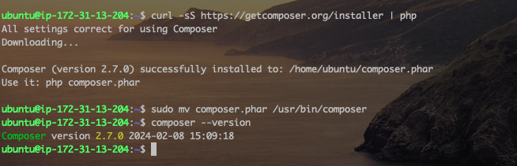

4. Install the following Jenkins Plugins
   - Plot: This would be used to display tests reports, and code coverage information.
   - Artifactory: This would be used to easily upload code artifacts into an Artifactory server
     
5. Configure the Artifactory plugin in Jenkins. Remember to open ports `8081` and `8082` as they are both required for Jfrog Artifactory. From the Jenkins Dashoard > Manage Jenkins > System, and then scroll down to the Jfrog section.
   

### Phase 2 – Integrate Artifactory repository with Jenkins

1.  Create a dummy Jenkinsfile inside the php-todo repository cloned into jenkins-ansible server.
2.  On the database server, create database `homestead`and user `homesteaduser`. Let's do this using the Jenkins file we created in the php-todo.
3.  Update the roles/mysql/defaults/main.yml with the command below
    > ```yml
    > # Databases.
    > mysql_databases:
    >    - name: homestead
    >        collation: utf8_general_ci
    >        encoding: utf8
    >        replicate: 1
    >
    > # Users.
    > mysql_users:
    >    - name: homestead
    >         host: <private-ip-of-jenkins-server>
    >         password: password.1
    >         priv: '*.*:ALL,GRANT'
    > ```
4.  Run the playbook from Jenkins and select the Dev enviroment when prompted.
    
5.  Install MySQL Client on the Jenkins Server and the log in remotely to the database to confirm the configuration.  
    
6.  Update the `.env.sample` file in the php-todo directory. This file is hidden so the view the file in the directory run `ls -la`. To edit the file, run `vi .env.sample`.
    
7.  Edit the below variables in the `.env` file. Note that the last two variables would be added as they weren't in the defaul file.
    > ```ini
    > DB_HOST=<private ip address of the db>
    > DB_DATABASE=homestead
    > DB_USERNAME=homestead
    > DB_PASSWORD=PassWord.1
    > DB_CONNECTION=mysql
    > DB_PORT=3306
    > ```
8.  Update the Jenkins File with the code below:
    > ```groovy
    > pipeline {
    >    agent any
    >
    >  stages {
    >
    >     stage("Initial cleanup") {
    >          steps {
    >            dir("${WORKSPACE}") {
    >              deleteDir()
    >            }
    >          }
    >        }
    >
    >    stage('Checkout SCM') {
    >      steps {
    >            // Provide your git url below
    >            git branch: 'main', url: 'https://github.com/iamYole/php-todo.git'
    >      }
    >    }
    >
    >    stage('Prepare Dependencies') {
    >      steps {
    >             sh 'mv .env.sample .env'
    >             sh 'composer install'
    >             sh 'php artisan migrate'
    >             sh 'php artisan db:seed'
    >             sh 'php artisan key:generate'
    >      }
    >    }
    >  }
    > }
    > ```
9.  Run the pipeline and all the stages should execute successfully.
    
10. Let's update the Jenkins Script again with the code below. This should be added after the `Prepare Dependencies` stage:
    > ```groovy
    >    stage('Execute Unit Tests') {
    >      steps {
    >             sh './vendor/bin/phpunit'
    >      }
    > ```
11. Before running, we need to set `xdebug.mode` to coverage in the php.ini file.

        - In the Jenkins Server linux console, run the following codes:

          > sudo apt-get install php-xdebug

          This will install xdebug, the tool that allows for code analysis for php files.

        - Locate the `php.ini` file (this can be found in `/etc/php/x.x/cli`) and make the change below:
          > debug_mode = coverage
        - Restart the Apache server, and the run the pipeline

    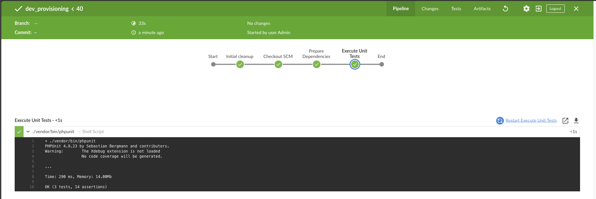
    At the moment, this application is not supported by > PhP 8.1 and above. Recommended version is PHP 7.4

### Phase 3 – Code Quality Analysis

This stage is of great importance to developers because even if the code works and the application is runnung, if the code doesn't meet the required quality or compliance requirement, the pipeline will fail and there would be no deployment.

For PHP the most commonly tool used for code quality analysis is phploc. Read the article here for more https://matthiasnoback.nl/2019/09/using-phploc-for-quick-code-quality-estimation-part-1/.

The data produced by phploc can be ploted onto graphs in Jenkins. Add the code analysis step in Jenkinsfile. The output of the data will be saved in build/logs/phploc.csv file.

1.  Let's add a new stage `Code Analysis` to the Jenkins file with the code below:
    > ```groovy
    > stage('Code Analysis') {
    >  steps {
    >        sh 'phploc app/ --log-csv build/logs/phploc.csv'
    >
    >  }
    > }
    > ```
2.  Plot the data using plot Jenkins plugin. This plugin provides generic plotting (or graphing) capabilities in Jenkins. It will plot one or more single values variations across builds in one or more plots. Plots for a particular job (or project) are configured in the job configuration screen, where each field has additional help information. Each plot can have one or more lines (called data series). After each build completes the plots’ data series latest values are pulled from the CSV file generated by phploc.
    > ```groovy
    > stage('Plot Code Coverage Report') {
    >      steps {
    >
    >            plot csvFileName: 'plot-396c4a6b-b573-41e5-85d8-73613b2ffffb.csv', csvSeries: [[displayTableFlag: false, exclusionValues: 'Lines of Code (LOC),Comment Lines of Code (CLOC),Non-Comment Lines of Code (NCLOC),Logical Lines of Code (LLOC)                          ', file: 'build/logs/phploc.csv', inclusionFlag: 'INCLUDE_BY_STRING', url: '']], group: 'phploc', numBuilds: '100', style: 'line', title: 'A - Lines of code', yaxis: 'Lines of Code'
    >            plot csvFileName: 'plot-396c4a6b-b573-41e5-85d8-73613b2ffffb.csv', csvSeries: [[displayTableFlag: false, exclusionValues: 'Directories,Files,Namespaces', file: 'build/logs/phploc.csv', inclusionFlag: 'INCLUDE_BY_STRING', url: '']], group: 'phploc', numBuilds: '100', style: 'line', title: 'B - Structures Containers', yaxis: 'Count'
    >            plot csvFileName: 'plot-396c4a6b-b573-41e5-85d8-73613b2ffffb.csv', csvSeries: [[displayTableFlag: false, exclusionValues: 'Average Class Length (LLOC),Average Method Length (LLOC),Average Function Length (LLOC)', file: 'build/logs/phploc.csv', inclusionFlag: 'INCLUDE_BY_STRING', url: '']], group: 'phploc', numBuilds: '100', style: 'line', title: 'C - Average Length', yaxis: 'Average Lines of Code'
    >            plot csvFileName: 'plot-396c4a6b-b573-41e5-85d8-73613b2ffffb.csv', csvSeries: [[displayTableFlag: false, exclusionValues: 'Cyclomatic Complexity / Lines of Code,Cyclomatic Complexity / Number of Methods ', file: 'build/logs/phploc.csv', inclusionFlag: 'INCLUDE_BY_STRING', url: '']], group: 'phploc', numBuilds: '100', style: 'line', title: 'D - Relative Cyclomatic Complexity', yaxis: 'Cyclomatic Complexity by Structure'
    >            plot csvFileName: 'plot-396c4a6b-b573-41e5-85d8-73613b2ffffb.csv', csvSeries: [[displayTableFlag: false, exclusionValues: 'Classes,Abstract Classes,Concrete Classes', file: 'build/logs/phploc.csv', inclusionFlag: 'INCLUDE_BY_STRING', url: '']], group: 'phploc', numBuilds: '100', style: 'line', title: 'E - Types of Classes', yaxis: 'Count'
    >            plot csvFileName: 'plot-396c4a6b-b573-41e5-85d8-73613b2ffffb.csv', csvSeries: [[displayTableFlag: false, exclusionValues: 'Methods,Non-Static Methods,Static Methods,Public Methods,Non-Public Methods', file: 'build/logs/phploc.csv', inclusionFlag: 'INCLUDE_BY_STRING', url: '']], group: 'phploc', numBuilds: '100', style: 'line', title: 'F - Types of Methods', yaxis: 'Count'
    >            plot csvFileName: 'plot-396c4a6b-b573-41e5-85d8-73613b2ffffb.csv', csvSeries: [[displayTableFlag: false, exclusionValues: 'Constants,Global Constants,Class Constants', file: 'build/logs/phploc.csv', inclusionFlag: 'INCLUDE_BY_STRING', url: '']], group: 'phploc', numBuilds: '100', style: 'line', title: 'G - Types of Constants', yaxis: 'Count'
    >            plot csvFileName: 'plot-396c4a6b-b573-41e5-85d8-73613b2ffffb.csv', csvSeries: [[displayTableFlag: false, exclusionValues: 'Test Classes,Test Methods', file: 'build/logs/phploc.csv', inclusionFlag: 'INCLUDE_BY_STRING', url: '']], group: 'phploc', numBuilds: '100', style: 'line', title: 'I - Testing', yaxis: 'Count'
    >            plot csvFileName: 'plot-396c4a6b-b573-41e5-85d8-73613b2ffffb.csv', csvSeries: [[displayTableFlag: false, exclusionValues: 'Logical Lines of Code (LLOC),Classes Length (LLOC),Functions Length (LLOC),LLOC outside functions or classes ', file: 'build/logs/phploc.csv', inclusionFlag: 'INCLUDE_BY_STRING', url: '']], group: 'phploc', numBuilds: '100', style: 'line', title: 'AB - Code Structure by Logical Lines of Code', yaxis: 'Logical Lines of Code'
    >            plot csvFileName: 'plot-396c4a6b-b573-41e5-85d8-73613b2ffffb.csv', csvSeries: [[displayTableFlag: false, exclusionValues: 'Functions,Named Functions,Anonymous Functions', file: 'build/logs/phploc.csv', inclusionFlag: 'INCLUDE_BY_STRING', url: '']], group: 'phploc', numBuilds: '100', style: 'line', title: 'H - Types of Functions', yaxis: 'Count'
    >            plot csvFileName: 'plot-396c4a6b-b573-41e5-85d8-73613b2ffffb.csv', csvSeries: [[displayTableFlag: false, exclusionValues: 'Interfaces,Traits,Classes,Methods,Functions,Constants', file: 'build/logs/phploc.csv', inclusionFlag: 'INCLUDE_BY_STRING', url: '']], group: 'phploc', numBuilds: '100', style: 'line', title: 'BB - Structure Objects', yaxis: 'Count'
    >
    >      }
    >    }
    > ```
3.  From the Jenkins Server linux console, install PhpLoc with the commands below:

    > ```bash
    > sudo apt install phploc
    > wget -O phpunit https://phar.phpunit.de/phpunit-7.phar
    > chmod +x phpunit
    > ```

4.  Save the Jenkins File and then run the pipeline. This should run successfully.
    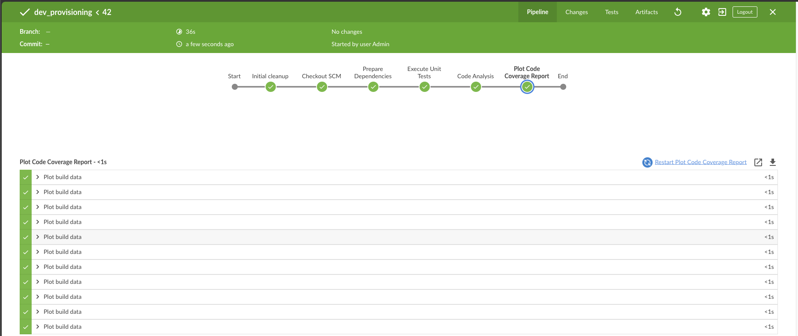
5.  Click on the `Code Analysis` stage to see the result of the code analysis.
    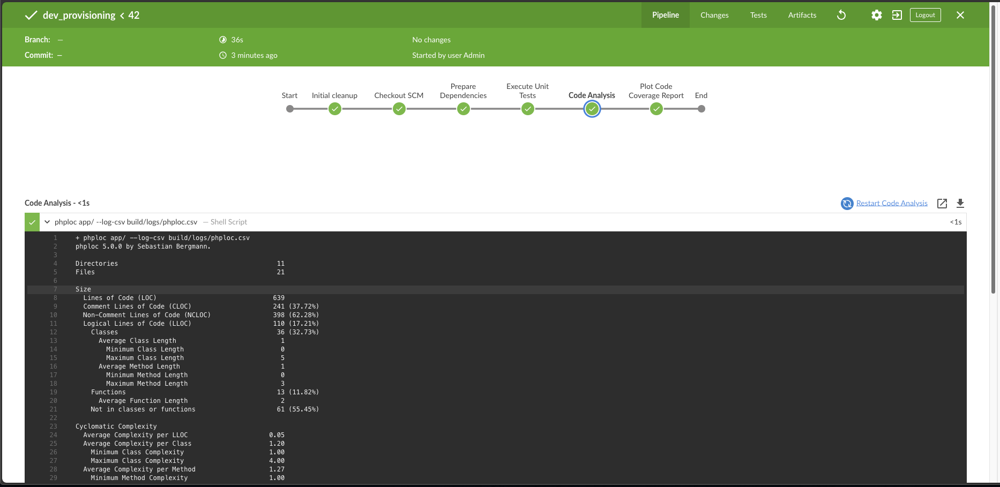
6.  To view the result of the `Plot Code Coverage Report` stage, exit the Blue Ocean view, click on the Pipeline project, and on the right pane, you should see a `Plot` menu.
    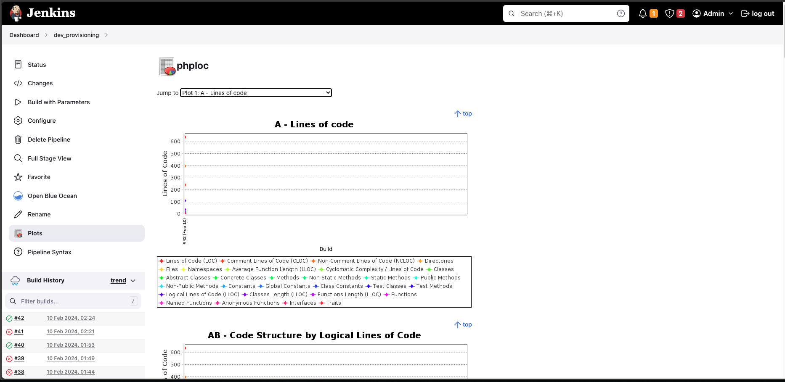

         The analytics may not mean much to you as it is meant to be read by developers. So, you need not worry much about it – this is just to give you an idea of the real-world implementation.

### Phase 4 – Bundle the PhP-TODO application files to the Artifactory repository.

In this section, upon successful completion of the code analysis, the application files would be packaged using zip, and then uploaded to the Articatory Server.

1. First of all, we need to ensure zip is installed on the Jenkins Server.
   > sudo apt install zip unzip -y
2. Add a stage Package the application files:
   > ```groovy
   > stage ('Package Artifact') {
   >    steps {
   >            sh 'zip -qr php-todo.zip ${WORKSPACE}/*'
   >     }
   >    }
   > ```
3. And another stage to upload the packed files to Artifactory
   > ```groovy
   > stage ('Upload Artifact to Artifactory') {
   >          steps {
   >            script {
   >                 def server = Artifactory.server 'jfrog-artifactory'
   >                 def uploadSpec = """{
   >                    "files": [
   >                      {
   >                       "pattern": "php-todo.zip",
   >                       "target": "<name-of-artifact-repository>/php-todo",
   >                       "props": "type=zip;status=ready"
   >
   >                       }
   >                    ]
   >                 }"""
   >
   >                 server.upload spec: uploadSpec
   >               }
   >            }
   >
   >        }
   > ```
4. Run the Pipeline and you should see all steps execute successfully.
   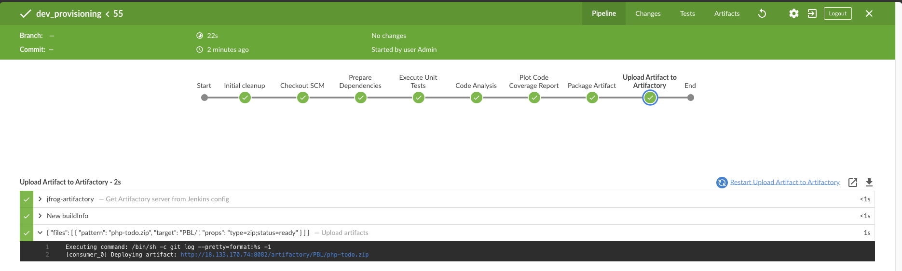
5. Log into the Jfrog Artifactory Server and confirm the packaged files/artifacts has been uploaded.
   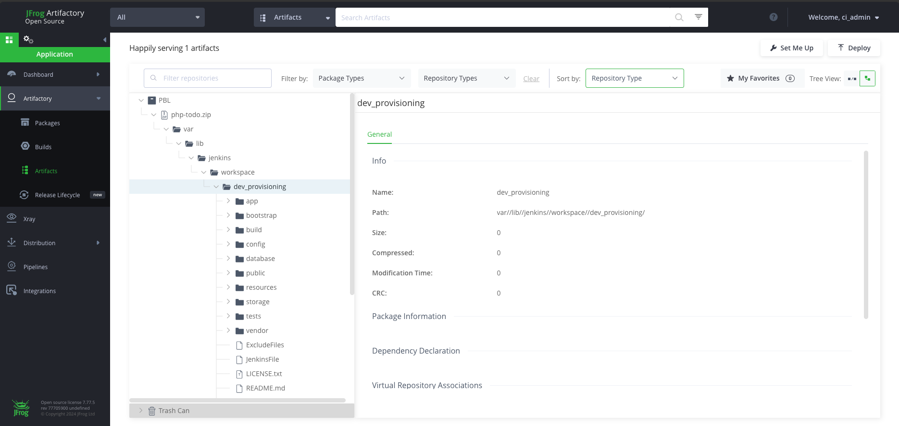

To recap, the pipeline starts by preparing the working directory, deleting all exitig file, and then downloads the latest version of the source codes from github to the directory. Using composer, builds the source code, performs code analysis and then uploads the artifacts to Jfrog Artifactory. However, why stop here, then next step should be to deploy the application to either dev enironment or production. In order to do this neatly, we will need to create two different jobs on jenkins, one to do the Continous Integration bit, while we have another to do the Continous Delivery bit. The Continous Integration job would automatically call the Continous Delivery job once it's done. That way, we will only have to initite one job.

Before we begin, let's go back to the `ansible` project we've been working on and create a playbook to deploy the application. We've already written different playbooks to provision and configure the servers for different environment.

1. Let's start by creating a new play `static-assignments/deployment.yml` with the code below.

   > ```yml
   > ---
   > - name: Deploying the PHP Applicaion to Dev Enviroment
   >  become: true
   >  hosts: todo
   >
   >  tasks:
   >    - name: Update apt cache
   >      ansible.builtin.apt:
   >        update_cache: yes
   >
   >    - name: Install prerequisites
   >      ansible.builtin.apt:
   >        name:
   >          - dirmngr
   >          - gnupg
   >          - software-properties-common
   >        state: present
   >
   >    - name: Add PHP repository
   >      ansible.builtin.apt_repository:
   >        repo: ppa:ondrej/php
   >        state: present
   >
   >    - name: install Apache on the webserver
   >      ansible.builtin.apt:
   >        name: apache2
   >        state: present
   >
   >    - name: ensure httpd is started and enabled
   >      ansible.builtin.service:
   >        name: apache2
   >        state: started
   >        enabled: yes
   >
   >    - name: Install PHP and required extensions
   >      ansible.builtin.apt:
   >        name:
   >          - php
   >          - php-mysql
   >          - php-gd
   >          - php-curl
   >          - unzip
   >          - php-common
   >          - php-mbstring
   >          - php-opcache
   >          - php-intl
   >          - php-xml
   >          - php-fpm
   >          - php-json
   >        state: present
   >
   >    - name: Ensure PHP-FPM is started and enabled
   >      ansible.builtin.service:
   >        name: php-fpm
   >        state: started
   >        enabled: yes
   >
   >    - name: Download the artifact
   >      ansible.builtin.get_url:
   >        url: http://18.133.204.179:8082/artifactory/PBL/php-todo
   >        dest: /home/ubuntu/
   >        url_username: admin
   >        url_password: cmVmdGtuOjAxOjE3MzkxNzM0ODQ6OXlhdks0aE1NZU0yb2hqZEFmWGhmV0ZWcmNm
   >
   >    - name: unzip the artifacts
   >      ansible.builtin.unarchive:
   >        src: /home/ubuntu/php-todo
   >        dest: /home/ubuntu/
   >        remote_src: yes
   >
   >    - name: deploy the code
   >      ansible.builtin.copy:
   >        src: /home/ubuntu/var/lib/jenkins/workspace/php-todo_main/
   >        dest: /var/www/html/
   >        remote_src: yes
   >
   >    - name: Remove Apache default page
   >      ansible.builtin.file:
   >        path: /etc/apache2/sites-enabled/000-default.conf
   >        state: absent
   >
   >    - name: Restart Apache
   >      ansible.builtin.service:
   >        name: apache2
   >        state: restarted
   > ```

   To generate the token used to download the artifact, log into the Artifactory, and at the top right corner, click on Set Me Up, and then enter the password to generate the token.

   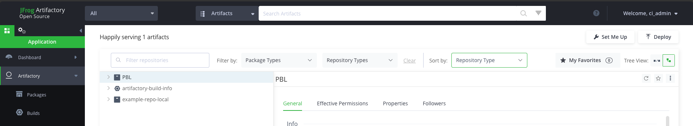
   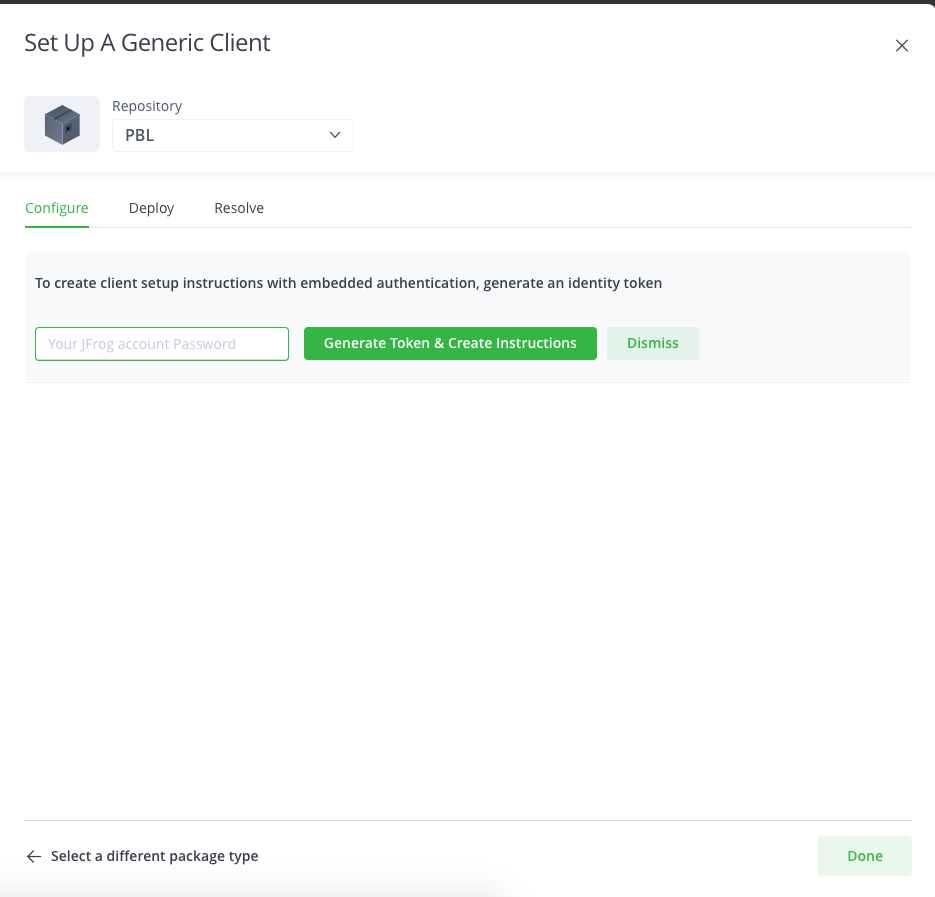

2. Update the `site.yml` file to call this new play with the code below.
   > ```yml
   > ---
   > - hosts: todo
   > - name: Deploy the PhP TODO Web Application
   >   import_playbook: ../static-assignments/deployment.yml
   > ```
3. Great, our playbook has been configure. Let's create a Jenkins job to run this playbook. However, a new pipeline would be responsible for calling this job.
4. Go to Jenkins and create a new job called `proj_deployment`. Point the job to the Jenkins script of the ansible project repository.
   
5. Now, create another job called `php_todo_cicd`. Point this job the the Jenkins Script of the php-todo git repository.
6. Update the the php_todo Jenkins script with the script created earlier to upload artifacts, and then add a new stage to call and run the `proj_deployment`.
   > ```yml
   >  stage ('Deploy to Dev Environment') {
   >      steps {
   >        build job: 'proj_deployment', parameters: [[$class: 'StringParameterValue', name: 'env', value: 'dev.yml']], propagate: false, wait: true
   >      }
   >    }
   > ```
7. Save and commit all changes to github, and then build the `php_todo_cicd` pipeline.
   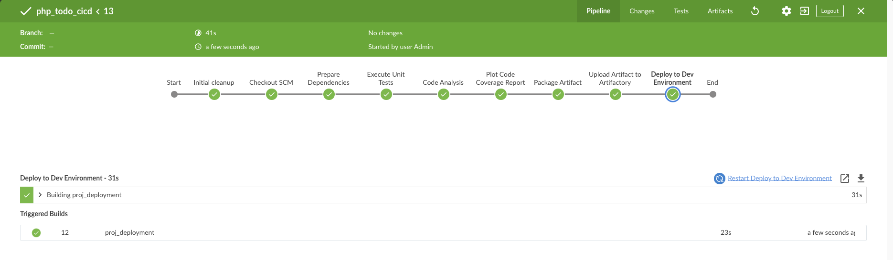
8. Click on `proj_deployment` to see that the deployment pipeline executed sucessfully
   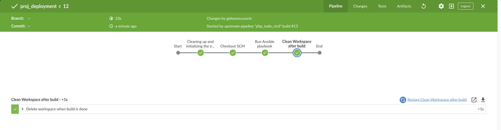
   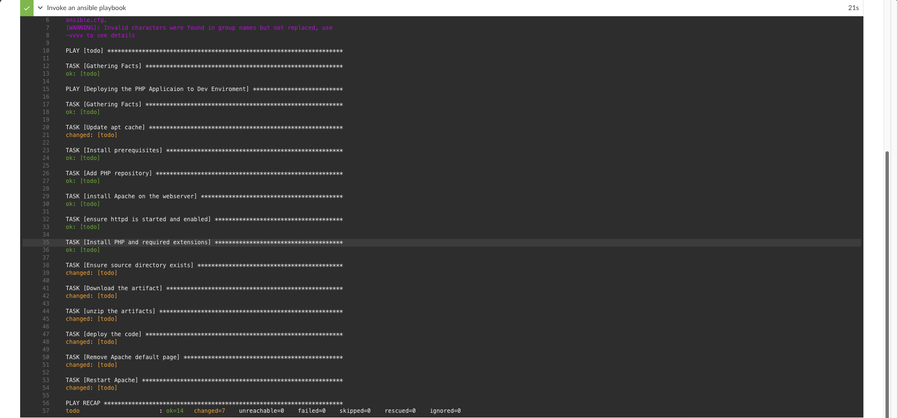
