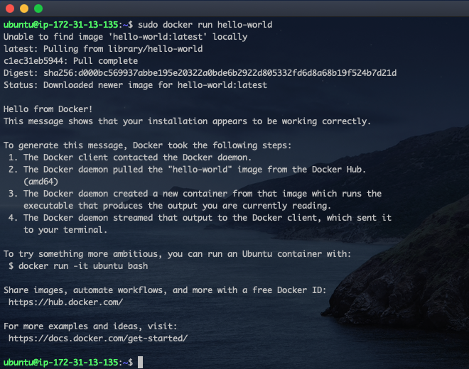

# Containerization with Docker

Containerization is a method of packaging, distributing, and running applications in a consistent and isolated environment called containers. Containers have revolutionized the way applications are developed, deployed, and managed in modern computing environments. Docker, a leading containerization platform, offers developers and IT professionals a powerful set of tools to package, distribute, and run applications consistently across different environments. By encapsulating applications and their dependencies into lightweight, portable containers, Docker enables seamless deployment and scalability while enhancing resource efficiency and development agility.

**Key features and benefits of containerization include:**

- **Isolation**: Containers provide a lightweight form of virtualization, isolating applications and their dependencies from the underlying host system.

- **Portability**: Containers are portable across different environments, such as development, testing, and production.
- **Consistency**: Containers encapsulate all dependencies and configurations required to run an application, ensuring consistency between development, testing, and production environments.
- **Resource Efficiency**: Containers share the host system's kernel and resources, making them lightweight compared to traditional virtual machines.

The most popular containerization technology is Docker, which has become the de facto standard for packaging and distributing containerized applications. Other container orchestration platforms like Kubernetes, Docker Swarm, and Amazon ECS provide additional features for managing and scaling containerized workloads in production environments.

With this understanding, let's deploy our tooling app using Docker.

### Step 1 - Installing Docker Engine

The Docker Engine is a core component of the Docker platform, responsible for managing and running containers on a host system. It provides an environment for creating, deploying, and managing containerized applications with ease. The Docker Engine consists of several key elements:

- **Docker Daemon**: The Docker Daemon (dockerd) is a persistent background process that manages Docker objects such as images, containers, networks, and volumes. It listens for Docker API requests and executes commands to perform various tasks, including container management, image handling, and networking.

- **Docker CLI**: The Docker Command Line Interface (CLI) is a user-friendly interface that allows users to interact with the Docker Engine via commands.

- **Docker Images**: Docker images are read-only templates used to create Docker containers. They contain the application code, runtime, libraries, dependencies, and configuration files required to run the application.

- **Docker Containers**: Docker containers are lightweight, portable, and isolated runtime environments that encapsulate applications and their dependencies. Each container runs as a separate process on the host system, with its own filesystem, network, and resources. Containers are created from Docker images and can be started, stopped, paused, and deleted using Docker commands.

- **Docker Registry**: The Docker Registry is a storage service for Docker images, allowing users to push and pull images to and from a centralized repository. [Docker Hub](https://hub.docker.com/) is the official public registry for Docker images.

The concepts above will become clearer when we start creating and managing docker images. Now let's start by installing the Docker Engine.

- Start by provisioning an EC2 Instance running Ubuntu 22.04.  
  For this, T2.Small is the recommended size as we will be running several docker images.
- Run the command below tp uninstall any conflicting package
  > `for pkg in docker.io docker-doc docker-compose docker-compose-v2 podman-docker containerd runc; do sudo apt-get remove $pkg; done`
- Next, rUn the commands below to ddd Docker's official GPG key:
  > ```bash
  > sudo apt-get update
  > sudo apt-get install ca-certificates curl
  > sudo install -m 0755 -d /etc/apt/keyrings
  > sudo curl -fsSL https://download.docker.com/linux/ubuntu/gpg -o /etc/apt/keyrings/docker.asc
  > sudo chmod a+r /etc/apt/keyrings/docker.asc
  > ```
- Add the repository to Apt sources
  > ```bash
  > echo \
  >   "deb [arch=$(dpkg --print-architecture) signed-by=/etc/apt/keyrings/docker.asc] https://download.docker.com/linux/ubuntu \
  >   $(. /etc/os-release && echo "$VERSION_CODENAME") stable" | \
  >   sudo tee /etc/apt/sources.list.d/docker.list > /dev/null
  > sudo apt-get update
  > ```
- Install the lastes Docker package
  > `sudo apt-get install docker-ce docker-ce-cli containerd.io docker-buildx-plugin docker-compose-plugin`
- Verify that the Docker Engine installation is successful by running the hello-world image.

  > `sudo docker run hello-world`

  
  From the image above, we can see that our installation was successful.

The commands above used in installing docker engine was gotten from the [official docker documentation page](https://docs.docker.com/engine/install/). Visit the page for future updates or installation on a different OS.
