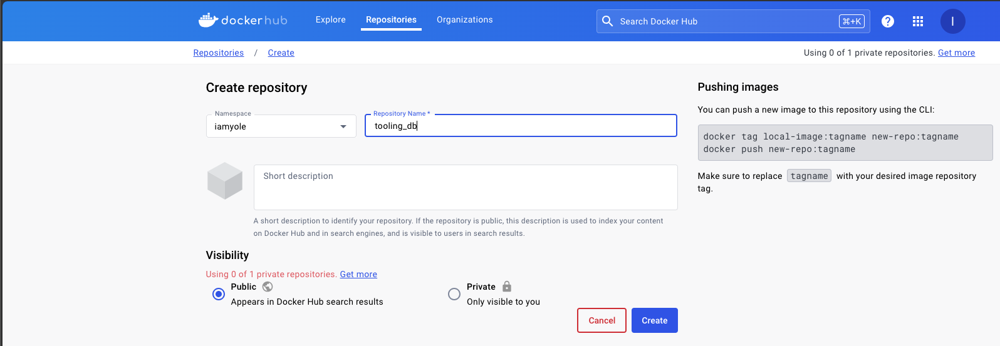
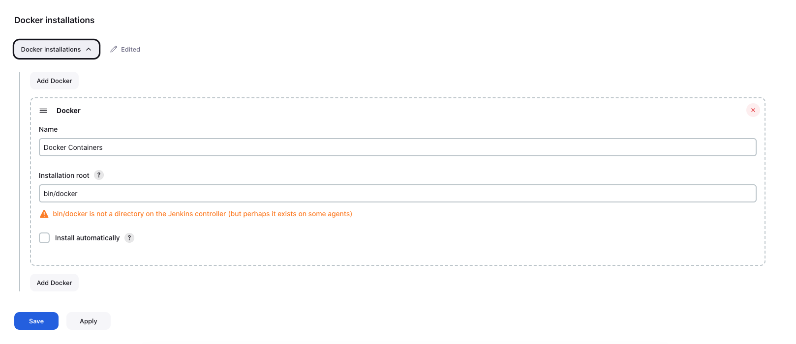

# Containerization with Docker

Containerization is a method of packaging, distributing, and running applications in a consistent and isolated environment called containers. Containers have revolutionized the way applications are developed, deployed, and managed in modern computing environments. Docker, a leading containerization platform, offers developers and IT professionals a powerful set of tools to package, distribute, and run applications consistently across different environments. By encapsulating applications and their dependencies into lightweight, portable containers, Docker enables seamless deployment and scalability while enhancing resource efficiency and development agility.

**Key features and benefits of containerization include:**

- **Isolation**: Containers provide a lightweight form of virtualization, isolating applications and their dependencies from the underlying host system.

- **Portability**: Containers are portable across different environments, such as development, testing, and production.
- **Consistency**: Containers encapsulate all dependencies and configurations required to run an application, ensuring consistency between development, testing, and production environments.
- **Resource Efficiency**: Containers share the host system's kernel and resources, making them lightweight compared to traditional virtual machines.

The most popular containerization technology is Docker, which has become the de facto standard for packaging and distributing containerized applications. Other container orchestration platforms like Kubernetes, Docker Swarm, and Amazon ECS provide additional features for managing and scaling containerized workloads in production environments.

With this understanding, let's deploy our tooling app using Docker.

### Step 1 - Installing Docker Engine

The Docker Engine is a core component of the Docker platform, responsible for managing and running containers on a host system. It provides an environment for creating, deploying, and managing containerized applications with ease. The Docker Engine consists of several key elements:

- **Docker Daemon**: The Docker Daemon (dockerd) is a persistent background process that manages Docker objects such as images, containers, networks, and volumes. It listens for Docker API requests and executes commands to perform various tasks, including container management, image handling, and networking.

- **Docker CLI**: The Docker Command Line Interface (CLI) is a user-friendly interface that allows users to interact with the Docker Engine via commands.

- **Docker Images**: Docker images are read-only templates used to create Docker containers. They contain the application code, runtime, libraries, dependencies, and configuration files required to run the application.

- **Docker Containers**: Docker containers are lightweight, portable, and isolated runtime environments that encapsulate applications and their dependencies. Each container runs as a separate process on the host system, with its own filesystem, network, and resources. Containers are created from Docker images and can be started, stopped, paused, and deleted using Docker commands.

- **Docker Registry**: The Docker Registry is a storage service for Docker images, allowing users to push and pull images to and from a centralized repository. [Docker Hub](https://hub.docker.com/) is the official public registry for Docker images.

The concepts above will become clearer when we start creating and managing docker images. Now let's start by installing the Docker Engine.

- Start by provisioning an EC2 Instance running Ubuntu 22.04.  
  For this, T2.Small is the recommended size as we will be running several docker images.
- Run the command below tp uninstall any conflicting package
  > `for pkg in docker.io docker-doc docker-compose docker-compose-v2 podman-docker containerd runc; do sudo apt-get remove $pkg; done`
- Next, rUn the commands below to ddd Docker's official GPG key:
  > ```bash
  > sudo apt-get update
  > sudo apt-get install ca-certificates curl
  > sudo install -m 0755 -d /etc/apt/keyrings
  > sudo curl -fsSL https://download.docker.com/linux/ubuntu/gpg -o /etc/apt/keyrings/docker.asc
  > sudo chmod a+r /etc/apt/keyrings/docker.asc
  > ```
- Add the repository to Apt sources
  > ```bash
  > echo \
  >   "deb [arch=$(dpkg --print-architecture) signed-by=/etc/apt/keyrings/docker.asc] https://download.docker.com/linux/ubuntu \
  >   $(. /etc/os-release && echo "$VERSION_CODENAME") stable" | \
  >   sudo tee /etc/apt/sources.list.d/docker.list > /dev/null
  > sudo apt-get update
  > ```
- Install the lastes Docker package
  > `sudo apt-get install docker-ce docker-ce-cli containerd.io docker-buildx-plugin docker-compose-plugin`
- Verify that the Docker Engine installation is successful by running the hello-world image.

  > `sudo docker run hello-world`

  

  From the image above, we can see that our installation was successful.

The commands above used in installing docker engine was gotten from the [official docker documentation page](https://docs.docker.com/engine/install/). Visit the page for future updates or installation on a different OS.

### Step 2 - Pulling a MySQL Docker Image

In this step, we will be building the database layer of the tooling application. In previous projects, we had to provision and EC2 Instance and then Install MySQL and its dependencies. Here, with just a sigle command, or maybe two, we can have a fully funcation MySQL server running. Let's begin

- From the linux command line, run the code below:

  > `sudo docker pull mysql:latest`

  

  If you require a specific version of MySQL Server, you can visit the [Docker Hub], the official repository of docker images, search for `mysql`, and in the tag link, scroll down or search for the specific version you are interested in.
  

- To view all locally available image, run the command below:

  > `sudo docker images`

  

- TO run the image, type the command below:
  > `sudo docker run --name tooling_db -e MYSQL_ROOT_PASSWORD=PassW0rd.1 -d mysql`
  - `--name` Gives the container we are creating a name, In this case we named it tooling_db
  - `-e` is used to provide a password to connect to the mysql server
  - `-d` is required to run the container in the background. Issuing this command without this flag will make it immpossible to run any other command on the system without first quiting the containiner.
- Type the command below to confirm the container is running

  > `sudo docker ps`

  

- To connect to the MySQL container, run the command below

  > `sudo docker exec -it tooling_db mysql -uroot -p`

  

#### Docker Networks

In Docker, a network is a communication channel that enables containers to communicate with each other, with other Docker services, or with external networks such as the internet. Docker provides various types of networks, each serving different purposes and offering different capabilities. These networks facilitate the networking requirements of containerized applications, allowing them to function effectively in distributed environments. It is not mandatory to create a network because docker creates one automatically for us. However, there are cases where we will require a network with specifications that the default network created by docker can't handle. For instance, there is a requirement to control the cidr range of a network.

Now, let's create a docker network and create a new mysql docker container in the network.

- To create the network, run
  > `docker network create --subnet=172.18.0.0/24 tooling_app_network`
- View the list of available networks, run

  > `sudo docker network ls`

  

- Now, let's create a new mysql docker containing on our network. Before that, let's export the password as a variable to the linux enviroment.
  > `export MYSQL_PASSWORD="PassW0rd.1"`
- Then run

  > `docker run --network tooling_app_network -h mysqlserverhost --name=tooling-db-server -e MYSQL_ROOT_PASSWORD=$MYSQL_PASSWORD  -d mysql/mysql-server:latest`

  - -h: Specify a hostname for the container
  - --network: connects the container to the network

  

  From the image above, notice docker could not find the image locally, so it went to the official repository to search for it That's because we are using a different image from the one used initially.

- Now, let's write a script to create a user. Using your favorite text editor, create a file with the code below. Save the file as `create_user.sql`

  > ```sql
  > CREATE USER 'webaccess'@'%' IDENTIFIED BY 'PassW0rd.1';
  > GRANT ALL PRIVILEGES ON *.* TO 'webaccess'@'%';
  > GRANT CREATE ON *.* TO 'webaccess'@'%';
  > ```

- then run
  > `sudo docker exec -i tooling-db-server mysql -uroot -p$MYSQL_PASSWORD < create_user.sql`
- Log in with the newly created user for confirmation

  > `sudo docker exec -it tooling-db-server mysql -uwebaccess -p$MYSQL_PASSWORD`

  Note that the same password exported to the linux enviroment as a variable was used to create the user.

  

#### Connecting to MySQL Server from a Client

Let's create a MySQL Client container that connects to the MySQL Server. Run the code below

> `docker run --network tooling_app_network --name mysql-client -it --rm mysql mysql -h mysqlserverhost -u webaccess -p`


From the Image above, we connected directly directly to the server using a client image. Notice also that we didn't have to create a new container for this. However, we can if we need to.

### Step 3 - Preparing the database schema for the tooling app

- First, clone the [Tooling app](https://github.com/dareyio/tooling) Repo to the local machine.
- Export the location of the `tooling_db_schema` as a variable
  > `export DB_SCHEMA="/home/ubuntu/tooling/html/tooling_db_schema.sql"`
- Run the script by executing the command below
  > `docker exec -i tooling-db-server mysql -uroot -p$MYSQL_PASSWORD < $DB_SCHEMA`
- Run the command below to confirm the schema has been created

  > `sudo docker exec -it tooling-db-server mysql -uwebaccess -p`

  

- Still in the MySQL console, run the following commands to explore the database

  > ```sql
  > show tables;
  > ```

  > ```sql
  > select * from tools;
  > ```

  

### Step 4 - Containerizing the Tooling App

We've been using prebuilt Docker Images up to this point. It's time we create our our image and customise it.

The [Tooling app](https://github.com/dareyio/tooling) Repo already has a DockerFile with the set of instructions required to build the image. Let's explore the file below:

> ```docker
> FROM php:7-apache
> LABEL Dare dare@darey.io
>
> ENV MYSQL_IP=$MYSQL_IP
> ENV MYSQL_USER=$MYSQL_USER
> ENV MYSQL_PASS=$MYSQL_PASS
> ENV MYSQL_DBNAME=$MYSQL_DBNAME
>
> RUN docker-php-ext-install mysqli
> RUN echo "ServerName localhost" >> /etc/apache2/apache2.conf
> RUN curl -sS https://getcomposer.org/installer | php -- --install-dir=/usr/local/bin --filename=composer
> COPY apache-config.conf /etc/apache2/sites-available/000-default.conf
> COPY start-apache /usr/local/bin
> RUN a2enmod rewrite
>
> # Copy application source
> COPY html /var/www
> RUN chown -R www-data:www-data /var/www
>
> CMD ["start-apache"]
> ```

- `FROM php:7-apache`: This line specifies the base image to use as the starting point for building the Docker image. In this case, it uses the official PHP 7 Apache image as the base image.
- `LABEL` is used to specify the owner of the file
- The `ENV` variables sets the enviroment varibles with values needed to configure the application
- The `RUN` commands are used to execute bash commands such as installing required packages.
- The `COPY` commands are used to copy files from the local machine to the container. Since we already cloned and modified the files, the same files would moved to the container.

Update the `tooling/html/db_conn.php` file with the following details

> ```php
> $servername = "mysqlserverhost";
> $username = "webaccess";
> $password = "PassW0rd.1";
> $dbname = "toolingdb";
> ```

Get the IP Address of the containing running the database by running the command below

> `docker inspect <contaner id> | grep IPAddress`

The container id can be obtained by running `docker ps`

Update the `tooling/html/.env` with the Ip Address of the database container.

To use a .env file for storing credentials in PHP, you typically use a library like "vlucas/phpdotenv" which allows you to load environment variables from a .env file into $\_ENV or $\_SERVER. However, in this project, we won't be making much changes to the source code.

In order to make the application work, edit the `/html/db_conn.php` file. Comment out the code below

> `$conn = new mysqli($servername, $username, $password, $dbname);`

and replace it with

> `$conn = new mysqli("<IP ADDRESS of the DB CONTAINER>","<DB USERNAME>","DB PASSWORD","toolingdb")`

Execute the command `sudo docker build -t tooling:0.0.1 .` to build the Tooling app image. Notice the period `.` at the end of the command. That tells docker to look for a file named `Dockerfile` within the current directory.

To run the image in a container, execute the command

> `sudo docker run --network tooling_app_network -p 8085:80 -it -d tooling:0.0.1`


From the image above, we can see we now have both containers running as well as their port numbers. Open a web broswer provide the public ip addess of the EC2 instance and the port `8085` to access the app


And there you have it. The Tooling application has been successfully installed using docker containers.

## Deploying the Tooling App using Docker Compose and Jenkins

In the previous section we deployed our first containerized application using Docker. In this section, we will be deploying the same application, but using `Docker Compse`, and then create a Jenkins pipeine to automate the process.

- Let's start by installing `Docker Compose`. The easiest and recommended way to get Docker Compose is to install Docker Desktop. Docker Desktop includes Docker Compose along with Docker Engine and Docker CLI which are Compose prerequisites. If you already have Docker Engine and Docker CLI installed, you can install the Compose plugin from the command line.

  > ```bash
  > sudo apt-get update
  > sudo apt-get install docker-compose-plugin
  > ```

- Verify that Docker Compose is installed correctly by checking the version.

  > `docker compose version`

- Next,let's stop the containers and delete the existing docker images.

  > `sudo docker stop $(docker ps -aq)`

  The command above first lists all the container IDs, then pass the list as an arguement to `docker stop` which stops all the containers.

  > `sudo docker rmi -f $(docker images -a -q)`

  

- And finally, run `sudo docker system prune` to delete all unused resources taking up space.
  

#### The Docker Compose file

Docker Compose is a tool for defining and running multi-container Docker applications. It allows you to use a YAML file to configure the services, networks, and volumes required for your application's containers and then spin up all of these containers with a single command.

- To begin, let's change the folder structure alittle bit. In the `tooling` home directory, create a foler called `Docker-Files`, and within the folder, create two sub folders called `db` and `tooling`. Within each of the sub folders, create a file called `Dockerfile`. Copy the schema file from the `html/tooling_db_schema.sql` to `Docker-Files/db`. Also copy the `apache-config.conf` and `start-apache` to the `Docker-Files/tooling` directory. The directory structure should look like the image below.

  

- In the `db/Dockerfile`, paste the code below and save it
  > ```docker
  > FROM mysql/mysql-server:latest
  > LABEL "Project"="Tooling App"
  > LABEL "Author"="Gideon"
  >
  > ENV MYSQL_USER = "webaccess"
  > ENV MYSQL_ROOT_PASS = "PassW0rd.1"
  > ENV MYSQL_DATABASE = "toolingdb"
  >
  > ADD tooling_db_schema.sql docker-entrypoint-initdb.d/tooling_db_schema.sql
  > ```
- In the `tooling/Dockerfile`, paste the code below and save it

  > ```docker
  > FROM php:7-apache
  > LABEL Dare dare@darey.io
  >
  > ENV MYSQL_IP=$MYSQL_IP
  > ENV MYSQL_USER=$MYSQL_USER
  > ENV MYSQL_PASS=$MYSQL_PASS
  > ENV MYSQL_DBNAME=$MYSQL_DBNAME
  >
  > RUN docker-php-ext-install mysqli
  > RUN echo "ServerName localhost" >> /etc/apache2/apache2.conf
  > RUN curl -sS https://getcomposer.org/installer | php -- --install-dir=/usr/local/bin --filename=composer
  > COPY apache-config.conf /etc/apache2/sites-available/000-default.conf
  > COPY start-apache /usr/local/bin
  > RUN a2enmod rewrite
  >
  > # Copy application source
  > COPY ~/tooling/html /var/www
  > RUN chown -R www-data:www-data /var/www
  >
  > CMD ["start-apache"]
  > ```

- Now, in the `tooling` home directory, create a file called `docker-compose.yml`, copy and paste the code below:

  > ```yml
  > version: "1.0"
  > services:
  >   tooling_db:
  >     build:
  >       context: ./Docker-Files/db
  >     ports:
  >       - "3306:3306"
  >     volumes:
  >       - dbdata:/var/lib/mysql
  >     environment:
  >       - MYSQL_ROOT_PASSWORD=PassW0rd.1
  >       - MYSQL_DATABASE="toolingdb"
  >     networks:
  >       tooling_app_network:
  >         ipv4_address: 172.18.0.2
  >
  >   tooling_frontend:
  >     build:
  >       context: ./Docker-Files/tooling
  >     ports:
  >       - "8080:80"
  >     volumes:
  >       - frontenddata:/var/www/html
  >     networks:
  >       tooling_app_network:
  >         ipv4_address: 172.18.0.3
  >
  > volumes:
  >   dbdata: {}
  >   frontenddata: {}
  >
  > networks:
  >   tooling_app_network:
  >     driver: bridge
  >     ipam:
  >       driver: default
  >       config:
  >         - subnet: 172.18.0.0/16
  > ```

- Before we build the images, let's modify the `$conn` variable in the `db_conn,php` file.

  > `$conn = new mysqli("tooling_db","<DB USERNAME>","DB PASSWORD","toolingdb")`

  Here, we using the service name "tooling_db" definded in the `docker-compose.yml` as the hostname. This will automatically be replaced with the IP Address of the container.

- To build the images using the `docker-compose` file, run the command below

  > `sudo docker compose build ` > 

- The command above will build the indivdual images and with their configurations. To confirm the images were built successfully, run the `sudo docker images` command.
  

  From the image above, we can see our tooling_db and tooling_frontedend containters have been built as defined in the services section of the docker compose file.

- Now, let's run the application by executing the command below.

  > `sudo docker compose up -d`

  

- Run the `docker ps` command to ensure the containers are indeed running
  

- Now, to access the tooling appllication, open a web broswer provide the public ip addess of the EC2 instance and the port `8080` to access the app
  
  

### Pushing the Docker images to Docker Hub

Docker Hub is a cloud-based repository service provided by Docker for sharing and distributing containerized applications and libraries. It serves as a central hub for container images built with Docker, allowing developers to store and share their Docker images publicly or privately.

To create our own docker images, let's start by registering at hub.docker.com

- After registering, go to Repositories, and create a repository. Select the name space and then tooling_db for the Repository name.
  
- Follow the same sets above and create another repository called tooling_frontend
  
- Next, we tag our images by running the code docker tag <image name>:tag <docker_hub_username>/reposotory_name:tag. For example

  > `docker tag tooling-tooling_db iamyole/tooling_db:1.0`

- After tagging both images, run `docker images` to verify the images have been tagged.
  
  we can see the tagged images from the screenshot above.
- Next, run `docker login`, provide your docker hub email address and password
  
- After logging in successfully, we can now push our images to docker hub by running the code
  > `sudo docker push iamyole/tooling_db:1.0` > 
- You can also log into docker hub to verify the image has been uploaded to your docker hub account accordingly.
  

### Creating a Jenkins Pipeline to Automate the entire process

As you would have noticed, we've made so many changes to the original [Tooling app](https://github.com/dareyio/tooling) repository we cloned earlier to make the application work. Now, let's commit those changes and push them to a new repositroy called `Tooling-Jenkins-Pipeline`.

- First, log into your GitHub account and create the Repository
- Navigate to the cloned directory and execute the command "git remote add new-origin new_repo_url". For example:
  > `git remote add new-origin git@github.com:iamYole/Tooling-Jenkins-Pipeline.git`
- Stage all changes
- commit all changes
- Push to the new repository by running the command below
  > `git push -u new-origin`
- You can confirm from your GitHub account that the new repository has all the files including the docker files definded earlier.

The next set would be to create a new Pipeline in Jenkins and link the new GitHub Repository. Now, from the pipeline, we would be executing some docker commands, so we can either install docker in the Jenkins Server or configure the Docker Server to be an Agent to Jenkins, and instruct the job to run from the agent. We learnt how to create Jenkins agents/slaves in [End to End Continous Integration (CI) project using JENKINS | ANSIBLE | ARTIFACTORY | SONARQUBE | PHP](https://github.com/iamYole/DIO-Projects/tree/main/Project%2018%20-%20End%20to%20End%20Continous%20Intergration%20Project#readme) project.

- Login into the Jenkins Server and configure the Docker Server to be a node/slave Jenkins
- Install the Docker plugin and configure it accordingly. Jenkins Dashboard > Manage Jenkins > Tools and then scroll down to the Docker section
  
- Create a new Jenkins Pipeline project called `Project_tooling` and link it to the `Tooling-Jenkins-Pipeline`GitHub Repository
  
- In the `Tooling-Jenkins-Pipeline`GitHub Repository, create a Jenkins file and paste the code below:

  > ```groovy
  > pipeline {
  > agent {label 'Docker_Server'}
  >
  > stages {
  >     stage('Inital Clean up'){
  >         steps {
  >          dir("${WORKSPACE}") {
  >            deleteDir()
  >          }
  >        }
  >     }
  >
  >     stage('Cloning the Tooling Repository') {
  >         steps {
  >              git branch: 'master', url: 'https://github.com/iamYole/Tooling-Jenkins-Pipeline.git'
  >          }
  >     }
  >
  >     stage('Building the Images'){
  >          steps{
  >              script{
  >               sh 'sudo docker compose build '
  >              }
  >          }
  >     }
  >      stage('Tagging the Images'){
  >          steps{
  >              script{
  >               sh 'sudo docker tag project_tooling-tooling_db iamyole/tooling_db:from_jenkins'
  >               sh 'sudo docker tag project_tooling-tooling_frontend iamyole/tooling_frontend:from_jenkins'
  >              }
  >          }
  >     }
  >
  >     stage('Pushing the Images to Docker Hub'){
  >          steps{
  >              script{
  >                  withCredentials([string(credentialsId: 'dockerhubpw', variable: 'dockerhubpw')]) {
  >                      sh 'sudo docker login -u gideonovuzorie@gmail.com -p ${dockerhubpw}'
  >                  }
  >                  sh 'sudo docker push iamyole/tooling_db:from_jenkins'
  >                  sh 'sudo docker push iamyole/tooling_frontend:from_jenkins'
  >                  sh 'sudo docker logout'
  >              }
  >          }
  >     }
  >
  >  }
  > }
  > ```

  - Build and run the script from Jenkins
    

The Jenkins Script ran perfectly. Now let's verify the task were also executed as expected.

- Log into the Docker server to confirm the images were created
  
- Log into Docker Hub to confirm the images were pushed
  
  There you have it. Notice we now have two images. The one pushed earlier and the one tagged `from jenkins`.

Depending on the project requirement, we could also add a new stage to launch the docker containers or add a post stage to stop all docker processes and delete the containers. Since we've already pushed the images to docker hub, let's introduce a
`Post` stage to delete the docker containers from the Docker Server.

Let's modify the Jenikins file. After the `Pushing the Images to Docker Hub` Stage, add a post with the code below:

> ```groovy
> post{
>        always{
>            script{
>                sh 'sudo docker compose down -v'
>                sh 'sudo docker rmi -f $(sudo docker images -a -q) '
>            }
>        }
>   }
> ```

The complete Jenkinsfile can be foung [here](https://github.com/iamYole/Tooling-Jenkins-Pipeline/blob/master/Jenkinsfile).

And there you have it, our Jenkins Pipleline has been built successfully.
