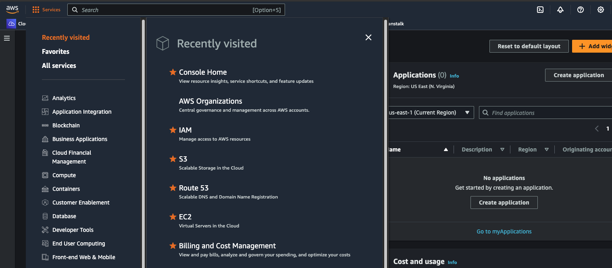
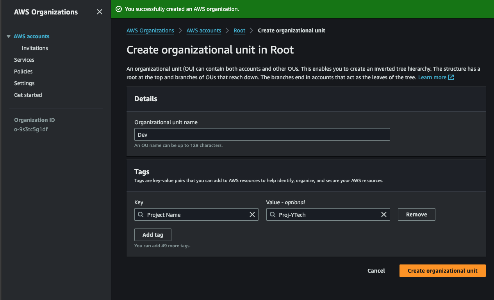
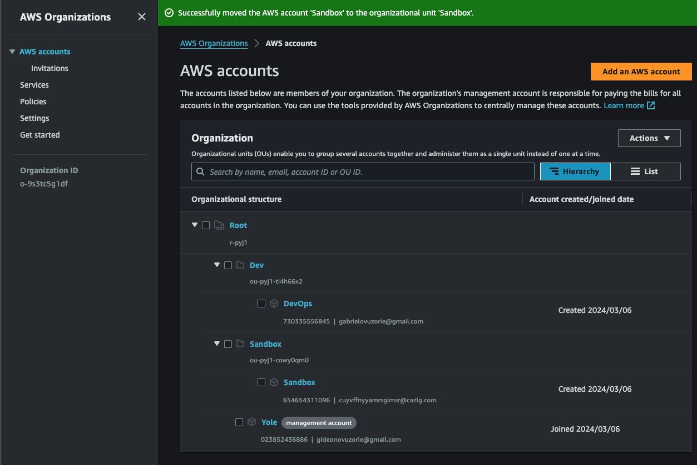
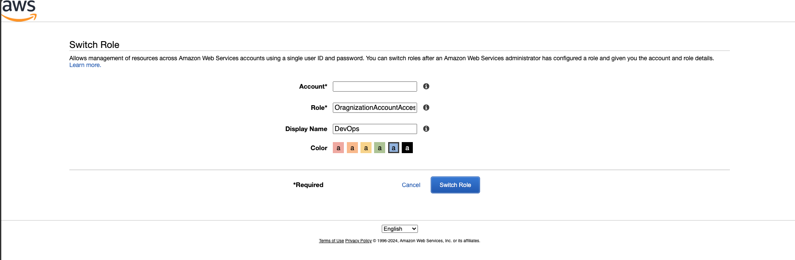
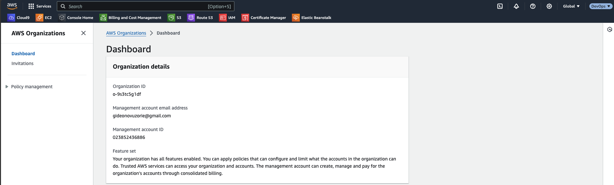
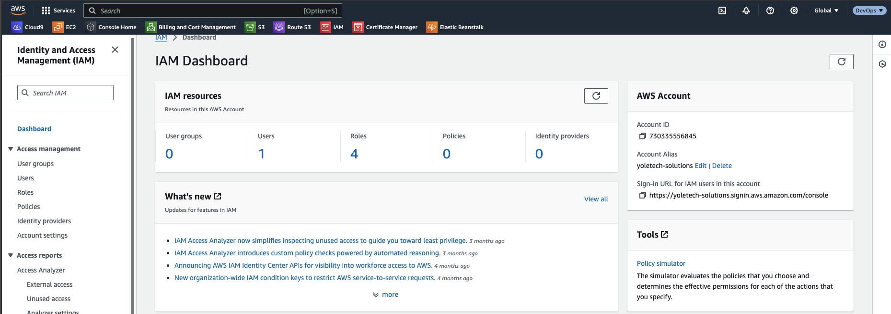
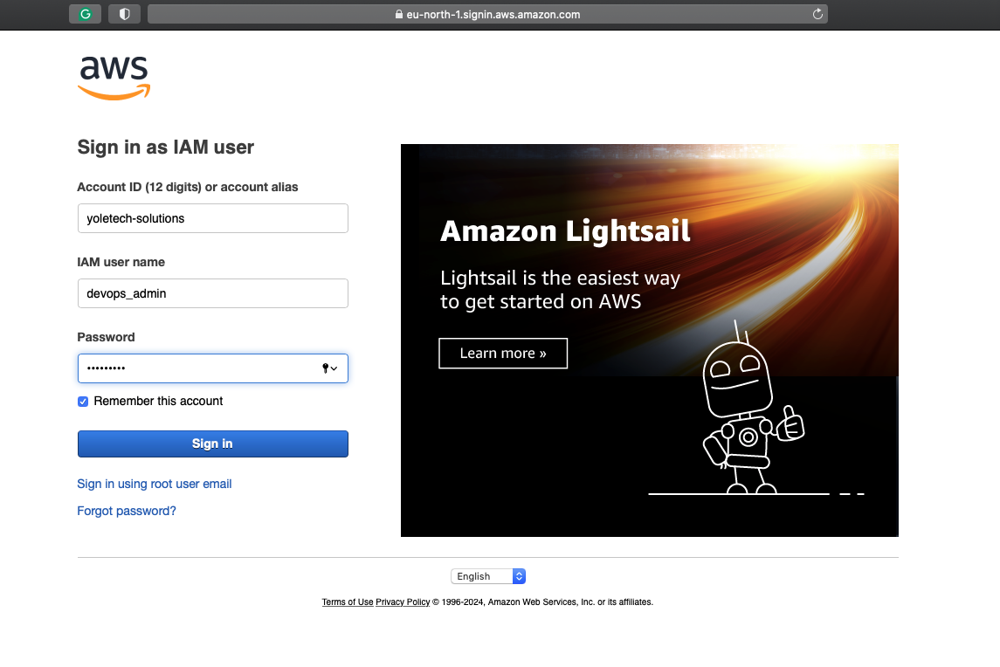
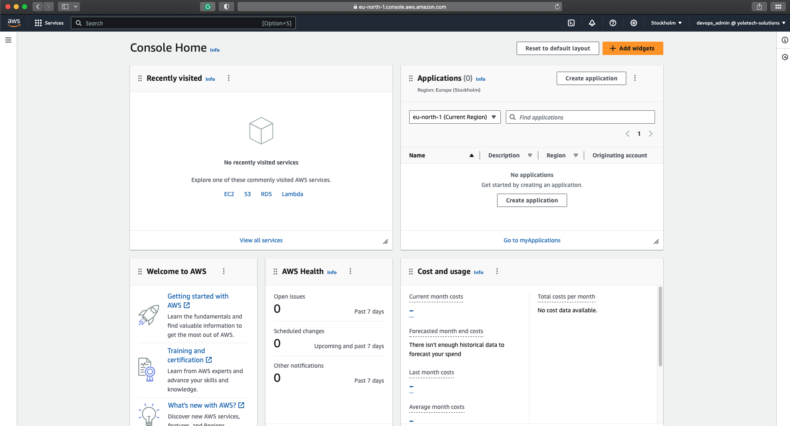

# Implementation of AWS Infrastructure for a Company

In this project, we will be designing the IT infrastructure of a fictitious company **Yoletech Solutions** in AWS from scratch. Our main focus would be on creating and designing the IT infrastructures to make the company's application online.

The following concepts would be briefly discussed and implemented in this project.

1. Introduction to AWS and Cloud Computing
2. Designing the Architecture: Considerations and Best Practices
3. Setting up a domain for the company
4. AWS Accounts and IAM (Identity and Access Management)
5. AWS Organizations
6. AWS Route53
7. Virtual Private Cloud (VPC) Configuration and Networking
8. Compute Services

Designing a complete Cloud IT infrastructure for a Company involves a whole lot more concepts which are beyond the scope of this project. For example, designing for Disaster Recovery and High Availability, enforcing Security and Compliance requirements etc. Let's begin.

### Part 1- Introduction to AWS and Cloud Computing

Cloud computing has revolutionized the way businesses manage and deploy their IT infrastructure. Instead of relying on physical servers and on-premises hardware, cloud computing enables organizations to access a vast array of computing resources over the internet. Amazon Web Services (AWS) is a leading provider in this space, offering a comprehensive suite of cloud services to cater to various business needs.

AWS provides a wide range of services, including computing power, storage options, networking capabilities, and database solutions, among others. These services are offered on a pay-as-you-go basis, allowing businesses to scale their infrastructure up or down based on demand, without the need for significant upfront investments. This flexibility is one of the key advantages of cloud computing, enabling businesses to adapt quickly to changing requirements and market conditions.

In addition to scalability and cost-efficiency, AWS also offers high levels of reliability, security, and global reach. With data centers located in multiple regions around the world, AWS provides low-latency access to services for users globally. Security features such as encryption, identity and access management, and compliance certifications ensure that data stored on AWS is protected against unauthorized access and meets regulatory requirements. Overall, AWS and cloud computing have become integral components of modern IT infrastructure, empowering businesses to innovate and grow in a rapidly evolving digital landscape.

### Part 2 - Designing the Architecture

Yoletech Solutions has a website (WordPress) and an internal application (Tooling) used by their DevOps team. The aim of this project is to create a secure and scalable IT infrastructure for the organization. The Chief Technology Officer (CTO) has requested the reverse proxy technology of NGINX is used for deploying the applications.

Cost, Security and Scalability are of utmost important to the organization, and the network architecture below has been designed and approved by the CTO.

We've been tasked to implement the diagram above using AWS, and also consider best practices.

### Part 3 - Setting up a domain for the company

There are several domain services out there with some offering free domain names for a period of time. I'll be using [Godaddy](https://www.godaddy.com/en-uk/domains) as it is one of the most popular and has lots of discount. The domain for our company Yoletech Solutions would be "www.iamyole.uk". This has already been purchased and ready for configuration.

### Part 4 - AWS Accounts and IAM (Identity and Access Management)

AWS accounts serve as the foundation upon which organizations create and manage their resources within the AWS ecosystem. Identity and Access Management (IAM) is the service provided by AWS for account management. IAM enables organizations to create and manage users, groups, and roles, assigning granular permissions to each entity based on the principle of least privilege.

AWS Users and Roles are fundamental components of the Identity and Access Management (IAM). Users represent individual entities, such as employees or applications, who interact with AWS resources. Each user has a unique identity and is associated with specific permissions that dictate their level of access to AWS services and resources.

Roles, on the other hand, are similar to users but are typically used to grant temporary permissions to entities or applications. Roles are often used in scenarios where access needs to be assumed by multiple users or services, such as cross-account access or granting permissions to AWS services like Lambda or EC2 instances.

In previous projects, we've created an AWS account, logged in with the root user and then created an IAM User with administrative privileges.

### Part 5 - AWS Organizations

AWS Organizations is a management service designed to centrally govern and manage multiple AWS accounts within an organization. This service simplifies the administration of resources, policies, and security across multiple AWS accounts, allowing organizations to efficiently scale their cloud infrastructure while maintaining control and compliance.

At its core, AWS Organizations enables organizations to create a hierarchical structure of AWS accounts, referred to as an organization. Within this structure, administrators can define policies and controls that apply to all member accounts, streamlining the enforcement of security, compliance, and cost management practices.

Let's create an Organization for the company:

- Log into your AWS Management Console, click on services and the search for AWS Organization.
  
- In the AWS Organization Dashboard, click create organization, and a new organization structure would be created with the root hierarchy and management account.
  
- One of project requirement is to create a `Dev` Organization Unit (OU) and a `DevOps` account. The `DevOps` account would be added to the `Dev` OU, where all the Development resource would be launched from.
- To to this, click on the checkbox in front of the Root hierarchy, the click on action and then create new OU. Also give it a tag with the project name.
  
- Repeat the steps above to create another OU called `Sandbox`. The sandbox OU is recommended by AWS as best practice for testing and experimentation. Within this OU, AWS accounts specifically dedicated to testing new applications, services, configurations, or policy changes would be created without impacting production environments or risking disruption to critical workloads.
- Now, let's create the `Devops` account. Still in the accounts page of AWS Organization, click on add account. Here, we can either add an existing account or create a new one.
- Click on Create new Account, provide the account name and a valid email address. Leave the IAM role name with the default value.
- Repeat the step above to create sandbox account for the sandbox OU.
- Next, we need to move the DevOps account to the Dev OU and the Sandbox account to it's OU. This can be done by selecting the checkbox in front of the account, click on action then Move.
- At this point, our AWS Organization should comprise of two(2) OUs and three(3) accounts.
  

After the OUs and Accounts have been created, the next set would be to log into the accounts within the OU. Let's log into the `Dev` OU using the `DevOps` account.

- Copy the account id for the `DevOps` account. It's the 12 digit number before the email address.
- In the top right corner of the AWS Management console, click on the dropdown menu with the account name and then select switch role.
- Paste the Account ID in the Account Field, `OrganizationAccountAccessRole` for Role, and then enter `DevOps` for the Display Name. You can also select a color.
  
- Click `Switch Role`, and that should take you to the dashboard to the `DevOps` account.
  
- Now, we can go to the IAM Service and create a new account `devops_admin`, give the account access to the AWS management Console and than give admin access to the account.
- Navigate to the dashboard, and from the AWS Account section in the right, click on create alias and give it a name. I named mine `yoletech-solutions`, and then you can now see the URL to sign in into the account.
  
- Copy the URL to a new browser and then sign in with the details of the newly opened account `devops_admin`.
  
- We are now logged into the account `devops_admin@yoletechsolutions`
  

#### Service Control Policies (SCP)
