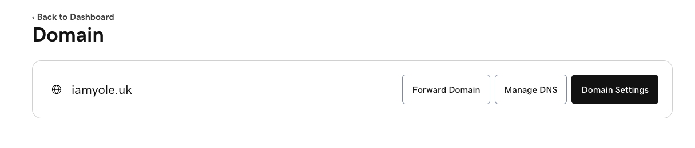

# Implementation of AWS Infrastructure for a Company

In this project, we will be designing the IT infrastructure of a fictitious company **Yoletech Solutions** in AWS from scratch. Our main focus would be on creating and designing the IT infrastructures to make the company's application online.

The following concepts would be briefly discussed and implemented in this project.

1. Introduction to AWS and Cloud Computing
2. Designing the Architecture: Considerations and Best Practices
3. Setting up a domain for the company
4. AWS Accounts and IAM (Identity and Access Management)
5. AWS Organizations
6. AWS Route53
7. Virtual Private Cloud (VPC) Configuration and Networking
8. Compute Services

Designing a complete Cloud IT infrastructure for a Company involves a whole lot more concepts which are beyond the scope of this project. For example, designing for Disaster Recovery and High Availability, enforcing Security and Compliance requirements etc. Let's begin.

### Part 1- Introduction to AWS and Cloud Computing

Cloud computing has revolutionized the way businesses manage and deploy their IT infrastructure. Instead of relying on physical servers and on-premises hardware, cloud computing enables organizations to access a vast array of computing resources over the internet. Amazon Web Services (AWS) is a leading provider in this space, offering a comprehensive suite of cloud services to cater to various business needs.

AWS provides a wide range of services, including computing power, storage options, networking capabilities, and database solutions, among others. These services are offered on a pay-as-you-go basis, allowing businesses to scale their infrastructure up or down based on demand, without the need for significant upfront investments. This flexibility is one of the key advantages of cloud computing, enabling businesses to adapt quickly to changing requirements and market conditions.

In addition to scalability and cost-efficiency, AWS also offers high levels of reliability, security, and global reach. With data centers located in multiple regions around the world, AWS provides low-latency access to services for users globally. Security features such as encryption, identity and access management, and compliance certifications ensure that data stored on AWS is protected against unauthorized access and meets regulatory requirements. Overall, AWS and cloud computing have become integral components of modern IT infrastructure, empowering businesses to innovate and grow in a rapidly evolving digital landscape.

### Part 2 - Designing the Architecture

Yoletech Solutions has a website (WordPress) and an internal application (Tooling) used by their DevOps team. The aim of this project is to create a secure and scalable IT infrastructure for the organization. The Chief Technology Officer (CTO) has requested the reverse proxy technology of NGINX is used for deploying the applications.

Cost, Security and Scalability are of utmost important to the organization, and the network architecture below has been designed and approved by the CTO.


We've been tasked to implement the diagram above using AWS, and also consider best practices.

### Part 3 - Setting up a domain for the company

There are several domain services out there with some offering free domain names for a period of time. I'll be using [Godaddy](https://www.godaddy.com/en-uk/domains) as it is one of the most popular and has lots of discount. The domain for our company Yoletech Solutions would be "www.iamyole.uk". This has already been purchased and ready for configuration.



### Part 4 - AWS Accounts and IAM (Identity and Access Management)

AWS accounts serve as the foundation upon which organizations create and manage their resources within the AWS ecosystem. Identity and Access Management (IAM) is the service provided by AWS for account management. IAM enables organizations to create and manage users, groups, and roles, assigning granular permissions to each entity based on the principle of least privilege.

AWS Users and Roles are fundamental components of the Identity and Access Management (IAM). Users represent individual entities, such as employees or applications, who interact with AWS resources. Each user has a unique identity and is associated with specific permissions that dictate their level of access to AWS services and resources.

Roles, on the other hand, are similar to users but are typically used to grant temporary permissions to entities or applications. Roles are often used in scenarios where access needs to be assumed by multiple users or services, such as cross-account access or granting permissions to AWS services like Lambda or EC2 instances.

In previous projects, we've created an AWS account, logged in with the root user and then created an IAM User with administrative privileges.

### Part 5 - AWS Organizations

AWS Organizations is a management service designed to centrally govern and manage multiple AWS accounts within an organization. This service simplifies the administration of resources, policies, and security across multiple AWS accounts, allowing organizations to efficiently scale their cloud infrastructure while maintaining control and compliance.

At its core, AWS Organizations enables organizations to create a hierarchical structure of AWS accounts, referred to as an organization. Within this structure, administrators can define policies and controls that apply to all member accounts, streamlining the enforcement of security, compliance, and cost management practices.

Let's create an Organization for the company:

- Log into your AWS Management Console, click on services and the search for AWS Organization.
  
- In the AWS Organization Dashboard, click create organization, and a new organization structure would be created with the root hierarchy and management account.
  
- One of project requirement is to create a `Dev` Organization Unit (OU) and a `DevOps` account. The `DevOps` account would be added to the `Dev` OU, where all the Development resource would be launched from.
- To to this, click on the checkbox in front of the Root hierarchy, the click on action and then create new OU. Also give it a tag with the project name.
  
- Repeat the steps above to create another OU called `Sandbox`. The sandbox OU is recommended by AWS as best practice for testing and experimentation. Within this OU, AWS accounts specifically dedicated to testing new applications, services, configurations, or policy changes would be created without impacting production environments or risking disruption to critical workloads.
- Now, let's create the `Devops` account. Still in the accounts page of AWS Organization, click on add account. Here, we can either add an existing account or create a new one.
- Click on Create new Account, provide the account name and a valid email address. Leave the IAM role name with the default value.
- Repeat the step above to create sandbox account for the sandbox OU.
- Next, we need to move the DevOps account to the Dev OU and the Sandbox account to it's OU. This can be done by selecting the checkbox in front of the account, click on action then Move.
- At this point, our AWS Organization should comprise of two(2) OUs and three(3) accounts.
  

After the OUs and Accounts have been created, the next set would be to log into the accounts within the OU. Let's log into the `Dev` OU using the `DevOps` account.

- Copy the account id for the `DevOps` account. It's the 12 digit number before the email address.
- In the top right corner of the AWS Management console, click on the dropdown menu with the account name and then select switch role.
- Paste the Account ID in the Account Field, `OrganizationAccountAccessRole` for Role, and then enter `DevOps` for the Display Name. You can also select a color.
  
- Click `Switch Role`, and that should take you to the dashboard to the `DevOps` account.
  
- Now, we can go to the IAM Service and create a new account `devops_admin`, give the account access to the AWS management Console and than give admin access to the account.
- Navigate to the dashboard, and from the AWS Account section in the right, click on create alias and give it a name. I named mine `yoletech-solutions`, and then you can now see the URL to sign in into the account.
  
- Copy the URL to a new browser and then sign in with the details of the newly opened account `devops_admin`.
  
- We are now logged into the account `devops_admin@yoletechsolutions`
  

#### Service Control Policies (SCP)

SCPs allow administrators to establish granular controls at the organizational level to enforce security, compliance, and governance requirements across all accounts within an AWS organization. Examples of such requirements could be restricting member accounts of OUs from accidentally leaving the Organization, restricting root users from creating some resources, limiting the Sandbox OU to just T2.micro, just to mention a few. Now, let's create some and apply them to our OUs.

- From the Organization homepage, click Policies and enable it if its not yet enabled.
  
- Click Create New Policy and name it `restrict-leaving-org`
- Policies are written in json, and we can write it manually, or used the helper by the right of the policy definition box.
- Using the helper, click on add statement, then would be to add a service, search for organization and select it, then finally, what action do we want, search for leave organization and then add it.
- Click on Add Resources, and then select all resources
- The json should have been populated with the following
  > ```json
  > {
  >   "Version": "2012-10-17",
  >   "Statement": [
  >     {
  >       "Sid": "Statement1",
  >       "Effect": "Deny",
  >       "Action": ["organizations:LeaveOrganization"],
  >       "Resource": ["*"]
  >     }
  >   ]
  > }
  > ```
- Click on Create Policy to create the Policy.

- Let's repeat the steps above to create the policy restricting root accounts from creating some resources. You can copy and paste the policy definition below to save time.

  > ```json
  > {
  >   "Version": "2012-10-17",
  >   "Statement": [
  >     {
  >       "Sid": "Statement1",
  >       "Effect": "Deny",
  >       "Action": ["ec2:*"],
  >       "Resource": ["*"],
  >       "Condition": {
  >         "ForAnyValue:StringLike": {
  >           "aws:PrincipalArn": "arn:aws:iam::*:root"
  >         }
  >       }
  >     }
  >   ]
  > }
  > ```

- Let's create one more limiting Sandbox to only T2.Micro. The Policy definition below.
  > ```json
  > {
  >   "Version": "2012-10-17",
  >   "Statement": [
  >     {
  >       "Sid": "Statement1",
  >       "Effect": "Deny",
  >       "Action": ["ec2:RunInstances"],
  >       "Resource": ["arn:aws:ec2:*:*:instance/*"],
  >       "Condition": {
  >         "ForAnyValue:StringNotEquals": {
  >           "ec2:InstanceType": "t2.micro"
  >         }
  >       }
  >     }
  >   ]
  > }
  > ```
- At time point, we should have `Customer managed policy`
  

Now, let's add these polices to the accounts.

- Go back to the user AWS accounts menu in the Organization, click on the `Sandbox` OU and the Policies.
  
- Click on attach and then select the policy to restricting EC2 Instances to just T2.micro. The policy above would be restricted to only the sandbox account.
- Now, back to the AWS accounts menu, click the `root` OU. Add the policy to restrict root accounts from creating EC2 Instances, and leaving the organization. As this is being added to the `root` OU, the policy would also be cascaded down to the nested OU.

We can log to the different accounts and test the organization policy is being enforced.

#### Tag Policies

In addition to SCPs defined above, we can also enforce the requirement that all resources must be tagged. We've been asked to create the following tags for all resources:

- Project Name: "Proj-Ytech"
- Environment: "Dev|Test|Stage|Prod"
- Automated: "Yes|NO"

Now let's create a policy enforcing this.

- Back to the Policies menu, click on Tag Policies. Enable it if it's not already enabled.
  
- Click on Create Policy, and give it a name `ProjectRequiredTags`
- Scroll down to the visual editor and create the following tags
  - Project Name
    - Select use capitalization
    - For the specified values, type in the value "Proj-Ytech"
    - For the resource type to enforce, scroll through the list and enable the resources we would be creating for the project.
- Repeat the step above twice, one for "Environment" and another for "Automated"
- At the end, your tag policy definition should be looking similar to the image below
  
- Add the policy to the `Dev` OU. The tag can be added the same way we added the other policies.

### Part 6 - AWS Route53

AWS Route 53 is a scalable and highly available Domain Name System (DNS) web service provided by Amazon Web Services (AWS). Route 53 offers a wide range of features and capabilities, including domain registration, DNS health checks, traffic routing policies, and DNS-based failover. It provides developers and administrators with the tools to configure and manage DNS records, implement advanced routing policies, and monitor the health and performance of their applications and infrastructure.

Since we already have our domain name from GoDaddy.com, we would just be creating a hosted zone. The hosted zone in AWS is a container for DNS records that define how internet traffic are routed for a specific domain. It serves as the authoritative source for DNS information for that domain. Hosted Zones contain various types of DNS records, such as A (IPv4 address), AAAA (IPv6 address), CNAME (canonical name), MX (mail exchange), TXT (text), and others.

Now, let's create our hosted Zone.

- Log into AWS Management console using the credentials of the `devops_admin` account created earlier.
- From the dashboard, search for Route 53, and from the main page, click on get started.
- Select `Create Hosted Zone` from the options
  
- Provide your domain name and give it a description
- Select Public hosted Zone and then create
  
- The hosted zone would be created with some Named Service(NS) records and a Start of Authority (SOA) record.
  
- Next, we need to map the NS Records from how hosted zone to the public domain.
- Log into your domain provider's site and navigate to manage domain.
- Within the manage domain window, create a new record, type should be NS, give it a name `techsolutions` and the copy and paste the NS records from the hosted zone in AWS.
  
- Save and then exit the manage domain settings.

We will test this later. Next, let's create/validate our domain with a certificate. This will enable us to create secure applications using https or TLS.

#### Creating a Certificate

- From the AWS management console, search for Certificate Manager.
- From the Certificate manager page, click on request certificate > request public certificate
  
- In the `Fully qualified domain name` field, provide your domain in the format `*.<yourdomain>`. Mine is `*.iamyole.uk`

  

- Leave the rest settings at default, create a tag and the request certificate.
- Refresh the page, and you should see your certificate. The status would be pending verification
  
- Now, to validate this certificate, click on it to access the CNAME name and CNAME value
  
- login into your domain settings, mine is GoDaddy.com > create a new CNAME record with the CNAME name and CNAME value from the certificate.
- For the CNAME name, remove the domain name at the end, and for the value, remove just the `fullstop` at the end. Just as it is in the image below. Then save
  
- Go back to the Certificate Manager in AWS and refresh to confirm of the certificate has been issued/validated. Note, this make take a while.
  
