# Implementation of AWS Infrastructure for a Company

In this project, we will be designing the IT infrastructure of a fictitious company **Yoletech Solutions** in AWS from scratch. Our main focus would be on creating and designing the IT infrastructures to make the company's application online.

The following concepts would be briefly discussed and implemented in this project.

1. Introduction to AWS and Cloud Computing
2. Designing the Architecture: Considerations and Best Practices
3. Setting up a domain for the company
4. AWS Accounts and IAM (Identity and Access Management)
5. AWS Organizations
6. AWS Route53
7. Virtual Private Cloud (VPC) Configuration and Networking
8. Compute Services

Designing a complete Cloud IT infrastructure for a Company involves a whole lot more concepts which are beyond the scope of this project. For example, designing for Disaster Recovery and High Availability, enforcing Security and Compliance requirements etc. Let's begin.

### Part 1- Introduction to AWS and Cloud Computing

Cloud computing has revolutionized the way businesses manage and deploy their IT infrastructure. Instead of relying on physical servers and on-premises hardware, cloud computing enables organizations to access a vast array of computing resources over the internet. Amazon Web Services (AWS) is a leading provider in this space, offering a comprehensive suite of cloud services to cater to various business needs.

AWS provides a wide range of services, including computing power, storage options, networking capabilities, and database solutions, among others. These services are offered on a pay-as-you-go basis, allowing businesses to scale their infrastructure up or down based on demand, without the need for significant upfront investments. This flexibility is one of the key advantages of cloud computing, enabling businesses to adapt quickly to changing requirements and market conditions.

In addition to scalability and cost-efficiency, AWS also offers high levels of reliability, security, and global reach. With data centers located in multiple regions around the world, AWS provides low-latency access to services for users globally. Security features such as encryption, identity and access management, and compliance certifications ensure that data stored on AWS is protected against unauthorized access and meets regulatory requirements. Overall, AWS and cloud computing have become integral components of modern IT infrastructure, empowering businesses to innovate and grow in a rapidly evolving digital landscape.

### Part 2 - Designing the Architecture

Yoletech Solutions has a website (WordPress) and an internal application (Tooling) used by their DevOps team. The aim of this project is to create a secure and scalable IT infrastructure for the organization. The Chief Technology Officer (CTO) has requested the reverse proxy technology of NGINX is used for deploying the applications.

Cost, Security and Scalability are of utmost important to the organization, and the network architecture below has been designed and approved by the CTO.


We've been tasked to implement the diagram above using AWS, and also consider best practices.

### Part 3 - Setting up a domain for the company

There are several domain services out there with some offering free domain names for a period of time. I'll be using [Godaddy](https://www.godaddy.com/en-uk/domains) as it is one of the most popular and has lots of discount. The domain for our company Yoletech Solutions would be "www.iamyole.uk". This has already been purchased and ready for configuration.


### Part 4 - AWS Accounts and IAM (Identity and Access Management)

AWS accounts serve as the foundation upon which organizations create and manage their resources within the AWS ecosystem. Identity and Access Management (IAM) is the service provided by AWS for account management. IAM enables organizations to create and manage users, groups, and roles, assigning granular permissions to each entity based on the principle of least privilege.

AWS Users and Roles are fundamental components of the Identity and Access Management (IAM). Users represent individual entities, such as employees or applications, who interact with AWS resources. Each user has a unique identity and is associated with specific permissions that dictate their level of access to AWS services and resources.

Roles, on the other hand, are similar to users but are typically used to grant temporary permissions to entities or applications. Roles are often used in scenarios where access needs to be assumed by multiple users or services, such as cross-account access or granting permissions to AWS services like Lambda or EC2 instances.

In previous projects, we've created an AWS account, logged in with the root user and then created an IAM User with administrative privileges.

### Part 5 - AWS Organizations

AWS Organizations is a management service designed to centrally govern and manage multiple AWS accounts within an organization. This service simplifies the administration of resources, policies, and security across multiple AWS accounts, allowing organizations to efficiently scale their cloud infrastructure while maintaining control and compliance.

At its core, AWS Organizations enables organizations to create a hierarchical structure of AWS accounts, referred to as an organization. Within this structure, administrators can define policies and controls that apply to all member accounts, streamlining the enforcement of security, compliance, and cost management practices.

Let's create an Organization for the company:

- Log into your AWS Management Console, click on services and the search for AWS Organization.
  
- In the AWS Organization Dashboard, click create organization, and a new organization structure would be created with the root hierarchy and management account.
  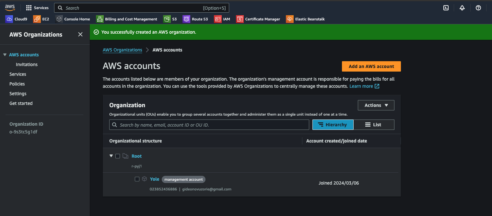
- One of project requirement is to create a `Dev` Organization Unit (OU) and a `DevOps` account. The `DevOps` account would be added to the `Dev` OU, where all the Development resource would be launched from.
- To to this, click on the checkbox in front of the Root hierarchy, the click on action and then create new OU. Also give it a tag with the project name.
  
- Repeat the steps above to create another OU called `Sandbox`. The sandbox OU is recommended by AWS as best practice for testing and experimentation. Within this OU, AWS accounts specifically dedicated to testing new applications, services, configurations, or policy changes would be created without impacting production environments or risking disruption to critical workloads.
- Now, let's create the `Devops` account. Still in the accounts page of AWS Organization, click on add account. Here, we can either add an existing account or create a new one.
- Click on Create new Account, provide the account name and a valid email address. Leave the IAM role name with the default value.
- Repeat the step above to create sandbox account for the sandbox OU.
- Next, we need to move the DevOps account to the Dev OU and the Sandbox account to it's OU. This can be done by selecting the checkbox in front of the account, click on action then Move.
- At this point, our AWS Organization should comprise of two(2) OUs and three(3) accounts.
  

After the OUs and Accounts have been created, the next set would be to log into the accounts within the OU. Let's log into the `Dev` OU using the `DevOps` account.

- Copy the account id for the `DevOps` account. It's the 12 digit number before the email address.
- In the top right corner of the AWS Management console, click on the dropdown menu with the account name and then select switch role.
- Paste the Account ID in the Account Field, `OrganizationAccountAccessRole` for Role, and then enter `DevOps` for the Display Name. You can also select a color.
  
- Click `Switch Role`, and that should take you to the dashboard to the `DevOps` account.
  
- Now, we can go to the IAM Service and create a new account `devops_admin`, give the account access to the AWS management Console and than give admin access to the account.
- Navigate to the dashboard, and from the AWS Account section in the right, click on create alias and give it a name. I named mine `yoletech-solutions`, and then you can now see the URL to sign in into the account.
  
- Copy the URL to a new browser and then sign in with the details of the newly opened account `devops_admin`.
  
- We are now logged into the account `devops_admin@yoletechsolutions`
  

### Service Control Policies (SCP)

SCPs allow administrators to establish granular controls at the organizational level to enforce security, compliance, and governance requirements across all accounts within an AWS organization. Examples of such requirements could be restricting member accounts of OUs from accidentally leaving the Organization, restricting root users from creating some resources, limiting the Sandbox OU to just T2.micro, just to mention a few. Now, let's create some and apply them to our OUs.

- From the Organization homepage, click Policies and enable it if its not yet enabled.
  
- Click Create New Policy and name it `restrict-leaving-org`
- Policies are written in json, and we can write it manually, or used the helper by the right of the policy definition box.
- Using the helper, click on add statement, then would be to add a service, search for organization and select it, then finally, what action do we want, search for leave organization and then add it.
- Click on Add Resources, and then select all resources
- The json should have been populated with the following
  > ```json
  > {
  >   "Version": "2012-10-17",
  >   "Statement": [
  >     {
  >       "Sid": "Statement1",
  >       "Effect": "Deny",
  >       "Action": ["organizations:LeaveOrganization"],
  >       "Resource": ["*"]
  >     }
  >   ]
  > }
  > ```
- Click on Create Policy to create the Policy.

- Let's repeat the steps above to create the policy restricting root accounts from creating some resources. You can copy and paste the policy definition below to save time.

  > ```json
  > {
  >   "Version": "2012-10-17",
  >   "Statement": [
  >     {
  >       "Sid": "Statement1",
  >       "Effect": "Deny",
  >       "Action": ["ec2:*"],
  >       "Resource": ["*"],
  >       "Condition": {
  >         "ForAnyValue:StringLike": {
  >           "aws:PrincipalArn": "arn:aws:iam::*:root"
  >         }
  >       }
  >     }
  >   ]
  > }
  > ```

- Let's create one more limiting Sandbox to only T2.Micro. The Policy definition below.
  > ```json
  > {
  >   "Version": "2012-10-17",
  >   "Statement": [
  >     {
  >       "Sid": "Statement1",
  >       "Effect": "Deny",
  >       "Action": ["ec2:RunInstances"],
  >       "Resource": ["arn:aws:ec2:*:*:instance/*"],
  >       "Condition": {
  >         "ForAnyValue:StringNotEquals": {
  >           "ec2:InstanceType": "t2.micro"
  >         }
  >       }
  >     }
  >   ]
  > }
  > ```
- At time point, we should have `Customer managed policy`
  

Now, let's add these polices to the accounts.

- Go back to the user AWS accounts menu in the Organization, click on the `Sandbox` OU and the Policies.
  
- Click on attach and then select the policy to restricting EC2 Instances to just T2.micro. The policy above would be restricted to only the sandbox account.
- Now, back to the AWS accounts menu, click the `root` OU. Add the policy to restrict root accounts from creating EC2 Instances, and leaving the organization. As this is being added to the `root` OU, the policy would also be cascaded down to the nested OU.

We can log to the different accounts and test the organization policy is being enforced.

### Tag Policies

In addition to SCPs defined above, we can also enforce the requirement that all resources must be tagged. We've been asked to create the following tags for all resources:

- Project Name: "Proj-Ytech"
- Environment: "Dev|Test|Stage|Prod"
- Automated: "Yes|NO"

Now let's create a policy enforcing this.

- Back to the Policies menu, click on Tag Policies. Enable it if it's not already enabled.
  
- Click on Create Policy, and give it a name `ProjectRequiredTags`
- Scroll down to the visual editor and create the following tags
  - Project Name
    - Select use capitalization
    - For the specified values, type in the value "Proj-Ytech"
    - For the resource type to enforce, scroll through the list and enable the resources we would be creating for the project.
- Repeat the step above twice, one for "Environment" and another for "Automated"
- At the end, your tag policy definition should be looking similar to the image below
  
- Add the policy to the `Dev` OU. The tag can be added the same way we added the other policies.

### Part 6 - AWS Route53

AWS Route 53 is a scalable and highly available Domain Name System (DNS) web service provided by Amazon Web Services (AWS). Route 53 offers a wide range of features and capabilities, including domain registration, DNS health checks, traffic routing policies, and DNS-based failover. It provides developers and administrators with the tools to configure and manage DNS records, implement advanced routing policies, and monitor the health and performance of their applications and infrastructure.

Since we already have our domain name from GoDaddy.com, we would just be creating a hosted zone. The hosted zone in AWS is a container for DNS records that define how internet traffic are routed for a specific domain. It serves as the authoritative source for DNS information for that domain. Hosted Zones contain various types of DNS records, such as A (IPv4 address), AAAA (IPv6 address), CNAME (canonical name), MX (mail exchange), TXT (text), and others.

Now, let's create our hosted Zone.

- Log into AWS Management console using the credentials of the `devops_admin` account created earlier.
- From the dashboard, search for Route 53, and from the main page, click on get started.
- Select `Create Hosted Zone` from the options
  
- Provide your domain name and give it a description
- Select Public hosted Zone and then create
  
- The hosted zone would be created with some Named Service(NS) records and a Start of Authority (SOA) record.
  
- Next, we need to map the NS Records from how hosted zone to the public domain.
- Log into your domain provider's site and navigate to manage domain.
- Within the manage domain window, create a new record, type should be NS, give it a name `techsolutions` and the copy and paste the NS records from the hosted zone in AWS.
  
- Save and then exit the manage domain settings.

We will test this later. Next, let's create/validate our domain with a certificate. This will enable us to create secure applications using https or TLS.

### Creating a Certificate

- From the AWS management console, search for Certificate Manager.
- From the Certificate manager page, click on request certificate > request public certificate
  
- In the `Fully qualified domain name` field, provide your domain in the format `*.<yourdomain>`. Mine is `*.iamyole.uk`

  

- Leave the rest settings at default, create a tag and the request certificate.
- Refresh the page, and you should see your certificate. The status would be pending verification
  
- Now, to validate this certificate, click on it to access the CNAME name and CNAME value
  
- login into your domain settings, mine is GoDaddy.com > create a new CNAME record with the CNAME name and CNAME value from the certificate.
- For the CNAME name, remove the domain name at the end, and for the value, remove just the `fullstop` at the end. Just as it is in the image below. Then save
  
- Go back to the Certificate Manager in AWS and refresh to confirm of the certificate has been issued/validated. Note, this make take a while.
  

### Part 7 - Virtual Private Cloud (VPC) Configuration and Networking

Virtual Private Cloud (VPC) Configuration and Networking in AWS is the foundation of building a secure and scalable cloud infrastructure. A VPC allows users to provision a logically isolated section of the AWS Cloud, where they can launch AWS resources such as EC2 instances, RDS databases, etc. VPCs enable users to define their own IP address range, subnets, route tables, and network gateways, providing complete control over network configuration and connectivity.

We already have an approved plan of how the network is to be designed, the resources in the network and how they all map to each other. Now let's implement this.


Making reference to the network diagram above, let's extract some key requirements for the VPC and save it to a `YAML` document. This would help keep us organized and the document can be shared with other teams to ensure uniformity.


Link to the complete yaml file can be found [here](https://github.com/iamYole/DIO-DevOps-Projects/blob/main/Project%2020%20-%20Building%20a%20Scalable%20and%20Secure%20IT%20Infrastructure%20on%20AWS/resources.yml). Let's begin.

For a more detailed step by step guide on how to create the VPC, refer to an earlier project - [Implementing Networking Concepts in AWS (VPC, Subnets, IG, NAT, Routing, etc](https://github.com/iamYole/DIO-DevOps-Projects/blob/main/Project%2015%20-%20Networking%20in%20AWS/README.md)

### Creating the VPC

Remember we are creating the entire infrastructure using the `devops_admin@ytech-solutions` account.

- Log into the AWS Management Console and from services, search for VPC.
- Click on create VPC, and from the VPC settings, select VPC only.
- In the IPv4 CIDR field, type in `10.0.0.0/16`.
- Create the required tags and the click create.
  
  We now how our vpc created.

### Creating the Subnets

- Click on Subnets > Create Subnet from the top right corner of the page, and then create 4 subnets using details in the [resources.yml](https://github.com/iamYole/DIO-DevOps-Projects/blob/main/Project%2020%20-%20Building%20a%20Scalable%20and%20Secure%20IT%20Infrastructure%20on%20AWS/resources.yml) file. Ensure the subnets are created in the ytech-vpc.
  

#### Creating the Elastic IP Address

- From the left pane of the VPC console, select Elastic IPs, and the from the top right corner of the screen, click on Allocate Elastic
- Select your region, give the Elastic IP a tag for easy identification, and the Allocate.
- Note that we require a total of three (3) Elastic IP addresses for this project, but we will be creating just one at the moment due to how Amazon charge for this resource. Others would be created when we need them.
  

### Creating the Internet Gateway

- Click on Internet gateways under the VPC menu > Create Internet Gateway.
- Type in `IGW` and the name and then create.
- Once the Internet Gateway is created, add it to the VPC, by selecting Actions > Attach to VPC. Select the `ytech-vpc` and then attach.
  

### Creating the NAT Gateway

- From the left pane in the VPC console, select NAT Gateways, and then from the top right corner, click on the Create NAT gateway button.
- In the Create NAT gateway page, let's give our NAT gateway a name and then select any of our Public Subnets. Also select the Elastic IP we created earlier and then save.
  
  

### Creating the Route Tables

In order for our Internet Gateway to direct traffic from the internet in and out of our subnets, we need to create a route table to direct these traffic accordingly.

- Click on Route tables > Create Route table
- Type in `pub-RT` as the name, and then select the `ytech-vpc` and the create.
- Repeat the steps above and name the second route table `priv-RT`.
  
- Select the `pub-RT`, abd then click on Edit Routes.
  
- Click on Add Route, then provide `0.0.0.0` as the destination, and then the Internet Gateway we created earlier as the Target
  
- Repeat the steps above to configure `priv-RT`. The destination should also be `0.0.0.0/0`, but the Target here should be the NAT Gateway we created.

Finally, we need to associate the Public subnets to `pub-RT` and the Private subnets to `priv-RT`.

- Still in the route table page, select select the `priv-RT` > Subnet Association, and then Edit Subnet associations.
  
- Select the two public subnets we want to restrict access to the internet, and then save.
- Repeat the steps above for the `pub-RT` and then select the public subnets.

At this point, we should have a functional VPC that routes traffic to the Internet or the local network depending on the subnet. We have a pictorial representation of our VPC by navigating to `Your VPC` > select the `ytech-vpc` > `Resource Map`.


### Creating the Security Groups

Now, let's create the different Security Groups for our resources within the VPC. Please refer once again to the [resources.yml](https://github.com/iamYole/DIO-DevOps-Projects/blob/main/Project%2020%20-%20Building%20a%20Scalable%20and%20Secure%20IT%20Infrastructure%20on%20AWS/resources.yml) file containing the configuration requirements.

From the Services Menu, search for Elastic Compute (EC2) and go to the dashboard.


The top section (Resources) shows a breakdown of all the resources (EC2 Instances, Elastic IPs, Volumes etc) that are created in a region. So far, we've created only one (1) Elastic IP, and the default VPC comes with two (2) Security Groups. Let's create ours now.

- From the right pane, scroll down to Network & Security, then click on Security Groups.
- Click on Create security group, give it a name `alb_SG` and description, select the `ytech-vpc`.
- In the Inbound Rule section, click on add rule, then add all traffic from http and https to `0.0.0.0/0`.
- Tag accordingly and then save.
  
- Repeat the steps above for the `nginx_SG`. However, this time, we are allowing traffic from only the `alb_SG` created earlier.
- Use the information from the [resource.yml](https://github.com/iamYole/DIO-DevOps-Projects/blob/main/Project%2020%20-%20Building%20a%20Scalable%20and%20Secure%20IT%20Infrastructure%20on%20AWS/resources.yml) to create the remaining security groups.
- For the `backend_SG`, ensure only ssh access if allowed, and only traffic from the company's network is allowed connection.
  

Note that the inbound rules defined at this stage are not final. As we create resources within the security groups, more more ports would be opened to all traffic to the specific applications. For instance, NGINX may run on port `8080`, the database on `3306` etc. Now, we should have created all the security groups required at this stage.


### Part 8 - Compute Services

Compute services in Amazon Web Services (AWS) are tools that allow users to run and manage computing resources in the cloud. These services offer flexible and scalable options for running applications and workloads without the need for owning physical servers.

One of the main compute services in AWS is Amazon Elastic Compute Cloud (EC2). It provides virtual servers, known as instances, which users can customize based on their needs for CPU, memory, storage, and networking. EC2 instances can be easily launched, managed, and scaled up or down as needed.

For this Project, we will be configuring several EC2 Instances, for the servers, an AWS RDS for the database, Application load balances, Volumes for storage, etc.

Let's begin by configuring the Compute Resources for the Nginx Server.

### Compute Resources for the Nginx

1. Provisioning the Instance Using the information in the [resource.yml](https://github.com/iamYole/DIO-DevOps-Projects/blob/main/Project%2020%20-%20Building%20a%20Scalable%20and%20Secure%20IT%20Infrastructure%20on%20AWS/resources.yml) file, provision the instance. The instance should be bootstrapped with the `userdata` script below:

   > ```bash
   > #!/bin/bash
   > # Update package lists and install required packages
   > yum update -y
   >
   > # Install required packages
   > yum install -y python ntp net-tools vim wget telnet chrony nginx-all-modules.noarch
   >
   > # Start and enable the NTP service
   > systemctl start chronyd
   > systemctl enable chronyd
   >
   > # Start and enable the NGINX service
   > systemctl start nginx
   > systemctl enable nginx
   > ```

- After the Instance has been provisioned, SSH into it to confirm all the packages are installed and are running as expected.
- Port 22 can be temporarily enabled on the security group to perform this checks pending when the Bastion Host has been provisioned.
- Ensure the NGINX Server was provisioned in a public subnet with internet access.

2. Creating an AMI out of the Instance  
   Just as we used the Redhat Linux 9 AMI(Amazon Machine Image) above to provision the NGINX Server, we can as well create our own AMI or Images with pre-configured softwares. Since we need to create one NGINX Server in each public subnet, instead of creating the instance and then installing all the softwares from scratch, we will be using the NGINX current settings in creating the AML.

   - Select the NGINX Instance and from actions, select Image and Template > Create Image

   

   - In the Create AMI page, give the AMI a name `nginx-ami`, give it a tag and then save.
   - Navigate to the AMI section and confirm the `nginx-ami` has been created.
     

3) Prepare a Lunch template for the Image  
   Launch templates are a feature provided by Amazon Web Services (AWS) that allows users to define a set of parameters for launching EC2 instances. These parameters include instance type, AMI ID, security groups, key pair, and other configurations.
   Again, the speed up the process of provisioning new Nginx Servers as at when needed, we will be creating a launch template the the `nginx-ami` image. The launch template will define the VPC, instance type, subnet, security group etc.

- Click on Launch Templates from the right pane, and then create a Launch Template.
- In the create launch template window, provide the following:
  
  - Template name
  - AMI: select the `nginx-ami`
  - Instance Type: T2.micro
  - Key Pair: choose an existing key pair
  - Subnet: Do not Include (this is because we will be launching the Nginx Severs in different subnets)
  - Security Group: `nginx_SG`  
     The remaining setting can be left at the default values
    
    Launch Template Created.

4. Configure Target Groups  
   Target groups are logical groupings of instances that can receive traffic from a load balancer. Target groups are used in conjunction with Application Load Balancers (ALBs) and Network Load Balancers (NLBs) to route incoming requests to the appropriate targets based on routing rules and health checks.

   Since we will be having multiple Nginx Servers, we will need a target group in where the load balancers we will be creating can route traffic to.

   - In the right pane, under the load balancer section, click on Target Group > Create Target Group

   

   - The the create Target Group Window, make the following selections:
     - Choose Targets: Instance
     - Give the Target Group a name
     - Protocol - Port: TLS 433
     - Ip Type: Ip v4
     - VPC - ytech

- Click next and then select the nginx instances in the available section.
- Click in include pending below to move them the the target section.
  

5. Configure Auto Scaling  
   Auto Scaling Groups allows you to automatically add or remove instances in response to changing application load or resource utilization, ensuring that your application can seamlessly handle fluctuations in traffic while maintaining performance and availability.

   - From the left pane, select Auto Scaling Group > Create Auto Scaling Group.
     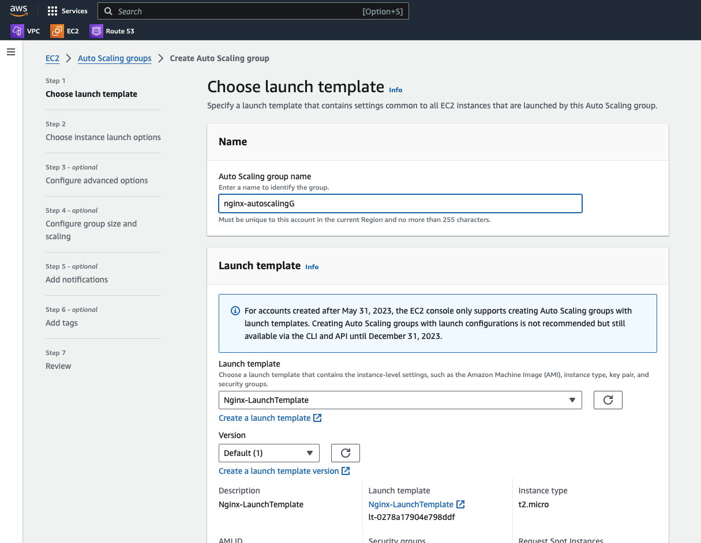
     - Give it a descriptive name
     - Select the nginx launch template created earlier

- Click next to the instance launch options
  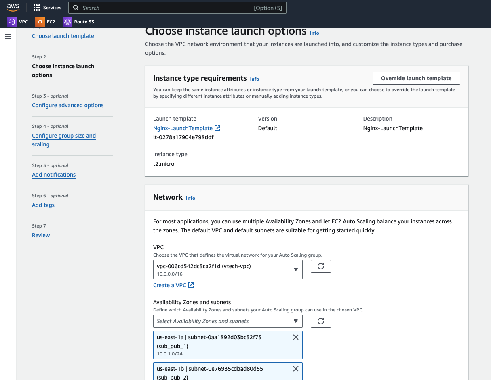
  - Select the `ytech` VPC and select the two public subnets from the drop down list
- Click next, and select no load balancer as we will be creating one later.
- In the `Configure group size and scaling` setting, choose a min and max desired capacity for the number in instance we want running. Since we are cost conscious, we will be selecting `2` as min and `4` as max.
- Leave the reset options in their default settings and click next
- Add a tag and the create the Auto Scaling Group
  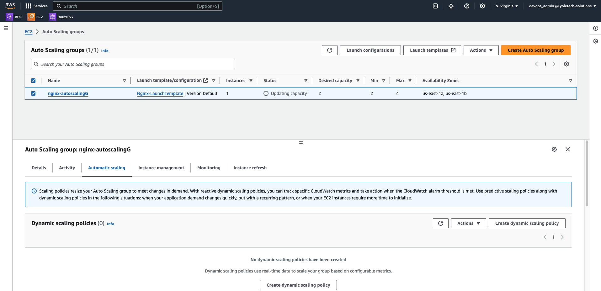
- After the Auto Scaling Group has been created, we need to now create a dynamic scaling policy that will automatically scale up or down the instances.
- Select the auto scaling group and then click on create dynamic scaling policy. Fill in the details as is in the image below and the save
  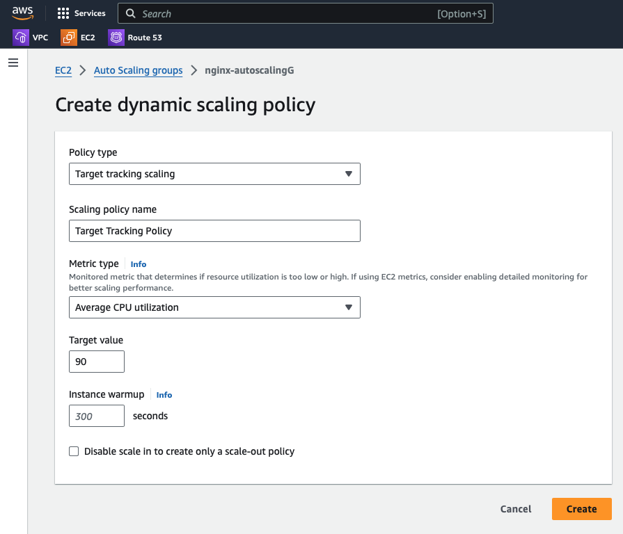

### Compute Resources for the Bastion Host

A bastion host, sometimes referred to as a jump server or a pivot server, is a specially configured server that acts as a secure gateway for accessing and managing other servers in a private network. Bastion hosts are typically placed within a public subnet of a Virtual Private Cloud (VPC) or within a demilitarized zone (DMZ) in on-premises environments.

It is very important the bastion host is secured and that also includes the Operating System its running on. There are specially created AMI with enhanced security settings that can be used for this. CIS (Center for Internet Security) has some AMIs for different OSs link ubuntu, Amazon Linux etc that can be used for this. However, these come at a cost.

With that being said, lets provision a new EC2 Instance for the Bastion Host using the details stated in the [resources.yaml](https://github.com/iamYole/DIO-DevOps-Projects/blob/main/Project%2020%20-%20Building%20a%20Scalable%20and%20Secure%20IT%20Infrastructure%20on%20AWS/resources.yml) file.

The script below can be used to bootstrap the instance with the required softwares

> ```bash
> #!/bin/bash
> # Update package lists and install required packages
> yum update -y
>
> # Install Git and Ansible
> yum install -y git ansible-core python ntp net-tools vim wget telnet chrony
>
> # Start and enable the NTP service
> systemctl start chronyd
> systemctl enable chronyd
> ```

- Log in to the Bastion Host and confirm the packages were installed as expected.
  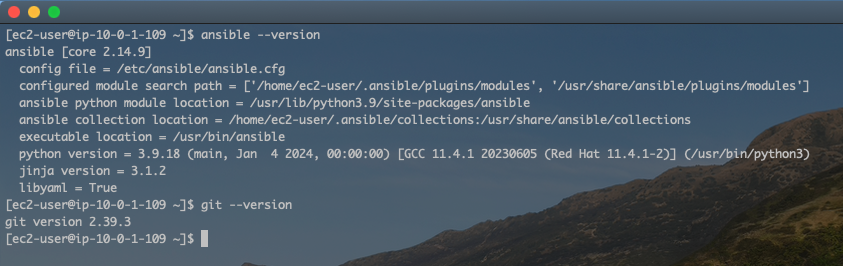
- Just like we did in the previous section, create an Image from this provisioned Bastion Host.
  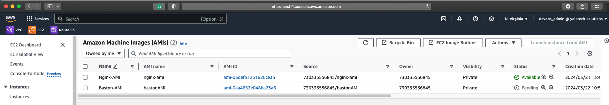
- Create a Launch Template using the Image with the necessary settings (VPC, Security Groups, Login Key etc)
  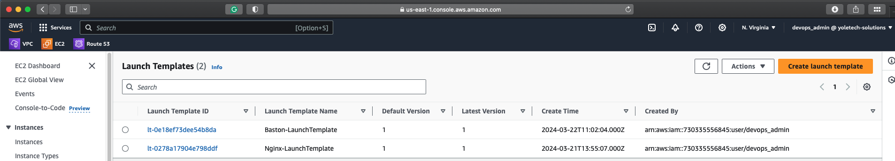
- Launch a new Bastion Host in the other public subnet
- Create a Target Group for the Bastion Hosts
  - This time, the Protocol should be `TCP`, and the Port `22`.
    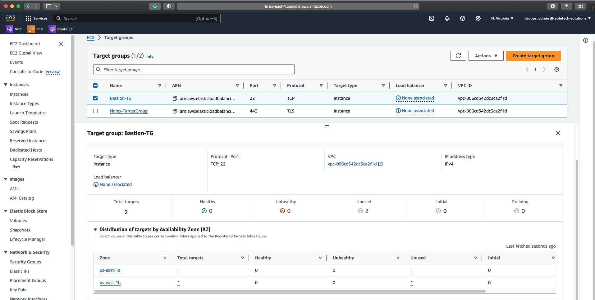
- Since this Bastion host would be used primarily to connect to other servers within the organization, there would be no need to create an autoscaling group for it at this moment.

### Compute Resources for the Web Servers

Just like to previous two sections, provision a new instance for the Web Servers using the details in the [resources.yaml](https://github.com/iamYole/DIO-DevOps-Projects/blob/main/Project%2020%20-%20Building%20a%20Scalable%20and%20Secure%20IT%20Infrastructure%20on%20AWS/resources.yml) file.

The company has two separate applications(Tooling and WordPress), so we would be creating the resources of both. Let's begin with the tooling site:

- Using the details from the `resource.yaml` file, launch an instance called Tooling_Web.
- Enure the necessary softwares are installed using the `userdata` script below:
  > ```bash
  > #!/bin/bash
  >
  > # Update package lists
  > sudo apt update
  >
  > # Install required packages
  > sudo apt install -y python3 ntp net-tools vim wget git htop php
  >
  > # Cloning the tooling site
  > git clone https://github.com/darey-io/tooling.git
  >
  > # Move the Web Files to the html directory
  > cd tooling/html
  > cp -R  * /var/www/html
  > ```
- Launch another EC2 Instance and name is WordPress Server
- Enure the necessary softwares are installed using the `userdata` script below:
  > ```bash
  > #!/bin/bash
  >
  > # Update package lists
  > sudo apt update
  >
  > # Install required packages
  > sudo apt install -y python ntp net-tools vim wget git htop php
  >
  > # Install WordPress and its dependencies
  > sudo apt install -y wordpress
  > ```
- Create Images for Tooling and WordPress
  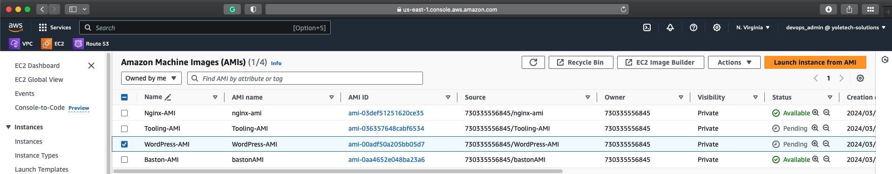
- Create Launch Templates for both web servers
  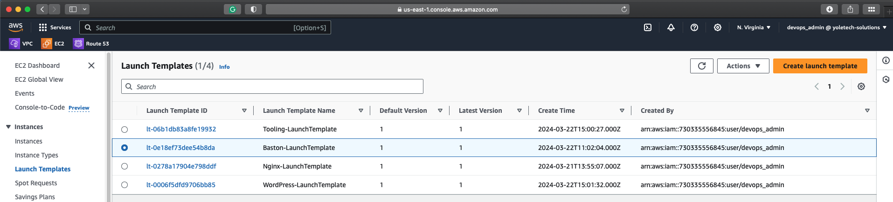
- Create a Target group for the web servers
  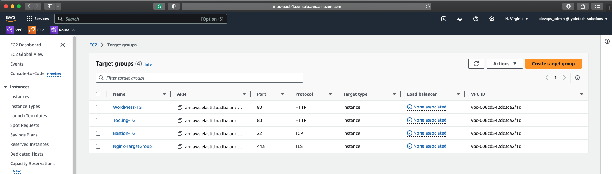
- Create an Auto Scaling Group for the web servers
  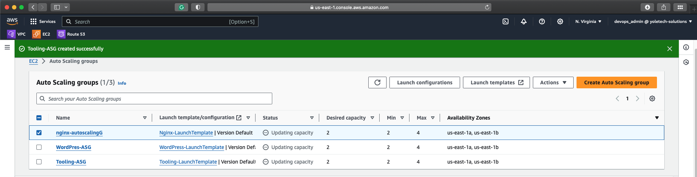

### Creating AWS Elastic File System

Elastic File System (EFS) is a scalable, fully managed file storage service provided by Amazon Web Services (AWS). It is designed to provide scalable and elastic file storage for use with AWS cloud services and on-premises resources.

Since we will be having clusters of dynamic web applications where users would be saving and retrieving data, its important we provide consistent data to the users. We will create an EFS volume to host data from the web servers. One for the Tooling Site, and another for WordPress. Let's begin.
