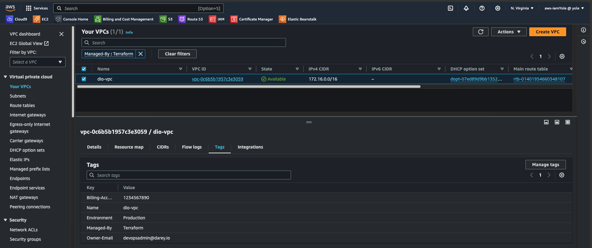
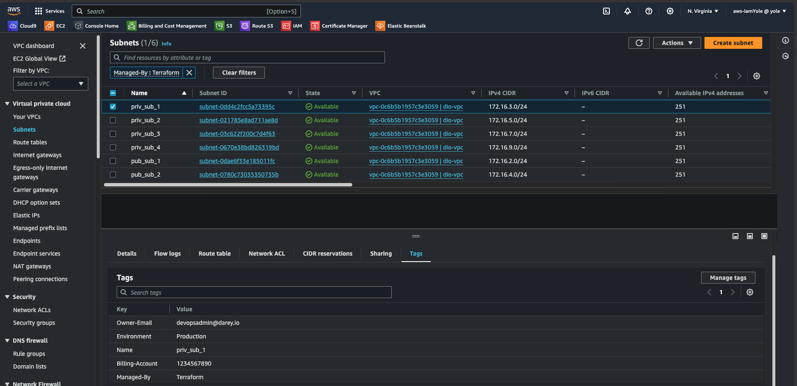
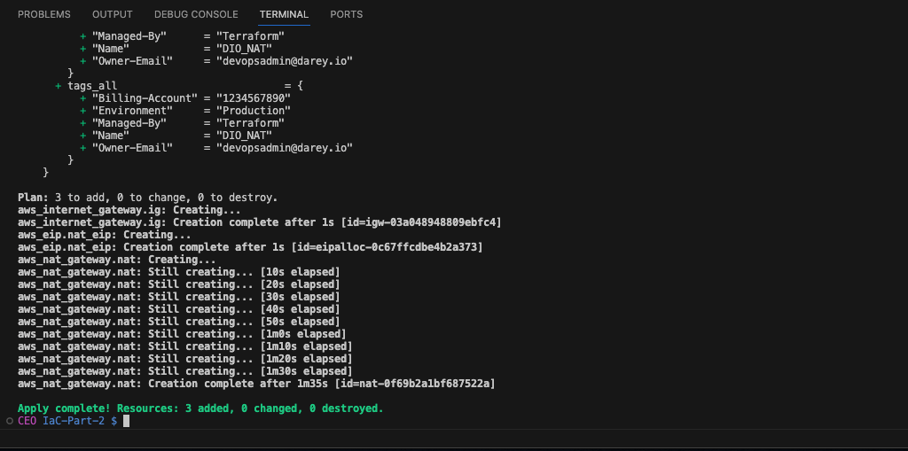
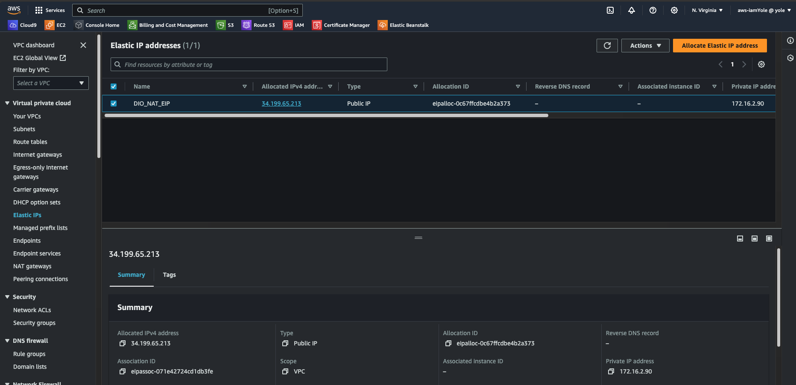
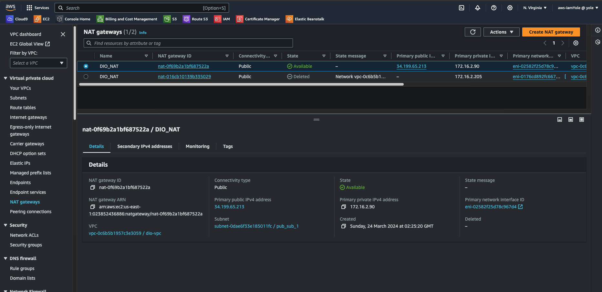
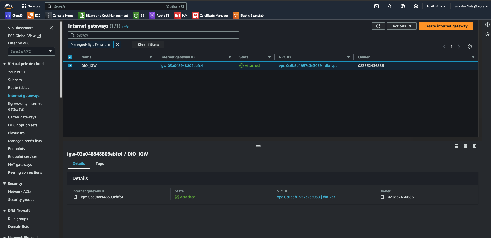
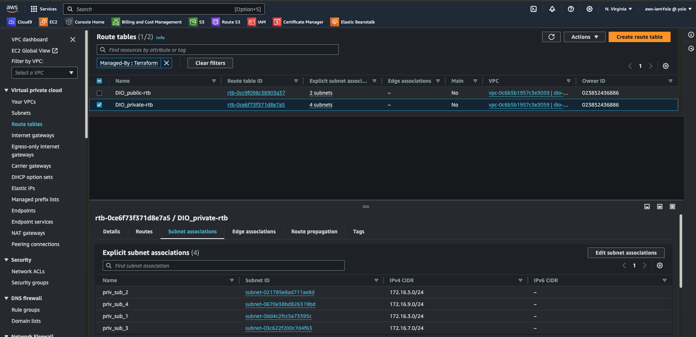
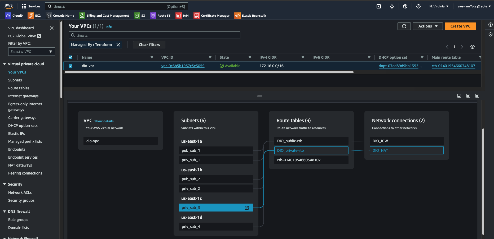
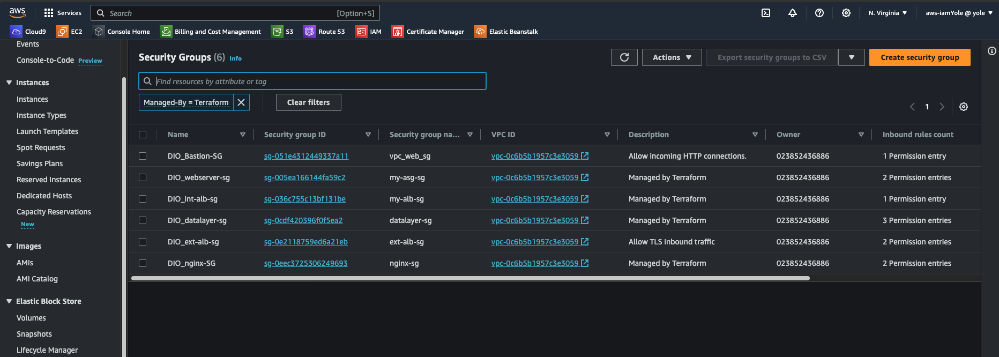

# Infrastructure as a Code (IaC) using Terraform in AWS Part 2

In the first part of this project [Infrastructure as a Code (IaC) using Terraform in AWS](https://github.com/iamYole/DIO-Projects/blob/main/Project%2016%20-%20Infrastructure%20as%20a%20Code%20using%20Terraform/README.md), we were introduce to the basics of IaC with terraform and provisioned a VPC, Subnets, and and EC2 Instance. We will be building on that by creating the resources in the diagram below.


Let's begin with a recap from the previous part. In the previous part, we created a VPC `dio-vpc` and two public subnets. We leveraged on the `data` block to create a data source of the availability zones in the region and selected the first 2. The code was also refactored to use the `variables.tf` to define the variables and the `terraform.tfvars` file to set the values.

Now, let's add 4 Private Subnets to the VPC.

## IaC - Networking

### Creating the Private Subnets

Before we continue, one of the the project requirement is creating tags for all resources, and we've been given a format/template on the minimum tag each resource should have.

> ```yaml
> Environment     = "production"
> Owner-Email     = "devopsAdmin@darey.io"
> Managed-By      = "Terraform"
> Billing-Account = "1234567890"
> ```

To comply with the above tag requirement, we can create a tag variable in the `variable.tf` file, and then for each object we create, we reference the tag. Let's start by re tagging the exiting objects (VPC, and Public Subnets).

- Add the following lines of code to the `variables.tf` file
  > ```bash
  > variable "tag_prefix" {
  >   default = "DIO"
  > }
  >
  > variable "tags" {
  >  default = {
  >    "Environment"     = "Production"
  >    "Owner-Email"     = "devopsadmin@darey.io"
  >    "Managed-By"      = "Terraform"
  >    "Billing-Account" = "1234567890"
  >  }
  > }
  > ```
- In the `main.tf` file, delete the current tags in the VPC and subnet, and then replace them with the codes below
  > ```bash
  > #VPC tag
  > tags = merge(
  >    var.tags, {
  >      Name = "dio-vpc"
  >    }
  >  )
  >
  > #Subnets Tag
  > tags = merge(
  >  var.tags,
  >  {
  >    Name = "pub_sub_${count.index + 1}"
  >  },
  > )
  > ```

With the modified code above, each resource will inherit details of the default tag, and the name of the resource will be appended to the tag.

Now, let's continue with the 4 private subnets.

- The first step is to create a variable in the `variables.tf` file
  > ```bash
  > variable "preferred_number_of_private_subnets" {
  >     default = null
  > }
  > ```
- In the `terraform.tfvars` file, let's set the number
  > `preferred_number_of_private_subnets = 4`
- Now, in the `main.tf` file, add the following lines of code
  > ```bash
  > # Create private subnets
  >  resource "aws_subnet" "private" {
  >  count                   = var.preferred_number_of_private_subnets == null ? length(data.aws_availability_zones.available.names) : var.preferred_number_of_private_subnets
  >  vpc_id                  = aws_vpc.dio-vpc.id
  >  cidr_block              = cidrsubnet(var.vpc_cidr, 8, count.index * 2 + 1) #Using odd numbers for the CIDR_BLOCK
  >  map_public_ip_on_launch = false
  >  availability_zone       = data.aws_availability_zones.available.names[count.index]
  >
  >  tags = merge(
  >    var.tags,
  >    {
  >      Name = "priv_sub_${count.index + 1}"
  >    },
  >  )
  > }
  >
  > ```
- Run `terraform validate` to ensure there are no syntax errors, and then `terraform plan` to see the execution plan.

        Note, in the previous step, I created the resources in the eu-west-2 region which has just 3 AZs. This would be a problem as we are attempting to create 4 subnets.
        To fix this, I've changed the region to us-east-1, which has 6 AZs.

        Another point to note. When we dynamically allocated the cidr_block to the public subnet, we used the code below
        cidr_block = cidrsubnet(var.vpc_cidr, 4, count.index + 1). Since we were creating two public subnets, the cidr_block will start at one and increment by 1.

        That approach worked just fine. However, when implementing the cidr_block allocation for the private subnet, we need to create a logic where there won't be a conflict.

        To do that, we allocate even numbers to the public subnet using code below
        cidr_block = cidrsubnet(var.vpc_cidr, 4, (count.index + 1) * 2). This will generate
        (0 + 1) * 2 = 2
        (1 + 1) * 2 = 4

        and for the private subnet, we use the code below
        cidr_block = cidrsubnet(var.vpc_cidr, 4, ((count.index + 1) * 2) + 1)). This will generate
        ((0 + 1) * 2) + 1 = 3
        ((1 + 1) * 2) + 1 = 5

- Run `terraform apply --auto-approve` to create the resources.
- Log into the AWS Console to confirm the resources have been created and tagged accordingly.
  
  We can see the VPC has been created and tagged as expected

  

  We can also see the private and public subnets have been created, the CIDR_BLOCK had no conflict

Next, we will be creating an Internet Gateway, an Elastic IP and a NAT Gateway.

### Creating the Internet Gateway, NAT Gateway and Elastic IP

In a bid not to have one file containing a long line of codes, we can create new files to and group the items being created. That way, our code becomes was to read as well as manage. Let's create a new file for the IGW, NAT GW and EIP

Create a new file called `IG_NAT_EIP.tf` with the code below:

> ```bash
> # Create Internet Gateway
> resource "aws_internet_gateway" "ig" {
> vpc_id = aws_vpc.dio-vpc.id
>  tags = merge(
>    var.tags,
>    {
>      Name = "${var.tag_prefix}_IGW"
>    }
>  )
> }
>
> # Create Elastic IP
> resource "aws_eip" "nat_eip" {
>  depends_on = [aws_internet_gateway.ig]
>
>  tags = merge(
>    var.tags,
>    {
>      Name = "${var.tag_prefix}_NAT_EIP"
>    },
>  )
> }
>
> # Create NAT Gateway
> resource "aws_nat_gateway" "nat" {
>  allocation_id = aws_eip.nat_eip.id
>  subnet_id     = element(aws_subnet.public.*.id, 0)
>  depends_on    = [aws_internet_gateway.ig]
>
>  tags = merge(
>    var.tags,
>    {
>      Name = "${var.tag_prefix}_NAT"
>    },
>  )
> }
>
> ```

Run `terraform plan` to inspect the changes and then `terraform apply -auto-approve` to implement the changes.


The Internet Gateway, Elastic IP and NAT Gateway has now been created. Again, this can be verified from the AWS Console.

The EIP


The NAT GW with the EIP attached


The IGW


### Creating the Route Tables

Again, let's create new file called `route_tables.tf` with the code below:

> ```bash
> # create private route table
> resource "aws_route_table" "private-rtb" {
>  vpc_id = aws_vpc.dio-vpc.id
>
>  route {
>    cidr_block = "0.0.0.0/0"
>    gateway_id = aws_nat_gateway.nat.id
>  }
>
>  tags = merge(
>    var.tags,
>    {
>      Name = "${var.tag_prefix}_private-rtb"
>    }
>  )
> }
>
> # associate all private subnets to the private route table
> resource "aws_route_table_association" "private-subnets-assoc" {
>  count          = length(aws_subnet.private[*].id)
>  subnet_id      = element(aws_subnet.private[*].id, count.index)
>  route_table_id = aws_route_table.private-rtb.id
> }
>
> # create route table for the public subnets
> resource "aws_route_table" "public-rtb" {
>  vpc_id = aws_vpc.dio-vpc.id
>
>  route {
>    cidr_block = "0.0.0.0/0"
>    gateway_id = aws_internet_gateway.ig.id
>  }
>
>  tags = merge(
>    var.tags,
>    {
>      Name = "${var.tag_prefix}_public-rtb"
>    }
>  )
> }
>
> # associate all public subnets to the public route table
> resource "aws_route_table_association" "public-subnets-assoc" {
>   count          = length(aws_subnet.public[*].id)
>   subnet_id      = element(aws_subnet.public[*].id, count.index)
>   route_table_id = aws_route_table.public-rtb.id
> }
> ```

In the code above, we created the Public and Private `Route Tables` , and within the TR, we defined the route `0.0.0.0/0` to direct all traffic to the `Internet Gateway` for the Public RT, and `NAT Gateway` for the Private RT. We also created two `subnet association` to associate the route tables to the subnets. Again, we used the `length` function to obtain the number of subnets for each category, and `count` to create a subnet association of each subnet.

Run `terraform plan` and `terraform apply -auto-approve` to inspect and implement the changes.

The Route Tables and the Subnet Association


The VPC and the current state of the resource map showing how traffic is being routed


We are now done with the networking aspect of the infrastructure. Now, let's start creating the compute resources. However, before that, we need to step up the necessary user accounts and access control for the resources.

## IaC - IAM Users and Roles

AWS AssumeRole is an AWS Identity and Access Management (IAM) feature that allows an IAM user, AWS service, or federated user to obtain temporary security credentials to access AWS resources securely. This feature is commonly used in scenarios where a user or application requires access to AWS resources in another AWS account or when you need to grant cross-account access.

When a user or application assumes a role, they receive a set of temporary security credentials, including an access key ID, a secret access key, and a session token. These credentials are valid for a limited duration, typically between 15 minutes to 12 hours, depending on how the role is configured. After the duration expires, the credentials are no longer valid, providing an additional layer of security.

To assume a role, the entity must have permission to do so, which is defined in an IAM policy attached to the IAM user, group, or role. The policy must include the sts:AssumeRole action, and it can specify conditions such as the trusted entities (the IAM users or roles that are allowed to assume the role) and the duration for which the credentials are valid.

Once the entity successfully assumes the role, it can use the temporary security credentials to access the AWS resources according to the permissions granted by the role's IAM policies. These temporary credentials are often used in API requests, SDKs, or CLI commands just like regular IAM user credentials.

Now. let's create and AssumeRole for the EC2 Instance

Create a file called `roles.tf` with the code below

> ```bash
> resource "aws_iam_role" "ec2_instance_role" {
>  name = "ec2_instance_role"
>  assume_role_policy = jsonencode({
>    Version = "2012-10-17"
>    Statement = [
>      {
>        Action = "sts:AssumeRole"
>        Effect = "Allow"
>        Sid    = ""
>        Principal = {
>          Service = "ec2.amazonaws.com"
>        }
>      },
>    ]
>  })
>
>  tags = merge(
>    var.tags,
>    {
>      Name = "aws assume role"
>    },
>  )
> }
> ```

The code above creates an IAM role named `ec2_instance_role` and defines a policy that allows EC2 instances to assume this role. This role can then be attached to EC2 instances, granting them permissions to access other AWS services according to the policy `eca.amazonaws.com` attached to this role.

Next, we need to create a Policy and attach it to the role. Still within the `roles.tf` file, add the following lines of code;

> ```bash
> resource "aws_iam_policy" "policy" {
>  name        = "ec2_instance_policy"
>  description = "A test policy"
>  policy = jsonencode({
>    Version = "2012-10-17"
>    Statement = [
>      {
>        Action = [
>          "ec2:Describe*",
>        ]
>        Effect   = "Allow"
>        Resource = "*"
>      },
>    ]
>
>  })
>
>  tags = merge(
>    var.tags,
>    {
>      Name = "aws assume policy"
>    },
>  )
> }
> ```

The code above creates an IAM policy named "ec2_instance_policy" with a description "A test policy". The policy just allows the "ec2:Describe\*" actions on all resources.

Finally, we need to attach the policy to role. To do that, add the following lines of code to the file.

> ```bash
> resource "aws_iam_role_policy_attachment" "test-attach" {
>     role       = aws_iam_role.ec2_instance_role.name
>     policy_arn = aws_iam_policy.policy.arn
> }
> ```

To wrap up the roles and access management section, let's create an Instance Profile as a container for the IAM ROLE. An AWS Instance Profile is an AWS Identity and Access Management (IAM) entity used to provide AWS credentials to an EC2 instance. It is essentially a container for an IAM role that can be associated with an EC2 instance, granting it permissions to interact with other AWS services and resources.

While both AWS AssumeRole and AWS Instance Profile are used to grant permissions within AWS, AssumeRole is primarily used for cross-account access and federated authentication, while Instance Profile is specifically designed for granting permissions to EC2 instances within the same AWS account.

Add the following lines of code to the `roles.tf` file to

> ```bash
> resource "aws_iam_instance_profile" "instance_profile" {
>    name = "aws_instance_profile_test"
>    role =  aws_iam_role.ec2_instance_role.name
> }
> ```

#### Recap


From the diagram above, let's recap on what we've created so far and what's pending. So far, we've created the following:

- [x] The VPC
- [x] Two (2) Public Subnets
- [x] Four (4) Private Subnets
- [x] One (1) Elastic IP
- [x] One (1) Internet Gateway
- [x] One (1) NAT Gateway
- [x] One (1) Public Route Table
  - [x] Two (2) Subnet Associations to the Public Route Table
- [x] One (1) Private Route Table
  - [x] Four (4) Subnet Associations to the Private Route Table
- [x] IAM Roles and Policies for Access Management

Next, we will be creating the Security Groups.

### Creating the Security Groups

Create a new file called `security_groups.tf` with the code below:

> ```bash
> # security group for alb, to allow acess from any where for HTTP and HTTPS traffic
> resource "aws_security_group" "ext-alb-sg" {
>  name        = "ext-alb-sg"
>  vpc_id      = aws_vpc.dio-vpc.id
>  description = "Allow TLS inbound traffic"
>
>  ingress {
>    description = "HTTP"
>    from_port   = 80
>    to_port     = 80
>    protocol    = "tcp"
>    cidr_blocks = ["0.0.0.0/0"]
>  }
>
>  ingress {
>    description = "HTTPS"
>    from_port   = 22
>    to_port     = 22
>    protocol    = "tcp"
>    cidr_blocks = ["0.0.0.0/0"]
>  }
>
>  egress {
>    from_port   = 0
>    to_port     = 0
>    protocol    = "-1"
>    cidr_blocks = ["0.0.0.0/0"]
>  }
>
>  tags = merge(
>    var.tags,
>    {
>      Name = "${var.tag_prefix}_ext-alb-sg"
>    },
>  )
>
> }
>
>
> # security group for bastion, to allow access into the bastion host from you IP
> resource "aws_security_group" "bastion_sg" {
>  name        = "vpc_web_sg"
>  vpc_id      = aws_vpc.dio-vpc.id
>  description = "Allow incoming HTTP connections."
>
>  ingress {
>    description = "SSH"
>    from_port   = 22
>    to_port     = 22
>    protocol    = "tcp"
>    cidr_blocks = ["0.0.0.0/0"]
>  }
>
>  egress {
>    from_port   = 0
>    to_port     = 0
>    protocol    = "-1"
>    cidr_blocks = ["0.0.0.0/0"]
>  }
>
>  tags = merge(
>    var.tags,
>    {
>      Name = "${var.tag_prefix}_Bastion-SG"
>    },
>  )
> }
>
> #security group for nginx reverse proxy, to allow access only from the external load balancer and bastion instance
> resource "aws_security_group" "nginx-sg" {
>  name   = "nginx-sg"
>  vpc_id = aws_vpc.dio-vpc.id
>
>  egress {
>    from_port   = 0
>    to_port     = 0
>    protocol    = "-1"
>    cidr_blocks = ["0.0.0.0/0"]
>  }
>
>  tags = merge(
>    var.tags,
>    {
>      Name = "${var.tag_prefix}_nginx-SG"
>    },
>  )
> }
>
> resource "aws_security_group_rule" "inbound-nginx-http" {
>  type                     = "ingress"
>  from_port                = 443
>  to_port                  = 443
>  protocol                 = "tcp"
>  source_security_group_id = aws_security_group.ext-alb-sg.id
>  security_group_id        = aws_security_group.nginx-sg.id
> }
>
> resource "aws_security_group_rule" "inbound-bastion-ssh" {
>  type                     = "ingress"
>  from_port                = 22
>  to_port                  = 22
>  protocol                 = "tcp"
>  source_security_group_id = aws_security_group.bastion_sg.id
>  security_group_id        = aws_security_group.nginx-sg.id
> }
>
> # security group for ialb, to have access only from nginx reverser proxy server
> resource "aws_security_group" "int-alb-sg" {
>  name   = "my-alb-sg"
>  vpc_id = aws_vpc.dio-vpc.id
>
>  egress {
>    from_port   = 0
>    to_port     = 0
>    protocol    = "-1"
>    cidr_blocks = ["0.0.0.0/0"]
>  }
>
>  tags = merge(
>    var.tags,
>    {
>      Name = "${var.tag_prefix}_int-alb-sg"
>    },
>  )
>
> }
>
> resource "aws_security_group_rule" "inbound-ialb-https" {
>  type                     = "ingress"
>  from_port                = 443
>  to_port                  = 443
>  protocol                 = "tcp"
>  source_security_group_id = aws_security_group.nginx-sg.id
>  security_group_id        = aws_security_group.int-alb-sg.id
> }
>
> # security group for webservers, to have access only from the internal load balancer and bastion instance
> resource "aws_security_group" "webserver-sg" {
>  name   = "my-asg-sg"
>  vpc_id = aws_vpc.dio-vpc.id
>
>  egress {
>    from_port   = 0
>    to_port     = 0
>    protocol    = "-1"
>    cidr_blocks = ["0.0.0.0/0"]
>  }
>
>  tags = merge(
>    var.tags,
>    {
>      Name = "${var.tag_prefix}_webserver-sg"
>    },
>  )
>
> }
>
> resource "aws_security_group_rule" "inbound-web-https" {
>  type                     = "ingress"
>  from_port                = 443
>  to_port                  = 443
>  protocol                 = "tcp"
>  source_security_group_id = aws_security_group.int-alb-sg.id
>  security_group_id        = aws_security_group.webserver-sg.id
> }
>
> resource "aws_security_group_rule" "inbound-web-ssh" {
>  type                     = "ingress"
>  from_port                = 22
>  to_port                  = 22
>  protocol                 = "tcp"
>  source_security_group_id = aws_security_group.bastion_sg.id
>  security_group_id        = aws_security_group.webserver-sg.id
> }
>
> # security group for datalayer to alow traffic from websever on nfs and mysql port and bastion host on mysql port
> resource "aws_security_group" "datalayer-sg" {
>  name   = "datalayer-sg"
>  vpc_id = aws_vpc.dio-vpc.id
>
>  egress {
>    from_port   = 0
>    to_port     = 0
>    protocol    = "-1"
>    cidr_blocks = ["0.0.0.0/0"]
>  }
>
>  tags = merge(
>    var.tags,
>    {
>      Name = "${var.tag_prefix}_datalayer-sg"
>    },
>  )
> }
>
> resource "aws_security_group_rule" "inbound-nfs-port" {
>  type                     = "ingress"
>  from_port                = 2049
>  to_port                  = 2049
>  protocol                 = "tcp"
>  source_security_group_id = aws_security_group.webserver-sg.id
>  security_group_id        = aws_security_group.datalayer-sg.id
> }
>
> resource "aws_security_group_rule" "inbound-mysql-bastion" {
>  type                     = "ingress"
>  from_port                = 3306
>  to_port                  = 3306
>  protocol                 = "tcp"
>  source_security_group_id = aws_security_group.bastion_sg.id
>  security_group_id        = aws_security_group.datalayer-sg.id
> }
>
> resource "aws_security_group_rule" "inbound-mysql-webserver" {
>  type                     = "ingress"
>  from_port                = 3306
>  to_port                  = 3306
>  protocol                 = "tcp"
>  source_security_group_id = aws_security_group.webserver-sg.id
>  security_group_id        = aws_security_group.datalayer-sg.id
> }
> ```

The code above basically creates the security groups that would be required, and provided the ingress and egress rule for the ports that would be allowed to receive traffic.

The Security Groups created

