# Infrastructure as a Code (IaC) using Terraform in AWS Part 3

In this project, we will continue from the part 2 of the IaC series. In this part, we will be enhancing the existing project by introducing new concepts like remote state management (Backend), workspace, dynamic blocks, modules, etc. Let's begin by introducing the backend.

## Terraform Backend (S3 and DynamoDB)

Terraform uses state files to keep track of the resources it manages and their current state. A backend is a configuration setting that determines where and how Terraform state data is stored and accessed. By default, terraform stores the state of each resource in a local file. However, this approach is not ideal when working on a team project were other team members are editing or creating new resources.

The local file terraform stores the state of each resource `terraform.tfstate`


Since the provider we are working with is AWS, the AWS S3 would be perfect for storing the backend/state file. Another useful option that is supported by S3 backend is State Locking – it is used to lock your state file for all operations that could write state. This prevents others from acquiring the lock and potentially corrupting your state. State Locking feature for S3 backend is optional and requires another AWS service – DynamoDB which we will be configuring as well.

Create a file called `backend.tf` and paste codes below.

> ```bash
> resource "aws_s3_bucket" "terraform_state" {
>  bucket = var.bucket
>  # Prevent accidental deletion
>  lifecycle {
>    prevent_destroy = true
>  }
> }
>
> # Enabling versioning to see the change history of the state file
> resource "aws_s3_bucket_versioning" "bucket_versioning" {
>  bucket = aws_s3_bucket.terraform_state.id
>
>  versioning_configuration {
>    status = "Enabled"
>  }
>  # Prevent accidental deletion
>  lifecycle {
>    prevent_destroy = true
>  }
> }
>
> # Enable server-side encryption by default
> resource "aws_s3_bucket_server_side_encryption_configuration" "bucket_encryption" {
>  bucket = aws_s3_bucket.terraform_state.bucket
>
>  rule {
>    apply_server_side_encryption_by_default {
>      sse_algorithm = "AES256"
>    }
>  }
>  # Prevent accidental deletion
>  lifecycle {
>    prevent_destroy = true
>  }
> }
>
> resource "aws_dynamodb_table" "terraform_locks" {
>  name         = "terraform-locks"
>  billing_mode = "PAY_PER_REQUEST"
>  hash_key     = "LockID"
>  attribute {
>    name = "LockID"
>    type = "S"
>  }
>  # Prevent accidental deletion
>  lifecycle {
>    prevent_destroy = true
>  }
> }
> ```

Run `terraform plan` to inspect the changes.


The outcome of the `terraform plan` tells us 4 new resources would be created. The S3 bucket and its components as well as the dynamoDB table. These are required before we can configure Terraform to use S3 as backend. Now run `terraform apply` to implement the changes.

Confirm the S3 Bucket and DynamoDB table have been created.

S3 Bucket


DynamoDB Table


With the S3 bucket and DynamoDB table created, we can now configure the backend. Still in the `backend.tf` file, paste the code below

> ```bash
> terraform {
>  backend "s3" {
>    bucket         = "ytech-terraform-state"
>    key            = "ytech/s3/terraform.tfstate"
>    region         = "us-east-1"
>    dynamodb_table = "terraform-locks"
>    encrypt        = true
>  }
> }
> ```

Save the file and run `terraform init`. This will re initialize the project and then recognize the backend for remote state management. Terraform will also prompt you to copy the state of the existing resources to the backend.


The State file is now created in the S3 Bucket
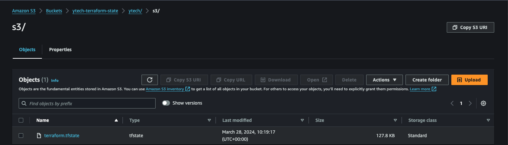

Create a new file called `output.tf` with the code below

> ```bash
> output "s3_bucket_arn" {
>  value       = aws_s3_bucket.terraform_state.arn
>  description = "The ARN of the S3 bucket"
> }
> output "dynamodb_table_name" {
>  value       = aws_dynamodb_table.terraform_locks.name
>  description = "The name of the DynamoDB table"
> }
> ```

Save and then run `terraform apply`. Now, refresh the S3 page and confirm a new version of the file has been created while retaining the old version.


Few things to note from this section

- Ensure the S3 buckets and DynamoDB Table are not deleted by accident. This can be done by introducing the mete data `lifecycle`.
- Its also advisable to create the S3 Bucket and DynamoDB manually, or from a different Terraform Project with a different Terraform State file. That way, the state of these objects can be managed separately from the state of other objects in which they are storing the state of.
- When creating the `backend` resource, ensure the values are hard coded as it won't accept variables.

## Restructuring the Code - Best Practice

Now, let's look as some best practice in terraform. Some new concepts will be introduced in this section to help make the code easier to write, maintain as well as making the code reusable for other projects. Let's begin.

### Map and Lookup

A map is a data structure that stores a collection of key-value pairs. Each key in the map must be unique, and the values can be of any data type, including strings, numbers, lists, or even nested maps. You can use maps in Terraform to represent structured data, configurations, or sets of parameters. They are commonly used to define variables, configure resources, or pass data between modules.

To access values from a map in Terraform, you can use the `lookup` function. The `lookup` function retrieves the value associated with a specified key from a map. It also allows you to provide a default value if the key does not exist in the map.

With this understanding, we can restructure the `variables.tf` file to take advantage of this data type.

Currently we defined two different variables to store the AMI values for the instance. Let's modify the file with the code below:

> ```bash
> variable "regions" {
>  type = map(string)
>  default = {
>    "London_Office" = "eu-west-2"
>    "US_Office"     = "us-east-1"
>  }
> }
>
> variable "instance_types" {
>  type = map(string)
>  default = {
>    "small"  = "t2.micro"
>    "medium" = "t3.medium"
>    "large"  = "r5.large"
>  }
> }
>
> # A nested map variable
>
> variable "Images" {
>  type = map(map(string))
>  default = {
>    "US_Office" = {
>      "RHEL_9"           = "ami-0fe630eb857a6ec83"
>      "Ubuntu_Server_22" = "ami-080e1f13689e07408"
>    }
>    "London_Office" = {
>      "RHEL_9"           = "ami-035cecbff25e0d91e"
>      "Ubuntu_Server_22" = "ami-0b9932f4918a00c4f"
>    }
>  }
> }
> ```

In the code above, we defined three (3) variables of type map. The `Images` variable above was defined using a nested map i.e a map inside another map. To use these variable, let's edit the files where we created EC2 Instances with the code below:

> ```bash
>  image_id      = lookup(lookup(var.Images, "US_Office"), "RHEL_9")
>  instance_type = lookup(var.instance_types, "small")
>
> # Also edit the provider block in the main.tf file with the code below
>
> provider "aws" {
>  region = lookup(var.regions, "US_Office")
> }
> ```

Notice how we also nested the `lookup()` function to loop through the key / value pair of the nested map variable.

### Dynamic Blocks

Dynamic blocks in Terraform provide a way to create repeated nested blocks dynamically within a resource or module configuration. They allow you to generate multiple similar blocks based on a list or map of values, reducing duplication and enabling more flexible and concise configurations.

Dynamic blocks are particularly useful when you need to create multiple similar configurations, such as multiple ingress rules for a security group, multiple subnet blocks for a VPC, or multiple tags for a resource. Currently, we created six(6) different security groups by defining a block for each of them. Some of these security groups have multiple ingress rules defined. We will be refactoring the code using dynamic blocks in place of multiple ingress rule definitions.

In the `security_group.tf` file, let's edit the `ext-alb-sg` SG with the code below:

> ```bash
> #security group for alb, to allow access from any where for HTTP and HTTPS traffic
> resource "aws_security_group" "ext-alb-sg" {
>  name        = "ext-alb-sg"
>  vpc_id      = aws_vpc.dio-vpc.id
>  description = "Allow TLS inbound traffic"
>
>  dynamic "ingress" {
>    for_each = {
>      "HTTP"  = 80,
>      "HTTPS" = 22
>    }
>
>    content {
>      description = ingress.key
>      from_port   = ingress.value
>      to_port     = ingress.value
>      protocol    = "tcp"
>      cidr_blocks = ["0.0.0.0/0"]
>    }
>  }
>  egress {
>    from_port   = 0
>    to_port     = 0
>    protocol    = "-1"
>    cidr_blocks = ["0.0.0.0/0"]
>  }
>
>  tags = merge(
>    var.tags,
>    {
>      Name = "${var.tag_prefix}_ext-alb-sg"
>    },
>  )
>
> }
> ```

## Refactoring the Code into Modules

Modules are reusable components that encapsulate configuration, making it easier to manage and maintain infrastructure as code. Modules allow you to package and organize resources, variables, outputs, and other Terraform constructs into logical units that can be used across different Terraform configurations.

By default, we've been creating all our resources in the `Root` module. This works fine for a small project, however, breaking the project into several modules that can be handled by different teams/individuals is highly recommended for large projects. We currently have over 10 files in our root module, and its becoming difficult to locate files for different resources, so before it gets more complex, let's create several modules, with each having its own `var.tf` file.

In this project, we will be creating the following modules:

- **ALB**: Application Load Balancer module to store files related to the creation of our application load balancers. The module will consist of the following files:
  - `alb.tf`
  - `output.tf`
  - `var.tf`
- **ASG**: Auto Scaling Group module to store files related to the creation of our auto scaling groups such as launch template. The module will consist of the following files:
  - `asg.tf`
  - `var.tf`
  - `asg-bastion-nginx.tf`
  - `asg-tooling-wordpress.tf`
  - `UserData/[userdatascripts].sh`
- **Compute**: At the moment, we are launching the EC2 Instances using both the ASG and ALB. Therefore, this would be empty for now.
- **EFS**: Elastic File System module to store files related to the creation of our elastic file system and the mount points. The module will consist of the following files:
  - `efs.tf`
  - `var.tf`
- **Networking**: This module would store files used to create the VPC, Subnets Route tables, Internat and Nat Gateways etc. The module will consist of the following files:
  - `main.tf`
  - `route_tables.tf`
  - `IG_NAT_GW.tf`
  - `var.tf`
- **RDS**: This module would store files for the database creation. The module will consist of the following files:
  - `rds.tf`
- **Security**: The security module would be used to store files relating to ACLs, Roles, security groups etc. The module will consist of the following files:
  - `security_group.tf`
  - `cert.tf`
  - `roles.tf`
  - `var.tf`

Before we begin, let's go through some best practices as it relates to Modules in Terraform.

- **Single Responsibility Principle**: Each module should have a clear and specific purpose, encapsulating a single piece of infrastructure functionality. This makes modules easier to understand, reuse, and maintain.

- **Modularity**: Design modules to be composable and reusable across different projects and environments. Avoid hardcoding values that are specific to a particular use case or environment.

- **Parameterization**: Use input variables to parameterize modules, allowing users to customize the behavior and configuration of the module based on their requirements. This promotes flexibility and reuse.

- **Documentation**: Provide clear and comprehensive documentation for your modules, including information on how to use them, input variables, outputs, and any dependencies or requirements. Documentation helps users understand the purpose and functionality of the module.

- **Consistency**: Follow consistent naming conventions, directory structures, and coding styles across your modules and Terraform configurations. Consistency makes it easier for team members to understand and work with your code.

The idea of Modularizing our project in the first place was to group the creation of similar resources together. However, there are cases where we may need to reference an object from one module in a different module.

Modularizing the exiting project is going to be a lot of, but with patient and proper understanding of the task, to should be easy. Now, let's start with the `Security Module`.
Move the files below to the `Security` directory:

- `cert.tf`
- `roles.tf`
- `security_groups.tf`

The create two new files called `vars.tf` and `output.tf`

The `vars.tf` file should contain the code below:

> ```bash
> variable "vpc_id" {
>  type = string
> }
> variable "domain_name" {
>  type = string
> }
> variable "hosted_zone" {
>  type = string
> }
> variable "tooling_record" {
>  type = string
> }
> variable "wordpress_record" {
>  type = string
> }
> variable "tags" {
>  type = map(any)
> }
> variable "tag_prefix" {
>  type = string
> }
> variable "ext-alb_dns_name" {
>  type = string
> }
> variable "ext-alb_zone_id" {
>  type = string
> }
> ```

The `vars.tf` file contains variables of objects and/or values that would be obtained from a different module. For example, the `security module` has no idea of the `vpc_id` or details of the internal and external load balancers. I decided to parameterize the `domain_name` and `hosted_zone` so this module can be used by someone else with a different domain_name. More on this later.

The `output.tf` file should contain the code below:

> ```bash
> output "datalayer-sg_id" {
>  value = aws_security_group.datalayer-sg.id
> }
> output "tooling_record" {
>  value = aws_route53_record.tooling
> }
> output "int-alb-sg_id" {
>  value = aws_security_group.int-alb-sg.id
> }
> output "ext-alb-sg_id" {
>  value = aws_security_group.ext-alb-sg.id
> }
> output "certificate_arn" {
>  value = aws_acm_certificate_validation.iamyole.certificate_arn
> }
> output "bastion_sg-id" {
>  value = aws_security_group.bastion_sg.id
> }
> output "nginx_sg-id" {
>  value = aws_security_group.nginx-sg.id
> }
> output "webserver_sg-id" {
>  value = aws_security_group.webserver-sg.id
> }
> ```

Just as we created variables for resource details like `vpc_id` in the `vars.tf` file. The `output.tf` will be exporting/exposing some variables to be accessible by other modules. For example, the `networking` module would need details of several security groups defined in this module.

After creating variables for objects defined in other modules, we need to edit the codes to reference the variables and not the objects. For example, in the `cert.tf` make the following adjustments:

> ```bash
> resource "aws_acm_certificate" "yole" {
>  domain_name       = var.domain_name
>  validation_method = "DNS"
> }
> ```

Initially, we hard coded the domain name, but here we are referencing the variable. Also, still in the `cert.tf` file:

> ```bash
> resource "aws_route53_record" "tooling" {
>  zone_id = data.aws_route53_zone.iamyole.zone_id
>  name    = var.tooling_record
>  type    = "A"
>
>  alias {
>    name                   = var.ext-alb_dns_name //aws_lb.ext-alb.dns_name
>    zone_id                = var.ext-alb_zone_id  //aws_lb.ext-alb.zone_id
>    evaluate_target_health = true
>  }
> }
> ```

Here, we are using `var.ext-alb_dns_name` and `var.ext-alb_zone_id` in place of `aws_lb.ext-alb.dns_name` and `aws_lb.ext-alb.zone_id`. The changes are a lot so i'll be dropping the complete modularized project files [here](https://github.com/iamYole/DIO-DevOps-Projects/tree/main/Project%2022%20-%20Infrastructure%20as%20a%20Code%20using%20Terraform%20Part%203/IaC-Modularized-Project).

Now, to use this module, we will create a `main.tf` file in the root directory with the code below:

> ```bash
> terraform {
>  required_version = "~> 1.3"
>  required_providers {
>    aws = {
>      source  = "hashicorp/aws"
>      version = "~> 5.0"
>    }
>  }
> }
>
> module "security" {
>  source = "./Modules/Security"
>
>  vpc_id           = module.networking.vpc_id
>  ext-alb_dns_name = module.networking.alb_dns_name
>  ext-alb_zone_id  = module.networking.ext-alb_id
>
>  domain_name      = var.domain_name
>  hosted_zone      = var.hosted_zone
>  tooling_record   = var.tooling_record
>  wordpress_record = var.wordpress_record
>  tag_prefix       = local.tag_prefix
>  tags             = local.tags
> }
> ```

From the code above, we can the VPC and Application Load Balancer details are being retrieved the the networking module. And for this to be possible, the networking module has its own `output.tf` file where these were exposed:

> ```bash
> output "vpc_id" {
>  value = aws_vpc.dio-vpc.id
> }
> output "ext-alb_dns_name" {
>  value = aws_lb.ext-alb.dns_name
> }
> output "ext-alb_zone_id" {
>  value = aws_lb.ext-alb.zone_id
> }
> ```

Once all modules have been defined, and after any changes to a module file, we must run `terraform init` to reinitialize the modules.

The final file should consists of multiple modules in the `main.tf` file as seen in the image below:


We are also created a `locals.tf` file to store some configuration settings for the project.

> ```bash
> locals {
>  vpc_cidr             = "172.16.0.0/16"
>  enable_dns_support   = "true"
>  enable_dns_hostnames = "true"
>  tag_prefix           = "DIO"
>  preferred_number_of_public_subnets  = 2
>  preferred_number_of_private_subnets = 4
>
>  region = {
>    "London_Office" = "eu-west-2"
>    "US_Office"     = "us-east-1"
>  }
>
>  tags = {
>    "Environment"     = "Production"
>    "Owner-Email"     = "devopsadmin@darey.io"
>    "Managed-By"      = "Terraform"
>    "Billing-Account" = "1234567890"
>  }
> }
> ```

In the file above is very similar to the `terraform.tfvars` we will also define. The major difference here is that values we do not wish to change over times such as the vpc_cidr are defined here. While values such as `domain_name` would be created in the `variables.tf` and `terraform.tfvars` files. Sample `terraform.tfvars` file below:

> ```bash
> master-username  = "dbadmin"
> master-password  = "password"
> db_name          = "diobd"
> bucket           = "ytech-terraform-state"
> your_ip          = "[0.0.0.0/0]"
> keypair          = "ytech-key"
> domain_name      = "*.iamyole.uk"
> hosted_zone      = "iamyole.uk"
> wordpress_record = "wordpress.iamyole.uk"
> tooling_record   = "tooling.iamyole.uk"
> ```

The configuration above can be easily changed by users depending on the project or environment. Again, the complete modularized files can be found [here](https://github.com/iamYole/DIO-DevOps-Projects/tree/main/Project%2022%20-%20Infrastructure%20as%20a%20Code%20using%20Terraform%20Part%203/IaC-Modularized-Project).

The final project directory now looks like this


Run `terraform init` to compile the modules and make them available for use


Take note of the output `Initializing Modules....`. ALso note that Terraform will create a module directory within the .terraform directory. In the `.terraform/modules` a modules.json file will be created storing details of all the modules.

Next, we run `terraform validate` and then `terraform plan` to inspect the changes to be made

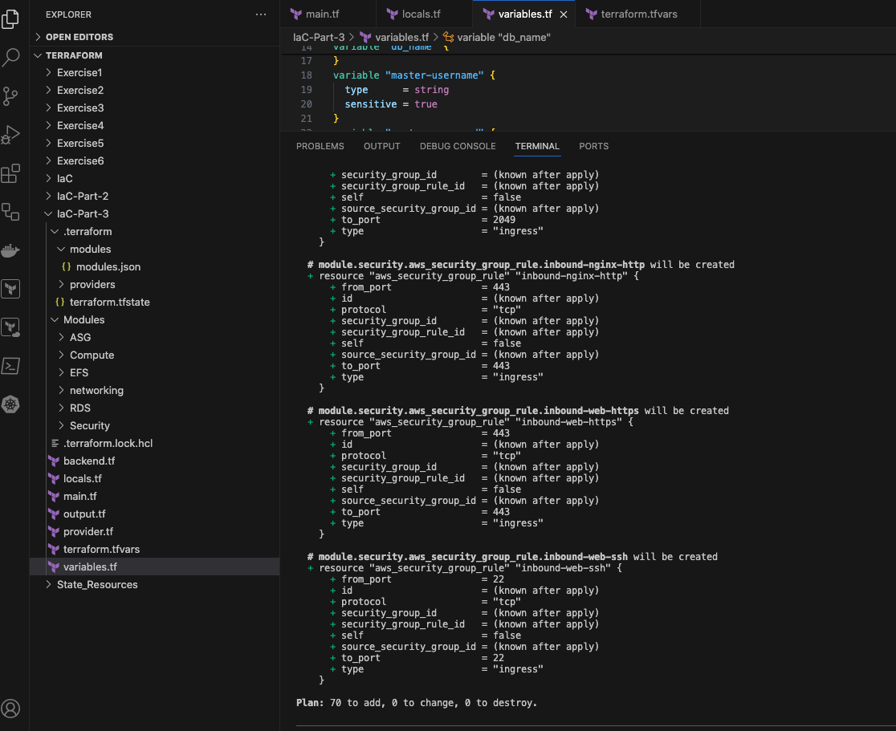

## Terraform Workspace and Environments

A workspace is a feature that allows you to manage multiple "instances" or "states" of your infrastructure within a single Terraform configuration directory. Each workspace has its own state file, allowing you to maintain separate sets of resources or configurations within the same Terraform configuration.

Workspaces are useful for scenarios where you need to maintain multiple versions or instances of the same infrastructure, such as different environments (e.g., development, staging, production) or feature branches. Instead of duplicating your Terraform configurations for each environment, you can use workspaces to manage them within the same directory.

Environments on the other hand typically refer to separate configurations or sets of infrastructure resources that correspond to different stages of your development or deployment workflow. These environments are managed using separate directories or repositories, each containing its own Terraform configuration files, state files, and backend configurations.

Environments are typically managed using separate directories or repositories, each containing its own Terraform configuration files, state files, and backend configurations. This is ideal when the resources being created for `Development` are different from the resources that would be created for `Production`.

Let's start by using Workspaces
By default, every project in terraform has a default workspace. We can confirm this by running `terraform workspace list`

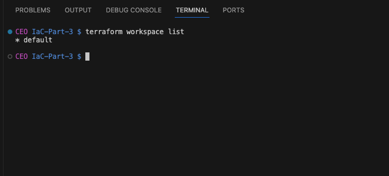

To create a workspace, the command is `terraform workspace new [name-of-workspace]`. Now, let's create two (2) workspaces, **Development** and **Production**.

To demonstrate this, we will configure E2 Instances in Production workspace to be `t2.small`, while that of Development will be `t2.micro`. We will also dynamically specify the tag for each environment. To implement this, let's edit the `locals.tf` file with the following.

For the tags,

> ```bash
> tags = {
>    "Environment"     = "${terraform.workspace}" // Set this to the current workspace
>    "Owner-Email"     = "devopsadmin@darey.io"
>    "Managed-By"      = "Terraform"
>    "Billing-Account" = "1234567890"
>  }
> ```

For the instance,

> ```bash
> instance_type_value = terraform.workspace == "Production" ? "medium" : "small"
> ```

Here, we introduced a condition to use either a t2.medium or t2.mirco as the instance size depending on the environment. This instance_type_value was defined in the ASG Module
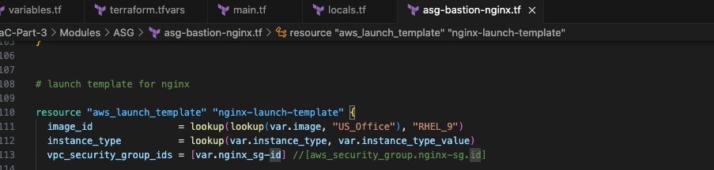

The module's `var.tf` file
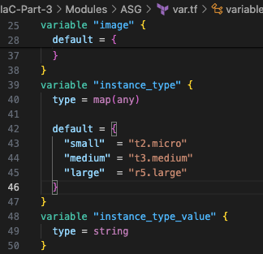

and then used in the `main.tf` file here:
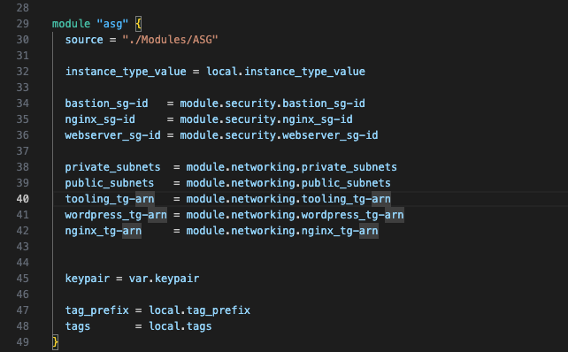

Now, let't test this by first initializing and validating the project. The switch to the `Development WorkSpace`.
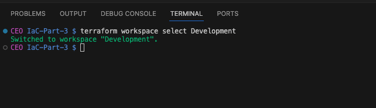

Now, plan and then apply the changes.
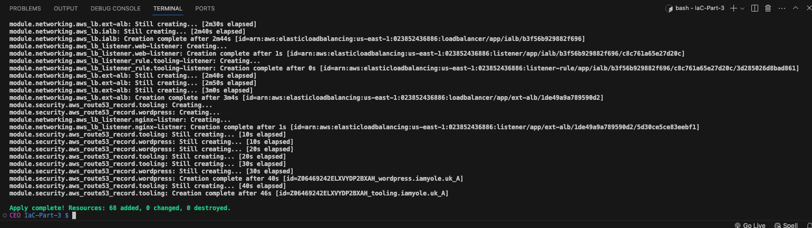

Log into the AWS Console and confirm the instance type in the `Development` Workspace is t2.micro and the tags has Development set for the environment.
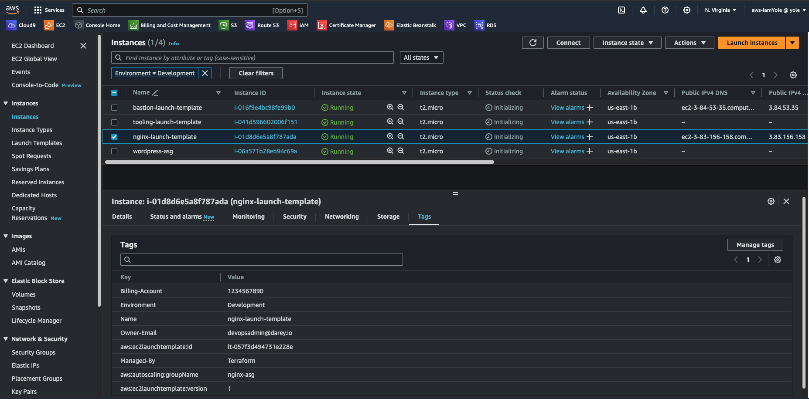

Also check the S3 Bucket and confirm we have different folders to store different workspace/environment
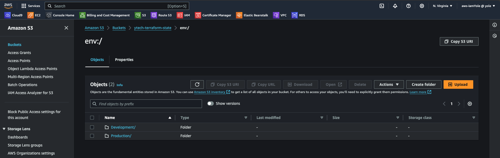

Now, let's switch to the `Production` Workspace and apply the changes

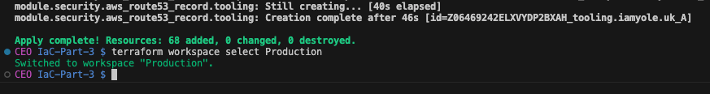

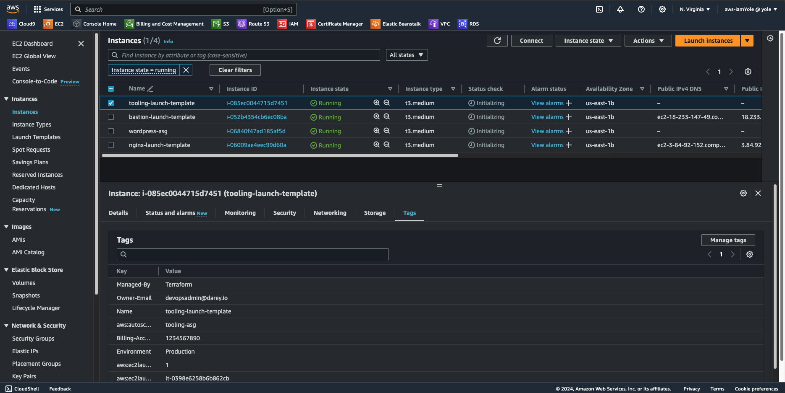

Note. In this sample, we used the same region to host the resources, so using the workspace as a prefix in naming the resources will be necessary to avoid conflict. We already have a tag_prefix defined, so we can set the value to `  tag_prefix = "${terraform.workspace}_DIO"`

### Using Directory Structure

For directory Structure, we won't have to make changes to dynamically select variables. Instead, we will be creating multiple files for each environment. To implement this, in the root directory, create two (2) folders Dev and Prod. Make a copy and move the files `.tf` files outside the modules into each of the directories. At the end, your directory should have this structure:

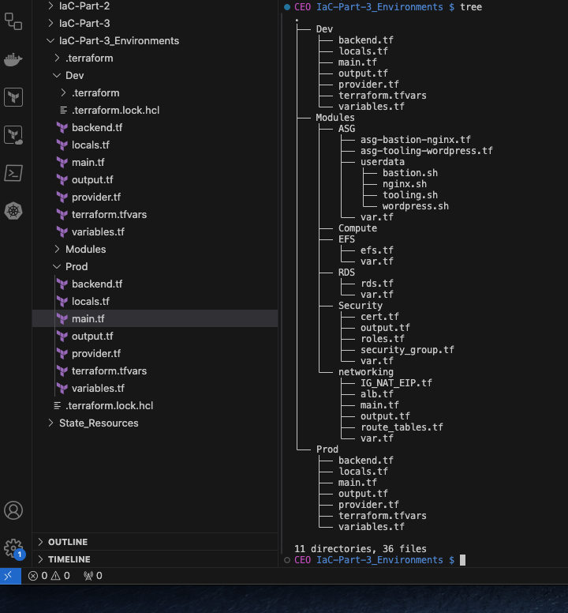

Basically, we have the root directory, and within the root directory, we have the Modules, Dev and then Prod directory. The Dev and Prod directory each has the required files to run the application. This can be likened to two different projects using a shared resource (the module).

Now to run the code, navigate to the Dev or Prod directory from your terminal and then run terraform init and then plan or apply
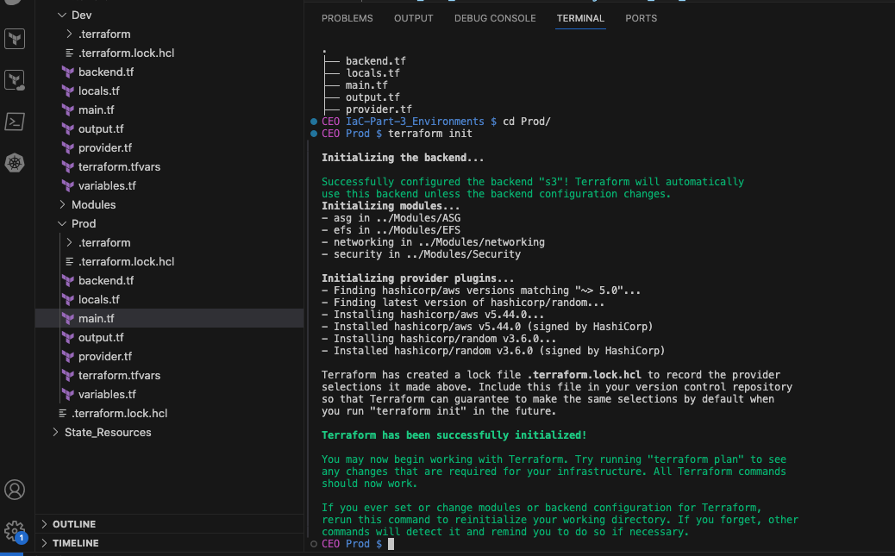

And that's how to use different environment with Terraform. This methods has their advantages and disadvantages, the choice of method to adapt depends on several factors.
