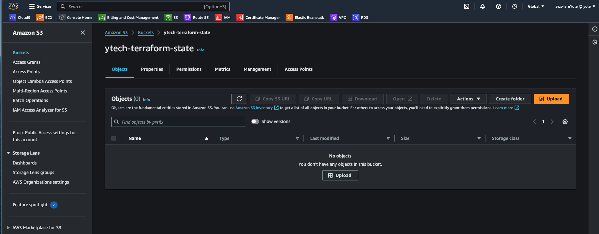

# Infrastructure as a Code (IaC) using Terraform in AWS Part 3

In this project, we will continue from the part 2 of the IaC series. In this part, we will be enhancing the existing project by introducing new concepts like remote state management (Backend), workspace, dynamic blocks, modules, etc. Let's begin by introducing the backend.

## Terraform Backend (S3 and DynamoDB)

Terraform uses state files to keep track of the resources it manages and their current state. A backend is a configuration setting that determines where and how Terraform state data is stored and accessed. By default, terraform stores the state of each resource in a local file. However, this approach is not ideal when working on a team project were other team members are editing or creating new resources.

The local file terraform stores the state of each resource `terraform.tfstate`


Since the provider we are working with is AWS, the AWS S3 would be perfect for storing the backend/state file. Another useful option that is supported by S3 backend is State Locking – it is used to lock your state file for all operations that could write state. This prevents others from acquiring the lock and potentially corrupting your state. State Locking feature for S3 backend is optional and requires another AWS service – DynamoDB which we will be configuring as well.

Create a file called `backend.tf` and paste codes below.

> ```bash
> resource "aws_s3_bucket" "terraform_state" {
>  bucket = var.bucket
>  # Prevent accidental deletion
>  lifecycle {
>    prevent_destroy = true
>  }
> }
>
> # Enabling versioning to see the change history of the state file
> resource "aws_s3_bucket_versioning" "bucket_versioning" {
>  bucket = aws_s3_bucket.terraform_state.id
>
>  versioning_configuration {
>    status = "Enabled"
>  }
>  # Prevent accidental deletion
>  lifecycle {
>    prevent_destroy = true
>  }
> }
>
> # Enable server-side encryption by default
> resource "aws_s3_bucket_server_side_encryption_configuration" "bucket_encryption" {
>  bucket = aws_s3_bucket.terraform_state.bucket
>
>  rule {
>    apply_server_side_encryption_by_default {
>      sse_algorithm = "AES256"
>    }
>  }
>  # Prevent accidental deletion
>  lifecycle {
>    prevent_destroy = true
>  }
> }
>
> resource "aws_dynamodb_table" "terraform_locks" {
>  name         = "terraform-locks"
>  billing_mode = "PAY_PER_REQUEST"
>  hash_key     = "LockID"
>  attribute {
>    name = "LockID"
>    type = "S"
>  }
>  # Prevent accidental deletion
>  lifecycle {
>    prevent_destroy = true
>  }
> }
> ```

Run `terraform plan` to inspect the changes.


The outcome of the `terraform plan` tells us 4 new resources would be created. The S3 bucket and its components as well as the dynamoDB table. These are required before we can configure Terraform to use S3 as backend. Now run `terraform apply` to implement the changes.

Confirm the S3 Bucket and DynamoDB table have been created.

S3 Bucket


DynamoDB Table


With the S3 bucket and DynamoDB table created, we can now configure the backend. Still in the `backend.tf` file, paste the code below

> ```bash
> terraform {
>  backend "s3" {
>    bucket         = "ytech-terraform-state"
>    key            = "ytech/s3/terraform.tfstate"
>    region         = "us-east-1"
>    dynamodb_table = "terraform-locks"
>    encrypt        = true
>  }
> }
> ```

Save the file and run `terraform init`. This will re initialize the project and then recognize the backend for remote state management. Terraform will also prompt you to copy the state of the existing resources to the backend.


The State file is now created in the S3 Bucket


Create a new file called `output.tf` with the code below

> ```bash
> output "s3_bucket_arn" {
>  value       = aws_s3_bucket.terraform_state.arn
>  description = "The ARN of the S3 bucket"
> }
> output "dynamodb_table_name" {
>  value       = aws_dynamodb_table.terraform_locks.name
>  description = "The name of the DynamoDB table"
> }
> ```

Save and then run `terraform apply`. Now, refresh the S3 page and confirm a new version of the file has been created while retaining the old version.


Few things to note from this section

- Ensure the S3 buckets and DynamoDB Table are not deleted by accident. This can be done by introducing the mete data `lifecycle`.
- Its also advisable to create the S3 Bucket and DynamoDB manually, or from a different Terraform Project with a different Terraform State file. That way, the state of these objects can be managed separately from the state of other objects in which they are storing the state of.
- When creating the `backend` resource, ensure the values are hard coded as it won't accept variables.

## Restructuring the Code - Best Practice

Now, let's look as some best practice in terraform. Some new concepts will be introduced in this section to help make the code easier to write, maintain as well as making the code reusable for other projects. Let's begin.

### Map and Lookup

A map is a data structure that stores a collection of key-value pairs. Each key in the map must be unique, and the values can be of any data type, including strings, numbers, lists, or even nested maps. You can use maps in Terraform to represent structured data, configurations, or sets of parameters. They are commonly used to define variables, configure resources, or pass data between modules.

To access values from a map in Terraform, you can use the `lookup` function. The `lookup` function retrieves the value associated with a specified key from a map. It also allows you to provide a default value if the key does not exist in the map.

With this understanding, we can restructure the `variables.tf` file to take advantage of this data type.

Currently we defined two different variables to store the AMI values for the instance. Let's modify the file with the code below:

> ```bash
> variable "regions" {
>  type = map(string)
>  default = {
>    "London_Office" = "eu-west-2"
>    "US_Office"     = "us-east-1"
>  }
> }
>
> variable "instance_types" {
>  type = map(string)
>  default = {
>    "small"  = "t2.micro"
>    "medium" = "t3.medium"
>    "large"  = "r5.large"
>  }
> }
>
> # A nested map variable
>
> variable "Images" {
>  type = map(map(string))
>  default = {
>    "US_Office" = {
>      "RHEL_9"           = "ami-0fe630eb857a6ec83"
>      "Ubuntu_Server_22" = "ami-080e1f13689e07408"
>    }
>    "London_Office" = {
>      "RHEL_9"           = "ami-035cecbff25e0d91e"
>      "Ubuntu_Server_22" = "ami-0b9932f4918a00c4f"
>    }
>  }
> }
> ```

In the code above, we defined three (3) variables of type map. The `Images` variable above was defined using a nested map i.e a map inside another map. To use these variable, let's edit the files where we created EC2 Instances with the code below:

> ```bash
>  image_id      = lookup(lookup(var.Images, "US_Office"), "RHEL_9")
>  instance_type = lookup(var.instance_types, "small")
>
> # Also edit the provider block in the main.tf file with the code below
>
> provider "aws" {
>  region = lookup(var.regions, "US_Office")
> }
> ```

Notice how we also nested the `lookup()` function to loop through the key / value pair of the nested map variable.

### Dynamic Blocks

Dynamic blocks in Terraform provide a way to create repeated nested blocks dynamically within a resource or module configuration. They allow you to generate multiple similar blocks based on a list or map of values, reducing duplication and enabling more flexible and concise configurations.

Dynamic blocks are particularly useful when you need to create multiple similar configurations, such as multiple ingress rules for a security group, multiple subnet blocks for a VPC, or multiple tags for a resource. Currently, we created six(6) different security groups by defining a block for each of them. Some of these security groups have multiple ingress rules defined. We will be refactoring the code using dynamic blocks in place of multiple ingress rule definitions.

In the `security_group.tf` file, let's edit the `ext-alb-sg` SG with the code below:

> ```bash
> #security group for alb, to allow access from any where for HTTP and HTTPS traffic
> resource "aws_security_group" "ext-alb-sg" {
>  name        = "ext-alb-sg"
>  vpc_id      = aws_vpc.dio-vpc.id
>  description = "Allow TLS inbound traffic"
>
>  dynamic "ingress" {
>    for_each = {
>      "HTTP"  = 80,
>      "HTTPS" = 22
>    }
>
>    content {
>      description = ingress.key
>      from_port   = ingress.value
>      to_port     = ingress.value
>      protocol    = "tcp"
>      cidr_blocks = ["0.0.0.0/0"]
>    }
>  }
>  egress {
>    from_port   = 0
>    to_port     = 0
>    protocol    = "-1"
>    cidr_blocks = ["0.0.0.0/0"]
>  }
>
>  tags = merge(
>    var.tags,
>    {
>      Name = "${var.tag_prefix}_ext-alb-sg"
>    },
>  )
>
> }
> ```

## Refactoring the Code into Modules

Modules are reusable components that encapsulate configuration, making it easier to manage and maintain infrastructure as code. Modules allow you to package and organize resources, variables, outputs, and other Terraform constructs into logical units that can be used across different Terraform configurations.
