# Infrastructure as a Code (IaC) using Packer and Terraform Cloud in AWS Part 4

So far, we've been creating our `.tf` files in our local computer where we had Terraform and AWS Cli installed. In this project, we will be creating immutable Images with Packer and migrating our existing project to TerraForm Cloud.

## Creating Immutable Infrastructures with Packer

**Packer** is an open-source tool developed by HashiCorp that automates the process of creating identical machine images or artifacts for multiple platforms from a single source configuration. It enables developers and operators to build machine images for various platforms, including virtual machines (VMs), containers, and cloud instances, in a repeatable and consistent manner.

In previous projects, we launched new EC2 Instances using a userdata script. Meaning the script has to run for every new instance that's be provision. This time around, we will be building images from the script so as we can launch as many instance we like with the exact same softwares installed.

We already have out `userdata` script, now let's create the packer files to build the immutable images. First, we need to install packer from [developer.hashicorp.com/packer/install](https://developer.hashicorp.com/packer/install).

After Packer has been installed, we need to provide our AWS credentials to Packer. This is necessary because Packer will have to launch an EC2 instance, configure the instance with the bash script we provide in the userdata folder, create the AMI from the configured OS, and then finally terminate the EC2 Instance. One easy way to provide the AWS credentials to packer is via setting environment variables in the local machine running packer.

> export AWS_ACCESS_KEY_ID="<YOUR_AWS_ACCESS_KEY_ID>"
>
> export AWS_SECRET_ACCESS_KEY="<YOUR_AWS_SECRET_ACCESS_KEY>"

With that done, we can now start building our `pkr.hcl` files. In VS Code, add a new workspace called `Packer-AMIs` to the existing terraform project. Within the `Packer-AMIs`, create a new folder called `userdata` and move your `.sh` files into it. From the root directory in the Packer-AMIs workspace, let's create the packer files as follows:

- **bastion.pkr.hcl**
  > ```bash
  > packer {
  > required_plugins {
  >  amazon = {
  >    version = ">= 1.2.8"
  >    source  = "github.com/hashicorp/amazon"
  >  }
  > }
  > }
  >
  > locals {
  >    timestamp = regex_replace(timestamp(), "[- TZ:]", "")
  >  }
  >
  > source "amazon-ebs" "bastion-AMI" {
  >    ami_name      = "DIO-bastion-AMI-${local.timestamp}"
  >    instance_type = "t2.micro"
  >    region        = "us-east-1"
  >
  >    source_ami_filter {
  >      filters = {
  >        name                = "RHEL-9.3.0_HVM-20240117-x86_64-49-Hourly2-GP3"
  >        root-device-type    = "ebs"
  >        virtualization-type = "hvm"
  >      }
  >      most_recent = true
  >      owners      = ["309956199498"]
  >    }
  >    ssh_username = "ec2-user"
  >    tag {
  >      key   = "Name"
  >      value = "bastion-key"
  >    }
  > }
  >
  > build {
  >  sources = ["source.amazon-ebs.bastion-AMI"]
  >
  >  provisioner "shell" {
  >    script = "userdata/bastion.sh"
  >  }
  > }
  > ```
- **nginx.pkr.hcl**  
  Sane with the script above. Just change the name to "nginx-AMI"
- **tooling.pkr.hcl**
  > ```bash
  > packer {
  > required_plugins {
  >  amazon = {
  >    version = ">= 1.2.8"
  >    source  = "github.com/hashicorp/amazon"
  >  }
  > }
  > }
  >
  > locals {
  >  timestamp = regex_replace(timestamp(), "[- TZ:]", "")
  > }
  >
  > source "amazon-ebs" "tooling-AMI" {
  >  ami_name      = "DIO-tooling-AMI-${local.timestamp}"
  >  instance_type = "t2.micro"
  >  region        = "us-east-1"
  >
  >  source_ami_filter {
  >    filters = {
  >      name                = "ubuntu/images/hvm-ssd/ubuntu-jammy-22.04-amd64-server-20240301"
  >      root-device-type    = "ebs"
  >      virtualization-type = "hvm"
  >    }
  >    most_recent = true
  >    owners      = ["099720109477"]
  >  }
  >  ssh_username = "ubuntu"
  >  tag {
  >    key   = "Name"
  >    value = "tooling-key"
  >  }
  > }
  >
  > build {
  > sources = ["source.amazon-ebs.tooling-AMI"]
  >
  >  provisioner "shell" {
  >    script = "userdata/tooling.sh"
  >  }
  > }
  > ```
- **wordpress.pkr.hcl**  
  Sane with the script above. Just change the name to "wordpress-AMI"

To obtain the AMI names and owners number used above, log into your AWS Console and Navigate to the EC2 Service. From left menu, click AMI, and the select "Public Images" from the filter above.
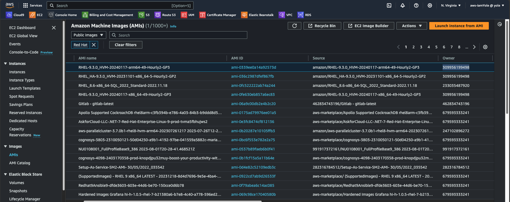

Once we've created all the packer files for our images, the next step would be to build them. From the console, navigate the directory where the packer files are and then run

> `Packer init .`

And then

> `packer build <filename.pkr.pcl>`

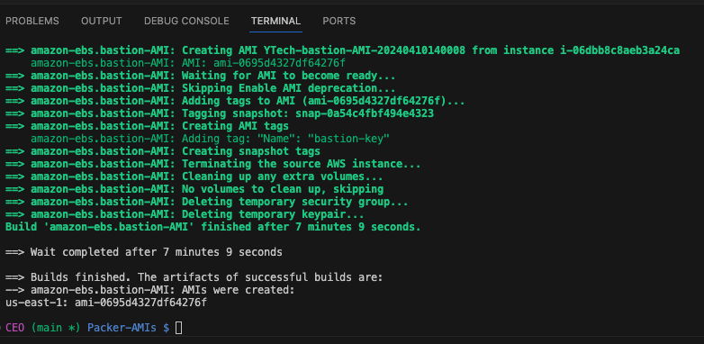
The image above shows we've successfully built our `bastion-AMI`. Build the other ami then confirm from AWS Console that the AMIs have been created.

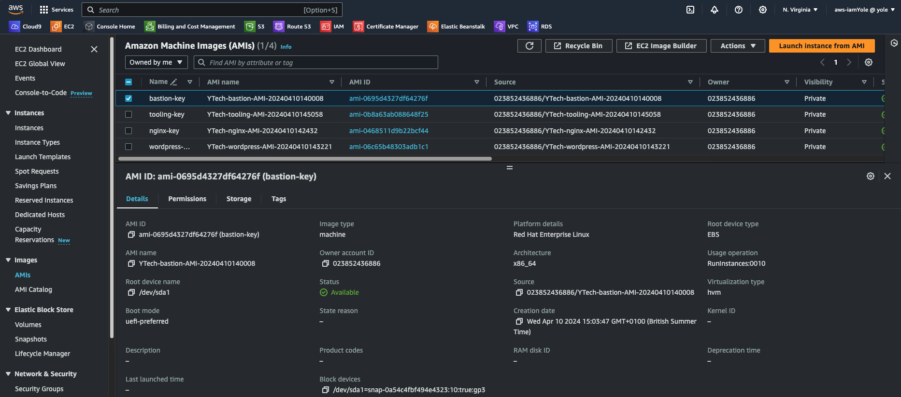

We've successfully created the AMIs needed for our servers. Next we need to created variables for the AMIs in the terraform project, and update the code to use these variables.

In the root module, create an image variable and then add the values to the terraform.tfvars file:

> ```bash
>
>  Image = {
>    "bastion-AMI"   = "ami-0695d4327df64276f"
>    "tooling-AMI"   = "ami-0b8a63ab088648f25"
>    "nginx-AMI"     = "ami-0468511d9b22bcf44"
>    "wordpress-AMI" = "ami-06c65b48303adb1c1"
>  }
>
> ```

Also update the respective files in the ASG modules.

## Migrating to Terraform Cloud

**Terraform Cloud** is a hosted service provided by HashiCorp that facilitates the management of infrastructure as code (IaC) with Terraform. It offers a centralized platform for collaborating on infrastructure configurations, storing Terraform state files, executing Terraform runs, and automating workflows. Some main features of Terraform Cloud are:

- **Collaboration**: Teams can collaborate on infrastructure configurations by sharing workspaces, collaborating on changes, and reviewing code using pull requests. Terraform Cloud offers access controls, audit logs, and role-based permissions to facilitate teamwork.
- **Remote State Management**: Terraform Cloud provides a secure backend for storing Terraform state files. This allows teams to centralize state management, ensuring consistency and synchronization across environments and team members.
- **Version Control Integration**: Terraform Cloud integrates with version control systems (e.g., GitHub, GitLab, Bitbucket) to trigger Terraform runs automatically when changes are pushed to repositories. This enables continuous integration and deployment (CI/CD) workflows, improving automation and agility.
- **Run Management**: Terraform Cloud manages Terraform runs, including plan, apply, and destroy operations. It provides visibility into run history, status, logs, and results, allowing teams to track changes, troubleshoot issues, and roll back changes if needed.

To get started with Terraform Cloud [here](https://app.terraform.io/), we need to create an account with HCL. Terraform Cloud offers majority of its feature free of charge, but there which aren't. After creating and account and signing in your Terraform Cloud account, the next thing would be creating an organization.
After the Organization has been created. We can now start migrating our local project to Terraform Cloud.


## Creating Workspaces

Workspaces are the building blocks of Terraform Cloud. They are used to organize and manage infrastructure configurations. Workspaces provide a way to group related Terraform configurations and state files, enabling teams to work on multiple projects or environments concurrently within the same organization.

In creating workspaces, we also need to decide how we intend to integrate the project with the workspace. The options are:

- **CLI Workflow**: The CLI workflow refers to using the Terraform CLI tool (terraform) in conjunction with Terraform Cloud for managing infrastructure configurations. This workflow allows you to leverage the features of Terraform Cloud, such as remote state management, collaboration, and policy enforcement, while still using the familiar Terraform CLI for local development and operations
- **API Workflow**: The API workflow in Terraform Cloud allows you to interact with Terraform Cloud programmatically using its RESTful API. This workflow enables automation, integration, and custom tooling to interact with Terraform Cloud, perform operations, and manage infrastructure configurations remotely
- **Version Control Workflow**: The version control workflow in Terraform Cloud integrates Terraform configurations with a version control system (VCS) such as Git. This workflow enables teams to manage changes, track history, collaborate, and automate infrastructure deployments using Terraform Cloud. This is the most commonly used workflow, and that's what we will be using for this project.

First, we need to ensure our project already exists in a GitHub repository. Before that, we need to update the backend so the state won't be stored in AWS S3, but the Terraform Cloud. Update the backend.tf file with the code below:

> ```bash
> terraform {
>  backend "remote" {
>
>    organization = "YoleTechSolutions"
>       workspaces {
>           name = "terraform-aws-IaC"
>       }
>    }
> }
> ```

The rename the `terraform.tfvars` file to `terraform.auto.tfvars`. This will enable Terraform Cloud automatically read the values of the variables in the file. Alternatively, you can fork the repository used for this project [here](https://github.com/iamYole/terraform-aws-IaC). However, the certain variables such as the AMIs, the Organization name above, etc needs to be updated to reflect your own values.

- Now, from the Terraform Cloud console, navigate to workspaces on the right menu and the click create workspace.
- Select the Version Control Workflow, and following the prompts to connect the workspace to your gitHub repository.

  

- Select the repository for the project in question, next and then create.
- You would be asked to provide values for the variables next, However, since are have `auto.tfvars`, we can skip this step.

There are two types of variables used in Terraform Cloud: Environment Variables and Terraform variables. Environment variables are used to store configuration settings and sensitive information outside of Terraform configuration files. For examples, security keys to connect our project to other applications like AWS, etc. Terraform variables on the other hand are used to parameterize and customize Terraform configurations as we've seen in the previous project.

Just as we provided our AWS credentials to Packer above, we need to do the same in Terraform Cloud. From the right pane, click on variables and the add variables. Provide the `AWS_ACCESS_KEY_ID` and `AWS_SECRET_ACCESS_KEY`. Ensure these are created as Environment Variables and the the sensitive option is selected.

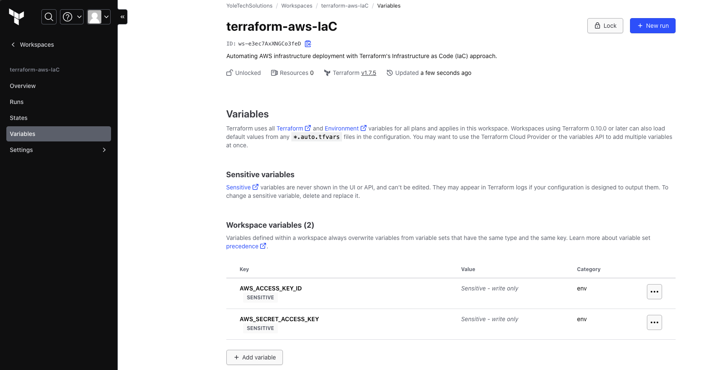

At this point, we can now start planing and creating AWS resources. To this, navigate to the left pane and click on rin, then start plan.

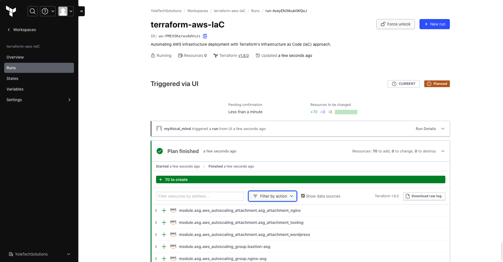

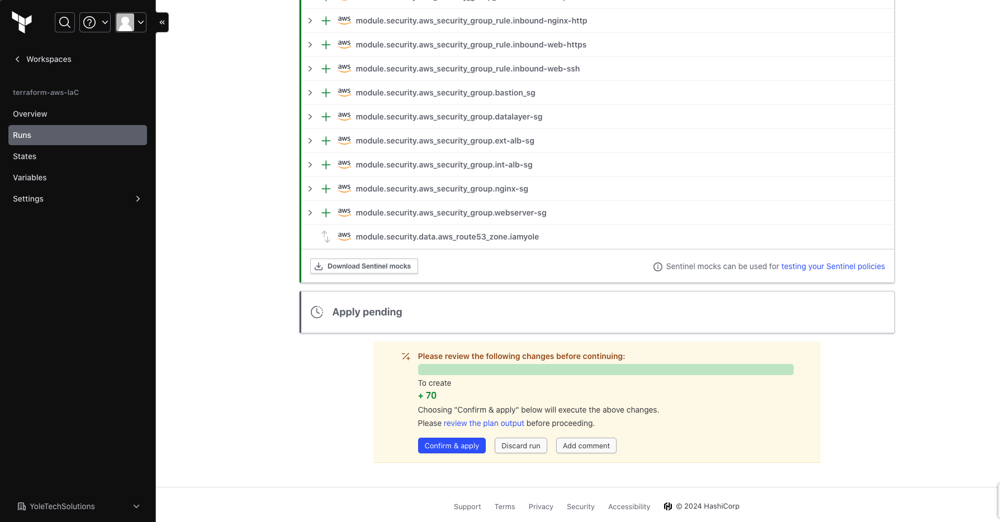

If satisfied with the plan output, click on confirm and apply, and then give a comment on this apply. With Terraform Cloud, we get a nice UI and update on the changes being made unlike what we saw from the CLI.

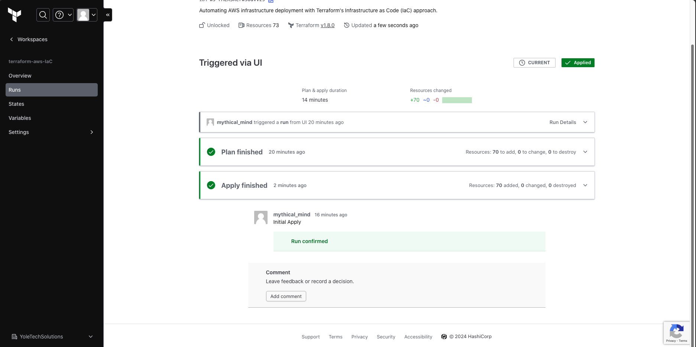

From the above image, we can confirm our resources has been created.

We can also go to the overview page to see the list of all the resources.

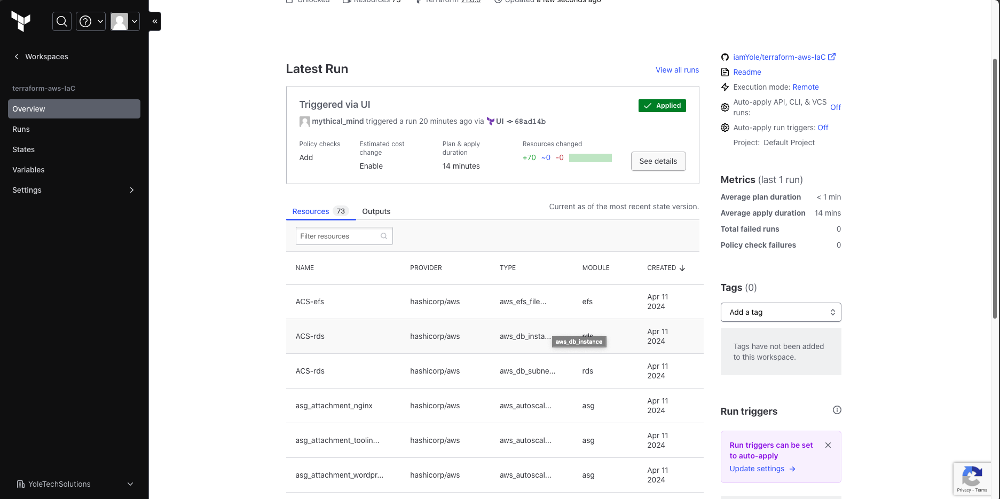

Log into AWS Console to confirm.


Confirm the EC2 Instance were created with the customer AMIs from Packer.

However, we still have a problem with our applications. If can check the Load Balancers and Target groups, we will see the health checks as unhealthy, meaning the the servers are not reachable.
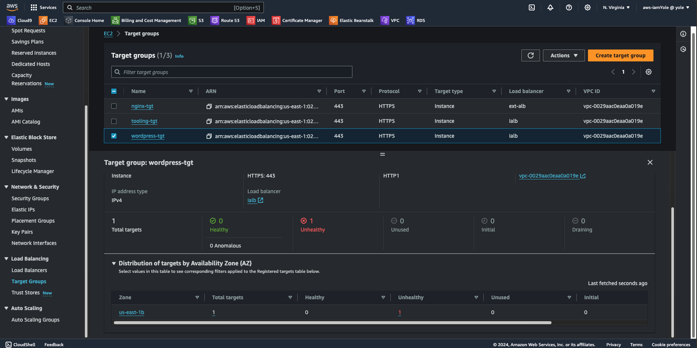

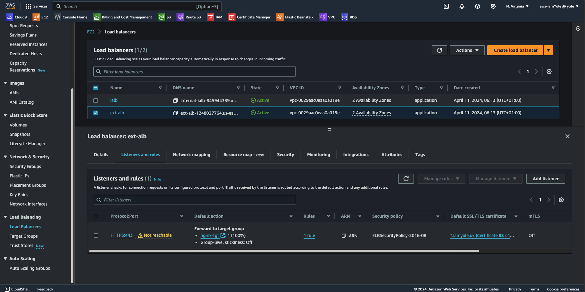

This is mainly because we have't fully configured the applications on this servers, nginx and the web application. This would be done using Ansible. However, to avoid complications, let's deregister the targets from the target groups and listenings and remove the listeners from the load balancers.

One major objective of Infrastructure as a Code (IaC) is state management of our resources. Hence, we won't be performing the above steps manually, but via code. Back to our Terraform repository, from the Networking Module, locate the `ALB.tf` file and comment out the listeners. Next, from the ASG module, locate the `aws_autoscaling_attachment` and comment them out to remove the them as targets for the target groups. Save the changes and commit to GitHub.

Back the Terraform Cloud, the commit should automatically trigger a new plan with the changes we've made to the IaC.

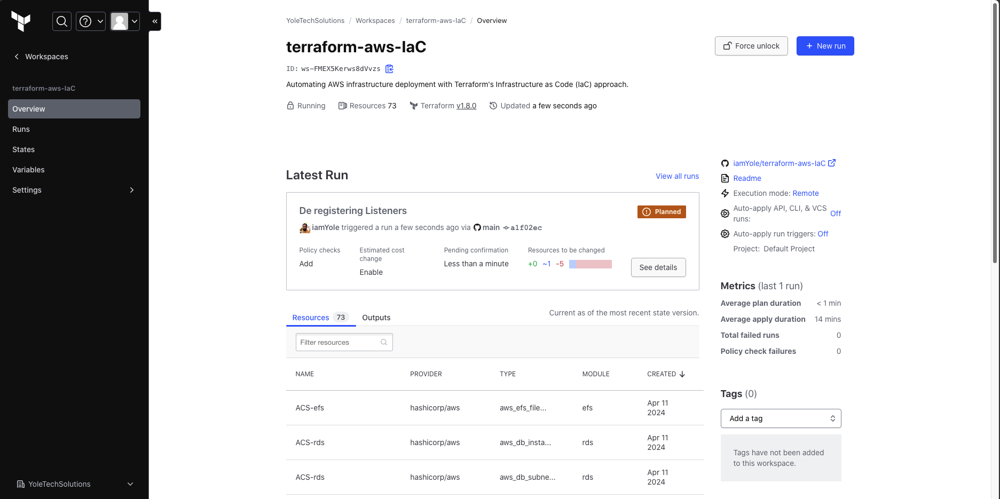

From the code above `De registering Listeners` was the comment for the commit and we can see the run was triggered from github.

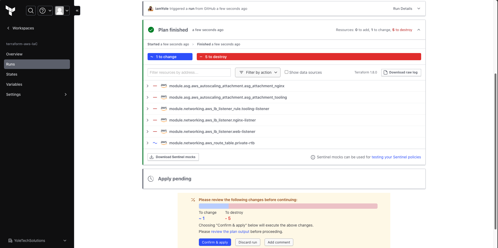

Inspect the changes being made, and then apply.

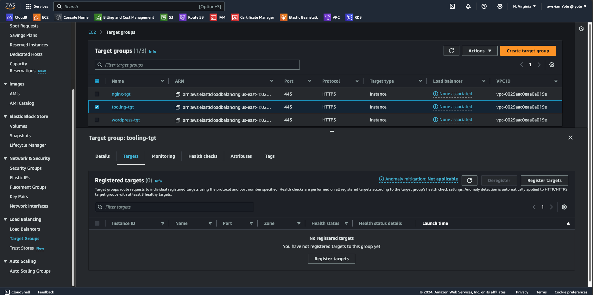

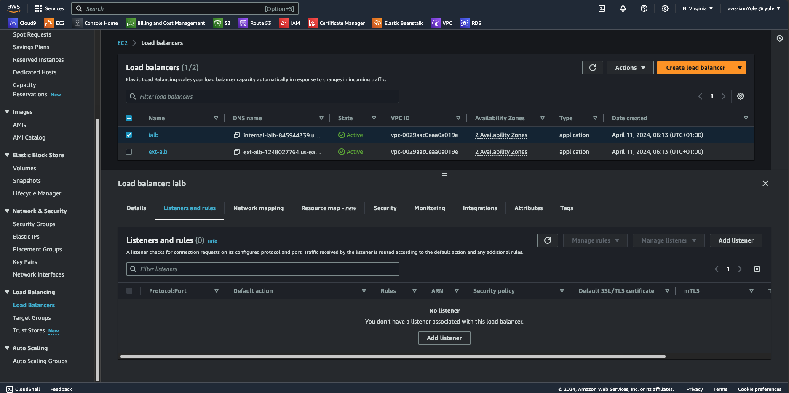

We can now see the Load Balancers have no listeners, and the target groups have no targets. Now, let's configure the resources using Ansible.

## Configuring the Resources from Ansible.
