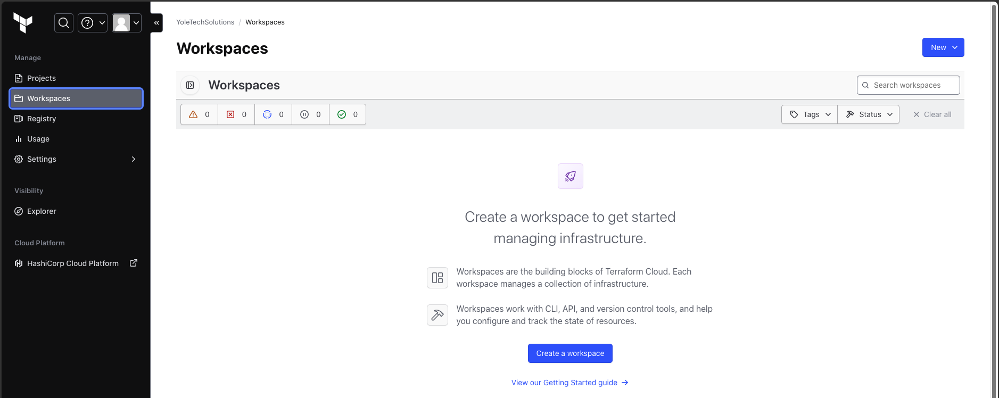
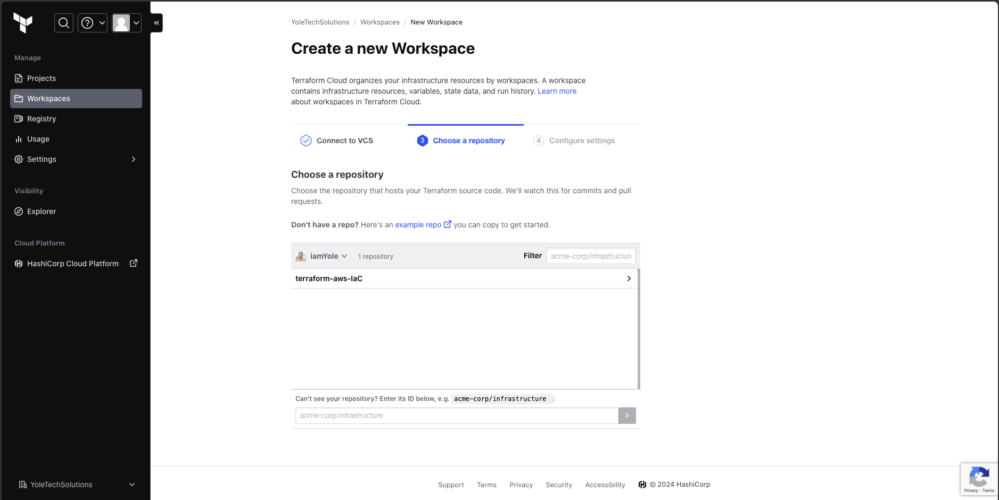

# Infrastructure as a Code (IaC) using Terraform in AWS Part 4

So far, we've been creating our `.tf` files in our local computer where we had Terraform and AWS Cli installed. In this project, we will be migrating our existing project to TerraForm Cloud and explore the benefits of using Terraform Cloud as against Terraform running on our local computers.

Terraform Cloud is a hosted service provided by HashiCorp that facilitates the management of infrastructure as code (IaC) with Terraform. It offers a centralized platform for collaborating on infrastructure configurations, storing Terraform state files, executing Terraform runs, and automating workflows. Some main features of Terraform Cloud are:

- **Collaboration**: Teams can collaborate on infrastructure configurations by sharing workspaces, collaborating on changes, and reviewing code using pull requests. Terraform Cloud offers access controls, audit logs, and role-based permissions to facilitate teamwork.
- **Remote State Management**: Terraform Cloud provides a secure backend for storing Terraform state files. This allows teams to centralize state management, ensuring consistency and synchronization across environments and team members.
- **Version Control Integration**: Terraform Cloud integrates with version control systems (e.g., GitHub, GitLab, Bitbucket) to trigger Terraform runs automatically when changes are pushed to repositories. This enables continuous integration and deployment (CI/CD) workflows, improving automation and agility.
- **Run Management**: Terraform Cloud manages Terraform runs, including plan, apply, and destroy operations. It provides visibility into run history, status, logs, and results, allowing teams to track changes, troubleshoot issues, and roll back changes if needed.

To get started with Terraform Cloud [here](https://app.terraform.io/), we need to create an account with HCL. Terraform Cloud offers majority of its feature free of charge, but there which aren't. After creating and account and signing in your Terraform Cloud account, the next thing would be creating an organization.
After the Organization has been created. We can now start migrating our local project to Terraform Cloud.

## Creating Workspaces

Workspaces are the building blocks of Terraform Cloud. They are used to organize and manage infrastructure configurations. Workspaces provide a way to group related Terraform configurations and state files, enabling teams to work on multiple projects or environments concurrently within the same organization.

In creating workspaces, we also need to decide how we intend to integrate the project with the workspace. The options are:

- **CLI Workflow**: The CLI workflow refers to using the Terraform CLI tool (terraform) in conjunction with Terraform Cloud for managing infrastructure configurations. This workflow allows you to leverage the features of Terraform Cloud, such as remote state management, collaboration, and policy enforcement, while still using the familiar Terraform CLI for local development and operations
- **API Workflow**: The API workflow in Terraform Cloud allows you to interact with Terraform Cloud programmatically using its RESTful API. This workflow enables automation, integration, and custom tooling to interact with Terraform Cloud, perform operations, and manage infrastructure configurations remotely
- **Version Control Workflow**: The version control workflow in Terraform Cloud integrates Terraform configurations with a version control system (VCS) such as Git. This workflow enables teams to manage changes, track history, collaborate, and automate infrastructure deployments using Terraform Cloud. This is the most commonly used workflow, and that's what we will be using for this project.

First, we need to ensure our project already exists in a GitHub repository. If not, you can fork the repository used for this project [here](https://github.com/iamYole/terraform-aws-IaC).

- Now, from the Terraform Cloud console, navigate to workspaces on the right menu and the click create workspace.
- Select the Version Control Workflow, and following the prompts to connect the workspace to your gitHub repository.

  

- Select the repository for the project in question, next and then create.
- Next, you would be asked to provide values to the Terraform variables seen in the `terraform.tfvars` file. We can skip this for now.

There are two types of variables used in Terraform Cloud: Environment Variables and Terraform variables. Environment variables are used to store configuration settings and sensitive information outside of Terraform configuration files. For examples, security keys to connect our project to other applications like AWS, etc. Terraform variables on the other hand are used to parameterize and customize Terraform configurations as we've seen in the previous project.
