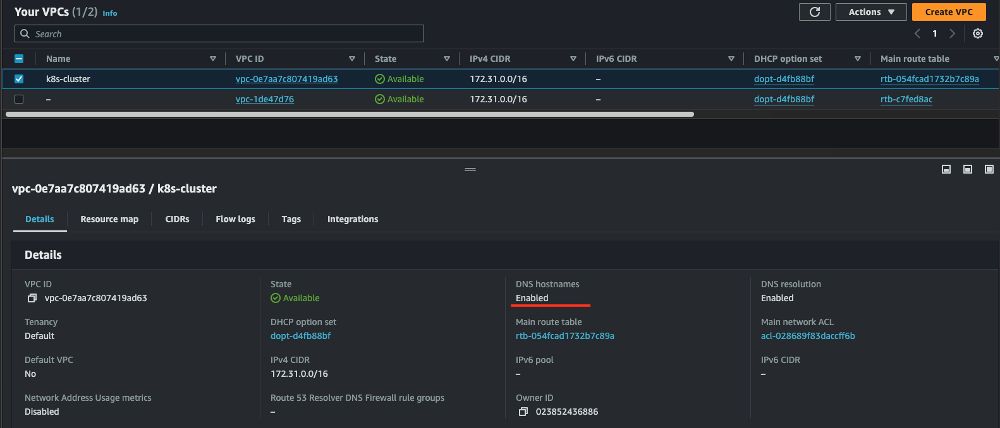
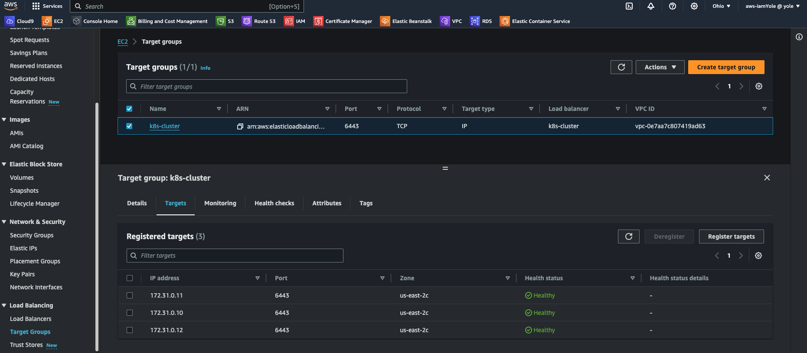

# Container Orchestration with Kubernetes Part 1

In previous projects, we learnt about containers, it's usefulness, and how to containerize applications. In this project, we will be introduce to Container Orchestration and Kubernetes.

## **What is Container Orchestration**

Container Orchestration is the automated management and coordination of containerized applications which involves deploying, scaling, updating, and managing containers across a cluster of servers. There are several container orchestration platforms in the market Kubernetes, Docker Swarm, and Apache Mesos, and these softwares will be responsible for the orchestration of the containers. Kubernetes is the market leader in this category, and that's what we would be working with in this project.

**Kubernetes**, often abbreviated as K8s, is an open-source container orchestration platform originally developed by Google and now maintained by the Cloud Native Computing Foundation (CNCF). Kubernetes provides a platform for orchestrating containers, enabling efficient resource utilization, seamless scaling, and high availability.

### **The Kubernetes architecture**

Kubernetes is designed around a master-slave model, with a master node orchestrating multiple worker nodes.


At the heart of the architecture lies the **Kubernetes master**, which consists of several components:

- **API Server**: The API Server acts as the frontend for the Kubernetes control plane. It validates and processes RESTful API requests, serving as the primary entry point for all administrative tasks.
- **Scheduler**: Responsible for placing containers onto available nodes in the cluster based on resource requirements, workload constraints, and other policies.
- **Controller Manager**: Manages various controllers that regulate the state of the cluster, ensuring that the desired state matches the actual state and initiating corrective actions when necessary.
- **etcd**: A distributed key-value store that stores all cluster data, including configuration details, cluster state, and metadata. It serves as the Kubernetes' backing store for all cluster data.

On the **Kubernetes worker nodes**, the following components run:

- **Kubelet**: An agent that runs on each node and is responsible for communicating with the Kubernetes master. It manages containers on the node, ensuring that they are running and healthy.
- **Kube-proxy**: Maintains network rules on the host and performs connection forwarding for Kubernetes services. It enables communication between services within the cluster and from external clients to services running on the cluster.
- **Container Runtime**: The software responsible for running containers, such as Docker or containerd. It manages the lifecycle of containers, including starting, stopping, and managing their resources.

These components work together to provide the foundation for container orchestration in Kubernetes, enabling the deployment, scaling, and management of containerized applications across clusters of nodes.


I'll recommend you read more about these components and how the function from the Kubernetes official documentation [here](https://kubernetes.io/docs/concepts/overview/components/)

## Installing Kubernetes (k8s) from scratch

Installing and configuring a K8s cluster from scratch in a production or Corporate environment is quite a task especially when considering security and scalability of the environment. Luckily, there are managed versions of k8s already created by some software giants: Amazon Elastic Kubernetes Services (Amazon EKS), Google Kubernetes Engine (GKE) and Azure Kubernetes Services (AKS). There are also open source tools for running k8s locally or in a development environment as minikube, MicroK8s, K3s, etc.

In this project, we will be doing it the hard way initially so as to fully understand each component and how they fit together to form a fully working K8s cluster. As a Kubernetes Administrator, you would be charged with the following responsibilities and more:

1. Install and configure master (also known as control plane) components and worker nodes (or just nodes).
2. Apply security settings across the entire cluster (i.e., encrypting the data in transit, and at rest)
   - In transit encryption means encrypting communications over the network using HTTPS
   - At rest encryption means encrypting the data stored on a disk
3. Plan the capacity for the backend data store etcd
4. Configure network plugins for the containers to communicate
5. Manage periodical upgrade of the cluster
6. Configure observability/monitoring and auditing

`Note: Unless you have any business or compliance restrictions, ALWAYS consider to use managed versions of K8s – Platform as a Service offerings, such as Azure Kubernetes Service (AKS), Amazon Elastic Kubernetes Service (Amazon EKS), or Google Kubernetes Engine (GKE) as they usually have better default security settings, and the costs for maintaining the control plane are very low.`

### Let us begin building out Kubernetes cluster from the ground

**DISCLAIMER**: The following setup of Kubernetes should be used for learning purpose only, and not to be considered for production. This is because setting up a K8s cluster for production use has a lot more moving parts, especially when it comes to planning the nodes, and securing the cluster. The purpose of "K8s From-Ground-Up" is to get you much closer to the different components as shown in the architecture diagram and relate with what you have been learning about Kubernetes.

The following tools and packages would be required in this project:

- Virtual Machines: AWS EC2 (3) One master and 2 nodes
- AWS CLI
- Docker Engine: To build/run individual containers
- kubectl console utility
- cfssl and cfssljson utilities
- Kubernetes cluster

We will be creating 3 EC2 Instances and then make the following configurations:

- SSL/TLS certificates for Kubernetes components to communicate securely
- Configured Node Network
- Configured Pod Network

## Preparing the Setup Environment

The set up environment would be pretty simple. An EC2 Instance running Ubuntu 22 and the software packages listed above.

- Provision an EC2 Instance running Ubuntu 22
- Install the following:
  - sudo apt update
  - sudo apt install awscli -y
  - sudo apt install jq -y  
    `'jq' is a lightweight and flexible command-line tool for parsing, manipulating, and querying JSON data`
- Next, we configure awscli with the necessary credentials

  - run `aws configure` and then provide the details requested by the prompt
  - run `aws ec2 describe-vpcs` to confirm aws has been configured successfully with the right credentials

    

- Install `kubectl`

  - Download the binary file: `wget https://storage.googleapis.com/kubernetes-release/release/v1.21.0/bin/linux/amd64/kubectl`
  - Make it executable: `chmod +x kubectl`
  - Move it to the bin directory, making the command globally recognized in the system: `sudo mv kubectl /usr/local/bin/`
  - Verify `kubectl` has been installed correctly: `kubectl version --short`

    

- Install CFSSL and CFSSLJSON-linux  
  CFSSL is an open source tool by Cloudflare used to setup a Public Key Infrastructure (PKI) for generating, signing and bundling TLS certificates. cfssl will be configured as a Certificate Authority which will issue the certificates required to spin up the Kubernetes cluster.

  > ```bash
  > wget -q --show-progress --https-only --timestamping \
  > https://pkg.cfssl.org/R1.2/cfssl_linux-amd64 \
  > https://pkg.cfssl.org/R1.2/cfssljson_linux-amd64
  >
  > chmod +x cfssl_linux-amd64 cfssljson_linux-amd64
  > sudo mv cfssl_linux-amd64 /usr/local/bin/cfssl
  > sudo mv cfssljson_linux-amd64 /usr/local/bin/cfssljson
  > ```

- Verify it's installation

  > `cfssl version`

  

## Provisioning the AWS Resources using AWSCLI

When working with Kubernetes on AWS, it's often recommended to create the Kubernetes cluster in a separate VPC rather than the default VPC provided by AWS. This recommendation is down to the following reasons:

- **Isolation**: Creating the Kubernetes cluster in a separate VPC provides isolation from other resources in the default VPC. This isolation can enhance security and prevent unintended interactions between resources.
- **Control**: By creating a dedicated VPC for the Kubernetes cluster, you have more control over the network configuration, security settings, and routing policies specific to the cluster's requirements. This allows for better customization and optimization of network resources.
- **Avoiding Conflicts**: Running Kubernetes in a separate VPC helps avoid potential conflicts with existing resources or configurations in the default VPC. It allows you to tailor the network environment specifically for Kubernetes workloads without impacting other AWS resources.

## Creating the VPC and Network resources

Create a directory called `k8s-cluster-from-ground-up`

### Virtual Private Cloud (VPC)

- Create the VPC:
  - `VPC_ID=$(aws ec2 create-vpc --cidr-block 172.31.0.0/16 --output text --query 'Vpc.VpcId')`
- Create a variable called NAME:
  - `NAME=k8s-cluster`
- Create a variable called AWS_REGION:
  - `AWS_REGION=us-east-2`
- Tag the VPC with the name variable:

  - `aws ec2 create-tags --resources ${VPC_ID} --tags Key=Name,Value=${NAME}`

  
  Notice that `DNS` is currently disabled

### Domain Name System – DNS

- Enable DNS support for the VPC:
  - `aws ec2 modify-vpc-attribute --vpc-id ${VPC_ID} --enable-dns-support '{"Value": true}'`
- Enable DNS support for hostnames:

  - `aws ec2 modify-vpc-attribute --vpc-id ${VPC_ID} --enable-dns-hostnames '{"Value": true}'`

  

### Dynamic Host Configuration Protocol – DHCP

DHCP options sets are configurations that allow you to specify custom DHCP options for your AWS Virtual Private Cloud (VPC). These options are used to configure instances with custom DNS servers, domain names, NTP (Network Time Protocol) servers, NetBIOS name servers, and more.

AWS automatically creates and associates a DHCP option set for your VPC upon creation and sets two options: domain-name-servers (defaults to AmazonProvidedDNS) and domain-name (defaults to the domain name for your set region). AmazonProvidedDNS is an Amazon Domain Name System (DNS) server, and this option enables DNS for instances to communicate using DNS names. By default, EC2 instances have fully qualified names like` ip-172-50-197-106.eu-central-1.compute.internal`. But you can set your own configuration using an example below:

> ```bash
> DHCP_OPTION_SET_ID=$(aws ec2 create-dhcp-options \
>  --dhcp-configuration \
>    "Key=domain-name,Values=iamyole.uk.internal" \
>    "Key=domain-name-servers,Values=AmazonProvidedDNS" \
>  --output text --query 'DhcpOptions.DhcpOptionsId')
> ```

- Create a tag for the `DHCP Option Set`
  - `aws ec2 create-tags  --resources ${DHCP_OPTION_SET_ID} --tags Key=Name,Value=${NAME}`
- Associate the DHCP Option set with the VPC

  - `aws ec2 associate-dhcp-options --dhcp-options-id ${DHCP_OPTION_SET_ID} --vpc-id ${VPC_ID}`

  

### Subnet

- Create the a Subnet for the VPC
  > ```bash
  > SUBNET_ID=$(aws ec2 create-subnet \
  > --vpc-id ${VPC_ID} \
  > --cidr-block 172.31.0.0/24 \
  > --output text --query 'Subnet.SubnetId')
  > ```
- Tag the subnet

  - `aws ec2 create-tags  --resources ${SUBNET_ID}  --tags Key=Name,Value=${NAME}`

  

### Internet Gateway (IGW)

- Create the Internet Gateway and attach it to the VPC

  > ```bash
  > INTERNET_GATEWAY_ID=$(aws ec2 create-internet-gateway \
  > --output text --query 'InternetGateway.InternetGatewayId')
  > aws ec2 create-tags \
  > --resources ${INTERNET_GATEWAY_ID} \
  > --tags Key=Name,Value=${NAME}
  > ```

- Attach it to the VPC

  > ```bash
  > aws ec2 attach-internet-gateway \
  > --internet-gateway-id ${INTERNET_GATEWAY_ID} \
  > --vpc-id ${VPC_ID}
  > ```

  

### Route tables

- Create route tables, associate the route table to subnet, and create a route to allow external traffic to the Internet through the Internet Gateway.

  > ```bash
  > ROUTE_TABLE_ID=$(aws ec2 create-route-table \
  > --vpc-id ${VPC_ID} \
  > --output text --query 'RouteTable.RouteTableId')
  > aws ec2 create-tags \
  > --resources ${ROUTE_TABLE_ID} \
  > --tags Key=Name,Value=${NAME}
  > aws ec2 associate-route-table \
  > --route-table-id ${ROUTE_TABLE_ID} \
  > --subnet-id ${SUBNET_ID}
  > aws ec2 create-route \
  > --route-table-id ${ROUTE_TABLE_ID} \
  > --destination-cidr-block 0.0.0.0/0 \
  > --gateway-id ${INTERNET_GATEWAY_ID}
  > ```

  

### Creating the Security Groups

- Configure security groups

  > ```bash
  > # Create the security group and store its ID in a variable
  > SECURITY_GROUP_ID=$(aws ec2 create-security-group \
  > --group-name ${NAME} \
  > --description "Kubernetes cluster security group" \
  > --vpc-id ${VPC_ID} \
  > --output text --query 'GroupId')
  >
  > # Create the NAME tag for the security group
  > aws ec2 create-tags \
  > --resources ${SECURITY_GROUP_ID} \
  > --tags Key=Name,Value=${NAME}
  >
  > # Create Inbound traffic for all communication within the subnet to connect on ports used by the master node(s)
  > aws ec2 authorize-security-group-ingress \
  > --group-id ${SECURITY_GROUP_ID} \
  > --ip-permissions IpProtocol=tcp,FromPort=2379,ToPort=2380,IpRanges='[{CidrIp=172.31.0.0/24}]'
  >
  > # Create Inbound traffic for all communication within the subnet to connect on ports used by the worker nodes
  > aws ec2 authorize-security-group-ingress \
  > --group-id ${SECURITY_GROUP_ID} \
  > --ip-permissions IpProtocol=tcp,FromPort=30000,ToPort=32767,IpRanges='[{CidrIp=172.31.0.0/24}]'
  >
  > # Create inbound traffic to allow connections to the Kubernetes API Server listening on port 6443
  > aws ec2 authorize-security-group-ingress \
  > --group-id ${SECURITY_GROUP_ID} \
  > --protocol tcp \
  > --port 6443 \
  > --cidr 0.0.0.0/0
  >
  > # Create Inbound traffic for SSH from anywhere (Do not do this in production. Limit access ONLY to IPs or CIDR that MUST connect)
  > aws ec2 authorize-security-group-ingress \
  > --group-id ${SECURITY_GROUP_ID} \
  > --protocol tcp \
  > --port 22 \
  > --cidr 0.0.0.0/0
  >
  > # Create ICMP ingress for all types
  > aws ec2 authorize-security-group-ingress \
  > --group-id ${SECURITY_GROUP_ID} \
  > --protocol icmp \
  > --port -1 \
  > --cidr 0.0.0.0/0
  > ```

  

### Network Load Balancer

- Create a network Load balancer

  > ```bash
  > LOAD_BALANCER_ARN=$(aws elbv2 create-load-balancer \
  > --name ${NAME} \
  > --subnets ${SUBNET_ID} \
  > --scheme internet-facing \
  > --type network \
  > --output text --query 'LoadBalancers[].LoadBalancerArn')
  > ```

  

### Tagret Group

- Create a target group
  > ```bash
  > TARGET_GROUP_ARN=$(aws elbv2 create-target-group \
  > --name ${NAME} \
  > --protocol TCP \
  > --port 6443 \
  > --vpc-id ${VPC_ID} \
  > --target-type ip \
  > --output text --query 'TargetGroups[].TargetGroupArn')
  > ```
- Register targets: We haven't provisioned the nodes so we will be using dummy ip address as the targets for now
  - `aws elbv2 register-targets --target-group-arn ${TARGET_GROUP_ARN} --targets Id=172.31.0.1{0,1,2}`
- Create a listener to listen for requests and forward to the target nodes on TCP port 6443. TCP port 6443 is typically associated with the Kubernetes API server

  > ```bash
  > aws elbv2 create-listener \
  > --load-balancer-arn ${LOAD_BALANCER_ARN} \
  > --protocol TCP \
  > --port 6443 \
  > --default-actions Type=forward,TargetGroupArn=${TARGET_GROUP_ARN} \
  > --output text --query 'Listeners[].ListenerArn'
  > ```

  

### K8s Public Address

- Get the DNS Name for the network load balancer and store it in a variable called `KUBERNETES_PUBLIC_ADDRESS`

  > ```bash
  > KUBERNETES_PUBLIC_ADDRESS=$(aws elbv2 describe-load-balancers \
  >       --load-balancer-arns ${LOAD_BALANCER_ARN} \
  >       --output text --query 'LoadBalancers[].DNSName')
  > ```

  

## Create The Compute Resources

- Get an image to create EC2 instances

  > ```bash
  > IMAGE_ID=$(aws ec2 describe-images --owners 099720109477 \
  >       --filters \
  >       'Name=root-device-type,Values=ebs' \
  >       'Name=architecture,Values=x86_64' \
  >       'Name=name,Values=ubuntu-pro-server/images/hvm-ssd/ubuntu-xenial-16.04-amd64-pro-server-20221202' \
  > | jq -r '.Images|sort_by(.Name)[-1]|.ImageId')
  > ```

  Let's breakdown the code above. The script above obtains the latest AMI for Ubuntu, and store the value in a variable called `IMAGE_ID`. This piece of code `| jq -r '.Images|sort_by(.Name)[-1]|.ImageId':` pipes the output of the aws ec2 describe-images command to `jq`. The `jq`, a command-line JSON processor parses and manipulates the output of the aws describe-image command to obtain the specific AMI.

  

- Create SSH Key-Pair
  > ```bash
  > mkdir -p ssh
  >
  > aws ec2 create-key-pair \
  >    --key-name ${NAME} \
  >    --output text --query 'KeyMaterial' \
  >    >ssh/${NAME}.id_rsa
  > chmod 400 ssh/${NAME}.id_rsa
  > ```

### EC2 Instances for Controle Plane (Master Nodes)

- Create 3 Master nodes: Note – Using t2.micro instead of t2.small as t2.micro is covered by AWS free tier
  > ```bash
  > for i in 0 1 2; do
  >   instance_id=$(aws ec2 run-instances \
  >       --associate-public-ip-address \
  >       --image-id ${IMAGE_ID} \
  >       --count 1 \
  >       --key-name ${NAME} \
  >       --security-group-ids ${SECURITY_GROUP_ID} \
  >       --instance-type t2.micro \
  >       --private-ip-address 172.31.0.1${i} \
  >       --user-data "name=master-${i}" \
  >       --subnet-id ${SUBNET_ID} \
  >       --output text --query 'Instances[].InstanceId')
  >   aws ec2 modify-instance-attribute \
  >       --instance-id ${instance_id} \
  >       --no-source-dest-check
  >   aws ec2 create-tags \
  >       --resources ${instance_id} \
  >       --tags "Key=Name,Value=${NAME}-master-${i}"
  > done
  > ```

### EC2 Instances for Worker Nodes

- Create 3 worker nodes:

  > ```bash
  > for i in 0 1 2; do
  >   instance_id=$(aws ec2 run-instances \
  >       --associate-public-ip-address \
  >       --image-id ${IMAGE_ID} \
  >       --count 1 \
  >       --key-name ${NAME} \
  >       --security-group-ids ${SECURITY_GROUP_ID} \
  >       --instance-type t2.micro \
  >       --private-ip-address 172.31.0.2${i} \
  >       --user-data "name=worker-${i}|pod-cidr=172.20.${i}.0/24" \
  >       --subnet-id ${SUBNET_ID} \
  >       --output text --query 'Instances[].InstanceId')
  >   aws ec2 modify-instance-attribute \
  >       --instance-id ${instance_id} \
  >       --no-source-dest-check
  >   aws ec2 create-tags \
  >       --resources ${instance_id} \
  >       --tags "Key=Name,Value=${NAME}-worker-${i}"
  > done
  > ```

  
  From the screenshot above, we can see we have three(3) Master nodes and three(3) worker nodes running.

  ### Recap

  So far, we've setup the lab environment by provisioning an EC2 Instance. We then installed AWS CLI to provision the servers that the k8s cluster would run on as as well installed cfssl and cfssljson utilities to configure the security settings for the cluster. For the infrastructure, the following has been created with aws cli: - VPC - Subnet - Internet Gateway - Routes and Route Tables associated with the subnet - Network Load balancer - Target groups - Security groups - Security Key - 6 EC2 Instances (3 for the control node and 3 for the worker nodes)

Now let's start configuring the Kubernetes of the infrastructure.

## Creating the Self-Signed Certificate and General TLS Certificate

Referring back to the diagram on Kubernetes Architecture.


The components in the Master node all requires TLS Certificates to function. While for the worker node, the `kubelet` and `kube-proxy` also requires TLS Certificates.

Using `cfssl`, let's provision a Private Key infrastructure (PKI) which will have a Certificate Authority (CA). The CA will generate certificates for all the individual components.

### Self-Signed Root Certificate Authority (CA)

- Create a directory and switch into it:
  - `mkdir ca-authority && cd ca-authority`
- Generate the CA configuration file, Root Certificate, and Private key:
  > ```bash
  > {
  >
  >   cat > ca-config.json <<EOF
  >       {
  >           "signing": {
  >           "default": {
  >               "expiry": "8760h"
  >           },
  >           "profiles": {
  >               "kubernetes": {
  >               "usages": ["signing", "key encipherment", "server auth", "client auth"],
  >               "expiry": "8760h"
  >               }
  >           }
  >       }
  > }
  > EOF
  >
  >   cat > ca-csr.json <<EOF
  >       {
  >           "CN": "Kubernetes",
  >           "key": {
  >               "algo": "rsa",
  >               "size": 2048
  >           },
  >           "names": [
  >           {
  >               "C": "UK",
  >               "L": "England",
  >               "O": "Ytech",
  >               "OU": "DEVOPS",
  >               "ST": "London"
  >           }]
  >       }
  > EOF
  >
  >   cfssl gencert -initca ca-csr.json | cfssljson -bare ca
  >
  > }
  > ```

The file defines the following

- CN – Common name for the authority
- algo – the algorithm used for the certificates
- size – algorithm size in bits
- C – Country
- L – Locality (city)
- ST – State or province
- O – Organization
- OU – Organizational Unit


- View the certificates creates

  - Ensure you are in the **ca-authority** directory, and the run the command: `ls -l `

  

- The 3 important files here are:
  - ca.pem – The Root Certificate
  - ca-key.pem – The Private Key
  - ca.csr – The Certificate Signing Request

### Generating TLS Certificates For Client and Server

We also need to create Client/Server certificates for all the components. It is \***\*MANDATORY\*\*** for all the network communications within the cluster are encrypted. The server in this instance are the master nodes running the api-server component. While the client is every other component that needs to communicate with the api-server.

Now we have a certificate for the Root CA, we can then begin to request more certificates which the different Kubernetes components, i.e. clients and server, will use to have encrypted communication.

### Let us begin with the Kubernetes API-Server Certificate and Private Key

The certificate for the Api-server must have IP addresses, DNS names, and a Load Balancer address included. Otherwise, we may encounter lot of difficulties connecting to the api-server.

- Generate the Certificate Signing Request (CSR), Private Key and the Certificate for the Kubernetes Master Nodes.
  > ```bash
  > {
  >   cat > master-kubernetes-csr.json <<EOF
  >       {
  >           "CN": "kubernetes",
  >               "hosts": [
  >                   "127.0.0.1",
  >                   "172.31.0.10",
  >                   "172.31.0.11",
  >                   "172.31.0.12",
  >                   "ip-172-31-0-10",
  >                   "ip-172-31-0-11",
  >                   "ip-172-31-0-12",
  >                   "ip-172-31-0-10.${AWS_REGION}.compute.internal",
  >                   "ip-172-31-0-11.${AWS_REGION}.compute.internal",
  >                   "ip-172-31-0-12.${AWS_REGION}.compute.internal",
  >                   "${KUBERNETES_PUBLIC_ADDRESS}",
  >                   "kubernetes",
  >                   "kubernetes.default",
  >                   "kubernetes.default.svc",
  >                   "kubernetes.default.svc.cluster",
  >                   "kubernetes.default.svc.cluster.local"],
  >           "key": {
  >                   "algo": "rsa",
  >                   "size": 2048},
  >           "names": [{
  >                    "C": "UK",
  >                    "L": "England",
  >                    "O": "Ytech",
  >                    "OU": "DEVOPS",
  >                    "ST": "London"}]
  >       }
  > EOF
  >
  >   cfssl gencert \
  >       -ca=ca.pem \
  >       -ca-key=ca-key.pem \
  >       -config=ca-config.json \
  >       -profile=kubernetes \
  >   master-kubernetes-csr.json | cfssljson -bare master-kubernetes
  > }
  > ```


### Kubernetes API-Server Certificate and Private Key

> ```bash
> {
>   cat > kube-scheduler-csr.json <<EOF
>       {
>           "CN": "system:kube-scheduler",
>           "key": {
>               "algo": "rsa",
>               "size": 2048
>               },
>           "names": [
>               {
>                   "C": "UK",
>                   "L": "England",
>                   "O": "system:kube-scheduler",
>                   "OU": "DEVOPS",
>                   "ST": "London"
>               }]
>       }
> EOF
>
>   cfssl gencert \
>       -ca=ca.pem \
>       -ca-key=ca-key.pem \
>       -config=ca-config.json \
>       -profile=kubernetes \
>   kube-scheduler-csr.json | cfssljson -bare kube-scheduler
>
> }
> ```


### kube-proxy Client Certificate and Private Key

> ```bash
> {
>
>   cat > kube-proxy-csr.json <<EOF
>       {
>           "CN": "system:kube-proxy",
>           "key": {
>               "algo": "rsa",
>               "size": 2048
>               },
>           "names": [
>               {
>                   "C": "UK",
>                   "L": "England",
>                   "O": "system:node-proxier",
>                   "OU": "DEVOPS",
>                   "ST": "London"
>               }]
>       }
> EOF
>
>   cfssl gencert \
>       -ca=ca.pem \
>       -ca-key=ca-key.pem \
>       -config=ca-config.json \
>       -profile=kubernetes \
>   kube-proxy-csr.json | cfssljson -bare kube-proxy
>
> }
> ```


### kube-controller-manager Client Certificate and Private Key

> ```bash
> {
>   cat > kube-controller-manager-csr.json <<EOF
>       {
>           "CN": "system:kube-controller-manager",
>           "key": {
>               "algo": "rsa",
>               "size": 2048
>             },
>           "names": [
>               {
>                   "C": "UK",
>                   "L": "England",
>                   "O": "system:kube-controller-manager",
>                   "OU": "DEVOPS",
>                   "ST": "London"
>               }]
>       }
> EOF
>
>   cfssl gencert \
>       -ca=ca.pem \
>       -ca-key=ca-key.pem \
>       -config=ca-config.json \
>       -profile=kubernetes \
>   kube-controller-manager-csr.json | cfssljson -bare kube-controller-manager
>
> }
> ```


### kubelet Client Certificate and Private Key

Similar to how we configured the api-server's certificate, Kubernetes requires that the hostname of each worker node is included in the client certificate. Kubernetes also uses a special-purpose authorization mode called Node Authorizer, that specifically authorizes API requests made by kubelet services.

In order to be authorized by the Node Authorizer, kubelets must use a credential that identifies them as being in the system:nodes group, with a username of system:node:{nodeName}. Notice the "CN": "system:node:${instance_hostname}", in the below code.

Therefore, the certificate to be created must comply to these requirements. In the below example, there are 3 worker nodes, hence we will use bash to loop through a list of the worker nodes’ hostnames, and based on each index, the respective Certificate Signing Request (CSR), private key and client certificates will be generated.

> ```bash
> for i in 0 1 2; do
>  instance="${NAME}-worker-${i}"
>  instance_hostname="ip-172-31-0-2${i}"
>  cat > ${instance}-csr.json <<EOF
>   {
>       "CN": "system:node:${instance_hostname}",
>       "key": {
>           "algo": "rsa",
>           "size": 2048
>          },
>       "names": [
>           {
>               "C": "UK",
>               "L": "England",
>               "O": "system:nodes",
>               "OU": "DEVOPS",
>               "ST": "London"
>           }]
>    }
> EOF
>
>  external_ip=$(aws ec2 describe-instances \
>    --filters "Name=tag:Name,Values=${instance}" \
>    --output text --query 'Reservations[].Instances[].PublicIpAddress')
>
>  internal_ip=$(aws ec2 describe-instances \
>    --filters "Name=tag:Name,Values=${instance}" \
>    --output text --query 'Reservations[].Instances[].PrivateIpAddress')
>
>  cfssl gencert \
>    -ca=ca.pem \
>    -ca-key=ca-key.pem \
>    -config=ca-config.json \
>    -hostname=${instance_hostname},${external_ip},${internal_ip} \
>    -profile=kubernetes \
>    ${NAME}-worker-${i}-csr.json | cfssljson -bare ${NAME}-worker-${i}
> done
> ```


### kubernetes admin user's Client Certificate and Private Key

> ```bash
> {
>   cat > admin-csr.json <<EOF
>       {
>           "CN": "admin",
>           "key": {
>               "algo": "rsa",
>               "size": 2048
>             },
>           "names": [
>               {
>                   "C": "UK",
>                   "L": "England",
>                   "O": "system:masters",
>                   "OU": "DEVOPS",
>                   "ST": "London"
>               }]
>       }
> EOF
>
>   cfssl gencert \
>       -ca=ca.pem \
>       -ca-key=ca-key.pem \
>       -config=ca-config.json \
>       -profile=kubernetes \
>   admin-csr.json | cfssljson -bare admin
> }
> ```


### Token Controller Client Certificate and Private Key

The last key pair that needs to be created is for the Token Controller. A Token Controller is the component responsible for managing service account tokens within the cluster. Service accounts are identities used by applications running within Kubernetes pods to authenticate with the Kubernetes API server and perform actions on the cluster. Read more about Service Accounts from the official documentation.

> ```bash
> {
>
>   cat > service-account-csr.json <<EOF
>       {
>           "CN": "service-accounts",
>           "key": {
>               "algo": "rsa",
>               "size": 2048
>             },
>           "names": [
>               {
>                   "C": "UK",
>                   "L": "England",
>                   "O": "Kubernetes",
>                   "OU": "DAREY.IO DEVOPS",
>                   "ST": "London"
>               }]
>       }
> EOF
>
>   cfssl gencert \
>       -ca=ca.pem \
>       -ca-key=ca-key.pem \
>       -config=ca-config.json \
>       -profile=kubernetes \
>   service-account-csr.json | cfssljson -bare service-account
> }
> ```


List of Certificate Key Pairs created so far:


## Distributing the Client and Server Certificates

In the previous section, we created several certificates for the different components of the k8r cluster. In this section, we would me moving these certificates to where they belong.

Let us begin with the worker nodes:

Using Secure Copy (SCP), opy these files to the **Worker Nsodes**

- Root CA certificate – ca.pem
- X509 Certificate for each worker node
- Private Key of the certificate for each worker node

> ```bash
> for i in 0 1 2; do
>  instance="${NAME}-worker-${i}"
>  external_ip=$(aws ec2 describe-instances \
>    --filters "Name=tag:Name,Values=${instance}" \
>    --output text --query 'Reservations[].Instances[].PublicIpAddress')
>
>  scp -i ../ssh/${NAME}.id_rsa \
>    ca.pem ${instance}-key.pem ${instance}.pem ubuntu@${external_ip}:~/; \
> done
> ```

Using Secure Copy (SCP), copy the api-server related files to the **Master Nodes**.

> ```bash
> for i in 0 1 2; do
> instance="${NAME}-master-${i}" \
>  external_ip=$(aws ec2 describe-instances \
>    --filters "Name=tag:Name,Values=${instance}" \
>    --output text --query 'Reservations[].Instances[].PublicIpAddress')
>  scp -i ../ssh/${NAME}.id_rsa \
>    ca.pem ca-key.pem service-account-key.pem service-account.pem \
>    master-kubernetes.pem master-kubernetes-key.pem ubuntu@${external_ip}:~/;
> done
> ```

The kube-proxy, kube-controller-manager, kube-scheduler, and kubelet client certificates will be used to generate client authentication configuration files later.

        We can ssh to the individual nodes to confirm the certificates have been copied into the nodes.

## Use KUBECTL to Generate the Configuration files for Authentication

In this step, we will create some files known as kubeconfig, which enables Kubernetes clients to locate and be authenticated by the Kubernetes API Servers. We will need a client tool called kubectl to do this.

Now it’s time to generate kubeconfig files for the kubelet, controller manager, kube-proxy, and scheduler clients and then the admin user.

First, let us create a few environment variables for reuse by multiple commands.

> ```bash
> KUBERNETES_API_SERVER_ADDRESS=$(aws elbv2 describe-load-balancers \
>   --load-balancer-arns ${LOAD_BALANCER_ARN} \
>   --output text --query 'LoadBalancers[].DNSName')
> ```

- Generate the kubelet kubeconfig file  
  For each of the nodes running the kubelet component, it is very important that the client certificate configured for that node is used to generate the kubeconfig. This is because each certificate has the node’s DNS name or IP Address configured at the time the certificate was generated. It will also ensure that the appropriate authorization is applied to that node through the Node Authorizer.

      Each kubeconfig outside of the master nodes like the kubelet, kube-proxy and admin requires a Kubernetes API Server to connect to while the ones within the control nodes just need to connect with the localhost (loop back) address. To support high availability the IP address assigned to the external load balancer fronting the Kubernetes API Servers will be used.

Below command must be run in the directory where all the certificates were generated.

> ```bash
> for i in 0 1 2; do
>
> instance="${NAME}-worker-${i}"
> instance_hostname="ip-172-31-0-2${i}"
>
> # Set the kubernetes cluster in the kubeconfig file
>  kubectl config set-cluster ${NAME} \
>    --certificate-authority=ca.pem \
>    --embed-certs=true \
>    --server=https://$KUBERNETES_API_SERVER_ADDRESS:6443 \
>    --kubeconfig=${instance}.kubeconfig
>
> # Set the cluster credentials in the kubeconfig file
>  kubectl config set-credentials system:node:${instance_hostname} \
>    --client-certificate=${instance}.pem \
>    --client-key=${instance}-key.pem \
>    --embed-certs=true \
>    --kubeconfig=${instance}.kubeconfig
>
> # Set the context in the kubeconfig file
>  kubectl config set-context default \
>    --cluster=${NAME} \
>    --user=system:node:${instance_hostname} \
>    --kubeconfig=${instance}.kubeconfig
>
>  kubectl config use-context default --kubeconfig=${instance}.kubeconfig
> done
> ```


List the output

- `ls -ltr *.kubeconfig`


Open up the kubeconfig files generated and review the 3 different sections that have been configured:

- Cluster
- Credentials
- And Kube Context

Kubeconfig file is used to organize information about clusters, users, namespaces and authentication mechanisms. By default, kubectl looks for a file named config in the $HOME/.kube directory. You can specify other kubeconfig files by setting the KUBECONFIG environment variable or by setting the --kubeconfig flag. To get to know more how to create your own kubeconfig files – read this documentation - https://kubernetes.io/docs/concepts/configuration/organize-cluster-access-kubeconfig/.

Context part of kubeconfig file defines three main parameters: cluster, namespace and user. You can save several different contexts with any convenient names and switch between them when needed.

- Generate the kube-proxy kubeconfig

  > ```bash
  > {
  >  kubectl config set-cluster ${NAME} \
  >    --certificate-authority=ca.pem \
  >    --embed-certs=true \
  >    --server=https://${KUBERNETES_API_SERVER_ADDRESS}:6443 \
  >    --kubeconfig=kube-proxy.kubeconfig
  >
  >  kubectl config set-credentials system:kube-proxy \
  >    --client-certificate=kube-proxy.pem \
  >    --client-key=kube-proxy-key.pem \
  >    --embed-certs=true \
  >    --kubeconfig=kube-proxy.kubeconfig
  >
  >  kubectl config set-context default \
  >    --cluster=${NAME} \
  >    --user=system:kube-proxy \
  >    --kubeconfig=kube-proxy.kubeconfig
  >
  >  kubectl config use-context default --kubeconfig=kube-proxy.kubeconfig
  > }
  > ```

  

- Generate the Kube-Controller-Manager kubeconfig  
  Notice that the --server is set to use 127.0.0.1. This is because, this component runs on the API-Server so there is no point routing through the Load Balancer.
  > ```bash
  > {
  >  kubectl config set-cluster ${NAME} \
  >    --certificate-authority=ca.pem \
  >    --embed-certs=true \
  >    --server=https://127.0.0.1:6443 \
  >    --kubeconfig=kube-controller-manager.kubeconfig
  >
  >  kubectl config set-credentials system:kube-controller-manager \
  >    --client-certificate=kube-controller-manager.pem \
  >    --client-key=kube-controller-manager-key.pem \
  >    --embed-certs=true \
  >    --kubeconfig=kube-controller-manager.kubeconfig
  >
  >  kubectl config set-context default \
  >    --cluster=${NAME} \
  >    --user=system:kube-controller-manager \
  >    --kubeconfig=kube-controller-manager.kubeconfig
  >
  >  kubectl config use-context default --kubeconfig=kube-controller-manager.kubeconfig
  > }
  > ```


- Generating the Kube-Scheduler Kubeconfig
  > ```bash
  > {
  >  kubectl config set-cluster ${NAME} \
  >    --certificate-authority=ca.pem \
  >    --embed-certs=true \
  >    --server=https://127.0.0.1:6443 \
  >    --kubeconfig=kube-scheduler.kubeconfig
  >
  >  kubectl config set-credentials system:kube-scheduler \
  >    --client-certificate=kube-scheduler.pem \
  >    --client-key=kube-scheduler-key.pem \
  >    --embed-certs=true \
  >    --kubeconfig=kube-scheduler.kubeconfig
  >
  >  kubectl config set-context default \
  >    --cluster=${NAME} \
  >    --user=system:kube-scheduler \
  >    --kubeconfig=kube-scheduler.kubeconfig
  >
  >  kubectl config use-context default --kubeconfig=kube-scheduler.kubeconfig
  > }
  > 
  > ```

Finally, generate the kubeconfig file for the admin user
Configuring kubectl for Remote Access. We will be generating a kubeconfig file for the kubectl command line utility based on the admin user credentials.

Each kubeconfig requires a Kubernetes API Server to connect to. To support high availability the IP address assigned to the external load balancer fronting the Kubernetes API Servers will be used.

> ```bash
> {
>  kubectl config set-cluster ${NAME} \
>    --certificate-authority=ca.pem \
>    --embed-certs=true \
>    --server=https://${KUBERNETES_API_SERVER_ADDRESS}:6443 \
>    --kubeconfig=admin.kubeconfig
>
>  kubectl config set-credentials admin \
>    --client-certificate=admin.pem \
>    --client-key=admin-key.pem \
>    --embed-certs=true \
>    --kubeconfig=admin.kubeconfig
>
>  kubectl config set-context default \
>    --cluster=${NAME} \
>    --user=admin \
>    --kubeconfig=admin.kubeconfig
>
>  kubectl config use-context default --kubeconfig=admin.kubeconfig
> }
> ```


Next, we need to distribute the files to their respective servers, using scp and a for loop like we have done previously.

> ```bash
> for i in 0 1 2; do
>  instance="${NAME}-worker-${i}"
>  external_ip=$(aws ec2 describe-instances \
>    --filters "Name=tag:Name,Values=${instance}" \
>    --output text --query 'Reservations[].Instances[].PublicIpAddress')
>  scp -i ../ssh/${NAME}.id_rsa \
>    ${instance}.kubeconfig kube-proxy.kubeconfig ubuntu@${external_ip}:~/; \
> done
> ```

> ```bash
> for i in 0 1 2; do
> instance="${NAME}-master-${i}" \
>  external_ip=$(aws ec2 describe-instances \
>    --filters "Name=tag:Name,Values=${instance}" \
>    --output text --query 'Reservations[].Instances[].PublicIpAddress')
>  scp -i ../ssh/${NAME}.id_rsa \
>    kube-scheduler.kubeconfig kube-controller-manager.kubeconfig admin.kubeconfig ubuntu@${external_ip}:~/;
> done
> ```


## Preparing the ETCD Database for Encryption at REST

Kubernetes uses etcd (A distributed key value store) to store variety of data which includes the cluster state, application configurations, and secrets. By default, the data that is being persisted to the disk is not encrypted. Any attacker that is able to gain access to this database can exploit the cluster since the data is stored in plain text. Hence, it is a security risk for Kubernetes that needs to be addressed.

To mitigate this risk, we must prepare to encrypt etcd at rest. "At rest" means data that is stored and persists on a disk. Anytime you hear "in-flight" or "in transit" refers to data that is being transferred over the network. "In-flight" encryption is done through TLS.

### Generate the encryption key and encode it using base64

`ETCD_ENCRYPTION_KEY=$(head -c 32 /dev/urandom | base64)`

**Create an encryption-config.yaml file as documented officially by kubernetes**

> ```bash
> cat > encryption-config.yaml <<EOF
> kind: EncryptionConfig
> apiVersion: v1
> resources:
>  - resources:
>      - secrets
>    providers:
>      - aescbc:
>          keys:
>            - name: key1
>              secret: ${ETCD_ENCRYPTION_KEY}
>      - identity: {}
> EOF
> ```

**Send the encryption file to the Controller nodes using SCP and a For Loop.**

> ```bash
> for i in 0 1 2; do
> instance="${NAME}-master-${i}" \
>  external_ip=$(aws ec2 describe-instances \
>    --filters "Name=tag:Name,Values=${instance}" \
>    --output text --query 'Reservations[].Instances[].PublicIpAddress')
>  scp -i ../ssh/${NAME}.id_rsa \
>    encryption-config.yaml ubuntu@${external_ip}:~/;
> done
> ```

## Bootstrap etcd cluster

The primary purpose of the etcd component is to store the state of the cluster. This is because Kubernetes itself is stateless. Therefore, all its stateful data will persist in etcd. Since Kubernetes is a distributed system – it needs a distributed storage to keep persistent data in it. etcd is a highly-available key value store that fits the purpose. All K8s cluster configurations are stored in a form of key value pairs in etcd, it also stores the actual and desired states of the cluster. etcd cluster is intelligent enough to watch for changes made on one instance and almost instantly replicate those changes to the rest of the instances, so all of them will be always reconciled.

- SSH into each control pane
- Download and install etcd in each of the control panes
  > ```bash
  > wget -q --show-progress --https-only --timestamping \
  > "https://github.com/etcd-io/etcd/releases/download/v3.4.27/etcd-v3.4.27-linux-amd64.tar.gz"
  > ```
- Extract and install the etcd server and the etcdctl command line utility
  > ```bash
  > {
  >   tar -xvf etcd-v3.4.27-linux-amd64.tar.gz
  >   sudo mv etcd-v3.4.27-linux-amd64/etcd* /usr/local/bin/
  > }
  > ```
- Configure the etcd servers
  > ```bash
  > {
  >   sudo mkdir -p /etc/etcd /var/lib/etcd
  >   sudo chmod 700 /var/lib/etcd
  >   sudo cp ca.pem master-kubernetes-key.pem master-kubernetes.pem /etc/etcd/
  > }
  > ```
- The instance internal IP address will be used to serve client requests and communicate with etcd cluster peers. Retrieve the internal IP address for the current compute instance:
  - `export INTERNAL_IP=$(curl -s http://169.254.169.254/latest/meta-data/local-ipv4)`
- Each etcd member must have a unique name within an etcd cluster. Set the etcd name to node Private IP address so it will uniquely identify the machine:

  > ```bash
  > ETCD_NAME=$(curl -s http://169.254.169.254/latest/user-data/ \
  > | tr "|" "\n" | grep "^name" | cut -d"=" -f2)
  >
  > echo ${ETCD_NAME}
  > ```

  

  

  

- Create the etcd.service systemd unit file

  > ```bash
  > cat <<EOF | sudo tee /etc/systemd/system/etcd.service
  > [Unit]
  > Description=etcd
  > Documentation=https://github.com/coreos
  >
  > [Service]
  > Type=notify
  > ExecStart=/usr/local/bin/etcd \\
  >  --name ${ETCD_NAME} \\
  >  --trusted-ca-file=/etc/etcd/ca.pem \\
  >  --peer-trusted-ca-file=/etc/etcd/ca.pem \\
  >  --peer-client-cert-auth \\
  >  --client-cert-auth \\
  >  --listen-peer-urls https://${INTERNAL_IP}:2380 \\
  >  --listen-client-urls https://${INTERNAL_IP}:2379,https://127.0.0.1:2379 \\
  >  --advertise-client-urls https://${INTERNAL_IP}:2379 \\
  >  --initial-cluster-token etcd-cluster-0 \\
  >  --initial-cluster master-0=https://172.31.0.10:2380,master-1=https://172.31.0.11:2380,master-2=https://172.31.0.12:2380 \\
  >  --cert-file=/etc/etcd/master-kubernetes.pem \\
  >  --key-file=/etc/etcd/master-kubernetes-key.pem \\
  >  --peer-cert-file=/etc/etcd/master-kubernetes.pem \\
  >  --peer-key-file=/etc/etcd/master-kubernetes-key.pem \\
  >  --initial-advertise-peer-urls https://${INTERNAL_IP}:2380 \\
  >  --initial-cluster-state new \\
  >  --data-dir=/var/lib/etcd
  > Restart=on-failure
  > RestartSec=5
  >
  > [Install]
  > WantedBy=multi-user.target
  > EOF
  >
  > ```

- Start and enable the etcd service on all control panes
  > ```bash
  > {
  >   sudo systemctl daemon-reload
  >   sudo systemctl enable etcd
  >   sudo systemctl start etcd
  > }
  > ```
- Verify the etcd installation on all control panes

  > ```bash
  > sudo ETCDCTL_API=3 etcdctl member list \
  >  --endpoints=https://127.0.0.1:2379 \
  >  --cacert=/etc/etcd/ca.pem \
  >  --cert=/etc/etcd/master-kubernetes.pem \
  >  --key=/etc/etcd/master-kubernetes-key.pem
  > ```

  
  The output should be the same on each control node

- Verify the etcd service is running on each control node:

  - `sudo systemctl status etcd`

  

  

  

## Bootstrap the Control Pane

- Still in the control panes, create the Kubernetes configuration directory
  - `sudo mkdir -p /etc/kubernetes/config`
- Download the official Kubernetes release binaries:
  > ```bash
  > wget -q --show-progress --https-only --timestamping \
  >   "https://storage.googleapis.com/kubernetes-release/release/v1.21.0/bin/linux/amd64/kube-apiserver" \
  >   "https://storage.googleapis.com/kubernetes-release/release/v1.21.0/bin/linux/amd64/kube-controller-manager" \
  >   "https://storage.googleapis.com/kubernetes-release/release/v1.21.0/bin/linux/amd64/kube-scheduler" \
  >   "https://storage.googleapis.com/kubernetes-release/release/v1.21.0/bin/linux/amd64/kubectl"
  > ```
- Install the Kubernetes binaries:
  > ```bash
  > {
  >   chmod +x kube-apiserver kube-controller-manager kube-scheduler kubectl
  >   sudo mv kube-apiserver kube-controller-manager kube-scheduler kubectl /usr/local/bin/
  > }
  > ```
- Configure the Kubernetes API Server:

  > ```bash
  > {
  >   sudo mkdir -p /var/lib/kubernetes/
  >
  >   sudo mv ca.pem ca-key.pem master-kubernetes-key.pem master-kubernetes.pem \
  >   service-account-key.pem service-account.pem \
  >   encryption-config.yaml /var/lib/kubernetes/
  > }
  > ```

- The instance internal IP address will be used to advertise the API Server to members of the cluster. Retrieve the internal IP address for the current compute instance:
  - `export INTERNAL_IP=$(curl -s http://169.254.169.254/latest/meta-data/local-ipv4)`
- Create the Kube-ApiServer.service systemd unit file. To read more about the flags, refer to the documentation [here](https://kubernetes.io/docs/reference/command-line-tools-reference/kube-apiserver/)
  > ```bash
  > cat <<EOF | sudo tee /etc/systemd/system/kube-apiserver.service
  > [Unit]
  > Description=Kubernetes API Server
  > Documentation=https://github.com/kubernetes/kubernetes
  >
  > [Service]
  > ExecStart=/usr/local/bin/kube-apiserver \\
  >  --advertise-address=${INTERNAL_IP} \\
  >  --allow-privileged=true \\
  >  --apiserver-count=3 \\
  >  --audit-log-maxage=30 \\
  >  --audit-log-maxbackup=3 \\
  >  --audit-log-maxsize=100 \\
  >  --audit-log-path=/var/log/audit.log \\
  >  --authorization-mode=Node,RBAC \\
  >  --bind-address=0.0.0.0 \\
  >  --client-ca-file=/var/lib/kubernetes/ca.pem \\
  >  --enable-admission-plugins=NamespaceLifecycle,NodeRestriction,LimitRanger,ServiceAccount,DefaultStorageClass,ResourceQuota \\
  >  --etcd-cafile=/var/lib/kubernetes/ca.pem \\
  >  --etcd-certfile=/var/lib/kubernetes/master-kubernetes.pem \\
  >  --etcd-keyfile=/var/lib/kubernetes/master-kubernetes-key.pem\\
  >  --etcd-servers=https://172.31.0.10:2379,https://172.31.0.11:2379,https://172.31.0.12:2379 \\
  >  --event-ttl=1h \\
  >  --encryption-provider-config=/var/lib/kubernetes/encryption-config.yaml \\
  >  --kubelet-certificate-authority=/var/lib/kubernetes/ca.pem \\
  >  --kubelet-client-certificate=/var/lib/kubernetes/master-kubernetes.pem \\
  >  --kubelet-client-key=/var/lib/kubernetes/master-kubernetes-key.pem \\
  >  --runtime-config='api/all=true' \\
  >  --service-account-key-file=/var/lib/kubernetes/service-account.pem \\
  >  --service-account-signing-key-file=/var/lib/kubernetes/service-account-key.pem \\
  >  --service-account-issuer=https://${INTERNAL_IP}:6443 \\
  >  --service-cluster-ip-range=172.32.0.0/24 \\
  >  --service-node-port-range=30000-32767 \\
  >  --tls-cert-file=/var/lib/kubernetes/master-kubernetes.pem \\
  >  --tls-private-key-file=/var/lib/kubernetes/master-kubernetes-key.pem \\
  >  --v=2
  > Restart=on-failure
  > RestartSec=5
  >
  > [Install]
  > WantedBy=multi-user.target
  > EOF
  > ```
- Configure the Kubernetes Controller Manager. Move the kube-controller-manager kubeconfig into place:
  - `sudo mv kube-controller-manager.kubeconfig /var/lib/kubernetes/`
- Export some variables to retrieve the vpc_cidr – This will be required for the bind-address flag:
  > ```bash
  > export AWS_METADATA="http://169.254.169.254/latest/meta-data"
  > export EC2_MAC_ADDRESS=$(curl -s $AWS_METADATA/network/interfaces/macs/ | head -n1 | tr -d '/')
  > export VPC_CIDR=$(curl -s $AWS_METADATA/network/interfaces/macs/$EC2_MAC_ADDRESS/vpc-ipv4-cidr-block/)
  > export NAME=k8s-cluster
  > ```
- Create the kube-controller-manager.service systemd unit file:
  > ```bash
  > cat <<EOF | sudo tee /etc/systemd/system/kube-controller-manager.service
  > [Unit]
  > Description=Kubernetes Controller Manager
  > Documentation=https://github.com/kubernetes/kubernetes
  >
  > [Service]
  > ExecStart=/usr/local/bin/kube-controller-manager \\
  >  --bind-address=0.0.0.0 \\
  >  --cluster-cidr=${VPC_CIDR} \\
  >  --cluster-name=${NAME} \\
  >  --cluster-signing-cert-file=/var/lib/kubernetes/ca.pem \\
  >  --cluster-signing-key-file=/var/lib/kubernetes/ca-key.pem \\
  >  --kubeconfig=/var/lib/kubernetes/kube-controller-manager.kubeconfig \\
  >  --authentication-kubeconfig=/var/lib/kubernetes/kube-controller-manager.kubeconfig \\
  >  --authorization-kubeconfig=/var/lib/kubernetes/kube-controller-manager.kubeconfig \\
  >  --leader-elect=true \\
  >  --root-ca-file=/var/lib/kubernetes/ca.pem \\
  >  --service-account-private-key-file=/var/lib/kubernetes/service-account-key.pem \\
  >  --service-cluster-ip-range=172.32.0.0/24 \\
  >  --use-service-account-credentials=true \\
  >  --v=2
  > Restart=on-failure
  > RestartSec=5
  >
  > [Install]
  > WantedBy=multi-user.target
  > EOF
  > ```
- Configure the Kubernetes Scheduler: Move the kube-scheduler kubeconfig into place
  - `sudo mv kube-scheduler.kubeconfig /var/lib/kubernetes/`
  - `sudo mkdir -p /etc/kubernetes/config`
- Create the kube-scheduler.yaml configuration file:
  > ```bash
  > cat <<EOF | sudo tee /etc/kubernetes/config/kube-scheduler.yaml
  > apiVersion: kubescheduler.config.k8s.io/v1beta1
  > kind: KubeSchedulerConfiguration
  > clientConnection:
  >  kubeconfig: "/var/lib/kubernetes/kube-scheduler.kubeconfig"
  > leaderElection:
  >  leaderElect: true
  > EOF
  > ```
- Create the kube-scheduler.service systemd unit file:
  > ```bash
  > cat <<EOF | sudo tee /etc/systemd/system/kube-scheduler.service
  > [Unit]
  > Description=Kubernetes Scheduler
  > Documentation=https://github.com/kubernetes/kubernetes
  >
  > [Service]
  > ExecStart=/usr/local/bin/kube-scheduler \\
  >  --config=/etc/kubernetes/config/kube-scheduler.yaml \\
  >  --v=2
  > Restart=on-failure
  > RestartSec=5
  >
  > [Install]
  > WantedBy=multi-user.target
  > EOF
  > ```
- Start the Controller Services

  > ```bash
  > {
  >   sudo systemctl daemon-reload
  >   sudo systemctl enable kube-apiserver kube-controller-manager kube-scheduler
  >   sudo systemctl start kube-apiserver kube-controller-manager kube-scheduler
  > }
  > ```

  

Check the status of the services. Start with the kube-scheduler and kube-controller-manager. It may take up to 20 seconds for kube-apiserver to be fully loaded.

- `sudo systemctl status kube-apiserver`

  

- `sudo systemctl status kube-controller-manager`

  

- `sudo systemctl status kube-scheduler`

  

### Test that Everything is working fine

To get the cluster details run:

- `kubectl cluster-info  --kubeconfig admin.kubeconfig`

  

To get the current namespaces:

- `kubectl get namespaces --kubeconfig admin.kubeconfig`

  

To get the status of each component:

- `kubectl get componentstatuses --kubeconfig admin.kubeconfig`

  

At this point, the targets for the target groups should now be in a healthy status



- On one of the controller nodes, configure Role Based Access Control (RBAC) so that the api-server has necessary authorization for for the kubelet.

  > ```bash
  > cat <<EOF | kubectl apply --kubeconfig admin.kubeconfig -f -
  > apiVersion: rbac.authorization.k8s.io/v1
  > kind: ClusterRole
  > metadata:
  >  annotations:
  >    rbac.authorization.kubernetes.io/autoupdate: "true"
  >  labels:
  >    kubernetes.io/bootstrapping: rbac-defaults
  >  name: system:kube-apiserver-to-kubelet
  > rules:
  >  - apiGroups:
  >      - ""
  >    resources:
  >      - nodes/proxy
  >      - nodes/stats
  >      - nodes/log
  >      - nodes/spec
  >      - nodes/metrics
  >    verbs:
  >      - "*"
  > EOF
  > ```

  

- Create the ClusterRoleBinding to bind the kubernetes user with the role created above:

  > ```bash
  > cat <<EOF | kubectl --kubeconfig admin.kubeconfig  apply -f -
  > apiVersion: rbac.authorization.k8s.io/v1
  > kind: ClusterRoleBinding
  > metadata:
  >  name: system:kube-apiserver
  >  namespace: ""
  > roleRef:
  >  apiGroup: rbac.authorization.k8s.io
  >  kind: ClusterRole
  >  name: system:kube-apiserver-to-kubelet
  > subjects:
  >  - apiGroup: rbac.authorization.k8s.io
  >    kind: User
  >    name: kubernetes
  > EOF
  > ```

  

As the K8s API Server authenticates to the kubelet as the kubernetes user using the same kubernetes.pem certificate. We need to configure Role Based Access (RBAC) for Kubelet Authorization:

The Kubernetes API Server authenticates with the kubelet as the 'kubernetes' user, utilizing the 'kubernetes.pem' certificate for authentication.

To establish Role-Based Access Control (RBAC) for Kubelet Authorization, follow these steps:

- Set up RBAC permissions to grant the Kubernetes API Server access to the Kubelet API on every worker node. This access is essential for tasks such as retrieving metrics, logs, and executing commands within pods.

- Create the 'system:kube-apiserver-to-kubelet' ClusterRole, which includes permissions for accessing the Kubelet API and executing common operations related to pod management on the worker nodes.

To initiate this configuration, execute the provided script on the Controller node.

> ```bash
> cat <<EOF | kubectl apply --kubeconfig admin.kubeconfig -f -
> apiVersion: rbac.authorization.k8s.io/v1
> kind: ClusterRole
> metadata:
>  annotations:
>    rbac.authorization.kubernetes.io/autoupdate: "true"
>  labels:
>    kubernetes.io/bootstrapping: rbac-defaults
>  name: system:kube-apiserver-to-kubelet
> rules:
>  - apiGroups:
>      - ""
>    resources:
>      - nodes/proxy
>      - nodes/stats
>      - nodes/log
>      - nodes/spec
>      - nodes/metrics
>    verbs:
>      - "*"
> EOF
> ```

- Bind the system:kube-apiserver-to-kubelet ClusterRole to the kubernetes user so that API server can authenticate successfully to the kubelets on the worker nodes
  > ```bash
  > cat <<EOF | kubectl apply --kubeconfig admin.kubeconfig -f -
  > apiVersion: rbac.authorization.k8s.io/v1
  > kind: ClusterRoleBinding
  > metadata:
  >  name: system:kube-apiserver
  >  namespace: ""
  > roleRef:
  >  apiGroup: rbac.authorization.k8s.io
  >  kind: ClusterRole
  >  name: system:kube-apiserver-to-kubelet
  > subjects:
  >  - apiGroup: rbac.authorization.k8s.io
  >    kind: User
  >    name: kubernetes
  > EOF
  > ```

## Configuring the Kubernetes Worker nodes

Bootstraping components on the worker nodes

The following components will be installed on each node:

- kubelet
- kube-proxy
- Containerd or Docker
- Networking plugins

1. SSH into the worker nodes
2. Install OS dependencies:
   > ```bash
   > {
   >  sudo apt-get update
   >  sudo apt-get -y install socat conntrack ipset
   > }
   > ```

### More about the dependencies:

- **socat**. Socat is the default implementation for Kubernetes port-forwarding when using dockershim for the kubelet runtime. You will get to experience port-forwarding with Kubernetes in the next project. But what is Dockershim?

- **Dockershim** was a temporary solution proposed by the Kubernetes community to add support for Docker so that it could serve as its container runtime. You should always remember that Kubernetes can use different container runtime to run containers inside its pods. For many years, Docker has been adopted widely and has been used as the container runtime for kubernetes. Hence the implementation that allowed docker is called the Dockershim. If you check the source code of Dockershim, you will see that socat was used to implement the port-forwarding functionality.

- **conntrack** Connection tracking (“conntrack”) is a core feature of the Linux kernel’s networking stack. It allows the kernel to keep track of all logical network connections or flows, and thereby identify all of the packets which make up each flow so they can be handled consistently together. It is essential for performant complex networking of Kubernetes where nodes need to track connection information between thousands of pods and services.

- **ipset** is an extension to iptables which is used to configure firewall rules on a Linux server. ipset is a module extension to iptables that allows firewall configuration on a "set" of IP addresses. Compared with how iptables does the configuration linearly, ipset is able to store sets of addresses and index the data structure, making lookups very efficient, even when dealing with large sets. Kubernetes uses ipsets to implement a distributed firewall solution that enforces network policies within the cluster. This can then help to further restrict communications across pods or namespaces. For example, if a namespace is configured with DefaultDeny isolation type (Meaning no connection is allowed to the namespace from another namespace), network policies can be configured in the namespace to whitelist the traffic to the pods in that namespace.

## Kubernetes Network Policy And How It Is Implemented

Kubernetes network policies are application centric compared to infrastructure/network centric standard firewalls. There are no explicit CIDR or IP used for matching source or destination IP’s. Network policies build up on labels and selectors which are key concepts of Kubernetes that are used for proper organization (for e.g dedicating a namespace to data layer and controlling which app is able to connect there). A typical network policy that controls who can connect to the database namespace will look like below

> ```bash
> apiVersion: extensions/v1beta1
> kind: NetworkPolicy
> metadata:
>  name: database-network-policy
>  namespace: tooling-db
> spec:
>  podSelector:
>    matchLabels:
>      app: mysql
>  ingress:
>   - from:
>     - namespaceSelector:
>       matchLabels:
>         app: tooling
>     - podSelector:
>       matchLabels:
>       role: frontend
>   ports:
>     - protocol: tcp
>     port: 3306
> ```

NOTE: Best practice is to use solutions like RDS for database implementation.

- Disable Swap If swap is not disabled, kubelet will not start. It is highly recommended to allow Kubernetes to handle resource allocation.
- Test if swap is already enabled on the host:

        If there is no output, then it's already turned off. Otherwise, run "sudo swapoff -a" to turn it off

- Download and install a container runtime. (Docker Or Containerd); Docker is no longer supported by kubernetes from v1.20 release. However, installing docker still works, but that may change in the future. Also, it's important to not that docker and containerd should not be installed on the same worker node as k8r requires just one.
- Containerd Download binaries for runc, cri-ctl, and containerd
  > ```bash
  > wget https://github.com/opencontainers/runc/releases/download/v1.1.9/runc.amd64 \
  >    https://github.com/kubernetes-sigs/cri-tools/releases/download/v1.28.0/crictl-v1.28.0-linux-amd64.tar.gz \
  >    https://github.com/containerd/containerd/releases/download/v1.7.7/containerd-1.7.7-linux-amd64.tar.gz
  > ```
- Configure containerd:

  > ```bash
  > {
  >  mkdir containerd
  >  tar -xvf crictl-v1.28.0-linux-amd64.tar.gz
  >  tar -xvf containerd-1.7.7-linux-amd64.tar.gz -C containerd
  >  sudo mv runc.amd64 runc
  >  chmod +x  crictl runc
  >  sudo mv crictl runc /usr/local/bin/
  >  sudo mv containerd/bin/* /bin/
  > }
  > ```

  `sudo mkdir -p /etc/containerd/`

  > ```bash
  > cat << EOF | sudo tee /etc/containerd/config.toml
  > [plugins]
  >  [plugins.cri.containerd]
  >    snapshotter = "overlayfs"
  >    [plugins.cri.containerd.default_runtime]
  >      runtime_type = "io.containerd.runtime.v1.linux"
  >      runtime_engine = "/usr/local/bin/runc"
  >      runtime_root = ""
  > EOF
  > ```

- Create the containerd.service systemd unit file:
  > ```bash
  > cat <<EOF | sudo tee /etc/systemd/system/containerd.service
  > [Unit]
  > Description=containerd container runtime
  > Documentation=https://containerd.io
  > After=network.target
  >
  > [Service]
  > ExecStartPre=/sbin/modprobe overlay
  > ExecStart=/bin/containerd
  > Restart=always
  > RestartSec=5
  > Delegate=yes
  > KillMode=process
  > OOMScoreAdjust=-999
  > LimitNOFILE=1048576
  > LimitNPROC=infinity
  > LimitCORE=infinity
  >
  > [Install]
  > WantedBy=multi-user.target
  > EOF
  > ```
- Create directories for to configure kubelet, kube-proxy, cni, and a directory to keep the kubernetes root ca file:

  > ```bash
  > sudo mkdir -p \
  >       /var/lib/kubelet \
  >       /var/lib/kube-proxy \
  >       /etc/cni/net.d \
  >       /opt/cni/bin \
  >       /var/lib/kubernetes \
  >       /var/run/kubernetes
  > ```

- Download and Install Container Network Interface (CNI)  
  Container Network Interface (CNI) is a Cloud Native Computing Foundation project, consists of a specification and libraries for writing plugins to configure network interfaces in Linux containers. It also comes with a number of plugins.

      Kubernetes uses CNI as an interface between network providers and Kubernetes Pod networking. Network providers create network plugin that can be used to implement the Kubernetes networking, and includes additional set of rich features that Kubernetes does not provide out of the box.

      Download the plugins available from containernetworking’s GitHub repo and read more about CNIs and why it is being developed.

      >```bash
      >wget -q --show-progress --https-only --timestamping \
      >  https://github.com/containernetworking/plugins/releases/download/v1.3.0/cni-plugins-linux-amd64-v1.3.0.tgz

- Install CNI into /opt/cni/bin/
  - `sudo tar -xvf cni-plugins-linux-amd64-v1.3.0.tgz -C /opt/cni/bin/`

There are few other plugins that are not included in the CNI, which are also widely used in the industry. They all have their unique implementation approach and set of features.

Click to read more about each of the network plugins below:

- [Calico](https://github.com/projectcalico/calico)
- [Weave Net](https://github.com/weaveworks/weave)
- [Flannel](https://github.com/flannel-io/flannel)

We can combine more than one plugin together to maximize the use of features from different providers. Or simply use a CNI network provider such as canal that gives the best of Flannel and Calico.

- Download binaries for kubectl, kube-proxy, and kubelet

  > ```bash
  > wget -q --show-progress --https-only --timestamping \
  >  https://storage.googleapis.com/kubernetes-release/release/v1.21.0/bin/linux/amd64/kubectl \
  >  https://storage.googleapis.com/kubernetes-release/release/v1.21.0/bin/linux/amd64/kube-proxy \
  >  https://storage.googleapis.com/kubernetes-release/release/v1.21.0/bin/linux/amd64/kubelet
  > ```

- Install the downloaded binaries
  > ```bash
  > {
  >  chmod +x  kubectl kube-proxy kubelet
  >  sudo mv  kubectl kube-proxy kubelet /usr/local/bin/
  > }
  > ```

### Configure the worker nodes components

### Configure kubelet

In the home directory, you should have the certificates and kubeconfig file for each node.

Configuring the network

Get the POD_CIDR that will be used as part of network configuration

> ```bash
> POD_CIDR=$(curl -s http://169.254.169.254/latest/user-data/ \
>  | tr "|" "\n" | grep "^pod-cidr" | cut -d"=" -f2)
> echo "${POD_CIDR}"
> ```

In case you are wondering where this POD_CIDR is coming from. Well, this was configured at the time of creating the worker nodes. Remember the for loop below? The --user-data flag is where we specified what we want the POD_CIDR to be. It is very important to ensure that the CIDR does not overlap with EC2 IPs within the subnet. In the real world, this will be decided in collaboration with the Network team.

#### Why do we need a network plugin? And why network configuration is crucial to implementing a Kubernetes cluster?

First, let us understand the Kubernetes networking model:

The networking model assumes a flat network, in which containers and nodes can communicate with each other. That means, regardless of which node is running the container in the cluster, Kubernetes expects that all the containers must be able to communicate with each other. Therefore, any network interface used for a Kubernetes implementation must follow this requirement. Otherwise, containers running in pods will not be able to communicate. Of course, this has security concerns. Because if an attacker is able to get into the cluster through a compromised container, then the entire cluster can be exploited.

To mitigate security risks and have a better controlled network topology, Kubernetes uses CNI (Container Network Interface) to manage Network Policies which can be used to operate the Pod network through external plugins such as Calico, Flannel or Weave Net to name a few. With these, you can set policies similar to how you would configure segurity groups in AWS and limit network communications through either cidr ipBlock, namespaceSelectors, or podSelectors, you will see more of these concepts further on.

To really understand Kubernetes further, let us explore some basic concepts around its networking:

**Pods**:

A Pod is the basic building block of Kubernetes; it is the smallest and simplest unit in the Kubernetes object model that you create or deploy. A Pod represents a running process on your cluster.

It encapsulates a container running an application such as the Tooling website (or, in some cases, multiple containers), storage resources, a unique network IP, and options that govern how the container(s) should run. All the containers running inside a Pod can reach each other on localhost.

For example, if you deploy both Tooling and MySQL containers inside the same pod, then both of them are considered running on localhost. Although this design pattern is not ideal. Most likely they will run in separate Pods. In most cases one Pod contains just one container, but there are some design patterns that imply multi-container pods (e.g. sidecar, ambassador, adapter) – you can read more about them in this article https://betterprogramming.pub/understanding-kubernetes-multi-container-pod-patterns-577f74690aee.

For a better understanding, of Kubernetes networking, let us assume that we have 2-containers in a single Pod and we have 2 such Pods (we can actually have as many pods of the same composition as our node resources would allow).

Network configuration will look like this:


Notice, that both containers share a single virtual network interface veth0 that belongs to a virtual network within a single node. This virtual interface veth0 is used to allow communication from a pod to the outer world through a bridge cbr0 (custom bridge). This bridge is an interface that forwards the traffic from the Pods on one node to other nodes through a physical network interface eth0. Routing between the nodes is done by means of a router with the routing table.

**Pod Network**

You must decide on the Pod CIDR per worker node. Each worker node will run multiple pods, and each pod will have its own IP address. IP address of a particular Pod on worker node 1 should be able to communicate with the IP address of another particular Pod on worker node 2. For this to become possible, there must be a bridge network with virtual network interfaces that connects them all together.

- Configure the bridge and loopback networks Bridge
  > ```bash
  > cat > 172-20-bridge.conf <<EOF
  > {
  >    "cniVersion": "0.3.1",
  >    "name": "bridge",
  >    "type": "bridge",
  >    "bridge": "cnio0",
  >    "isGateway": true,
  >    "ipMasq": true,
  >    "ipam": {
  >        "type": "host-local",
  >        "ranges": [
  >          [{"subnet": "${POD_CIDR}"}]
  >        ],
  >        "routes": [{"dst": "0.0.0.0/0"}]
  >    }
  > }
  > EOF
  > ```
- Loopback:
  > ```bash
  > cat > 99-loopback.conf <<EOF
  > {
  >    "cniVersion": "0.3.1",
  >    "type": "loopback"
  > }
  > EOF
  > ```
- Move the files to the network configuration directory:
  - `sudo mv 172-20-bridge.conf 99-loopback.conf /etc/cni/net.d/`
- Store the worker’s name in a variable:

  > ```bash
  > NAME=k8s-cluster
  > WORKER_NAME=${NAME}-$(curl -s http://169.254.169.254/latest/user-data/ \
  >  | tr "|" "\n" | grep "^name" | cut -d"=" -f2)
  > echo "${WORKER_NAME}"
  > ```

  

  

  

- Move the certificates and kubeconfig file to their respective configuration directories:

  > ```bash
  > sudo mv ${WORKER_NAME}-key.pem ${WORKER_NAME}.pem /var/lib/kubelet/
  > sudo mv ${WORKER_NAME}.kubeconfig /var/lib/kubelet/kubeconfig
  > sudo mv kube-proxy.kubeconfig /var/lib/kube-proxy/kubeconfig
  > sudo mv ca.pem /var/lib/kubernetes/
  > ```

- Create the kubelet-config.yaml file.
  > ```bash
  > cat <<EOF | sudo tee /var/lib/kubelet/kubelet-config.yaml
  > kind: KubeletConfiguration
  > apiVersion: kubelet.config.k8s.io/v1beta1
  > authentication:
  >  anonymous:
  >    enabled: false
  >  webhook:
  >    enabled: true
  >  x509:
  >    clientCAFile: "/var/lib/kubernetes/ca.pem"
  > authorization:
  >  mode: Webhook
  > clusterDomain: "cluster.local"
  > clusterDNS:
  >  - "10.32.0.10"
  > resolvConf: "/etc/resolv.conf"
  > runtimeRequestTimeout: "15m"
  > tlsCertFile: "/var/lib/kubelet/${WORKER_NAME}.pem"
  > tlsPrivateKeyFile: "/var/lib/kubelet/${WORKER_NAME}-key.pem"
  > EOF
  > ```

## Final Steps

Let us talk about the configuration file kubelet-config.yaml and the actual configuration for a bit. Before creating the systemd file for kubelet, it is recommended to create the kubelet-config.yaml and set the configuration there rather than using multiple startup flags in systemd. You will simply point to the yaml file.

The config file specifies where to find certificates, the DNS server, and authentication information. As you already know, kubelet is responsible for the containers running on the node, regardless if the runtime is Docker or Containerd; as long as the containers are being created through Kubernetes, kubelet manages them. If you run any docker or cri commands directly on a worker to create a container, bear in mind that Kubernetes is not aware of it, therefore kubelet will not manage those. Kubelet’s major responsibility is to always watch the containers in its care, by default every 20 seconds, and ensuring that they are always running. Think of it as a process watcher.

The clusterDNS is the address of the DNS server. As of Kubernetes v1.12, CoreDNS is the recommended DNS Server, hence we will go with that, rather than using legacy kube-dns.

Note: The CoreDNS Service is named kube-dns(When you see kube-dns, just know that it is using CoreDNS). This is more of a backward compatibility reasons for workloads that relied on the legacy kube-dns Service name.

In Kubernetes, Pods are able to find each other using service names through the internal DNS server. Every time a service is created, it gets registered in the DNS server.

In Linux, the /etc/resolv.conf file is where the DNS server is configured. If you want to use Google’s public DNS server (8.8.8.8) your /etc/resolv.conf file will have following entry:

nameserver 8.8.8.8

In Kubernetes, the kubelet process on a worker node configures each pod. Part of the configuration process is to create the file /etc/resolv.conf and specify the correct DNS server.

- Configure the kubelet systemd service
  > ```bash
  > cat <<EOF | sudo tee /etc/systemd/system/kubelet.service
  > [Unit]
  > Description=Kubernetes Kubelet
  > Documentation=https://github.com/kubernetes/kubernetes
  > After=containerd.service
  > Requires=containerd.service
  > [Service]
  > ExecStart=/usr/local/bin/kubelet \\
  >  --config=/var/lib/kubelet/kubelet-config.yaml \\
  >  --cluster-domain=cluster.local \\
  >  --container-runtime=remote \\
  >  --container-runtime-endpoint=unix:///var/run/containerd/containerd.sock \\
  >  --image-pull-progress-deadline=2m \\
  >  --kubeconfig=/var/lib/kubelet/kubeconfig \\
  >  --network-plugin=cni \\
  >  --register-node=true \\
  >  --v=2
  > Restart=on-failure
  > RestartSec=5
  > [Install]
  > WantedBy=multi-user.target
  > EOF
  > ```
- Create the kube-proxy.yaml file
  > ```bash
  > cat <<EOF | sudo tee /var/lib/kube-proxy/kube-proxy-config.yaml
  > kind: KubeProxyConfiguration
  > apiVersion: kubeproxy.config.k8s.io/v1alpha1
  > clientConnection:
  >  kubeconfig: "/var/lib/kube-proxy/kubeconfig"
  > mode: "iptables"
  > clusterCIDR: "172.31.0.0/16"
  > EOF
  > ```
- Configure the Kube Proxy systemd service
  > ```bash
  > cat <<EOF | sudo tee /etc/systemd/system/kube-proxy.service
  > [Unit]
  > Description=Kubernetes Kube Proxy
  > Documentation=https://github.com/kubernetes/kubernetes
  > [Service]
  > ExecStart=/usr/local/bin/kube-proxy \\
  >  --config=/var/lib/kube-proxy/kube-proxy-config.yaml
  > Restart=on-failure
  > RestartSec=5
  > [Install]
  > WantedBy=multi-user.target
  > EOF
  > ```
- Reload configurations and start both services

  > ```bash
  > {
  >  sudo systemctl daemon-reload
  >  sudo systemctl enable containerd kubelet kube-proxy
  >
  > ```

  

  Now we should have the worker nodes joined to the cluster, and in a READY state.

  ## Verification

  Login to one of the controller nodes and list the registered Kubernetes nodes:

  - `kubectl get nodes --kubeconfig admin.kubeconfig`

    

From the lab workstation, the same directory used to generate the admin client certificates ca-authority or you can specify the absolute path of your admin.kubeconfig:


## Troubleshooting Tips:

If you have issues at this point. Consider the below:

Use journalctl -u {service name} to get the log output and read what might be wrong with starting up the service. You can redirect the output into a file and analyse it.

Review your PKI setup again. Ensure that the certificates you generated have the hostnames properly configured.

Congratulations!

we've created our first Kubernetes cluster From-Ground-Up!

### Reference

https://petermd.github.io/kubernetes-the-hard-way/
