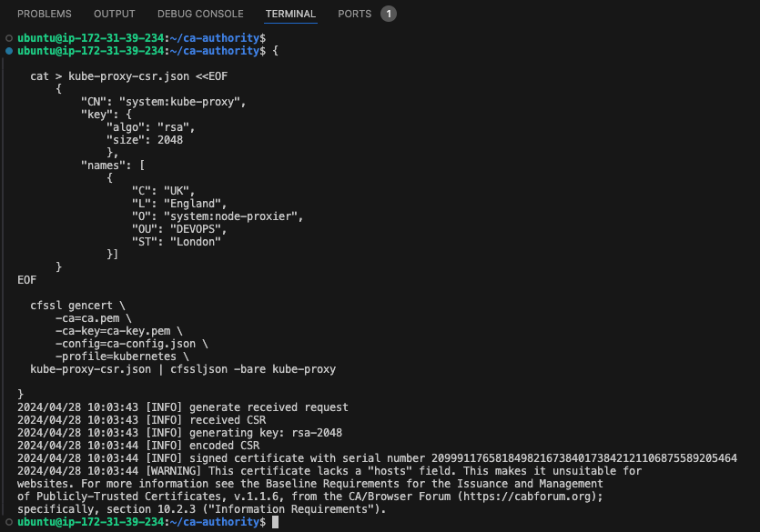

# Container Orchestration with Kubernetes Part 1

In previous projects, we learnt about containers, it's usefulness, and how to containerize applications. In this project, we will be introduce to Container Orchestration and Kubernetes.

## **What is Container Orchestration**

Container Orchestration is the automated management and coordination of containerized applications which involves deploying, scaling, updating, and managing containers across a cluster of servers. There are several container orchestration platforms in the market Kubernetes, Docker Swarm, and Apache Mesos, and these softwares will be responsible for the orchestration of the containers. Kubernetes is the market leader in this category, and that's what we would be working with in this project.

**Kubernetes**, often abbreviated as K8s, is an open-source container orchestration platform originally developed by Google and now maintained by the Cloud Native Computing Foundation (CNCF). Kubernetes provides a platform for orchestrating containers, enabling efficient resource utilization, seamless scaling, and high availability.

### **The Kubernetes architecture**

Kubernetes is designed around a master-slave model, with a master node orchestrating multiple worker nodes.


At the heart of the architecture lies the **Kubernetes master**, which consists of several components:

- **API Server**: The API Server acts as the frontend for the Kubernetes control plane. It validates and processes RESTful API requests, serving as the primary entry point for all administrative tasks.
- **Scheduler**: Responsible for placing containers onto available nodes in the cluster based on resource requirements, workload constraints, and other policies.
- **Controller Manager**: Manages various controllers that regulate the state of the cluster, ensuring that the desired state matches the actual state and initiating corrective actions when necessary.
- **etcd**: A distributed key-value store that stores all cluster data, including configuration details, cluster state, and metadata. It serves as the Kubernetes' backing store for all cluster data.

On the **Kubernetes worker nodes**, the following components run:

- **Kubelet**: An agent that runs on each node and is responsible for communicating with the Kubernetes master. It manages containers on the node, ensuring that they are running and healthy.
- **Kube-proxy**: Maintains network rules on the host and performs connection forwarding for Kubernetes services. It enables communication between services within the cluster and from external clients to services running on the cluster.
- **Container Runtime**: The software responsible for running containers, such as Docker or containerd. It manages the lifecycle of containers, including starting, stopping, and managing their resources.

These components work together to provide the foundation for container orchestration in Kubernetes, enabling the deployment, scaling, and management of containerized applications across clusters of nodes.


I'll recommend you read more about these components and how the function from the Kubernetes official documentation [here](https://kubernetes.io/docs/concepts/overview/components/)

## Installing Kubernetes (k8s) from scratch

Installing and configuring a K8s cluster from scratch in a production or Corporate environment is quite a task especially when considering security and scalability of the environment. Luckily, there are managed versions of k8s already created by some software giants: Amazon Elastic Kubernetes Services (Amazon EKS), Google Kubernetes Engine (GKE) and Azure Kubernetes Services (AKS). There are also open source tools for running k8s locally or in a development environment as minikube, MicroK8s, K3s, etc.

In this project, we will be doing it the hard way initially so as to fully understand each component and how they fit together to form a fully working K8s cluster. As a Kubernetes Administrator, you would be charged with the following responsibilities and more:

1. Install and configure master (also known as control plane) components and worker nodes (or just nodes).
2. Apply security settings across the entire cluster (i.e., encrypting the data in transit, and at rest)
   - In transit encryption means encrypting communications over the network using HTTPS
   - At rest encryption means encrypting the data stored on a disk
3. Plan the capacity for the backend data store etcd
4. Configure network plugins for the containers to communicate
5. Manage periodical upgrade of the cluster
6. Configure observability/monitoring and auditing

`Note: Unless you have any business or compliance restrictions, ALWAYS consider to use managed versions of K8s – Platform as a Service offerings, such as Azure Kubernetes Service (AKS), Amazon Elastic Kubernetes Service (Amazon EKS), or Google Kubernetes Engine (GKE) as they usually have better default security settings, and the costs for maintaining the control plane are very low.`

### Let us begin building out Kubernetes cluster from the ground

**DISCLAIMER**: The following setup of Kubernetes should be used for learning purpose only, and not to be considered for production. This is because setting up a K8s cluster for production use has a lot more moving parts, especially when it comes to planning the nodes, and securing the cluster. The purpose of "K8s From-Ground-Up" is to get you much closer to the different components as shown in the architecture diagram and relate with what you have been learning about Kubernetes.

The following tools and packages would be required in this project:

- Virtual Machines: AWS EC2 (3) One master and 2 nodes
- AWS CLI
- Docker Engine: To build/run individual containers
- kubectl console utility
- cfssl and cfssljson utilities
- Kubernetes cluster

We will be creating 3 EC2 Instances and then make the following configurations:

- SSL/TLS certificates for Kubernetes components to communicate securely
- Configured Node Network
- Configured Pod Network

## Preparing the Setup Environment

The set up environment would be pretty simple. An EC2 Instance running Ubuntu 22 and the software packages listed above.

- Provision an EC2 Instance running Ubuntu 22
- Install the following:
  - sudo apt update
  - sudo apt install awscli -y
  - sudo apt install jq -y  
    `'jq' is a lightweight and flexible command-line tool for parsing, manipulating, and querying JSON data`
- Next, we configure awscli with the necessary credentials

  - run `aws configure` and then provide the details requested by the prompt
  - run `aws ec2 describe-vpcs` to confirm aws has been configured successfully with the right credentials

    

- Install `kubectl`

  - Download the binary file: `wget https://storage.googleapis.com/kubernetes-release/release/v1.21.0/bin/linux/amd64/kubectl`
  - Make it executable: `chmod +x kubectl`
  - Move it to the bin directory, making the command globally recognized in the system: `sudo mv kubectl /usr/local/bin/`
  - Verify `kubectl` has been installed correctly: `kubectl version --short`

    

- Install CFSSL and CFSSLJSON-linux  
  CFSSL is an open source tool by Cloudflare used to setup a Public Key Infrastructure (PKI) for generating, signing and bundling TLS certificates. cfssl will be configured as a Certificate Authority which will issue the certificates required to spin up the Kubernetes cluster.

  > ```bash
  > wget -q --show-progress --https-only --timestamping \
  > https://pkg.cfssl.org/R1.2/cfssl_linux-amd64 \
  > https://pkg.cfssl.org/R1.2/cfssljson_linux-amd64
  >
  > chmod +x cfssl_linux-amd64 cfssljson_linux-amd64
  > sudo mv cfssl_linux-amd64 /usr/local/bin/cfssl
  > sudo mv cfssljson_linux-amd64 /usr/local/bin/cfssljson
  > ```

- Verify it's installation

  > `cfssl version`

  

## Provisioning the AWS Resources using AWSCLI

When working with Kubernetes on AWS, it's often recommended to create the Kubernetes cluster in a separate VPC rather than the default VPC provided by AWS. This recommendation is down to the following reasons:

- **Isolation**: Creating the Kubernetes cluster in a separate VPC provides isolation from other resources in the default VPC. This isolation can enhance security and prevent unintended interactions between resources.
- **Control**: By creating a dedicated VPC for the Kubernetes cluster, you have more control over the network configuration, security settings, and routing policies specific to the cluster's requirements. This allows for better customization and optimization of network resources.
- **Avoiding Conflicts**: Running Kubernetes in a separate VPC helps avoid potential conflicts with existing resources or configurations in the default VPC. It allows you to tailor the network environment specifically for Kubernetes workloads without impacting other AWS resources.

## Creating the VPC and Network resources

Create a directory called `k8s-cluster-from-ground-up`

### Virtual Private Cloud (VPC)

- Create the VPC:
  - `VPC_ID=$(aws ec2 create-vpc --cidr-block 172.31.0.0/16 --output text --query 'Vpc.VpcId')`
- Create a variable called NAME:
  - `NAME=k8s-cluster`
- Create a variable called AWS_REGION:
  - `AWS_REGION=us-east-2`
- Tag the VPC with the name variable:

  - `aws ec2 create-tags --resources ${VPC_ID} --tags Key=Name,Value=${NAME}`

  
  Notice that `DNS` is currently disabled

### Domain Name System – DNS

- Enable DNS support for the VPC:
  - `aws ec2 modify-vpc-attribute --vpc-id ${VPC_ID} --enable-dns-support '{"Value": true}'`
- Enable DNS support for hostnames:

  - `aws ec2 modify-vpc-attribute --vpc-id ${VPC_ID} --enable-dns-hostnames '{"Value": true}'`

  

### Dynamic Host Configuration Protocol – DHCP

DHCP options sets are configurations that allow you to specify custom DHCP options for your AWS Virtual Private Cloud (VPC). These options are used to configure instances with custom DNS servers, domain names, NTP (Network Time Protocol) servers, NetBIOS name servers, and more.

AWS automatically creates and associates a DHCP option set for your VPC upon creation and sets two options: domain-name-servers (defaults to AmazonProvidedDNS) and domain-name (defaults to the domain name for your set region). AmazonProvidedDNS is an Amazon Domain Name System (DNS) server, and this option enables DNS for instances to communicate using DNS names. By default, EC2 instances have fully qualified names like` ip-172-50-197-106.eu-central-1.compute.internal`. But you can set your own configuration using an example below:

> ```bash
> DHCP_OPTION_SET_ID=$(aws ec2 create-dhcp-options \
>  --dhcp-configuration \
>    "Key=domain-name,Values=iamyole.uk.internal" \
>    "Key=domain-name-servers,Values=AmazonProvidedDNS" \
>  --output text --query 'DhcpOptions.DhcpOptionsId')
> ```

- Create a tag for the `DHCP Option Set`
  - `aws ec2 create-tags  --resources ${DHCP_OPTION_SET_ID} --tags Key=Name,Value=${NAME}`
- Associate the DHCP Option set with the VPC

  - `aws ec2 associate-dhcp-options --dhcp-options-id ${DHCP_OPTION_SET_ID} --vpc-id ${VPC_ID}`

  

### Subnet

- Create the a Subnet for the VPC
  > ```bash
  > SUBNET_ID=$(aws ec2 create-subnet \
  > --vpc-id ${VPC_ID} \
  > --cidr-block 172.31.0.0/24 \
  > --output text --query 'Subnet.SubnetId')
  > ```
- Tag the subnet

  - `aws ec2 create-tags  --resources ${SUBNET_ID}  --tags Key=Name,Value=${NAME}`

  

### Internet Gateway (IGW)

- Create the Internet Gateway and attach it to the VPC

  > ```bash
  > INTERNET_GATEWAY_ID=$(aws ec2 create-internet-gateway \
  > --output text --query 'InternetGateway.InternetGatewayId')
  > aws ec2 create-tags \
  > --resources ${INTERNET_GATEWAY_ID} \
  > --tags Key=Name,Value=${NAME}
  > ```

- Attach it to the VPC

  > ```bash
  > aws ec2 attach-internet-gateway \
  > --internet-gateway-id ${INTERNET_GATEWAY_ID} \
  > --vpc-id ${VPC_ID}
  > ```

  

### Route tables

- Create route tables, associate the route table to subnet, and create a route to allow external traffic to the Internet through the Internet Gateway.

  > ```bash
  > ROUTE_TABLE_ID=$(aws ec2 create-route-table \
  > --vpc-id ${VPC_ID} \
  > --output text --query 'RouteTable.RouteTableId')
  > aws ec2 create-tags \
  > --resources ${ROUTE_TABLE_ID} \
  > --tags Key=Name,Value=${NAME}
  > aws ec2 associate-route-table \
  > --route-table-id ${ROUTE_TABLE_ID} \
  > --subnet-id ${SUBNET_ID}
  > aws ec2 create-route \
  > --route-table-id ${ROUTE_TABLE_ID} \
  > --destination-cidr-block 0.0.0.0/0 \
  > --gateway-id ${INTERNET_GATEWAY_ID}
  > ```

  

### Creating the Security Groups

- Configure security groups

  > ```bash
  > # Create the security group and store its ID in a variable
  > SECURITY_GROUP_ID=$(aws ec2 create-security-group \
  > --group-name ${NAME} \
  > --description "Kubernetes cluster security group" \
  > --vpc-id ${VPC_ID} \
  > --output text --query 'GroupId')
  >
  > # Create the NAME tag for the security group
  > aws ec2 create-tags \
  > --resources ${SECURITY_GROUP_ID} \
  > --tags Key=Name,Value=${NAME}
  >
  > # Create Inbound traffic for all communication within the subnet to connect on ports used by the master node(s)
  > aws ec2 authorize-security-group-ingress \
  > --group-id ${SECURITY_GROUP_ID} \
  > --ip-permissions IpProtocol=tcp,FromPort=2379,ToPort=2380,IpRanges='[{CidrIp=172.31.0.0/24}]'
  >
  > # Create Inbound traffic for all communication within the subnet to connect on ports used by the worker nodes
  > aws ec2 authorize-security-group-ingress \
  > --group-id ${SECURITY_GROUP_ID} \
  > --ip-permissions IpProtocol=tcp,FromPort=30000,ToPort=32767,IpRanges='[{CidrIp=172.31.0.0/24}]'
  >
  > # Create inbound traffic to allow connections to the Kubernetes API Server listening on port 6443
  > aws ec2 authorize-security-group-ingress \
  > --group-id ${SECURITY_GROUP_ID} \
  > --protocol tcp \
  > --port 6443 \
  > --cidr 0.0.0.0/0
  >
  > # Create Inbound traffic for SSH from anywhere (Do not do this in production. Limit access ONLY to IPs or CIDR that MUST connect)
  > aws ec2 authorize-security-group-ingress \
  > --group-id ${SECURITY_GROUP_ID} \
  > --protocol tcp \
  > --port 22 \
  > --cidr 0.0.0.0/0
  >
  > # Create ICMP ingress for all types
  > aws ec2 authorize-security-group-ingress \
  > --group-id ${SECURITY_GROUP_ID} \
  > --protocol icmp \
  > --port -1 \
  > --cidr 0.0.0.0/0
  > ```

  

### Network Load Balancer

- Create a network Load balancer

  > ```bash
  > LOAD_BALANCER_ARN=$(aws elbv2 create-load-balancer \
  > --name ${NAME} \
  > --subnets ${SUBNET_ID} \
  > --scheme internet-facing \
  > --type network \
  > --output text --query 'LoadBalancers[].LoadBalancerArn')
  > ```

  

### Tagret Group

- Create a target group
  > ```bash
  > TARGET_GROUP_ARN=$(aws elbv2 create-target-group \
  > --name ${NAME} \
  > --protocol TCP \
  > --port 6443 \
  > --vpc-id ${VPC_ID} \
  > --target-type ip \
  > --output text --query 'TargetGroups[].TargetGroupArn')
  > ```
- Register targets: We haven't provisioned the nodes so we will be using dummy ip address as the targets for now
  - `aws elbv2 register-targets --target-group-arn ${TARGET_GROUP_ARN} --targets Id=172.31.0.1{0,1,2}`
- Create a listener to listen for requests and forward to the target nodes on TCP port 6443. TCP port 6443 is typically associated with the Kubernetes API server

  > ```bash
  > aws elbv2 create-listener \
  > --load-balancer-arn ${LOAD_BALANCER_ARN} \
  > --protocol TCP \
  > --port 6443 \
  > --default-actions Type=forward,TargetGroupArn=${TARGET_GROUP_ARN} \
  > --output text --query 'Listeners[].ListenerArn'
  > ```

  

### K8s Public Address

- Get the DNS Name for the network load balancer and store it in a variable called `KUBERNETES_PUBLIC_ADDRESS`

  > ```bash
  > KUBERNETES_PUBLIC_ADDRESS=$(aws elbv2 describe-load-balancers \
  >       --load-balancer-arns ${LOAD_BALANCER_ARN} \
  >       --output text --query 'LoadBalancers[].DNSName')
  > ```

  

## Create The Compute Resources

- Get an image to create EC2 instances

  > ```bash
  > IMAGE_ID=$(aws ec2 describe-images --owners 099720109477 \
  >       --filters \
  >       'Name=root-device-type,Values=ebs' \
  >       'Name=architecture,Values=x86_64' \
  >       'Name=name,Values=ubuntu-pro-server/images/hvm-ssd/ubuntu-xenial-16.04-amd64-pro-server-20221202' \
  > | jq -r '.Images|sort_by(.Name)[-1]|.ImageId')
  > ```

  Let's breakdown the code above. The script above obtains the latest AMI for Ubuntu, and store the value in a variable called `IMAGE_ID`. This piece of code `| jq -r '.Images|sort_by(.Name)[-1]|.ImageId':` pipes the output of the aws ec2 describe-images command to `jq`. The `jq`, a command-line JSON processor parses and manipulates the output of the aws describe-image command to obtain the specific AMI.

  

- Create SSH Key-Pair
  > ```bash
  > mkdir -p ssh
  >
  > aws ec2 create-key-pair \
  >    --key-name ${NAME} \
  >    --output text --query 'KeyMaterial' \
  >    >ssh/${NAME}.id_rsa
  > chmod 400 ssh/${NAME}.id_rsa
  > ```

### EC2 Instances for Controle Plane (Master Nodes)

- Create 3 Master nodes: Note – Using t2.micro instead of t2.small as t2.micro is covered by AWS free tier
  > ```bash
  > for i in 0 1 2; do
  >   instance_id=$(aws ec2 run-instances \
  >       --associate-public-ip-address \
  >       --image-id ${IMAGE_ID} \
  >       --count 1 \
  >       --key-name ${NAME} \
  >       --security-group-ids ${SECURITY_GROUP_ID} \
  >       --instance-type t2.micro \
  >       --private-ip-address 172.31.0.1${i} \
  >       --user-data "name=master-${i}" \
  >       --subnet-id ${SUBNET_ID} \
  >       --output text --query 'Instances[].InstanceId')
  >   aws ec2 modify-instance-attribute \
  >       --instance-id ${instance_id} \
  >       --no-source-dest-check
  >   aws ec2 create-tags \
  >       --resources ${instance_id} \
  >       --tags "Key=Name,Value=${NAME}-master-${i}"
  > done
  > ```

### EC2 Instances for Worker Nodes

- Create 3 worker nodes:

  > ```bash
  > for i in 0 1 2; do
  >   instance_id=$(aws ec2 run-instances \
  >       --associate-public-ip-address \
  >       --image-id ${IMAGE_ID} \
  >       --count 1 \
  >       --key-name ${NAME} \
  >       --security-group-ids ${SECURITY_GROUP_ID} \
  >       --instance-type t2.micro \
  >       --private-ip-address 172.31.0.2${i} \
  >       --user-data "name=worker-${i}|pod-cidr=172.20.${i}.0/24" \
  >       --subnet-id ${SUBNET_ID} \
  >       --output text --query 'Instances[].InstanceId')
  >   aws ec2 modify-instance-attribute \
  >       --instance-id ${instance_id} \
  >       --no-source-dest-check
  >   aws ec2 create-tags \
  >       --resources ${instance_id} \
  >       --tags "Key=Name,Value=${NAME}-worker-${i}"
  > done
  > ```

  
  From the screenshot above, we can see we have three(3) Master nodes and three(3) worker nodes running.

  ### Recap

  So far, we've setup the lab environment by provisioning an EC2 Instance. We then installed AWS CLI to provision the servers that the k8s cluster would run on as as well installed cfssl and cfssljson utilities to configure the security settings for the cluster. For the infrastructure, the following has been created with aws cli: - VPC - Subnet - Internet Gateway - Routes and Route Tables associated with the subnet - Network Load balancer - Target groups - Security groups - Security Key - 6 EC2 Instances (3 for the control node and 3 for the worker nodes)

Now let's start configuring the Kubernetes of the infrastructure.

## Creating the Self-Signed Certificate and General TLS Certificate

Referring back to the diagram on Kubernetes Architecture.


The components in the Master node all requires TLS Certificates to function. While for the worker node, the `kubelet` and `kube-proxy` also requires TLS Certificates.

Using `cfssl`, let's provision a Private Key infrastructure (PKI) which will have a Certificate Authority (CA). The CA will generate certificates for all the individual components.

### Self-Signed Root Certificate Authority (CA)

- Create a directory and switch into it:
  - `mkdir ca-authority && cd ca-authority`
- Generate the CA configuration file, Root Certificate, and Private key:
  > ```bash
  > {
  >
  >   cat > ca-config.json <<EOF
  >       {
  >           "signing": {
  >           "default": {
  >               "expiry": "8760h"
  >           },
  >           "profiles": {
  >               "kubernetes": {
  >               "usages": ["signing", "key encipherment", "server auth", "client auth"],
  >               "expiry": "8760h"
  >               }
  >           }
  >       }
  > }
  > EOF
  >
  >   cat > ca-csr.json <<EOF
  >       {
  >           "CN": "Kubernetes",
  >           "key": {
  >               "algo": "rsa",
  >               "size": 2048
  >           },
  >           "names": [
  >           {
  >               "C": "UK",
  >               "L": "England",
  >               "O": "Ytech",
  >               "OU": "DEVOPS",
  >               "ST": "London"
  >           }]
  >       }
  > EOF
  >
  >   cfssl gencert -initca ca-csr.json | cfssljson -bare ca
  >
  > }
  > ```

The file defines the following

- CN – Common name for the authority
- algo – the algorithm used for the certificates
- size – algorithm size in bits
- C – Country
- L – Locality (city)
- ST – State or province
- O – Organization
- OU – Organizational Unit


- View the certificates creates

  - Ensure you are in the **ca-authority** directory, and the run the command: `ls -l `

  

- The 3 important files here are:
  - ca.pem – The Root Certificate
  - ca-key.pem – The Private Key
  - ca.csr – The Certificate Signing Request

### Generating TLS Certificates For Client and Server

We also need to create Client/Server certificates for all the components. It is \***\*MANDATORY\*\*** for all the network communications within the cluster are encrypted. The server in this instance are the master nodes running the api-server component. While the client is every other component that needs to communicate with the api-server.

Now we have a certificate for the Root CA, we can then begin to request more certificates which the different Kubernetes components, i.e. clients and server, will use to have encrypted communication.

### Let us begin with the Kubernetes API-Server Certificate and Private Key

The certificate for the Api-server must have IP addresses, DNS names, and a Load Balancer address included. Otherwise, we may encounter lot of difficulties connecting to the api-server.

- Generate the Certificate Signing Request (CSR), Private Key and the Certificate for the Kubernetes Master Nodes.
  > ```bash
  > {
  >   cat > master-kubernetes-csr.json <<EOF
  >       {
  >           "CN": "kubernetes",
  >               "hosts": [
  >                   "127.0.0.1",
  >                   "172.31.0.10",
  >                   "172.31.0.11",
  >                   "172.31.0.12",
  >                   "ip-172-31-0-10",
  >                   "ip-172-31-0-11",
  >                   "ip-172-31-0-12",
  >                   "ip-172-31-0-10.${AWS_REGION}.compute.internal",
  >                   "ip-172-31-0-11.${AWS_REGION}.compute.internal",
  >                   "ip-172-31-0-12.${AWS_REGION}.compute.internal",
  >                   "${KUBERNETES_PUBLIC_ADDRESS}",
  >                   "kubernetes",
  >                   "kubernetes.default",
  >                   "kubernetes.default.svc",
  >                   "kubernetes.default.svc.cluster",
  >                   "kubernetes.default.svc.cluster.local"],
  >           "key": {
  >                   "algo": "rsa",
  >                   "size": 2048},
  >           "names": [{
  >                    "C": "UK",
  >                    "L": "England",
  >                    "O": "Ytech",
  >                    "OU": "DEVOPS",
  >                    "ST": "London"}]
  >       }
  > EOF
  >
  >   cfssl gencert \
  >       -ca=ca.pem \
  >       -ca-key=ca-key.pem \
  >       -config=ca-config.json \
  >       -profile=kubernetes \
  >   master-kubernetes-csr.json | cfssljson -bare master-kubernetes
  > }
  > ```


### Kubernetes API-Server Certificate and Private Key

> ```bash
> {
>   cat > kube-scheduler-csr.json <<EOF
>       {
>           "CN": "system:kube-scheduler",
>           "key": {
>               "algo": "rsa",
>               "size": 2048
>               },
>           "names": [
>               {
>                   "C": "UK",
>                   "L": "England",
>                   "O": "system:kube-scheduler",
>                   "OU": "DEVOPS",
>                   "ST": "London"
>               }]
>       }
> EOF
>
>   cfssl gencert \
>       -ca=ca.pem \
>       -ca-key=ca-key.pem \
>       -config=ca-config.json \
>       -profile=kubernetes \
>   kube-scheduler-csr.json | cfssljson -bare kube-scheduler
>
> }
> ```


### kube-proxy Client Certificate and Private Key

> ```bash
> {
>
>   cat > kube-proxy-csr.json <<EOF
>       {
>           "CN": "system:kube-proxy",
>           "key": {
>               "algo": "rsa",
>               "size": 2048
>               },
>           "names": [
>               {
>                   "C": "UK",
>                   "L": "England",
>                   "O": "system:node-proxier",
>                   "OU": "DEVOPS",
>                   "ST": "London"
>               }]
>       }
> EOF
>
>   cfssl gencert \
>       -ca=ca.pem \
>       -ca-key=ca-key.pem \
>       -config=ca-config.json \
>       -profile=kubernetes \
>   kube-proxy-csr.json | cfssljson -bare kube-proxy
>
> }
> ```



### kube-controller-manager Client Certificate and Private Key

> ```bash
> {
>   cat > kube-controller-manager-csr.json <<EOF
>       {
>           "CN": "system:kube-controller-manager",
>           "key": {
>               "algo": "rsa",
>               "size": 2048
>             },
>           "names": [
>               {
>                   "C": "UK",
>                   "L": "England",
>                   "O": "system:kube-controller-manager",
>                   "OU": "DEVOPS",
>                   "ST": "London"
>               }]
>       }
> EOF
>
>   cfssl gencert \
>       -ca=ca.pem \
>       -ca-key=ca-key.pem \
>       -config=ca-config.json \
>       -profile=kubernetes \
>   kube-controller-manager-csr.json | cfssljson -bare kube-controller-manager
>
> }
> ```


### kubelet Client Certificate and Private Key

Similar to how we configured the api-server's certificate, Kubernetes requires that the hostname of each worker node is included in the client certificate. Kubernetes also uses a special-purpose authorization mode called Node Authorizer, that specifically authorizes API requests made by kubelet services.

In order to be authorized by the Node Authorizer, kubelets must use a credential that identifies them as being in the system:nodes group, with a username of system:node:{nodeName}. Notice the "CN": "system:node:${instance_hostname}", in the below code.

Therefore, the certificate to be created must comply to these requirements. In the below example, there are 3 worker nodes, hence we will use bash to loop through a list of the worker nodes’ hostnames, and based on each index, the respective Certificate Signing Request (CSR), private key and client certificates will be generated.

> ```bash
> for i in 0 1 2; do
>  instance="${NAME}-worker-${i}"
>  instance_hostname="ip-172-31-0-2${i}"
>  cat > ${instance}-csr.json <<EOF
>   {
>       "CN": "system:node:${instance_hostname}",
>       "key": {
>           "algo": "rsa",
>           "size": 2048
>          },
>       "names": [
>           {
>               "C": "UK",
>               "L": "England",
>               "O": "system:nodes",
>               "OU": "DEVOPS",
>               "ST": "London"
>           }]
>    }
> EOF
>
>  external_ip=$(aws ec2 describe-instances \
>    --filters "Name=tag:Name,Values=${instance}" \
>    --output text --query 'Reservations[].Instances[].PublicIpAddress')
>
>  internal_ip=$(aws ec2 describe-instances \
>    --filters "Name=tag:Name,Values=${instance}" \
>    --output text --query 'Reservations[].Instances[].PrivateIpAddress')
>
>  cfssl gencert \
>    -ca=ca.pem \
>    -ca-key=ca-key.pem \
>    -config=ca-config.json \
>    -hostname=${instance_hostname},${external_ip},${internal_ip} \
>    -profile=kubernetes \
>    ${NAME}-worker-${i}-csr.json | cfssljson -bare ${NAME}-worker-${i}
> done
> ```


### kubernetes admin user's Client Certificate and Private Key

> ```bash
> {
>   cat > admin-csr.json <<EOF
>       {
>           "CN": "admin",
>           "key": {
>               "algo": "rsa",
>               "size": 2048
>             },
>           "names": [
>               {
>                   "C": "UK",
>                   "L": "England",
>                   "O": "system:masters",
>                   "OU": "DEVOPS",
>                   "ST": "London"
>               }]
>       }
> EOF
>
>   cfssl gencert \
>       -ca=ca.pem \
>       -ca-key=ca-key.pem \
>       -config=ca-config.json \
>       -profile=kubernetes \
>   admin-csr.json | cfssljson -bare admin
> }
> ```


### Token Controller Client Certificate and Private Key

The last key pair that needs to be created is for the Token Controller. A Token Controller is the component responsible for managing service account tokens within the cluster. Service accounts are identities used by applications running within Kubernetes pods to authenticate with the Kubernetes API server and perform actions on the cluster. Read more about Service Accounts from the official documentation.

> ```bash
> {
>
>   cat > service-account-csr.json <<EOF
>       {
>           "CN": "service-accounts",
>           "key": {
>               "algo": "rsa",
>               "size": 2048
>             },
>           "names": [
>               {
>                   "C": "UK",
>                   "L": "England",
>                   "O": "Kubernetes",
>                   "OU": "DAREY.IO DEVOPS",
>                   "ST": "London"
>               }]
>       }
> EOF
>
>   cfssl gencert \
>       -ca=ca.pem \
>       -ca-key=ca-key.pem \
>       -config=ca-config.json \
>       -profile=kubernetes \
>   service-account-csr.json | cfssljson -bare service-account
> }
> ```


List of Certificate Key Pairs created so far:


