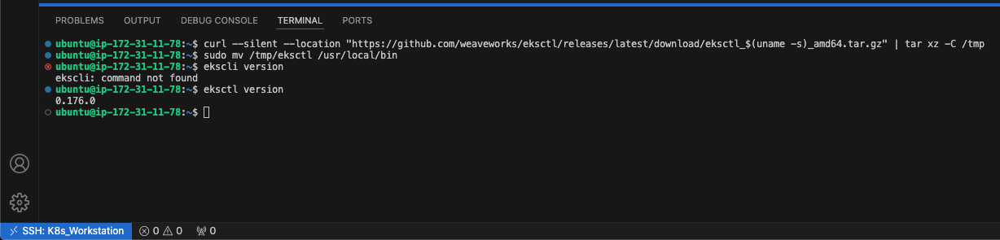
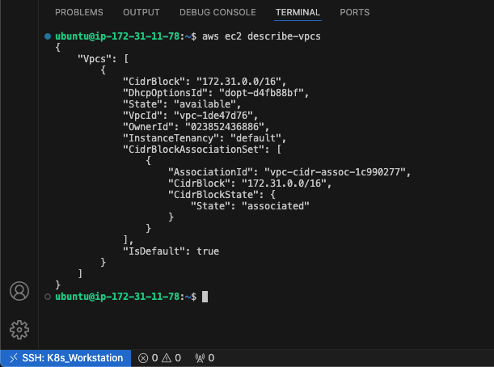
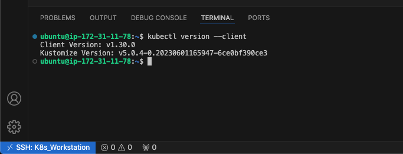

# Container Orchestration with Kubernetes Part 2 - Deploying Applications to K8r

In the first part of this Kubernetes Series, we looked at creating a Kubernetes Cluster from ground up, how how the components works together. In this part, we will be looking at deploying software applications to an already exiting K8r Cluster.

Deploying applications to Kubernetes involves leveraging various Kubernetes objects to define, manage, and scale the application workload efficiently within the cluster. Kubernetes abstracts away the underlying infrastructure complexities we saw in the precious part, allowing developers to focus on defining the desired state of their applications using declarative configurations (YAML).

At the core of Kubernetes application deployment are several key objects:

- **Pod**: A pod is the smallest deployable unit in Kubernetes, representing one or more containers that are tightly coupled and share networking and storage resources. Pods encapsulate an application's containers, storage resources, and configuration settings. They are scheduled and run on nodes within the cluster.
- **ReplicaSet**: A ReplicaSet ensures that a specified number of identical pod replicas are running at all times within the cluster. It provides scaling capabilities by dynamically adjusting the number of pod replicas based on defined criteria, such as CPU utilization or custom metrics. ReplicaSets are often used to achieve high availability and fault tolerance for applications.
- **Deployment**: A Deployment manages the lifecycle of a set of pods and ReplicaSets, allowing for declarative updates and rollback of application versions. Deployments define the desired state of the application, including the number of replicas, container images, and update strategies. They automate the process of deploying and updating applications while ensuring that the desired state is maintained consistently.
- **Service**: A Service provides networking abstraction for accessing pods running in the cluster. It acts as a stable endpoint for accessing the application, allowing clients to discover and communicate with pods dynamically. Services can be exposed internally within the cluster or externally to the internet using various service types, such as ClusterIP, NodePort, or LoadBalancer.
- **Ingress**: An Ingress provides HTTP and HTTPS routing capabilities for external access to services within the cluster. It allows traffic to be routed to different services based on hostnames, paths, or other request attributes. Ingress resources are used to configure routing rules and load balancing for applications exposed over HTTP/HTTPS.

By leveraging these Kubernetes objects, developers can define, deploy, scale, and manage applications effectively within Kubernetes clusters. These objects enable automation, scalability, and resilience, empowering organizations to build and run cloud-native applications with ease.

In this project series, we will be looking at implementing the following:

1. Deployment of software applications using YAML manifest files with following K8s objects:
   - Pods
   - ReplicaSets
   - Deployments
   - StatefulSets
   - Services (ClusterIP, NodeIP, Loadbalancer)
   - Configmaps
   - Volumes
   - PersistentVolumes
   - PersistentVolumeClaims …and many more
2. Difference between stateful and stateless applications
   - Deploy MySQL as a StatefulSet and explain why
3. Limitations of using manifests directly to deploy on K8s
   - Working with Helm templates, its components and the most important parts – semantic versioning
   - Converting all the .yaml templates into a helm chart
4. Deploying more tools with Helm charts on AWS Elastic Kubernetes Service (EKS)
   - Jenkins
   - MySQL
   - Ingress Controllers (Nginx)
   - Cert-Manager
   - Ingress for Jenkins
   - Ingress for the actual application
5. Deploy Monitoring Tools
   - Prometheus
   - Grafana
6. Hybrid CI/CD by combining different tools such as: Gitlab CICD, Jenkins. And, you will also be introduced to concepts around GitOps using Weaveworks Flux.

Let's begin by setting our our Kubernetes Cluster using `eksctl`.

## Setting up the Cluster using `eksctl`

**eksctl** is a simple CLI tool for creating clusters on EKS - Amazon's new managed Kubernetes service for EC2. It is written in Go, and uses CloudFormation. To read more on this and how to set it up, please refer the the official github page [here](https://github.com/eksctl-io/eksctl)

- Provision an EC2 instance running ubuntu 22.04
- Download and install eksctl
  - `curl --silent --location "https://github.com/weaveworks/eksctl/releases/latest/download/eksctl_$(uname -s)_amd64.tar.gz" | tar xz -C /tmp`
  - `sudo mv /tmp/eksctl /usr/local/bin`
- Verify eksctl is installed correctly by running `eksctl version`

  

- Install and configure awscli
- Run `aws ec2 describe-vpcs` to confirm aws cli has been installed and configured correctly.

  

- Install pip
  - `sudo apt install python3-pip -y`
- Upgrade the awscli
  - `pip install --upgrade awscli`
- Download and Install `kubectl`
  - `curl -LO "https://dl.k8s.io/release/$(curl -L -s https://dl.k8s.io/release/stable.txt)/bin/linux/amd64/kubectl"`
  - `sudo install -o root -g root -m 0755 kubectl /usr/local/bin/kubectl`
- Verify the installation of `kubectl` by running `kubectl version --client`

  

With all the above configurations done, we can start creating a EKS clusters. Let's create a sample demo cluster by running the code below:
