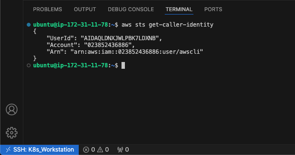
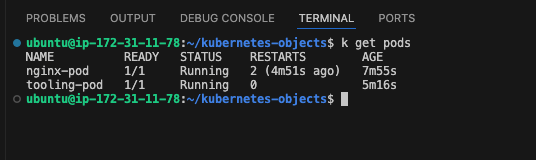

# Container Orchestration with Kubernetes Part 2 - Deploying Applications to K8r

In the first part of this Kubernetes Series, we looked at creating a Kubernetes Cluster from ground up, how how the components works together. In this part, we will be looking at deploying software applications to an already exiting K8r Cluster.

Deploying applications to Kubernetes involves leveraging various Kubernetes objects to define, manage, and scale the application workload efficiently within the cluster. Kubernetes abstracts away the underlying infrastructure complexities we saw in the precious part, allowing developers to focus on defining the desired state of their applications using declarative configurations (YAML).

At the core of Kubernetes application deployment are several key objects:

- **Pod**: A pod is the smallest deployable unit in Kubernetes, representing one or more containers that are tightly coupled and share networking and storage resources. Pods encapsulate an application's containers, storage resources, and configuration settings. They are scheduled and run on nodes within the cluster.
- **ReplicaSet**: A ReplicaSet ensures that a specified number of identical pod replicas are running at all times within the cluster. It provides scaling capabilities by dynamically adjusting the number of pod replicas based on defined criteria, such as CPU utilization or custom metrics. ReplicaSets are often used to achieve high availability and fault tolerance for applications.
- **Deployment**: A Deployment manages the lifecycle of a set of pods and ReplicaSets, allowing for declarative updates and rollback of application versions. Deployments define the desired state of the application, including the number of replicas, container images, and update strategies. They automate the process of deploying and updating applications while ensuring that the desired state is maintained consistently.
- **Service**: A Service provides networking abstraction for accessing pods running in the cluster. It acts as a stable endpoint for accessing the application, allowing clients to discover and communicate with pods dynamically. Services can be exposed internally within the cluster or externally to the internet using various service types, such as ClusterIP, NodePort, or LoadBalancer.
- **Ingress**: An Ingress provides HTTP and HTTPS routing capabilities for external access to services within the cluster. It allows traffic to be routed to different services based on hostnames, paths, or other request attributes. Ingress resources are used to configure routing rules and load balancing for applications exposed over HTTP/HTTPS.

By leveraging these Kubernetes objects, developers can define, deploy, scale, and manage applications effectively within Kubernetes clusters. These objects enable automation, scalability, and resilience, empowering organizations to build and run cloud-native applications with ease.

In this project series, we will be looking at implementing the following:

1. Deployment of software applications using YAML manifest files with following K8s objects:
   - Pods
   - ReplicaSets
   - Deployments
   - StatefulSets
   - Services (ClusterIP, NodeIP, Loadbalancer)
   - Configmaps
   - Volumes
   - PersistentVolumes
   - PersistentVolumeClaims …and many more
2. Difference between stateful and stateless applications
   - Deploy MySQL as a StatefulSet and explain why
3. Limitations of using manifests directly to deploy on K8s
   - Working with Helm templates, its components and the most important parts – semantic versioning
   - Converting all the .yaml templates into a helm chart
4. Deploying more tools with Helm charts on AWS Elastic Kubernetes Service (EKS)
   - Jenkins
   - MySQL
   - Ingress Controllers (Nginx)
   - Cert-Manager
   - Ingress for Jenkins
   - Ingress for the actual application
5. Deploy Monitoring Tools
   - Prometheus
   - Grafana
6. Hybrid CI/CD by combining different tools such as: Gitlab CICD, Jenkins. And, you will also be introduced to concepts around GitOps using Weaveworks Flux.

Let's begin by setting our our Kubernetes Cluster using `eksctl`.

## Setting up the Cluster using `eksctl`

**eksctl** is a simple CLI tool for creating clusters on EKS - Amazon's new managed Kubernetes service for EC2. It is written in Go, and uses CloudFormation. To read more on this and how to set it up, please refer the the official github page [here](https://github.com/eksctl-io/eksctl)

- Provision an EC2 instance running ubuntu 22.04
- Download and install eksctl
  - `curl --silent --location "https://github.com/weaveworks/eksctl/releases/latest/download/eksctl_$(uname -s)_amd64.tar.gz" | tar xz -C /tmp`
  - `sudo mv /tmp/eksctl /usr/local/bin`
- Verify eksctl is installed correctly by running `eksctl version`

  

- Install and configure awscli
- Run `aws sts get-caller-identity` to confirm aws cli has been installed and configured correctly.

  

- Install pip
  - `sudo apt install python3-pip -y`
- Upgrade the awscli
  - `pip install --upgrade awscli`
- Download and Install `kubectl`
  - `curl -LO "https://dl.k8s.io/release/$(curl -L -s https://dl.k8s.io/release/stable.txt)/bin/linux/amd64/kubectl"`
  - `sudo install -o root -g root -m 0755 kubectl /usr/local/bin/kubectl`
- Verify the installation of `kubectl` by running `kubectl version --client`

  

With all the above configurations done, we can start creating a EKS clusters. Let's create a sample demo cluster by running the code below:

> ```bash
> $ eksctl create cluster \
>       --name demo-cluster \
>       --region us-east-2 \
>       --nodegroup-name worker \
>       --node-type t2.micro \
>       --nodes 2
> ```

A more standard approach will be to create a ClusterConfig file for the creation of the cluster. Using this method, let's create a file called `demo-cluster.yaml` with the code below:

> ```yaml
> apiVersion: eksctl.io/v1alpha5
> kind: ClusterConfig
>
> metadata:
>   name: demo-cluster
>   region: us-east-2
>
> nodeGroups:
>   - name: worker
>     instanceType: t2.micro
>     desiredCapacity: 2
>     maxSize: 3
>     minSize: 2
>     tags:
>       nodegroup-type: worker
> ```

From the console, run the command `eksctl create cluster --config-file demo-cluster.yaml` to create the cluster.


The cluster creation takes a while, so while its creating, you can log into your AWS Console and navigate to the cloud formation service and view the list of items being created.


We can also navigate to the Elastic Kubernetes Service menu and browse through details of the cluster.


From the screenshot above, we see the cluster has been created successfully. Next, run the following command to connect the kubectl utility to the cluster:  
`aws eks --region us-east-2 update-kubeconfig --name demo-cluster`

To view the nodes, run `kubectl get nodes`


We can also confirm the nodes creation from aws console


### Creating an Alias for kubectl

You will soon notice now often we will have to type `kubectl` to create, update or delete objects in the cluster. We can create an alias to save time and type less code. from your console, run the following command:

- `Alias k=kubectl`

Subsequently, we can type just `k get ....` instead of `kubectl get ....`

## Creating a Pod

### Understanding the common YAML fields for every Kubernetes object

Every Kubernetes object includes object fields that govern the object’s configuration:

- **kind**: Represents the type of kubernetes object created. It can be a Pod, DaemonSet, Deployments or Service.
- **version**: Kubernetes api version used to create the resource, it can be v1, v1beta and v2. Some of the kubernetes features can be released under beta and available for general public usage.
- **metadata**: provides information about the resource like name of the Pod, namespace under which the Pod will be running, labels and annotations.
- **spec**: consists of the core information about Pod. Here we will tell kubernetes what would be the expected state of resource, Like container image, number of replicas, environment variables and volumes.
- **status**: consists of information about the running object, status of each container. Status field is supplied and updated by Kubernetes after creation. This is not something you will have to put in the YAML manifest.

Now, let's deploy an NGINX container running inside a Pod.

- Create a file called `nginx_pod.yaml` with the code below.
  > ```yaml
  > apiVersion: v1
  > kind: Pod
  > metadata:
  >   name: nginx-pod
  > spec:
  >   containers:
  >     - image: nginx:latest
  >       name: nginx-pod
  >       ports:
  >         - containerPort: 80
  >           protocol: TCP
  > ```
- Create the Pod by running the code below:
  - `k apply -f nginx_pod.yaml`
- To view the running pods, run the code below:

  - `k get pods`

  

- We can also create a pod for the tooling application using the docker image created in the [PROJECT]().
- Create a file called `tooling-pod.yaml` with the code below

  > ```yaml
  > apiVersion: v1
  > kind: Pod
  > metadata:
  >   name: tooling-pod
  >   labels:
  >     app: tooling
  > spec:
  >   containers:
  >     - image: iamyole/tooling_frontend:1.0
  >       name: nginx-pod
  >       ports:
  >         - containerPort: 80
  >           protocol: TCP
  > ```

- run `k apply -f tooling-pod.yaml` and then `k get pods`

  

  we can see the two pods running

- Run `k describe pod tooling-pod` to get more details about the Pod such as the image its running, the node its running on etc.

## Creating a Service

Having created the App (The Nginx Image), we need to find a way to access it, but this currently is not possible as the Pod is assigned a private ip address. To resolve this issue, we we need to create another Kubernetes object known as a "Service."

A Service acts as an intermediary that receives requests and forwards them to the respective Pod's IP address. In essence, a Service acts as a gateway that accepts incoming requests on behalf of the Pods and routes them to the appropriate Pod's IP address. If you execute the provided command, you can obtain the IP address of the Pod. Nonetheless, it's important to note that there is no direct means of accessing this Pod from the external world.

Let's create a service in order to access the nginx application

- Create a file called `nginx_svc.yaml` with the code below:
  > ```yaml
  > apiVersion: v1
  > kind: Service
  > metadata:
  >   name: nginx-service
  > spec:
  >   type: NodePort
  >   selector:
  >     app: nginx-pod
  >   ports:
  >     - protocol: TCP
  >       port: 80
  >       nodePort: 30080
  > ```
- To create the service, run the code below:
  - `k apply -f nginx_svc.yaml`
- To view the service, run `k get service`

  

  We can see service has been created with Public IP address and Port that can be routed over the internet. The `kubernetes` service is the default service for running the k8r cluster.

The range of valid ports is 30000-32767

- From the aws console, allow access to port `30080` from the security group
- From the browser, key in the ip address and port `30080` to access the application
- Unfortunately, this still won't work because the service we created doesn't know the pod to route traffic to. To fix this, we need to update the Pod definition with a label(that acts as an ID) so the service can identify the pods to direct the traffic to.

- run `k get svc -o wide`

  

  The Selector field tells the service to route traffic to any pod with the label `app=nginx-pdd`

To fix this, let's update Pod definition file to have the required label:

> ```yaml
> apiVersion: v1
> kind: Service
> metadata:
>   name: nginx-service
>   labels:
>     app: nginx-pod
> spec:
>   selector:
>     app: nginx-pod
>   ports:
>     - protocol: TCP
>       port: 80
>       targetPort: 30080
> ```


Try accessing the app again by providing the Public IP of the EC2 Instance and the Port Number


- Delete the objects buy running the codes below
  - `k delete pod nginx-pod`
  - `k delete svc nginx-service`

In Kubernetes, there are several types of Services that you can create to expose your application to other parts of the cluster or to external clients. Each type of Service offers different networking configurations and access patterns. Here are the main types of Services in Kubernetes:

- **ClusterIP**:
  Exposes the Service on an internal IP address only accessible within the cluster.
  This is the default type of Service. It is used for internal communication between components within the cluster.
- **NodePort**:
  Exposes the Service on a static port on each node's IP address.
  Makes the Service accessible externally (from outside the cluster) using the node's IP address and the static port.
  Typically used for testing or for applications that require external access but do not need a load balancer.
- **LoadBalancer**:
  Exposes the Service using a cloud provider's load balancer.
  The cloud provider allocates an external IP address and routes traffic to the Service using the load balancer.
  Ideal for exposing Services to external clients (such as web applications) and distributing incoming traffic across multiple pods.
- **ExternalName**:
  Maps the Service to an external DNS name.
  Allows pods within the cluster to access external services using a custom DNS name.
  Useful for integrating with external services or legacy systems without modifying application code.

These are the main types of Services in Kubernetes, each serving different use cases and providing various levels of accessibility and networking configurations. When deploying applications in Kubernetes, you can choose the appropriate type of Service based on your application's requirements for internal or external communication

ClusterIP is the default service type when creating a Service, and we've seen a sample NodePort. Now let's create a LoadBalancer:

- Create a file called `nginx-loadbalancer.yaml` with the code below:

  > ```yaml
  > apiVersion: v1
  > kind: Service
  > metadata:
  >   name: nginx-loadbalancer
  > spec:
  >   type: LoadBalancer
  >   selector:
  >     teir: frontend
  >   ports:
  >     - protocol: TCP
  >       port: 8080
  >       targetPort: 80
  > ```

## Creating a ReplicaSet

ReplicaSets in Kuberenetes and AutoScaling Groups in AWS are very similar and serves the same purpose,ensuring a desired number of identical instances (pods in the case of ReplicaSets, EC2 instances in the case of ASG) are running at any given time.

Let's define a ReplicaSet

- Create a file called `nginx-rs.yaml` with the code below:
  > ```yaml
  > apiVersion: apps/v1
  > kind: ReplicaSet
  > metadata:
  >   name: nginx-rs
  > spec:
  >   replicas: 2
  >   selector:
  >     matchLabels:
  >       app: nginx-pod
  >   template:
  >     metadata:
  >       name: nginx-pod
  >       labels:
  >         app: nginx-pod
  >         tier: frontend
  >     spec:
  >       containers:
  >         - image: nginx:latest
  >           name: nginx-pod
  >           ports:
  >             - containerPort: 80
  >               protocol: TCP
  > ```

In the file above the template section is very similar to the pod definition. The ReplicaSet is designed to always have 2 identical copies of the pod at any given point in time. This number can be increased of decreased to meet demand just as it is with ASGs.

- Create the ReplicaSet by running the code below:
  - `k apply -f nginx-rs.yaml`
- To view the running pods created by the ReplicaSet, run the code below:

  - `k get pods -o wide`

    

- To scale the ReplicaSet up or down, run the command below:
  - `k scale rs nginx-rs --replicas=<number-of-pods>`

### Advanced label matching

So far, we used a simple selector that just matches a key-value pair and check only ‘equality’

> ```yaml
> selector:
>   app: nginx-pod
> ```

Assuming we need to select Pods with multiple labels that represents things like:

- Application tier: such as Frontend, or Backend
- Environment: such as Dev, SIT, QA, Preprod, or Prod

We can use **matchExpressions** and introduce conditions such as (In, NOT Equals to, etc). See the sample ReplicaSet below: Update the `nginx-rs.yaml` file to the code below

> ```yaml
> apiVersion: apps/v1
> kind: ReplicaSet
> metadata:
>   name: nginx-rs
> spec:
>   replicas: 2
>   selector:
>     matchLabels:
>       app: nginx
>     matchExpressions:
>       - { key: tier, operator: In, values: [frontend] }
>       - { key: environment, operator: NotIn, values: [dev] }
>   template:
>     metadata:
>       name: nginx-pod
>       labels:
>         app: nginx
>         env: prod
>         tier: frontend
>     spec:
>       containers:
>         - image: nginx:latest
>           name: nginx-pod
>           ports:
>             - containerPort: 80
>               protocol: TCP
> ```

- delete the existing rs with the same name and the create create the new rs
- View details of the ReplicaSet with:
  

In the above Script, under the selector, matchLabels and matchExpression are used to specify the key-value pair. The matchLabel works exactly the same way as the equality-based selector, and the matchExpression is used to specify the set based selectors. This feature is the main differentiator between ReplicaSet and the now obsolete ReplicationController.

In the previous section, we created a file called `nginx-loadbalancer.yaml`. Now, let's create the object and see how it functions.

- Create the LB by running the code `k apply -f nginx-loadbalancer.yaml`

  

- Log into aws console and confirm an Elastic Load Balancer has been created


- run `k get svc -o wide` to view the dns name which can be used to access the application

  

- From your web browser, paste the loadbalancer ARN and the port number `8080` to access the application.

## Creating Deployment

A Deployment is another layer above ReplicaSets and Pods. It has more advanced features than ReplicaSets. Deployment manages a replicated application, and also ensures that a specified number of replica pods are running at any given time. One major benefit of using a deployment is the Rolling Updates feature. Rolling updates enables us to update the application with new container images or configuration changes without downtime. Kubernetes gradually replaces old pods with new ones, ensuring a smooth transition and minimal disruption to the application.

- Let's delete the ReplicaSets created in the previous section before creating the Deployments.
  - `k delete replicaset nginx-rs`
- Create a new file called `nginx-deployment.yaml`
  > ```yaml
  > apiVersion: apps/v1
  > kind: Deployment
  > metadata:
  >   name: nginx-deployment
  >   labels:
  >     tier: frontend
  > spec:
  >   replicas: 3
  >   selector:
  >     matchLabels:
  >       tier: frontend
  >   template:
  >     metadata:
  >       labels:
  >         tier: frontend
  >     spec:
  >       containers:
  >         - name: nginx
  >           image: nginx:latest
  >           ports:
  >             - containerPort: 80
  > ```
- Create the Deployment by running the code below:
  - `k apply -f nginx-deployment.yaml`
- To view the running ReplicaSet created by the Deployment, run the code below:

  - `k get rs`

    

- To view the running pods created by the Deployment, run the code below:

  - `k get pods`

    

From the above we will find that one of the pods is pending. To get information about the pod run `kubectl describe pod <pod-id>` and inspect the events panel

> ```text
> Events:
>  Type     Reason            Age   From               Message
>  ----     ------            ----  ----               -------
>  Warning  FailedScheduling  2m3s  default-scheduler  0/2 nodes are available: 2 Too many pods. preemption: 0/2 nodes are available: 2 No preemption victims found for incoming pod.
>
> ```

The warning indicates that there are no available nodes to schedule the pod because all nodes are occupied.

Some of the ways to resolve this include:

- Add more nodes to your cluster.
- Adjust resource requests and limits.
- Prioritize pods.
- Use PodDisruptionBudgets.
- Scale down or remove unnecessary pods.

For now, we can simple scale down the number of pods to 2 by running the code below:

- `k scale deployment nginx-deployment --replicas=2`


### Connecting into a Pod.

Just as we used the `exec -it` command in docker to remotely access the OS of an image, we can do something similar in kubernetes by running the code below:

- `k exec -it <NAME-OF-POD> /bin/bash`

  

List the files and folders in the Nginx directory

- `ls -latr /etc/nginx`
  

We can also access the content of the default.conf and make changes

- `cat /etc/nginx/conf.d/default.conf`

However, these are not recommended because a change to the image running in a pod won't be replicated in other images in other pods and nodes.

### Recap

We've created a single Pod, a ReplicaSet and a Deployment. We've also created a service that can be used to access our application. We've also seen the different types of services (ClusterIP, NodePort, and Load Balancers), and when to use them. When working with Deployments, our Application Stack will logically look like the image below:


## Persisting data for pods

Deployments are stateless by design. Hence, any data stored inside the Pod’s container does not persist when the Pod dies.

If you were to update the content of the index.html file inside the container, and the Pod dies, that content will not be lost since a new Pod will replace the dead one.

Let's demonstrate this.

- Connect into the pod and install vim
- Install `vim` and make some changes to the default web page
  - `apt update && apt install vim -y`
- Update the content of the file at `/usr/share/nginx/html/index.html` with the code below:
- We will be changing the background color of the page to blue. Locate the body tag and add the bgcolor attribute.
  > ```html
  > <body bgcolor="blue"></body>
  > ```
- Save the changes and reload the web browser to confirm

  

- Now, delete the replicaset and watch it recreated by the deployment.

  

- Refresh the web page again and notice the changes we has been lost.

  

Storage is a critical part of running containers, and Kubernetes offers some powerful primitives for managing it. Dynamic volume provisioning is a feature in Kubernetes that allows storage volumes to be automatically created and configured on-demand when a PersistentVolumeClaim (PVC) is made, eliminating the need for manual intervention by administrators. Without dynamic provisioning, DevOps engineers must manually make calls to the cloud or storage provider to create new storage volumes, and then create PersistentVolume objects to represent them in Kubernetes. The dynamic provisioning feature eliminates the need for DevOps engineers to pre-provision storage. Instead, it automatically provisions storage when it is requested by users.

To make the data persist in case of a Pod’s failure, you will need to configure the Pod to use following objects:

Persistent Volume or pv – is a piece of storage in the cluster that has been provisioned by an administrator or dynamically provisioned using Storage Classes.
Persistent Volume Claim or pvc. Persistent Volume Claim is simply a request for storage, hence the "claim" in its name.

In [Part 3]() of this Kubernetes project, we will be working on the following

- Using Terraform to create a Kubernetes EKS cluster in AWS, and use some powerful features such as PV, PVCs, ConfigMaps.
- Package Kubernetes manifests using Helm
  Dynamic provisioning of volumes to make Pods stateful, using Kubernetes Statefulset
- Deploying applications into Kubernetes using Helm Charts And many more awesome technologies.
