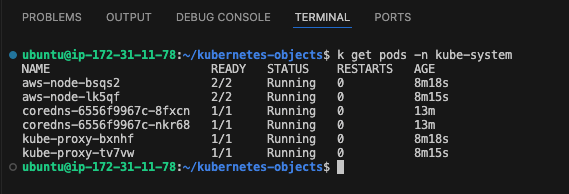
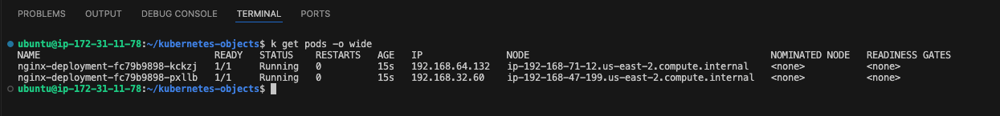
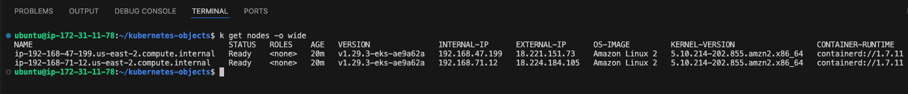
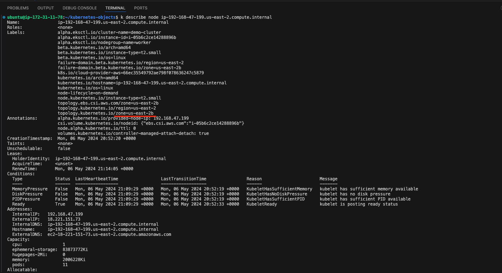
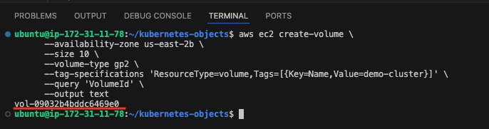
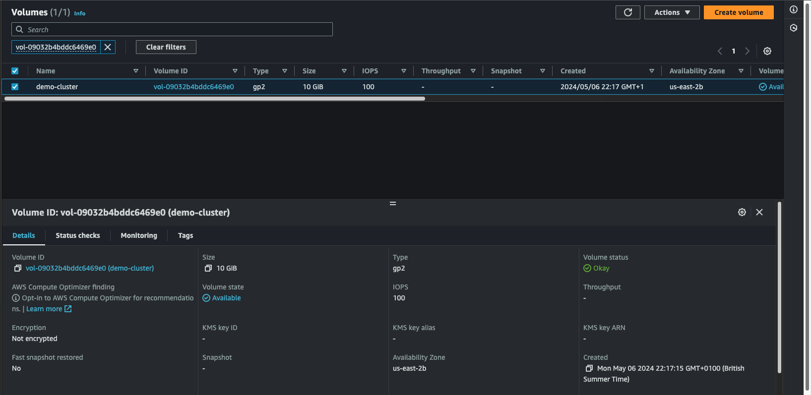
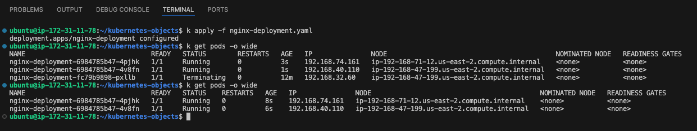
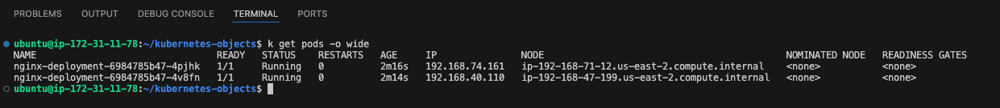
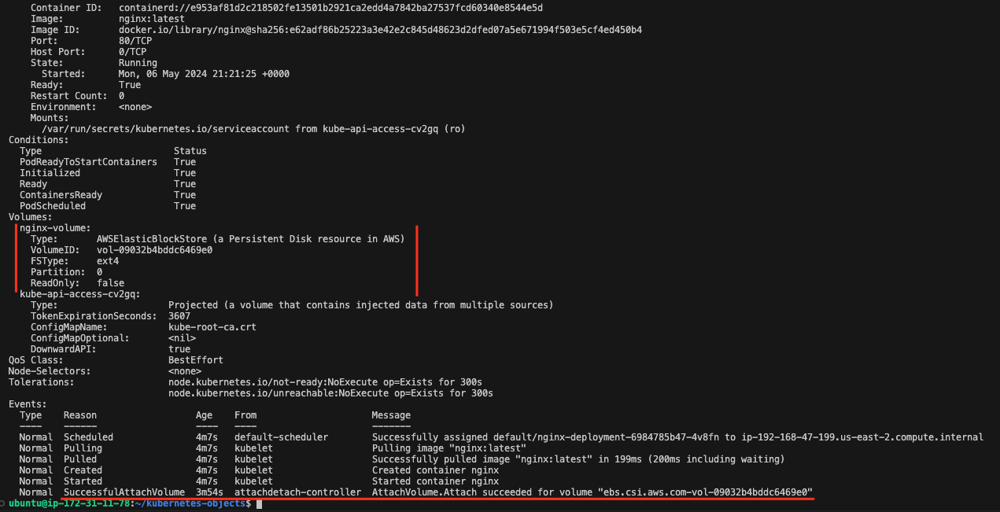

# Container Orchestration with Kubernetes Part 3 - Data Persistence

In the second part of this Kubernetes project [Deploying Applications in Kubernetes](https://github.com/iamYole/DIO-DevOps-Projects/blob/main/Project%2025%20-%20Container%20Orchestration%20with%20Kuburnetes%20Part%202/README.md), we discovered that by default, applications deployed in K8r clusters are stateless. Meaning they don't retain user created data after the application has been closed, container restarted or pod rescheduled.

In Kubernetes, data persistence refers to the ability to store and retain data beyond the lifespan of individual containers or pods. Achieving data persistence in Kubernetes typically involves using persistent storage solutions that allow data to survive container restarts, pod rescheduling, and even cluster failures. Here are some common approaches to achieving data persistence in Kubernetes:

- **PersistentVolumes (PVs) and PersistentVolumeClaims (PVCs)**:
  - Kubernetes provides an abstraction called PersistentVolumes (PVs) that represent storage volumes in the cluster, such as Amazon EBS volumes, Google Persistent Disks, or NFS shares.
  - PersistentVolumeClaims (PVCs) are requests for storage made by applications. They specify the desired characteristics (e.g., storage class, access mode, size) of the storage they need.
  - When a PVC is created, Kubernetes dynamically provisions a PV that meets the PVC's requirements, and the application can use the PV as persistent storage.
- **StatefulSets**:
  - StatefulSets are a Kubernetes workload API object used for managing stateful applications, such as databases or key-value stores.
  - StatefulSets provide stable, unique network identifiers and stable storage, making them suitable for applications that require persistent storage.
  - Each replica in a StatefulSet maintains its own identity and storage, allowing for scalable and resilient deployments of stateful applications.
- **Volumes**:
  - Kubernetes supports various types of volumes that can be mounted into containers to provide persistent storage, such as emptyDir, hostPath, and cloud-specific volumes such as AWS Elastic Block Store (EBS).
  - While these volumes may not offer the same level of durability and scalability as PVs, they can still be useful for certain use cases, such as caching or temporary storage.
- **Database Management Systems (DBMS)**:
  - For stateful applications like databases, using a managed database service outside of Kubernetes (e.g., Amazon RDS, Google Cloud SQL) may be a viable option.
  - Kubernetes can interact with these external services through services like ExternalName or through direct connectivity.

Let's see how we can use the AWS EBS to persist data in our application. In Kubernetes, EBS volumes can be dynamically provisioned using the AWS EBS Container Storage Interface (CSI) driver. This allows Kubernetes clusters to dynamically create EBS volumes and attach them to pods based on PersistentVolumeClaims (PVCs) defined by users.

## Installing the AWS EBS Container Storage Interface (CSI)

For this to work, we need to ensure the cluster are running on nodes greater the `t2.micro`. That's because the CSI driver will require more pods running on the nodes. If there aren't enough space in the nodes, this won't function as expected. Depending on how many pods you intend to run, the minimum requirement should be a `t2.small`.

Let's first check to see if the driver is installed by runing the command below:

- `k get pods -n kube-system`

  
  `after the installation is complete, we will run the command again to confirm the CSI pods are running`.

- **Enable IAM OIDC provider**  
  A prerequisite for the EBS CSI driver to work is to have an existing AWS Identity and Access Management (IAM) OpenID Connect (OIDC) provider for your cluster. This IAM OIDC provider can be enabled with the following command:

  > ```bash
  > eksctl utils associate-iam-oidc-provider \
  >    --region=us-east-2 \
  >    --cluster=demo-cluster \
  >    --approve
  > ```

  

- **Create Amazon EBS CSI driver IAM role**  
  Next, we create the IAM Role to enable `eksctl` to manage the volumes;

  > ```bash
  > eksctl create iamserviceaccount \
  >     --region us-east-2 \
  >     --name ebs-csi-controller-sa \
  >     --namespace kube-system \
  >     --cluster demo-cluster \
  >     --attach-policy-arn arn:aws:iam::aws:policy/service-role/AmazonEBSCSIDriverPolicy \
  >     --approve \
  >     --role-only \
  >     --role-name AmazonEKS_EBS_CSI_DriverRole
  > ```

  

- **Add the Amazon EBS CSI add-on**  
  Now we can finally add the EBS CSI add-on. Therefor we also need the AWS Account id which we can obtain by running aws sts get-caller-identity --query Account --output text

  > ```bash
  > eksctl create addon \
  >    --name aws-ebs-csi-driver \
  >    --cluster demo-cluster \
  > --service-account-role-arn arn:aws:iam::$(aws sts get-caller-identity --query Account --output text):role/AmazonEKS_EBS_CSI_DriverRole --force
  > ```

  

- Finally, let's confirm the EBS CSI has been installed and configured properly in the cluster by running the code below:

  - `k get pods -n kube-system`

    

We can now see the ebs-csi-controller pods runinng the the `kube-system` namespace.

## Deploying a Persistent Pod

- The is a continuation of [Deploying Applications in Kubernetes](https://github.com/iamYole/DIO-DevOps-Projects/blob/main/Project%2025%20-%20Container%20Orchestration%20with%20Kuburnetes%20Part%202/README.md), so we should have a running K8r cluster already to proceed.
- For EBS to work in our K8r the nodes must be running on an EC2 Instance
- The EBS volumes needs to be in the same Region and Availability Zone (AZ) as the EC2 Instance running the nodes
- By default, EBS are mounted to just one instance. If we intend to use one EBS volume for different EC2 Instances, and in different AZs, we need to ensure the EC2 Instance Type and EBS Volume type supports Multi Attach and then configure the volume for Multi AZ.

For now, let's create a deployment file `nginx-deployment.yaml` and confirm the AZ it's running on.

> ```yaml
> apiVersion: apps/v1
> kind: Deployment
> metadata:
>   name: nginx-deployment
>   labels:
>     tier: frontend
> spec:
>   replicas: 2
>   selector:
>     matchLabels:
>       tier: frontend
>   template:
>     metadata:
>       labels:
>         tier: frontend
>     spec:
>       containers:
>         - name: nginx
>           image: nginx:latest
>           ports:
>             - containerPort: 80
> ```

- Verify the Pods are running, and the nodes they are running on

  - `k get pods -o wide`

  

- Check the logs of one of the running pods

  - `k logs nginx-deployment-fc79b9898-kckzj`
    > ```bash
    > /docker-entrypoint.sh: /docker-entrypoint.d/ is not empty, will attempt to perform configuration
    > /docker-entrypoint.sh: Looking for shell scripts in /docker-entrypoint.d/
    > /docker-entrypoint.sh: Launching /docker-entrypoint.d/10-listen-on-ipv6-by-default.sh
    > 10-listen-on-ipv6-by-default.sh: info: Getting the checksum of /etc/nginx/conf.d/default.conf
    > 10-listen-on-ipv6-by-default.sh: info: Enabled listen on IPv6 in /etc/nginx/conf.d/default.conf
    > /docker-entrypoint.sh: Sourcing /docker-entrypoint.d/15-local-resolvers.envsh
    > /docker-entrypoint.sh: Launching /docker-entrypoint.d/20-envsubst-on-templates.sh
    > /docker-entrypoint.sh: Launching /docker-entrypoint.d/30-tune-worker-processes.sh
    > /docker-entrypoint.sh: Configuration complete; ready for start up
    > 2024/05/06 21:09:02 [notice] 1#1: using the "epoll" event method
    > 2024/05/06 21:09:02 [notice] 1#1: nginx/1.25.5
    > 2024/05/06 21:09:02 [notice] 1#1: built by gcc 12.2.0 (Debian 12.2.0-14)
    > 2024/05/06 21:09:02 [notice] 1#1: OS: Linux 5.10.214-202.855.amzn2.x86_64
    > 2024/05/06 21:09:02 [notice] 1#1: getrlimit(RLIMIT_NOFILE): 1048576:1048576
    > 2024/05/06 21:09:02 [notice] 1#1: start worker processes
    > 2024/05/06 21:09:02 [notice] 1#1: start worker process 28
    > ```

- To confirm the AZ a node is running, run the `describe` command on th node to get more details

  - `k get nodes -o wide`

    

  - `k describe node ip-192-168-47-199.us-east-2.compute.internal`

    

- Once we've confirmed the AZ, create the EBS Volume using the code below:

  > ```bash
  > aws ec2 create-volume \
  >       --availability-zone us-east-2b \
  >       --size 10 \
  >       --volume-type gp2 \
  >       --tag-specifications 'ResourceType=volume,Tags=[{Key=Name,Value=demo-cluster}]' \
  >       --query 'VolumeId' \
  >       --output text
  > ```

It is important the volume has a tag called `KuberentesCluster` with a value of the name the name of the cluster.

- Note the VolumeID

  

  

- Next, let's update the `nginx-deployment` with the volume ID

  > ```yaml
  > apiVersion: apps/v1
  > kind: Deployment
  > metadata:
  >   name: nginx-deployment
  >   labels:
  >     tier: frontend
  > spec:
  >   replicas: 2
  >   selector:
  >     matchLabels:
  >       tier: frontend
  >   template:
  >     metadata:
  >       labels:
  >         tier: frontend
  >     spec:
  >       containers:
  >         - name: nginx
  >           image: nginx:latest
  >           ports:
  >             - containerPort: 80
  >       volumes: # Attaching the Volume
  >         - name: nginx-volume
  >           awsElasticBlockStore:
  >             volumeID: "vol-09032b4bddc6469e0"
  >             fsType: ext4
  > ```

- Apply the changes by running `k apply -f nginx-deployment.yaml`. The deployment would gradually phase out the old pods, and replace them with the new pods with the new configuration.

  

- Describe the Pods running in the same AZ as the Volume we created and confirm the volume section contains the EBS volume details

  - `k describe pod nginx-deployment-669987d4db-mhh7f`

    

    

    If we run describe on the other pod, we should see an error saying it's not in the same AZ.

- we can also confirm by running the cide belo:

  > ```bash
  > aws ec2 describe-volumes --volume-ids vol-09032b4bddc6469e0
  > ```

  

At this point, even though the pod can be used for a stateful applications, the configuration is not yet complete. This is because, the volume is not yet mounted onto any specific filesystem inside the container. The directory /usr/share/nginx/html which holds the software/website code is still ephemeral, and if there is any kind of update to the index.html file, the new changes will only be there for as long as the pod is still running. If the pod dies after, all previously written data will be erased.

To complete the configuration, we will need to add another section to the deployment. The volumeMounts which basically answers the question "Where should this Volume be mounted inside the container?" Mounting a volume to a directory means that all data written to the directory will be stored on that volume.

> ```yaml
> apiVersion: apps/v1
> kind: Deployment
> metadata:
>   name: nginx-deployment
>   labels:
>     tier: frontend
> spec:
>   replicas: 2
>   selector:
>     matchLabels:
>       tier: frontend
>   template:
>     metadata:
>       labels:
>         tier: frontend
>     spec:
>       containers:
>         - name: nginx
>           image: nginx:latest
>           ports:
>             - containerPort: 80
>           volumeMounts: #Mounting the Volume
>             - name: nginx-volume
>               mountPath: /usr/share/nginx/
>       volumes:
>         - name: nginx-volume
>           awsElasticBlockStore:
>             volumeID: "vol-09032b4bddc6469e0"
>             fsType: ext4
> ```

- Create a Service `nginx-svc.yaml` using NodePort to enable access the Application

  > ```yaml
  > apiVersion: v1
  > kind: Service
  > metadata:
  >   name: nginx-service
  > spec:
  >   selector:
  >     tier: frontend
  >   type: NodePort
  >   ports:
  >     - protocol: TCP
  >       port: 80
  >       nodePort: 30000
  > ```

- Access the application from a browser using the EC2 Instance Public IP and port `30000`

The page cannot be displayed. Thats simply because mounting a new filesystem to a directory with existing data erases the exiting data. Hence all the nginx web files have been lost. A more refined approach to address this challenge is to leverage Persistent Volumes and Persistent Volume Claims (PVCs) in Kubernetes.

## Managing Volumes Dynamically with PVs and PVCs

Kubernetes provides API objects for storage management such that, the lower level details of volume provisioning, storage allocation, access management etc are all abstracted away from the user, and all you have to do is present manifest files that describes what you want to get done.

PVs are volume plugins that have a lifecycle completely independent of any individual Pod that uses the PV. This means that even when a pod dies, the PV remains. A PV is a piece of storage in the cluster that is either provisioned by an administrator through a manifest file, or it can be dynamically created if a storage class has been pre-configured.

Creating a PV manually is like what we have done previously with creating the volume from the console. As much as possible, we should allow PVs to be created automatically just be adding it to the container spec in deployments. But without a storageclass present in the cluster, PVs cannot be automatically created.

If your infrastructure relies on a storage system such as NFS, iSCSI or a cloud provider-specific storage system such as EBS on AWS, then you can dynamically create a PV which will create a volume that a Pod can then use. This means that there must be a storageClass resource in the cluster before a PV can be provisioned.

By default, in EKS, there is a default storageClass configured as part of EKS installation. This storageclass is based on gp2 which is Amazon’s default type of volume for Elastic block storage. gp2 is backed by solid-state drives (SSDs) which means they are suitable for a broad range of transactional workloads.

Run the command below to check if you already have a storageclass in your cluster

> ```yaml
> kubectl get storageclass
> ```


Of course, if the cluster is not EKS, then the storage class will be different. For example if the cluster is based on Google’s GKE or Azure’s AKS, then the storage class will be different.

If there is no storage class in your cluster, below manifest is an example of how one would be created

> ```yaml
> kind: StorageClass
> apiVersion: storage.k8s.io/v1
> metadata:
>   name: gp2
>   annotations:
>     storageclass.kubernetes.io/is-default-class: "true"
> provisioner: kubernetes.io/aws-ebs
> parameters:
>   type: gp2
>   fsType: ext4
> ```

A PersistentVolumeClaim (PVC) on the other hand is a request for storage. Just as Pods consume node resources, PVCs consume PV resources. Pods can request specific levels of resources (CPU and Memory). Claims can request specific size and access modes (e.g., they can be mounted ReadWriteOnce, ReadOnlyMany or ReadWriteMany, see AccessModes).

### Lifecycle of a PV and PVC

PVs are resources in the cluster. PVCs are requests for those resources and also act as claim checks to the resource. The interaction between PVs and PVCs follows this lifecycle:

1. Provisioning: There are two ways PVs may be provisioned: statically or dynamically.

   - Static/Manual Provisioning: A cluster administrator creates a number of PVs using a manifest file which will contain all the details of the real storage. PVs are not scoped to namespaces, they are cluster-wide resource, therefore the PV will be available for use when requested. PVCs on the other hand are namespace scoped.
   - Dynamic: When there is no PV matching a PVC’s request, then based on the available StorageClass, a dynamic PV will be created for use by the PVC. If there is no StorageClass, then the request for a PV by the PVC will fail.

2. Binding: PVCs are bound to specific PVs. This binding is exclusive. A PVC to PV binding is a one-to-one mapping. Claims will remain unbound indefinitely if a matching volume does not exist. Claims will be bound as matching volumes become available. For example, a cluster provisioned with many 50Gi PVs would not match a PVC requesting 100Gi. The PVC can be bound when a 100Gi PV is added to the cluster.

3. Using: Pods use claims as volumes. The cluster inspects the claim to find the bound volume and mounts that volume for a Pod. For volumes that support multiple access modes, the user specifies which mode is desired when using their claim as a volume in a Pod. Once a user has a claim and that claim is bound, the bound PV belongs to the user for as long as they need it. Users schedule Pods and access their claimed PVs by including a persistentVolumeClaim section in a Pod’s volumes block

4. Storage Object in Use Protection: The purpose of the Storage Object in Use Protection feature is to ensure that PersistentVolumeClaims (PVCs) in active use by a Pod and PersistentVolume (PVs) that are bound to PVCs are not removed from the system, as this may result in data loss. Note: PVC is in active use by a Pod when a Pod object exists that is using the PVC. If a user deletes a PVC in active use by a Pod, the PVC is not removed immediately. PVC removal is postponed until the PVC is no longer actively used by any Pods. Also, if an admin deletes a PV that is bound to a PVC, the PV is not removed immediately. PV removal is postponed until the PV is no longer bound to a PVC.

5. Reclaiming: When a user is done with their volume, they can delete the PVC objects from the API that allows reclamation of the resource. The reclaim policy for a PersistentVolume tells the cluster what to do with the volume after it has been released of its claim. Currently, volumes can either be Retained, Recycled, or Deleted.
   - Retain: The Retain reclaim policy allows for manual reclamation of the resource. When the PersistentVolumeClaim is deleted, the PersistentVolume still exists and the volume is considered "released". But it is not yet available for another claim because the previous claimant’s data remains on the volume.
   - Delete: For volume plugins that support the Delete reclaim policy, deletion removes both the PersistentVolume object from Kubernetes, as well as the associated storage asset in the external infrastructure, such as an AWS EBS. Volumes that were dynamically provisioned inherit the reclaim policy of their StorageClass, which defaults to Delete.

**NOTES:**

- When PVCs are created with a specific size, it cannot be expanded except the storageClass is configured to allow expansion with the allowVolumeExpansion field is set to true in the manifest YAML file. This is "unset" by default in EKS.
- When a PV has been provisioned in a specific availability zone, only pods running in that zone can use the PV. If a pod spec containing a PVC is created in another AZ and attempts to reuse an already bound PV, then the pod will remain in pending state and report volume node affinity conflict. Anytime you see this message, this will help you to understand what the problem is.
- PVs are not scoped to namespaces, they are cluster-wide resource. PVCs on the other hand are namespace scoped.

Now lets create some persistence for our nginx deployment. We will use 2 different approaches.

### Approach 1 - Creating PVC Config File

- Create a manifest file `pvc.yaml` for a PVC, and based on the gp2 storageClass a PV will be dynamically created
  > ```yaml
  > apiVersion: v1
  > kind: PersistentVolumeClaim
  > metadata:
  >   name: nginx-volume-claim
  > spec:
  >   accessModes:
  >     - ReadWriteOnce
  >   resources:
  >     requests:
  >       storage: 2Gi
  > ```

Apply the manifest file and run `k get  pvc` and you will notice that it is in pending state.


To troubleshoot this, simply run a describe on the pvc. Then you will see in the Message section that this pvc is waiting for the first consumer to be created before binding the PVC to a PV

- `k describe pvc nginx-volume-claim`

> ```bash
> Name:          nginx-volume-claim
> Namespace:     default
> StorageClass:  gp2
> Status:        Pending
> Volume:
> Labels:        <none>
> Annotations:   <none>
> Finalizers:    [kubernetes.io/pvc-protection]
> Capacity:
> Access Modes:
> VolumeMode:    Filesystem
> Used By:       <none>
> Events:
>  Type    Reason                Age               From                         Message
>  ----    ------                ----              ----                         -------
>  Normal  WaitForFirstConsumer  1s (x6 over 67s)  persistentvolume-controller  waiting for first consumer to be created before binding
>
> ```

If you run kubectl get pv you will see that no PV is created yet. The waiting for first consumer to be created before binding is a configuration setting from the storageClass. See the VolumeBindingMode section below.


To proceed, simply apply the new deployment configuration below.

> ```yaml
> apiVersion: apps/v1
> kind: Deployment
> metadata:
>   name: nginx-deployment
>   labels:
>     tier: frontend
> spec:
>   replicas: 2
>   selector:
>     matchLabels:
>       tier: frontend
>   template:
>     metadata:
>       labels:
>         tier: frontend
>     spec:
>       containers:
>         - name: nginx
>           image: nginx:latest
>           ports:
>             - containerPort: 80
>           volumeMounts:
>             - name: nginx-volume-claim
>               mountPath: "/tmp/nginx-mnt-point"
>       volumes:
>         - name: nginx-volume-claim
>           persistentVolumeClaim:
>             claimName: nginx-volume-claim
> ```

Notice that the volumes section now has a persistentVolumeClaim. With the new deployment manifest, the `/tmp/nginx-mnt-point` directory will be persisted, and any data written in there will be stored permanently on the volume, which can be used by another Pod if the current one gets replaced.

Now lets check the dynamically created PV

`kubectl get pv`


You can copy the PV Name and search in the AWS console. You will notice that the volume has been dynamically created there. This volume was automatically created, and its different from the one created earlier.


We can run a describe command on one of the pods and see the PVC was attached.


### Approach 2 - Creating a ConfigMap

- Create a volumeClaimTemplate within the Pod spec. This approach is simply adding the manifest for PVC right within the Pod spec of the deployment.
- Then use the PVC name just as Approach 1 above.

So rather than have 2 manifest files, you will define everything within the deployment manifest.

Delete the deployment, the PersistentVolumeClaim and the PersistentVolume:

- `k delete deployment nginx-deployment`
- `k delete pvc nginx-volume-claim`

Using configMaps for persistence is not something you would consider for data storage. Rather it is a way to manage configuration files and ensure they are not lost as a result of Pod replacement.

To demonstrate this, we will use the HTML file that came with Nginx. This file can be found in /usr/share/nginx/html/index.html directory.

Lets go through the below process so that you can see an example of a configMap use case.

- Update the `nginx-deployment.yaml` file with the code below and then apply it
  > ```yaml
  > apiVersion: apps/v1
  > kind: Deployment
  > metadata:
  >   name: nginx-deployment
  >   labels:
  >     tier: frontend
  > spec:
  >   replicas: 1
  >   selector:
  >     matchLabels:
  >       tier: frontend
  >   template:
  >     metadata:
  >       labels:
  >         tier: frontend
  >     spec:
  >       containers:
  >         - name: nginx
  >           image: nginx:latest
  >           ports:
  >             - containerPort: 80
  > ```
- Exec into the running container and keep a copy of the index.html file somewhere.

  

  > `kubectl exec -it nginx-deployment-fc79b9898-q96v7 -- bash`

  > `cat /usr/share/nginx/html/index.html`

- Copy the output and save the file on your local pc because we will need it to create a configmap.

According to the official documentation of configMaps, A ConfigMap is an API object used to store non-confidential data in key-value pairs. Pods can consume ConfigMaps as environment variables, command-line arguments, or as configuration files in a volume.

- In our own use case here, We will use configMap to create a file `nginx-configmap.yaml` in a volume.

  > ```yaml
  > apiVersion: v1
  > kind: ConfigMap
  > metadata:
  >   name: website-index-file
  > data:
  >   # file to be mounted inside a volume
  >   index-file: |
  >     <!DOCTYPE html>
  >     <html>
  >     <head>
  >     <title>Welcome to nginx!</title>
  >     <style>
  >     html { color-scheme: light dark; }
  >     body { width: 35em; margin: 0 auto;
  >     font-family: Tahoma, Verdana, Arial, sans-serif; }
  >     </style>
  >     </head>
  >     <body>
  >     <h1>Welcome to nginx!</h1>
  >     <p>If you see this page, the nginx web server is successfully installed and
  >     working. Further configuration is required.</p>>
  >
  >     <p>For online documentation and support please refer to
  >     <a href="http://nginx.org/">nginx.org</a>.<br/>
  >     Commercial support is available at
  >     <a href="http://nginx.com/">nginx.com</a>.</p>
  >
  >     <p><em>Thank you for using nginx.</em></p>
  >     </body>
  >     </html>
  > ```

- Apply the new manifest file
  - `kubectl apply -f nginx-configmap.yaml`
- Update the deployment file to use the configmap in the volumeMounts section

  > ```yaml
  > apiVersion: apps/v1
  > kind: Deployment
  > metadata:
  >   name: nginx-deployment
  >   labels:
  >     tier: frontend
  > spec:
  >   replicas: 1
  >   selector:
  >     matchLabels:
  >       tier: frontend
  >   template:
  >     metadata:
  >       labels:
  >         tier: frontend
  >     spec:
  >       containers:
  >         - name: nginx
  >           image: nginx:latest
  >           ports:
  >             - containerPort: 80
  >           volumeMounts:
  >             - name: config
  >               mountPath: /usr/share/nginx/html
  >               readOnly: true
  >       volumes:
  >         - name: config
  >           configMap:
  >             name: website-index-file
  >             items:
  >               - key: index-file
  >                 path: index.html
  > ```

- Now the `index.html` file is no longer ephemeral because it is using a configMap that has been mounted onto the filesystem. This is now evident when you exec into the pod and list the /usr/share/nginx/html directory

  

You can now see that the index.html is now a soft link to ..data/index.html

Accessing the site will not change anything at this time because the same html file is being loaded through configmap.

But if you make any change to the content of the html file through the configmap, and restart the pod, all your changes will persist.

Lets try that;

List the available configmaps.

> `k get configmap`


We are interested in the website-index-file configmap

Update the configmap. You can either update the manifest file, or the kubernetes object directly. Lets use the latter approach this time

> `kubectl edit cm website-index-file`

This command will open a text editor. You can now make the desired changes to the content, focusing on modifying only the HTML data section. After making your changes, save the file. As with the previous project, I'll be changing just the background color of the webpage

> ```html
> <body bgcolor="blue"></body>
> ```


Save the changes and Without restarting the pod, your site should be loaded automatically.


Restart the deployment using the command

> `k rollout restart deploy nginx-deploy`

This will terminate the running pod and launch up a new one.


Notice a new pod started and the old pod deleted

The content in the browser remains unchanged despite restarting the deployment, which resulted in the termination of the previous pod and the creation of a new one.

### Deleting the cluster

Before deleting a cluster in production setting, it's important to ensure that you have backups or a plan to recreate any data or resources that will be lost. You should also consider draining the nodes to gracefully terminate the pods running on them, minimizing disruption to your applications.

To delete an EKS cluster using eksctl, you can use the following command:

> ```bash
> eksctl delete cluster --name <cluster-name>
> ```

Replace `<cluster-name>` with the name of your EKS cluster. This command will delete the cluster and all associated resources.

Note that deleting an EKS cluster is irreversible and will result in the loss of all resources associated with the cluster, including any running pods. Make sure to back up any important data and plan for downtime before proceeding with cluster deletion.
