# Building an EKS Kubernetes Cluster with Terraform

In previous projects, we built a Kubernetes Cluster from ground up, seen how to easily spin up a k8r cluster using EKS, deployed a simple 1 pod application and dived a little into data persistence in a k8r cluster. This project will solidify our understanding of what we've learnt so far and introduce now topics like:

- Using Terraform to create an EKS cluster and dynamically add scalable nodes
- Deploy multiple applications to a cluster using Helm
- Explore more objects in K8r
- Integrate Jenkins to the deployment of application on a kubernetes cluster.

lets start by creating the K8r

## Building an EKS Cluster with Terraform

Before we begin, lets ensure we have access to an S3 Bucket to store the terraform state file

- Create a home directory for this project
- Within the directory, create a file called `variables.tf` with the code below:

  > ```yaml
  > variable "cluster_name" {
  > type        = string
  > description = "EKS cluster name."
  > }
  > variable "iac_environment_tag" {
  > type        = string
  > description = "AWS tag to indicate environment name of each infrastructure object."
  > }
  > variable "name_prefix" {
  > type        = string
  > description = "Prefix to be used on each infrastructure object Name created in AWS."
  > }
  > variable "main_network_block" {
  > type        = string
  > description = "Base CIDR block to be used in our VPC."
  > }
  > variable "subnet_prefix_extension" {
  > type        = number
  > description = "CIDR block bits extension to calculate CIDR blocks of each subnetwork."
  > }
  > variable "zone_offset" {
  > type        = number
  > description = "CIDR block bits extension offset to calculate Public subnets, avoiding collisions with Private subnets."
  > }
  > ```

- Within the directory create a file `backend.tf` with the code below:
  > ```yaml
  > ## Configure S3 Backend
  > terraform {
  > backend "s3" {
  > bucket         = "ytech-terraform-state"
  > key            = "eks/s3/terraform.tfstate"
  > region         = "us-east-2"
  > encrypt        = true
  > }
  > }
  > ```
- Create a file – network.tf and provision Elastic IP for Nat Gateway, VPC, Private and public subnets.  
  We be using the official AWS module to create the VPC.

  > ```yaml
  > # reserve Elastic IP to be used in our NAT gateway
  > resource "aws_eip" "nat_gw_elastic_ip" {
  >  domain   = "vpc"
  >
  > tags = {
  >    Name            = "${var.cluster_name}-nat-eip"
  >    iac_environment = var.iac_environment_tag
  >    }
  >  }
  >
  > # Create VPC using the official AWS module
  > module "vpc" {
  > source  = "terraform-aws-modules/vpc/aws"
  >
  > name = "${var.name_prefix}-vpc"
  > cidr = var.main_network_block
  > azs  = data.aws_availability_zones.available_azs.names
  >
  > private_subnets = [
  >    # this loop will create a one-line list as ["10.0.0.0/20", "10.0.16.0/20", "10.0.32.0/20", ...]
  >    # with a length depending on how many Zones are available
  >    for zone_id in data.aws_availability_zones.available_azs.zone_ids :
  >        cidrsubnet(var.main_network_block, var.subnet_prefix_extension, tonumber(substr(zone_id, length(zone_id) - 1, 1)) - 1)
  > ]
  >
  > public_subnets = [
  >    # this loop will create a one-line list as ["10.0.128.0/20", "10.0.144.0/20", "10.0.160.0/20", ...]
  >    # with a length depending on how many Zones are available
  >    # there is a zone Offset variable, to make sure no collisions are present with private subnet blocks
  >    for zone_id in data.aws_availability_zones.available_azs.zone_ids :
  >        cidrsubnet(var.main_network_block, var.subnet_prefix_extension, tonumber(substr(zone_id, length(zone_id) - 1, 1)) + var.zone_offset - 1)
  > ]
  >
  > # Enable single NAT Gateway to save some money
  > # WARNING: this could create a single point of failure, since we are creating a NAT Gateway in one AZ only
  > # reference: https://registry.terraform.io/modules/terraform-aws-modules/vpc/aws/2.44.0#nat-gateway-scenarios
  > enable_nat_gateway     = true
  > single_nat_gateway     = true
  > one_nat_gateway_per_az = false
  > enable_dns_hostnames   = true
  > reuse_nat_ips          = true
  > external_nat_ip_ids    = [aws_eip.nat_gw_elastic_ip.id]
  >
  > # Add VPC/Subnet tags required by EKS
  > tags = {
  >    "kubernetes.io/cluster/${var.cluster_name}" = "shared"
  >    iac_environment                             = var.iac_environment_tag
  >    }
  > public_subnet_tags = {
  >    "kubernetes.io/cluster/${var.cluster_name}" = "shared"
  >    "kubernetes.io/role/elb"                    = "1"
  >    iac_environment                             = var.iac_environment_tag
  >    }
  > private_subnet_tags = {
  >    "kubernetes.io/cluster/${var.cluster_name}" = "shared"
  >    "kubernetes.io/role/internal-elb"           = "1"
  >    iac_environment                             = var.iac_environment_tag
  >    }
  >  }
  >    Note: The tags added to the subnets is very important. The Kubernetes Cloud Controller Manager (cloud-controller-manager) and AWS Load Balancer Controller (aws-load-balancer-controller) needs to identify the cluster’s. To do that, it queries the cluster’s subnets by using the tags as a filter.
  > ```

  - For public and private subnets that use load balancer resources: each subnet must be tagged  
    **Key: kubernetes.io/cluster/cluster-name Value: shared**

  - For private subnets that use internal load balancer resources: each subnet must be tagged  
    **Key: kubernetes.io/role/internal-elb Value: 1**

  - For public subnets that use internal load balancer resources: each subnet must be tagged  
    **Key: kubernetes.io/role/elb Value: 1**

- Create a file – data.tf – This will pull the available AZs for use.

  > ```yaml
  > # get all available AZs in the region
  > data "aws_availability_zones" "available_azs" {
  >    state = "available"
  > }
  >
  > # obtain the account id
  > data "aws_caller_identity" "current" {}
  > ```

- Create the `main.tf` to provision the EKS cluster using the EKS Module.  
  Read more about this module from the official documentation [here](https://github.com/terraform-aws-modules/terraform-aws-eks)

  > ```yaml
  > module "eks_cluster" {
  >     source                          = "terraform-aws-modules/eks/aws"
  >     version                         = "~> 20.0"
  >     cluster_name                    = var.cluster_name
  >     cluster_version                 = "1.29"
  >     vpc_id                          = module.vpc.vpc_id
  >     subnet_ids                      = module.vpc.private_subnets
  >     cluster_endpoint_private_access = true
  >     cluster_endpoint_public_access  = true
  >
  >     cluster_addons = {
  >         //coredns = {
  >         //    most_recent = true
  >         //}
  >     kube-proxy = {
  >         most_recent = true
  >         }
  >     vpc-cni = {
  >         most_recent = true
  >         }
  >     }
  >
  > # Self Managed Node Group(s)
  >     self_managed_node_group_defaults = {
  >         instance_type                          = var.asg_instance_types[0]
  >         update_launch_template_default_version = true
  >     }
  >     self_managed_node_groups = local.self_managed_node_groups
  >
  >     tags = {
  >         Environment = "prod"
  >         Terraform   = "true"
  >     }
  > }
  > ```

- Create a file – `locals.tf` to create local variables.
  > ```yaml
  > # render Admin & Developer users list with the structure required by EKS module
  > locals {
  >
  > self_managed_node_groups = {
  > worker_group1 = {
  > name = "${var.cluster_name}-worker-group"
  >
  > min_size      = var.autoscaling_minimum_size_by_az * length(data.aws_availability_zones.available_azs.zone_ids)
  > desired_size      = var.autoscaling_minimum_size_by_az * length(data.aws_availability_zones.available_azs.zone_ids)
  > max_size  = var.autoscaling_maximum_size_by_az * length(data.aws_availability_zones.available_azs.zone_ids)
  > instance_type = var.asg_instance_types[0].instance_type
  >
  > bootstrap_extra_args = "--kubelet-extra-args '--node-labels=node.kubernetes.io/lifecycle=spot'"
  >
  > block_device_mappings = {
  > xvda = {
  > device_name = "/dev/xvda"
  > ebs = {
  > delete_on_termination = true
  > encrypted             = false
  > volume_size           = 10
  > volume_type           = "gp2"
  > }
  > }
  > }
  >
  > use_mixed_instances_policy = true
  > mixed_instances_policy = {
  > instances_distribution = {
  > spot_instance_pools = 4
  > }
  >
  > override = var.asg_instance_types
  > }
  > }
  > }
  > }
  > ```
- Add more variables to the `variables.tf` file

  > ```yaml
  > variable "admin_users" {
  > type        = list(string)
  > description = "List of Kubernetes admins."
  > }
  > variable "developer_users" {
  > type        = list(string)
  > description = "List of Kubernetes developers."
  > }
  > variable "asg_instance_types" {
  > description = "List of EC2 instance machine types to be used in EKS."
  > }
  > variable "autoscaling_minimum_size_by_az" {
  > type        = number
  > description = "Minimum number of EC2 instances to autoscale our EKS cluster on each AZ."
  > }
  > variable "autoscaling_maximum_size_by_az" {
  > type        = number
  > description = "Maximum number of EC2 instances to autoscale our EKS cluster on each AZ."
  > }
  > ```

- Create a file – `terraform.tfvars` to set values for variables.

  > ```yaml
  > cluster_name            = "demo-app-eks"
  > iac_environment_tag     = "development"
  > name_prefix             = "ytech"
  > main_network_block      = "10.0.0.0/16"
  > subnet_prefix_extension = 4
  > zone_offset             = 8
  >
  > asg_instance_types             = [{ instance_type = "t3.small" }, { instance_type = "t2.small" }, ]
  > autoscaling_minimum_size_by_az = 1
  > autoscaling_maximum_size_by_az = 10
  > ```

- Append the code below to the `data.tf` file
  > ```yaml
  > # get EKS cluster info to configure Kubernetes and Helm providers
  > data "aws_eks_cluster" "cluster" {
  > name = module.eks_cluster.cluster_id
  > }
  > data "aws_eks_cluster_auth" "cluster" {
  > name = module.eks_cluster.cluster_id
  > }
  > ```
- Create a file – `provider.tf`
  > ```yaml
  > provider "aws" {
  >  region = "us-east-2"
  > }
  >
  > provider "random" {
  > }
  >
  > # get EKS authentication for being able to manage k8s objects from terraform
  > provider "kubernetes" {
  >  host                   = data.aws_eks_cluster.cluster.endpoint
  >  cluster_ca_certificate = base64decode(data.aws_eks_cluster.cluster.certificate_authority.0.data)
  >  token                  = data.aws_eks_cluster_auth.cluster.token
  > }
  > ```

Now, let's initial terraform and then run `terraform plan` and then `terraform apply` to create the resources.

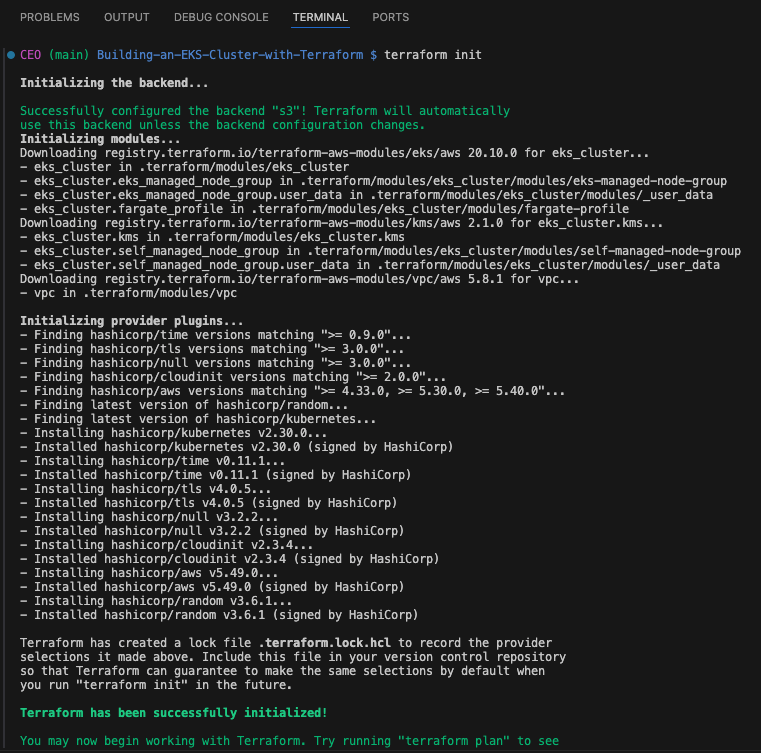

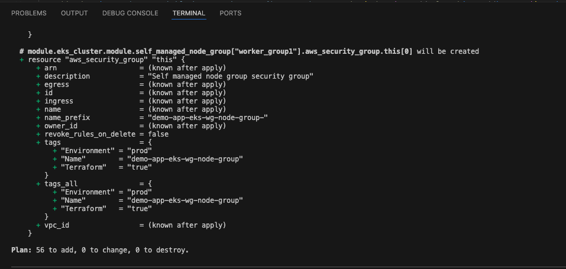

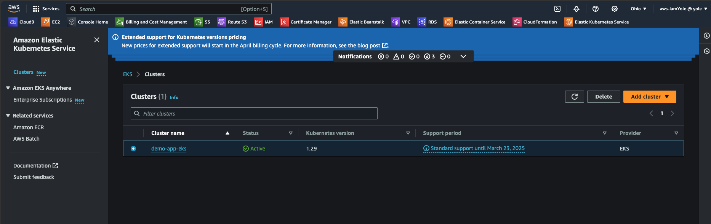

- Finally, we need to connect kubectl to the cluster by running the command below:
  > ```bash
  > aws eks update-kubeconfig \
  >       --name demo-app-eks \
  >       --region us-east-2 \
  >       --kubeconfig kubeconfig
  > ```

And now, we have our running k8r cluster.

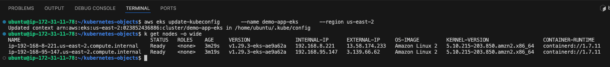

## Working with Helm

Helm is a package manager for Kubernetes that simplifies the process of deploying, managing, and upgrading applications on a Kubernetes clusters. It streamlines the installation and management of complex Kubernetes applications by providing a template system and a centralized repository of pre-configured application packages called "charts."

In previous projects, we experienced the use of manifest files to define and deploy resources like pods, replicatsets, deployments, configmap and services into a Kubernetes cluster. With helm, we will be doing the same thing except that it will not be passed through kubectl. Helm is the most popular tool used to deploy resources into kubernetes. That is because it has a rich set of features that allows deployments to be packaged as a unit. Rather than have multiple YAML files managed individually – which can quickly become messy.

### Installing Helm

Helm can be easily installed on an system running a kubernetes cluster by running the commands below:

> ```bash
> curl -fsSL -o get_helm.sh https://raw.githubusercontent.com/helm/helm/main/scripts/get-helm-3
> chmod 700 get_helm.sh
> ./get_helm.sh
> ```

To verify the Helm installation, run the command `helm version`

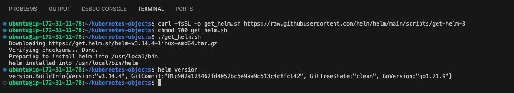

This installation works fine on a Linux System. To install Helm on Window or Mac, please refer to the official documentation page [here](https://helm.sh/docs/intro/install/)

**Helm Charts** are packages of pre-configured Kubernetes resources, such as Deployments, Services, ConfigMaps, etc bundled together for easy installation. With Helm Charts, we can deploy an application into a kubernetes clusters with a command as simple as:

> ```bash
> helm install stable/mysql
> ```

and Helm will make sure all the required resources are installed. Additionally, we can tweak the helm configuration by setting a single variable to a particular value and more or less resources will be deployed. For example, enabling slave for MySQL so that it can have read only replicas.

Behind the scenes, a helm chart is essentially a bunch of YAML manifests that define all the resources required by an application. Helm takes care of creating the resources in Kubernetes (where they don’t exist) and removing old resources.

**Let's see a practical demo on deploying applications with helm**

Let’s consider that our app (Tooling) has been Dockerized into an image called tooling-app, and we wish to deploy the app into the Kubernetes. Without helm, we would create the YAML manifests defining the deployment, service, and ingress, and apply them to the Kubernetes cluster using kubectl apply. Initially, the application would be version 1, and so the Docker image is tagged as tooling-app:1.0.0. A simple deployment manifest might look something like the following:

> ```yaml
> apiVersion: apps/v1
> kind: Deployment
> metadata:
>   name: tooling-app-deployment
>   labels:
>     app: tooling-app
> spec:
>   replicas: 3
>   strategy:
>     type: RollingUpdate
>     rollingUpdate:
>       maxUnavailable: 1
>   selector:
>     matchLabels:
>       app: tooling-app
>   template:
>     metadata:
>       labels:
>         app: tooling-app
>     spec:
>       containers:
>         - name: tooling-app
>           image: "tooling-app:1.0.0"
>           ports:
>             - containerPort: 80
> ```

Now lets imagine we produce another version of the app, version 1.1.0, and nothing else needs to be changed with the service or ingress. We will simply be copying the deployment manifest and replacing the image defined in the spec section, then re-apply this manifest to the cluster.

The main problem with this is that all of the values specific to the application – the labels and the image names etc – are mixed up with the "mechanical" definition of the manifest.

Helm tackles this by splitting the configuration of a chart out from its basic definition. For example, instead of baking the name of the app or the specific container image into the manifest, we can provide those during installation of chart into the cluster.

For example, a simple templated version of the previous deployment might look like the following:

> ```yaml
> apiVersion: apps/v1
> kind: Deployment
> metadata:
>  name: {{ .Release.Name }}-deployment
>  labels:
>    app: "{{ template "name" . }}"
> spec:
>  replicas: 3
>  strategy:
>    type: RollingUpdate
>    rollingUpdate:
>      maxUnavailable: 1
>  selector:
>    matchLabels:
>      app: "{{ template "name" . }}"
>  template:
>    metadata:
>      labels:
>        app: "{{ template "name" . }}"
>    spec:
>      containers:
>      - name: "{{ template "name" . }}"
>        image: "{{ .Values.image.name }}:{{ .Values.image.tag }}"
>        ports:
>        - containerPort: 80
> ```

This example demonstrates a number of features of Helm templates:

The template is based on YAML, with {{ }} mustache syntax defining dynamic sections. Helm provides various variables that are populated at install time. For example, the {{.Release.Name}} allows us to change the name of the resource at runtime by using the release name. Installing a Helm chart creates a release (this is a Helm concept rather than a Kubernetes concept). We can define helper methods in external files. The {{template "name"}} call gets a safe name for the app, given the name of the Helm chart (but which can be overridden). By using helper functions, we can reduce the duplication of static values (like tooling-app), and hopefully reduce the risk of typos.

We can manually provide configuration at runtime. The {{.Values.image.name}} value for example is taken from a set of default values, or from values provided when we call helm install. There are many different ways to provide the configuration values needed to install a chart using Helm. Typically, we would use two approaches:

- A values.yaml file that is part of the chart itself. This typically provides default values for the configuration, as well as serving as documentation for the various configuration values.

- When providing configuration on the command line, you can either supply a file of configuration values using the -f flag. We will see a lot more on this later on.

### Deploying Jenkins with Helm

Before we begin to develop our own helm charts, lets make use of publicly available charts to deploy all the tools that we need.

One of the amazing things about helm is the fact that we can deploy applications that are already packaged from a public helm repository directly with very minimal configuration. An example is Jenkins.

1. Visit [Artifact Hub](https://artifacthub.io/packages/search) to find applications packaged as Helm Charts
2. Search for Jenkins
3. Add the repository to helm so that you can easily download and deploy

   > ```bash
   > helm repo add jenkins https://charts.jenkins.io
   > ```

4. Update the helm repo

   > ```basg
   > helm repo update
   > ```

   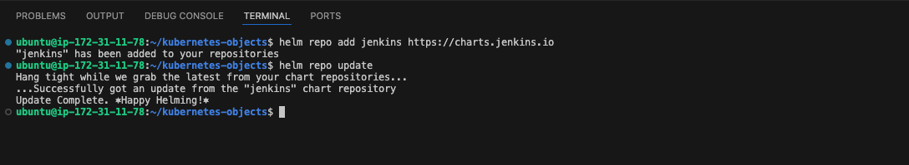

5. Install the Chart

   > ```bash
   > helm install jenkins jenkins/jenkins
   > ```

   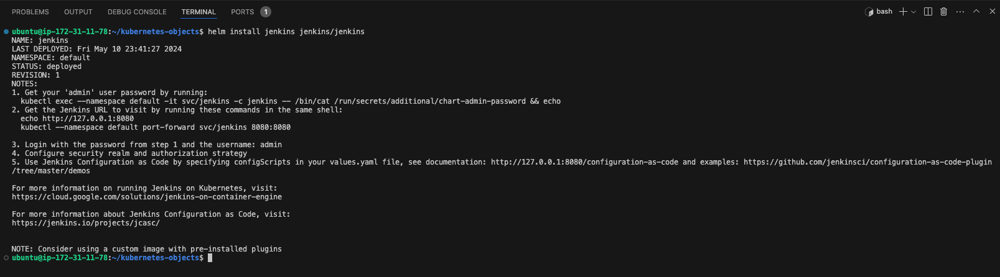

6. Check the Helm deployment

   > ```bash
   > helm ls
   > ```

   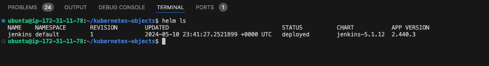

7. Now check to confirm the Jenkins pod is running. This may take a while

   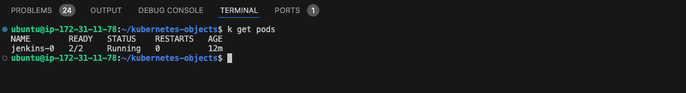

8. Check the logs of the running pod

   - `kubectl logs jenkins-0`

   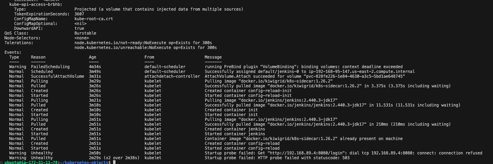

   notice the the unhealthy state

   This is because the pod has a Sidecar container alongside with the Jenkins container. As you can see from the error output, there is a list of containers inside the pod [jenkins config-reload] i.e jenkins and config-reload containers. The job of the config-reload is mainly to help Jenkins to reload its configuration without recreating the pod.

Therefore we need to let kubectl know, which pod we are interested to see its log.

Run the command to specify jenkins

`kubectl logs jenkins-0 -c jenkins`

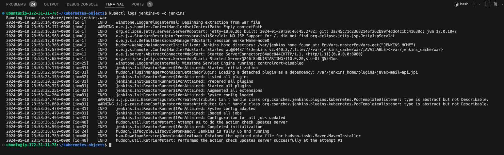

### Accessing the Jenkins App UI

From the output we got when we installed the jenkins using helm.
Set up the jenkins through the UI, we need to get the admin password

`kubectl exec -it svc/jenkins -c jenkins -- /bin/cat /run/secrets/additional/chart-admin-password && echo`

Accessing the jenkins through the UI, we need to port forward.

`kubectl port-forward svc/jenkins 8080:8080`

or use a LoadBalancer

In order to use a LoadBalancer, we need to obtain the pod labels. We can do this by running the command below
`k get pods --show-labels`

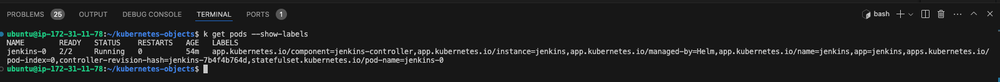

Or we can easily get the selectors the default service is searching for by running the command below

`k get svc -o wide`

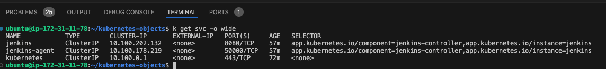

Now, we can create LoadBalance for the service using the selectors. Create a file called `jenkins-svc.yaml` with the code below:

> ```yaml
> apiVersion: v1
> kind: Service
> metadata:
>   name: jenkins-service
> spec:
>   selector:
>     app.kubernetes.io/component: jenkins-controller
>     app.kubernetes.io/instance: jenkins
>   type: LoadBalancer
>   ports:
>     - protocol: TCP
>       port: 8080
>       targetPort: 8080
> ```

Apply the file and confirm the load balancer's dns name

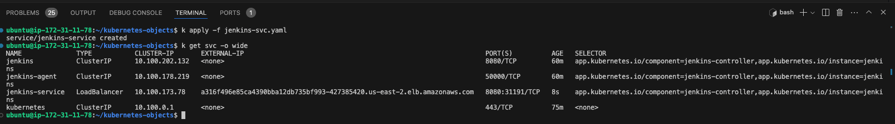

Now we can access the jenkins app from the web browser using the load balancer's dns name and port `8080`

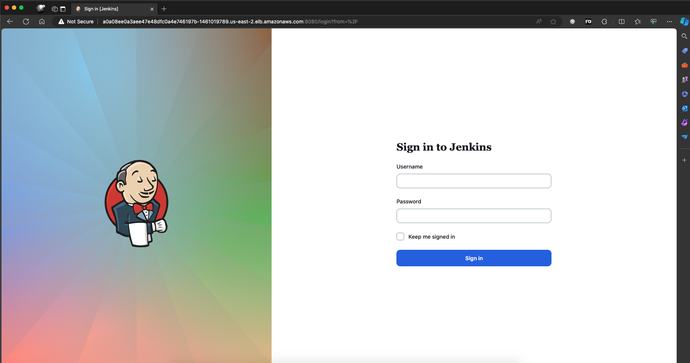

Log in with the username `admin`, and password obtained from the command below

> ```bash
> kubectl exec -it svc/jenkins -c jenkins -- /bin/cat /run/secrets/additional/chart-admin-password && echo
> ```

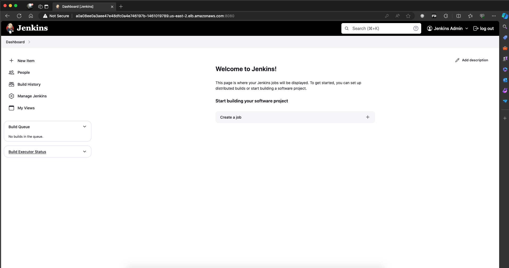

## Managing kubeconfig files

Kubectl expects to find the default kubeconfig file in the location ~/.kube/config. But what if you already have another cluster using that same file? It doesn’t make sense to overwrite it. What you will do is to merge all the kubeconfig files together using a kubectl plugin called konfig and select whichever one you need to be active.

Install a package manager for kubectl called krew so it will enable us install plugins to extend the functionality of kubectl. Read more about it here.

Make sure that git is installed.

Run this command to download and install krew:

> ```bash
> (
>  set -x; cd "$(mktemp -d)" &&
>  OS="$(uname | tr '[:upper:]' '[:lower:]')" &&
>  ARCH="$(uname -m | sed -e 's/x86_64/amd64/' -e 's/\(arm\)\(64\)\?.*/\1\2/' -e 's/aarch64$/arm64/')" &&
>  KREW="krew-${OS}_${ARCH}" &&
>  curl -fsSLO "https://github.com/kubernetes-sigs/krew/releases/latest/download/${KREW}.tar.gz" &&
>  tar zxvf "${KREW}.tar.gz" &&
>  ./"${KREW}" install krew
> )
> ```

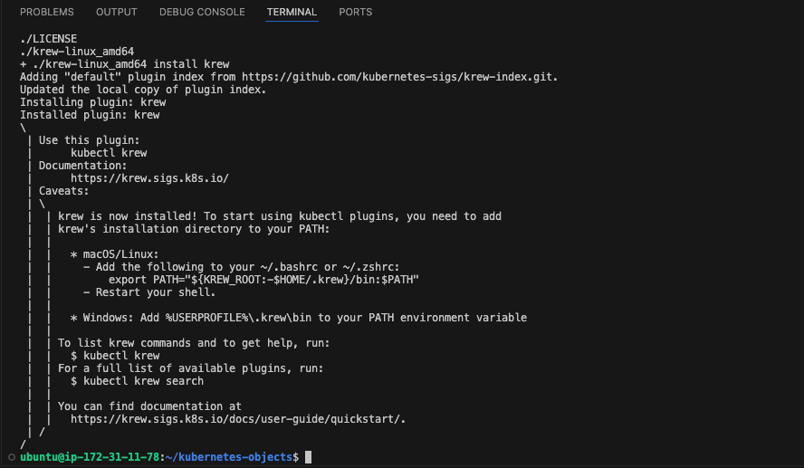

Add the $HOME/.krew/bin directory to your PATH environment variable. To do this, update your .bashrc or .zshrc file and append the following line:

`export PATH="${KREW_ROOT:-$HOME/.krew}/bin:$PATH"`

and restart the shell.

To check the installation

`kubectl krew version`

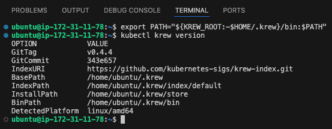

Context refers to a set of configuration details that determine which Kubernetes cluster and namespace you are currently interacting with. Contexts are used to manage multiple Kubernetes clusters and namespaces and switch between them easily. They are particularly helpful when you are working with multiple clusters, such as development, staging, and production environments, or when you need to switch between different namespaces within a cluster.

A Kubernetes context typically includes the following information:

Cluster: This specifies the details of the Kubernetes cluster you want to work with. It includes the cluster's API server address, certificate authority data, and the cluster name.

User: This defines the user's credentials, such as a client certificate and private key or an authentication token.

Namespace: This specifies the default namespace to use within the cluster. The namespace is where your Kubernetes resources, such as pods, services, and deployments, will be created unless you specify otherwise.

You can use the kubectl command-line tool to manage contexts. Here are some common kubectl commands related to contexts:

List available contexts:

`kubectl config get-contexts`

Switch to a different context:

`kubectl config use-context context-name`

Display the current context. This will let you know the context in which you are using to interact with Kubernetes.

`kubectl config current-context`

Contexts are useful for managing and switching between different Kubernetes environments and avoiding accidental changes to the wrong cluster or namespace. They help streamline your workflow when dealing with complex Kubernetes configurations and multiple clusters or namespaces.
