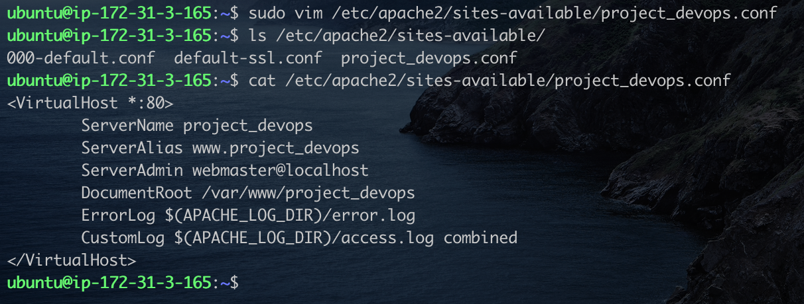

# LAMP (Linux, Apache, MySql, PhP) Stack

The LAMP web stack is a popular open-source software ecosystem for developing and hosting dynamic web applications. It is an acronym for four essential components:

- Linux: An open source operating system
- Apache: An open source web server
- MySQL: An open source relational database management system (RDBMS)
- PHP: An open source server-side scripting language.

Together, these components work seamlessly to create a robust and scalable platform for developing and running a wide range of web applications

### Part 1 - Apache Installation on Ubuntu

I already have my Linux Ubuntu server running, so we will begin with installing Apache on Linux.  
I'll start by running the following commands:

- `sudo apt update`: Downloads and update the apt package index file. This is to make sure we are downloading the latest versions of applications.
- `sudo apt install apache2`: This command dowloads and install apache on the local machine.
- `sudo systemctl status apache2`: This commands checks the status of the apache2 service. If apache is in a stopped state, we can run `sudo systemclt start apache2` to start the service.
  
  Our server is active and running.
- `curl http://127.0.0.1:80`. Optionally, we can issue this command to verify apache's default webpage is up and running. Running the command will display the content of the webpage in `html` format. This is just a quick way to test the apache webserver is running as we may not have access to a web browser.
- If you have access to a web browser, we can navigate to the same webpage by using the server's ip address and optionally the port number if it running on the default port 80.
  
  I'm running the server from AWS EC2 Instance, so i had to used the public ip to access the server.
  We've sucessfully installed Apache web server on Ubuntu.

### Part 2 - Installing MySql Server

Our web server is running and ready to host applications. However we need a database to store the application's data.  
Still on the Ubuntu server, I'll run the following commands to install and configure MySql server:

- `sudo apt install mysql-server -y`: This command downloads and install mysql. The optional flag `-y` is used to automatically accept any prompt during installation.
- `sudo systemctl status mysql`: This command shows the mysql server is active and running.
  
- `sudo mysql`: This commands logs you into the mysql console as the root user.
  
- The next step is to secure the database server by providing a password for the root user before running the the `mysql_secure_installation` script. This script which comes by default with mysql secures the server by setting a secure password, removing any anonymous users, disabling remote login access for the root user, etc.  
  Let's start by setting the root password.
- `ALTER USER 'root'@'localhost' IDENTIFIED WITH mysql_native_password BY 'PassWord.1';`. This command sets the root password to `PassWord.1`. Type `exit` in the mysql console to return back to the linux command line environment.
  
- Back in the linux command environment, run the following command `sudo mysql_secure_installation`. This script will take you through a series of questions to secure the server such as diabling remote login for root, removing anonymous accounts, etc.
  
- To log back into the mysql console, we run `sudo mysql -p`. This prompts you for the root password we created earlier.
  
  At this point, we've sucessfull installed and secure the mysql database server.

### Part 3 - Installing PHP

We've installed Apache webserver to host our application, and the MySql database server to store our application's data. It's time to install PhP, server-side scripting language that would used for creating dynamic web pages. It will also be used to create server side validation, business logic and sending/retrieving data from the MySql database.  
In order for PHP to archieve this, need to intall php as well as the dependencies necessary from comminication to MySql (`php-mysql`) and Apache (`libapache2-mod-php`).

- All threee files can be installed together by issuing the following command `sudo apt install php libapache2-mod-php php-mysql`.
  
- Additional packages/dependencies will be installed for PHP to work properly. Confirm by hitting the `Y` key on your keyboard to complete the installation.
- To confirm the installation was sucessful, we can run the following command `php -v`. This will print the version of PhP currently installed.
  
  At this point, we've sucessfully installed the follwowing:

  - [x] Linux (Ubuntu)
  - [x] Apache Web Server
  - [x] MySql Database Server
  - [x] PhP

### Part 4 - Enabling PhP on the Website

Remember when we installed Apache? the install came with a default webpage (`index.html`) which we saw when we provided the server's ip from a web browswer. This will take precedence over PhP's `index.php`. To change this behaviour, using your favority text editor, we need to modify apache's `dir.conf` file located in `/etc/apache2/mods-enabled/dir.conf`

In the image above, I commented out the default configuration and created custoomer configure that give `index.php` precedence over `index.html`. Save the file and the reload the apache2 service by running the command `sudo systemctl reload apache2`.

To test this, we will need to create an `index.php` file in the web root folder where apache host web applications.

Modify the `index.php` file with the following content

> index.php
>
> . <?php  
>  phpinfo();

Save, open a web browser and enter the server's ip address or `localhost or 127.0.0.1` if running from your local machine.

Now, our `index.php` has precedence over `index.html`. The `phpinfo()` function provides a lot of information about on the system which we don't want hackers to be aware. To be safe, we will delete the file completely.

### Step 5 - Creating a Virtual Host for our sample website in Apache

By default, files for the web application are store in the `/var/www/html` directory. We will be creating our domain called `project_devops`.  
To do this, we will following the steps below:

- Create the domain directory using the following command `sudo mkdir /var/www/project_devops`.
- Next, we change the ownership of the file from the root user to the current user using the following command `sudo chown -R $USER: $USER /var/www/project_devops`
  
- The next step is creating a new configuration file in apache's `sites-available` directory using your favorite text editor `sudo vim /etc/apapche2/sites-available/project_devops.conf`. Copy and paste the lines of code below to the newly created config file  
  
  Save the file and confirm it was saved in the right location
  
  In the `project_devops.conf` file created above, we are simply instructing apache2 serve our domain using files store in `/var/www/project_devops`, instead of `/var/www/html`.  
   To enable the domain, simply run `sudu a2dissite 000-default && sudo a2ensite project_devops`. Run `sudo apache2ctl configtest` to ensure all the configuration files are without syntax errors.
  
  My config file had a little error, and i was able to correct it with the help if the `apache2ctl configtest` tool.

  Our domain is up and running, but the site is empty. Let's download a sample website from [www.tooplate.com](https://www.tooplate.com/) and test our domain.  
   Run the following commands:

  - `cd /var/www/project_devops`: This will navigate to the domain's directory
  - `wget https://templatemo.com/tm-zip-files-2020/templatemo_506_tinker.zip`: This will download the _Tinker Template_ from [www.tooplate.com](https://templatemo.com/tm-506-tinker)
  - `unzip templatemo_506_tinker.zip`: This extracts the files into a new directory named `templatemo_506_tinker`.
  - As apache is looking for a file named `index.html or .php` in the `project_devops` directory, we need to move the contents from `templatemo_506_tinker` to `project_devops`.
  - `cp -R templatemo_506_tinker/* .`: This copys the content of `templatemo_506_tinker` to `project_devops`.
  - Optionally, we can delete the `templatemo_506_tinker` directory and the downloaded zip file
  - `rm - rf templatemo_506_tinker`
  - `rm templatemo_506_tinker.zip`

  Test all is working by entering the public ip address from a browswer.
  

#### And there you have it, our website template is up and running.
