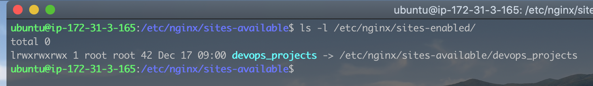
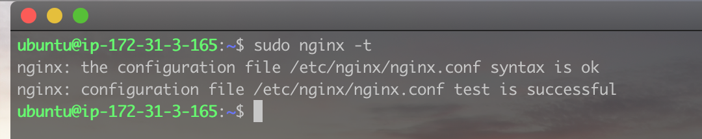
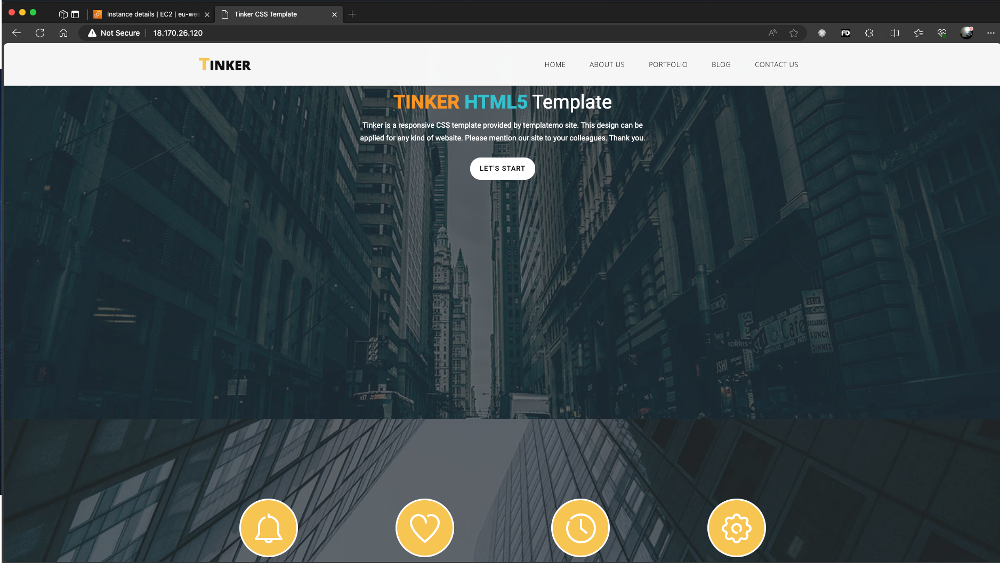
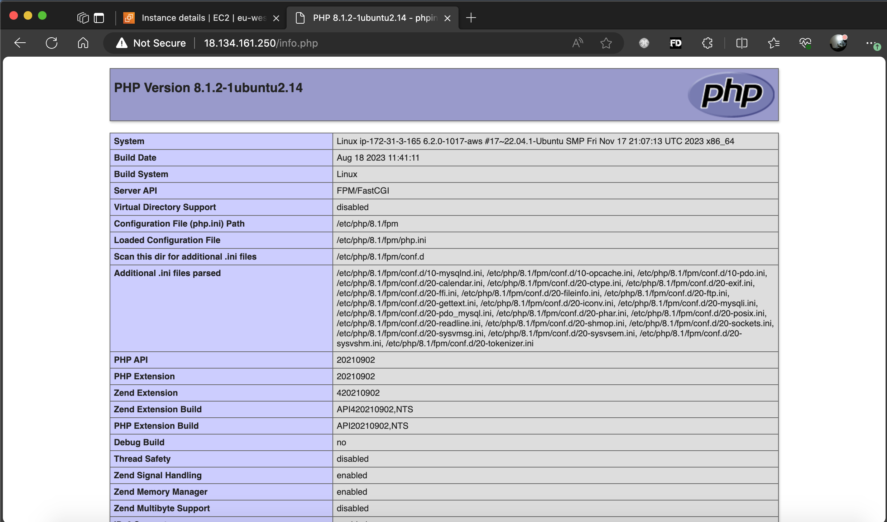
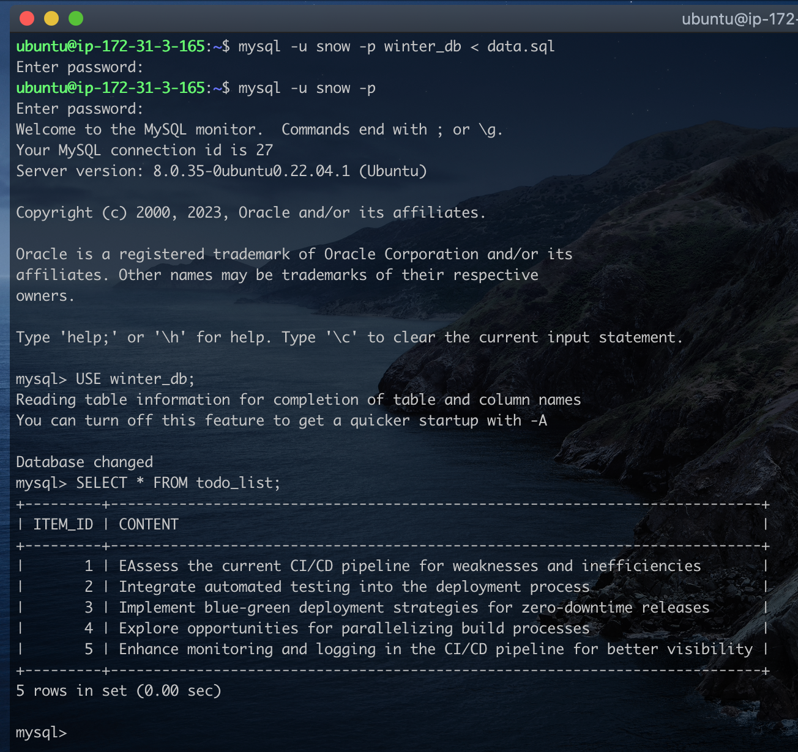
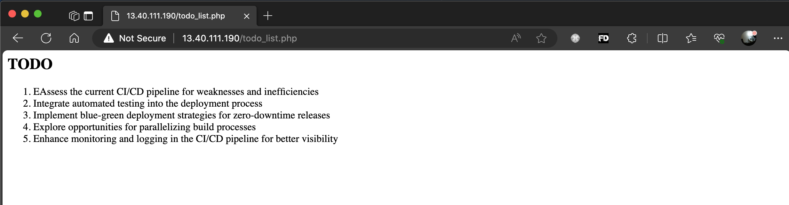

# LEMP (Linux, Nginx, MySql, PhP) Stack

The LAMP web stack is a popular open-source software ecosystem for developing and hosting dynamic web applications. It is an acronym for four essential components:

- Linux: An open source operating system
- Nginx: A lightweight and efficient web server that handles incoming HTTP requests and serves static content.
- MySQL: An open source relational database management system (RDBMS)
- PHP: An open source server-side scripting language.

Together, these components work seamlessly to create a robust and scalable platform for developing and running a wide range of web applications

### Part 1 - Installing the Nginx Web Server

We already have our Linux Ubuntu server running, so we will begin with installing Nginx on Linux.  
I'll start by running the following commands:

- `sudo apt update`: Downloads and update the apt package index file. This is to make sure we are downloading the latest versions of applications.
- `sudo apt install nginx`: This command dowloads and install apache on the local machine.
- `sudo systemctl status nginx`: This commands checks the status of the nginx service. > Note

  > If you have another service (e.g apache) runnung on port 80, you have to stop the service else `nginx` will note start as it also uses port 80. To do this, run `sudo systemclt stop apache2` to stop the service, and then `sudo systemctl start nginx` to start the `nginx` webserver

  
  Our server is active and running.

- `curl http://127.0.0.1:80`. Optionally, we can issue this command to verify nginx's default webpage is up and running. Running the command will display the content of the webpage in `html` format. This is just a quick way to test the apache webserver is running as we may not have access to a web browser.
- If you have access to a web browser, we can navigate to the same webpage by using the server's ip address and optionally the port number if it running on the default port 80.
  

  I'm running the server from AWS EC2 Instance, so i had to used the public ip to access the server.

  > Note
  > Nginx and Apache has similar directory structure, don't be suprised when the nginx web server is loading an apache webpage.  
  >  To fix this, simple navigate to `/var/www/html` directory, and remove the `index.html` that loads the apache web page. `Nginx` default webpage is `index.nginx-debian.html`.

  We've sucessfully installed our Nginx web server on Ubuntu.

### Part 2 - Installing MySQL Server

Our web server is running and ready to host applications. However we need a database to store the application's data.  
Still on the Ubuntu server, I'll run the following commands to install and configure MySql server:

- `sudo apt install mysql-server -y`: This command downloads and install mysql. The optional flag `-y` is used to automatically accept any prompt during installation.
- `sudo systemctl status mysql`: This command shows the mysql server is active and running.
  
- `sudo mysql`: This commands logs you into the mysql console as the root user.
  
- The next step is to secure the database server by providing a password for the root user before running the the `mysql_secure_installation` script. This script which comes by default with mysql secures the server by setting a secure password, removing any anonymous users, disabling remote login access for the root user, etc.  
  Let's start by setting the root password.
- `ALTER USER 'root'@'localhost' IDENTIFIED WITH mysql_native_password BY 'PassWord.1';`. This command sets the root password to `PassWord.1`. Type `exit` in the mysql console to return back to the linux command line environment.
  
- Back in the linux command environment, run the following command `sudo mysql_secure_installation`. This script will take you through a series of questions to secure the server such as diabling remote login for root, removing anonymous accounts, etc.
  
- To log back into the mysql console, we run `sudo mysql -p`. This prompts you for the root password we created earlier.
  
  At this point, we've sucessfull installed and secure the mysql database server.

### Part 3 - Installing PHP

We've installed Nginx webserver to host our application, and the MySql database server to store our application's data. It's time to install PhP, server-side scripting language that would used for creating dynamic web pages. It will also be used to create server side validation, business logic and sending/retrieving data from the MySql database.

Running PHP on Nginx involves using the **FastCGI Process Manager (PHP-FPM)** to handle PHP requests. Nginx is known for its efficiency in handling concurrent connections and static content, making it a lightweight and high-performance web server. In contrast, running PHP on Apache typically involves using the **mod_php module**, where Apache handles both static and dynamic content in a single process. Nginx's event-driven architecture and separate processes for handling dynamic content contribute to better resource utilization and scalability compared to Apache's process-based model.  
To configure Nginx to handle PhP requests, we need to install the `php-fpm` package as well as `php-mysql` to enable our application connect to a mysql database server.  
Run the folling commands

- `sudo apt install php-fpm php-mysql`
  

  > Take note of the output above.  
  > PHP 8.1 FPM was not enabled by default. That is because we have Apache installed, and alo using this particular version of PhP. Meaning running PhP applications using `fpm` is not enabled for apache. This is fine because we have `Nginx`.

  Now, let's configure Nginx to use PhP

### Part 4 - Configuring Nginx to use PhP

Just like we created Virutal Hosts in Apache, we will be creating something called Server Blocks in Nginx. These server blocks would enable a single Nginx web server host multiple web applications.  
In this exercise we will be creating a server block to host our fictional domain `devops_projects`. Let's start by taking the following steps:

- Create the domain's root directory

  > `sudo mkdir /var/www/devops_projects`

- Assign ownship of the newly created directory to the current non root user in charge of managing the web application.

  > `sudo chowm -R $USER:$USER /var/www/devops_projects`

- Create a custom confirguration file in the directory `/etc/nginx/sites-available/` using your favorite text editor

  > `sudo vim /etc/nginx/sites-available/devops_projects`

  copy and paste the code below into the newly created configuration file

  > ```nginx
  > #/etc/nginx/sites-available/devops_projects
  >
  > server {
  >    listen 80;
  >    server_name devops_projects www.devops_projects;
  >    root /var/www/devops_projects;
  >
  >    index index.html index.htm index.php;
  >
  >    location / {
  >      try_files $uri $uri/ =404;
  >    }
  >
  >    location ~ \.php$ {
  >     include snippets/fastcgi-php.conf;
  >     fastcgi_pass unix:/var/run/php/php8.1-fpm.sock;
  >    }
  >
  >    location ~ /\.ht {
  >     deny all;
  >    }
  >
  > }
  > ```

  Below is a brief explanation on what each line of code does:

  > ```nginx
  > server {
  >    listen 80;
  >    server_name devops_projects www.devops_projects;
  >    root /var/www/devops_projects;
  > }
  > ```

  - `listen 80;`: The server listens on port 80, the default HTTP port. This can be changed to 8080 or 8888 for example if you want to run apache and nginx simultanously.
  - `server_name devops_projects www.devops_projects;`: Specifies the server names for which this block will be active. Requests with the specified domain names will be handled by this server block.
  - `root /var/www/devops_projects;`: Sets the root directory for the server. Requests will be served from this location.
  - `index index.html index.htm index.php;`: Specifies the order in which Nginx should look for index files when a directory is requested. In this case, it looks for `index.html`, `index.htm`, and finally `index.php`.

  > ```nginx
  > location / {
  >    try_files $uri $uri/ =404;
  > }
  > ```

  - **Location Block for root directory** - Handles requests for the root directory ("/"). It uses try_files to attempt to serve existing files or directories, falling back to a 404 error if none are found.

  > ```nginx
  > location ~ \.php$ {
  >   include snippets/fastcgi-php.conf;
  >   fastcgi_pass unix:/var/run/php/php8.1-fpm.sock;
  > }
  > ```

  - Handles requests for files ending with ".php." It includes the `fastcgi-php.conf` file, which contains common FastCGI settings for PHP. It then passes the PHP requests to the PHP-FPM server running on the specified Unix socket (`unix:/var/run/php/php8.1-fpm.sock`).

  > ```nginx
  > location ~ /\.ht {
  >   deny all;
  > }
  > ```

  - **Location Block for .htaccess Files**: Blocks access to files starting with ".ht" to enhance security. This is a common practice to prevent unauthorized access to configuration files.

- Activate this configuration file by linking it to the defualt Nginx's config file:

  > `sudo ln -s /etc/nginx/sites-available/devops_projects /etc/nginx/sites-enabled/` > 

  The code above created a linked file from our new config file to the nginx's default config file.

- Check our configuration files for errors:

  > `$ sudo nginx -t`

  You should get the message below if everything was done correctly.
  

- Now, we disable the default nginx host configured to listen at port 80

  > `sudo unlink /etc/nginx/sites-enabled/default`

- Finally, we restart the nginx server:
  > `sudo systemctl reload nginx`

To test this, we need to deploy a sample website to our doamin's (`devops_project`) root directory. Let's download a sample website from [www.tooplate.com](https://www.tooplate.com/) and test our domain.  
 Run the following commands:

- `cd /var/www/devops_projects`: This will navigate to the domain's directory
- `wget https://templatemo.com/tm-zip-files-2020/templatemo_506_tinker.zip`: This will download the _Tinker Template_ from [www.tooplate.com](https://templatemo.com/tm-506-tinker)
- `unzip templatemo_506_tinker.zip`: This extracts the files into a new directory named `templatemo_506_tinker`.
- As nginx is looking for a file named `index.html or .php` in the `devops_projects` directory, we need to move the contents from `templatemo_506_tinker` to `devops_projects`.
- `cp -R templatemo_506_tinker/* .`: This copys the content of `templatemo_506_tinker` to `devops_projects`.
- Optionally, we can delete the `templatemo_506_tinker` directory and the downloaded zip file
- `rm - rf templatemo_506_tinker/`
- `rm templatemo_506_tinker.zip`

Test all is working by entering the public ip address from a browswer.


**And there you have it, our website template is up and running**.

### Part 5 - Testing PhP on Nginx

At this point, we've sucessfully installed the follwowing:

- [x] Linux (Ubuntu)
- [x] Nginx Web Server
- [x] MySql Database Server
- [x] PhP

However, we've not done a test to ensure PhP applications working. Let's do that now.

- Using your favorite text editor, create a file called `info.php`.

  > `vim /var/www/devops_projects/info.php`

- Copy and paste the code below into the file.
  > ```php
  > <?php
  >   phpinfo();
  > ```


There you go. PhP is working as expected.  
 _Remember to delete this file as it contains sensitive information about your server._

### Part 6 - Reading data from MySQL using PhP

In this exercise, we will be creating a database called `winter_db`, and then create a simple `todo list` php application that reads data from the database. Let's go:

- First, we connect to the `mysql` console using the root account.

  > `sudo mysql -u root -p`

  This should prompt you for your password.

- Next, we will be creating a new user `snow` and grant the user access to create a database.

  > CREATE USER 'snow'@'%' IDENTIFIED WITH mysql_native_password BY 'PassWord.1';

- After creating the user, we need to grant the user CREATE access.

  > ```sql
  > `GRANT CREATE ON *.* TO 'snow'@'%';
  > ```

- Now, we exit the `mysql` console and log back in using the user `snow`:

  > `mysql -u snow -p`

- Create the database using the following command:

  > `CREATE DATABASE winter_db;`

  To confirm, you can run the code `SHOW DATABASES;`

- Now exit the console, then create a file names `data.sql` with the code below:

  > ```sql
  > DROP TABLE IF EXISTS `todo_list`;
  >
  > CREATE TABLE `todo_list` (
  >      ITEM_ID INT AUTO_INCREMENT,
  >      CONTENT VARCHAR(255) NOT NULL,
  >      PRIMARY KEY(ITEM_ID)
  > );
  >
  > INSERT INTO `todo_list` (CONTENT) VALUES
  > ('EAssess the current CI/CD pipeline for weaknesses and inefficiencies'),
  > ('Integrate automated testing into the deployment process'),
  > ('Implement blue-green deployment strategies for zero-downtime releases'),
  > ('Explore opportunities for parallelizing build processes'),
  > ('Enhance monitoring and logging in the CI/CD pipeline for better visibility');
  > ```
  >
  > Save the file and close the text exitor.

- Run the code below to automatically create the table and import the data using the `data.sql` script.

  > `mysql -u snow -p winter_db.todo_list < data.sql`

- To verify, log back into the `mysql` console the query below:

  > ```sql
  > USE winter_db;
  >
  > SELECT * FROM todo_list;
  > ```
  >
  > 
  > We've created our databse `winter_db`, and a table withn the database `todo_list`. We've also populated the table with some data.

**Now, Let's read this data from a PhP application**.

- We start by creating the .php file in the domain's root director `/var/www/devops_projects`

  > ```php
  > //todo_list.php
  >
  > <?php
  >
  > $user = "snow";
  > $password = "PassWord.1";
  > $database = "winter_db";
  > $table = "todo_list";
  > $host = "localhost";
  >
  > try {
  >   $db = new PDO("mysql:host=$host; dbname=$database", $user, $password);
  >   echo "<h2>TODO</h2><ol>";
  >
  >   foreach($db->query("SELECT content FROM $table") as >$row){
  >       echo "<li>" . $row['content'] . "</li>";
  >     }
  >   echo "</ol>";
  >   }
  > catch (PDOException $e) {
  >       print "Error!: " . $e->getMessage() . "<br/>";
  >       die();
  >   }
  > ```

  Save the file as `todo_list.php`.

Now, you can access this page by visiting `http://[your_ip]/todo_list.php`.

**And there you go. We can read data directly from our database to our PhP application**
