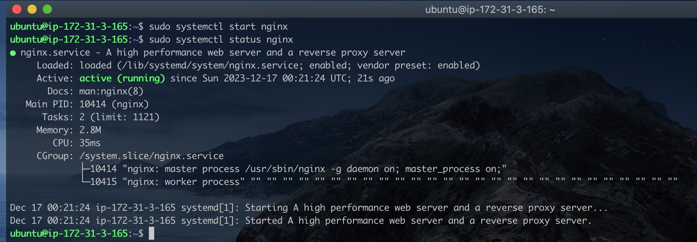
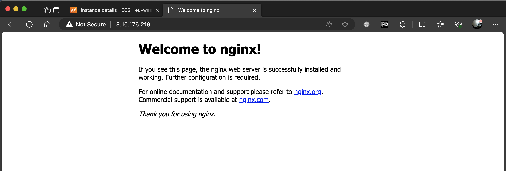
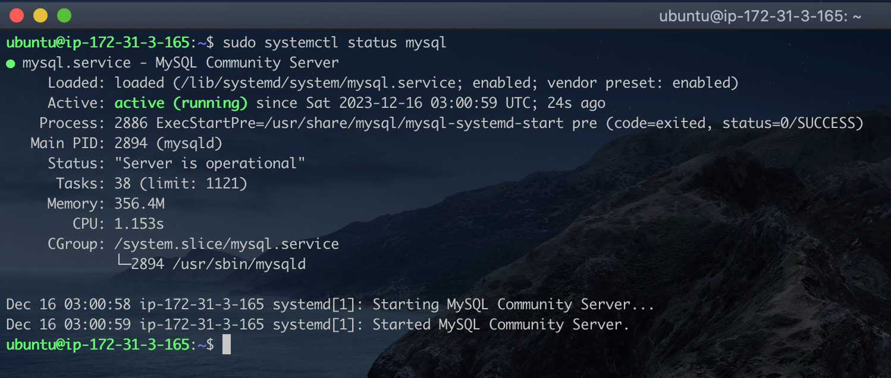
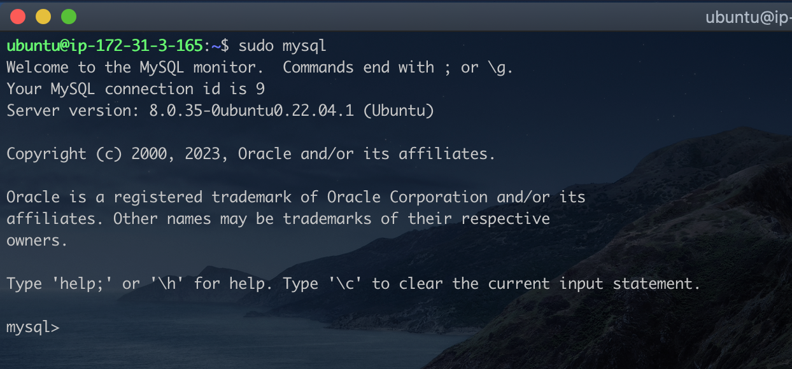
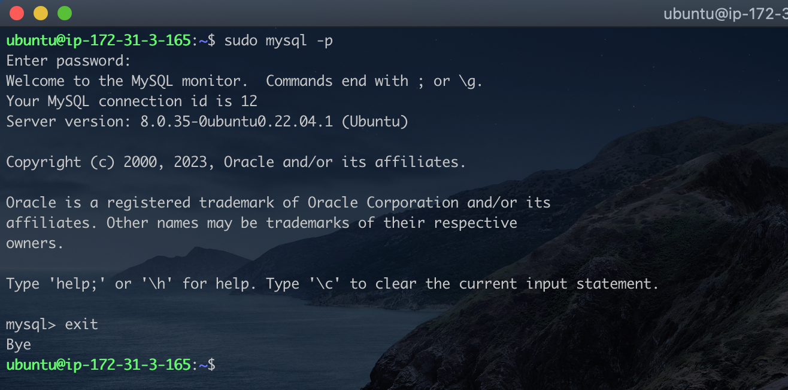
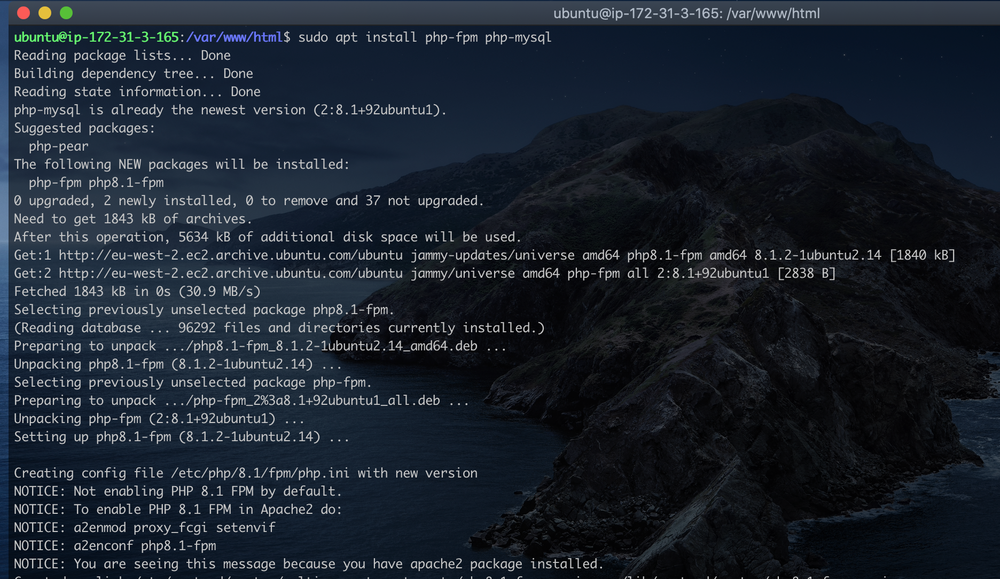

# LEMP (Linux, Nginx, MySql, PhP) Stack

The LAMP web stack is a popular open-source software ecosystem for developing and hosting dynamic web applications. It is an acronym for four essential components:

- Linux: An open source operating system
- Nginx: A lightweight and efficient web server that handles incoming HTTP requests and serves static content.
- MySQL: An open source relational database management system (RDBMS)
- PHP: An open source server-side scripting language.

Together, these components work seamlessly to create a robust and scalable platform for developing and running a wide range of web applications

### Part 1 - Installing the Nginx Web Server

We already have our Linux Ubuntu server running, so we will begin with installing Nginx on Linux.  
I'll start by running the following commands:

- `sudo apt update`: Downloads and update the apt package index file. This is to make sure we are downloading the latest versions of applications.
- `sudo apt install nginx`: This command dowloads and install apache on the local machine.
- `sudo systemctl status nginx`: This commands checks the status of the nginx service. > Note

  > If you have another service (e.g apache) runnung on port 80, you have to stop the service else `nginx` will note start as it also uses port 80. To do this, run `sudo systemclt stop apache2` to stop the service, and then `sudo systemctl start nginx` to start the `nginx` webserver

  
  Our server is active and running.

- `curl http://127.0.0.1:80`. Optionally, we can issue this command to verify nginx's default webpage is up and running. Running the command will display the content of the webpage in `html` format. This is just a quick way to test the apache webserver is running as we may not have access to a web browser.
- If you have access to a web browser, we can navigate to the same webpage by using the server's ip address and optionally the port number if it running on the default port 80.
  

  I'm running the server from AWS EC2 Instance, so i had to used the public ip to access the server.

  > Note
  > Nginx and Apache has similar directory structure, don't be suprised when the nginx web server is loading an apache webpage.  
  >  To fix this, simple navigate to `/var/www/html` directory, and remove the `index.html` that loads the apache web page. `Nginx` default webpage is `index.nginx-debian.html`.

  We've sucessfully installed our Nginx web server on Ubuntu.

### Part 2 - Installing MySql Server

Our web server is running and ready to host applications. However we need a database to store the application's data.  
Still on the Ubuntu server, I'll run the following commands to install and configure MySql server:

- `sudo apt install mysql-server -y`: This command downloads and install mysql. The optional flag `-y` is used to automatically accept any prompt during installation.
- `sudo systemctl status mysql`: This command shows the mysql server is active and running.
  
- `sudo mysql`: This commands logs you into the mysql console as the root user.
  
- The next step is to secure the database server by providing a password for the root user before running the the `mysql_secure_installation` script. This script which comes by default with mysql secures the server by setting a secure password, removing any anonymous users, disabling remote login access for the root user, etc.  
  Let's start by setting the root password.
- `ALTER USER 'root'@'localhost' IDENTIFIED WITH mysql_native_password BY 'PassWord.1';`. This command sets the root password to `PassWord.1`. Type `exit` in the mysql console to return back to the linux command line environment.
  
- Back in the linux command environment, run the following command `sudo mysql_secure_installation`. This script will take you through a series of questions to secure the server such as diabling remote login for root, removing anonymous accounts, etc.
  
- To log back into the mysql console, we run `sudo mysql -p`. This prompts you for the root password we created earlier.
  
  At this point, we've sucessfull installed and secure the mysql database server.

### Part 3 - Installing PHP

We've installed Nginx webserver to host our application, and the MySql database server to store our application's data. It's time to install PhP, server-side scripting language that would used for creating dynamic web pages. It will also be used to create server side validation, business logic and sending/retrieving data from the MySql database.

Running PHP on Nginx involves using the **FastCGI Process Manager (PHP-FPM)** to handle PHP requests. Nginx is known for its efficiency in handling concurrent connections and static content, making it a lightweight and high-performance web server. In contrast, running PHP on Apache typically involves using the **mod_php module**, where Apache handles both static and dynamic content in a single process. Nginx's event-driven architecture and separate processes for handling dynamic content contribute to better resource utilization and scalability compared to Apache's process-based model.  
To configure Nginx to handle PhP requests, we need to install the `php-fpm` package as well as `php-mysql` to enable our application connect to a mysql database server.  
Run the folling commands

- `sudo apt install php-fpm php-mysql`
  

  > Take note of the output above.  
  > PHP 8.1 FPM was not enabled by default. That is because we have Apache installed, and alo using this particular version of PhP. Meaning running PhP applications using `fpm` is not enabled for apache. This is fine because we have `Nginx`.

  Now, let's configure Nginx to use PhP

### Part 4 - Configuring Ngin to use PhP
