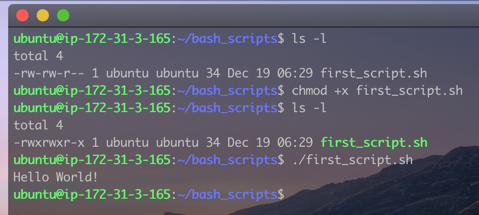
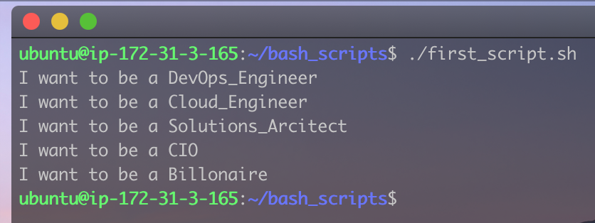
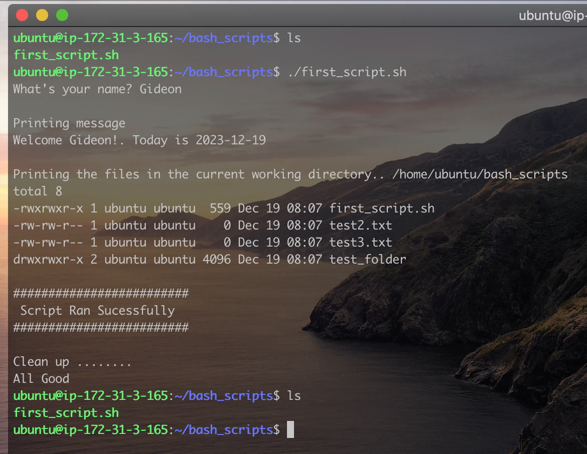

# Task Automation with Bash Scripting

A Bash script is a plain text file containing series of commands written in the Bash (Bourne Again SHell) scripting language. Bash is a widely used as it provides a powerful and flexible way to automate tasks and execute commands. Bash scripts often have the ".sh" file extension and can be run from the command line to automate repetitive tasks or perform system administration tasks.  
In this project, we will get familair with how a bash script works.

### Part 1 - Basic commands

Bash scripts are ususally saved with the `.sh` extension. Lets create our first script:

- Open create a file with your favorite text editor and then write the code below:

  > ```bash
  > #! /bin/bash
  >
  > echo "Hello World!"
  > Save the file as `first_script.sh`then run the following commands:
  > ```

  - `chmod +x first_script.sh`: to make it executable
  - `./first_script.sh`: To run the script.
    
    We just created and ran our first bash script.

- **Variables**  
  Just like any other programming language, we can create variables in bash. Here is an example:

  > ```bash
  > #! /bin/bash
  >
  > name="Gideon"
  > echo "Hello $name! How are you doing today?"
  > ```
  >
  > As with the previous example, make sure the file is saved with a `.sh` extension, and is executable. Run the script and you should see the output below:

  
  Now, let's do something more interesting.

- **Conditional Statements**  
  Conditional statements like _if if else if elif else_ are very important and powerful when writing a script. They allow for decision-making based on certain conditions, executing specific code blocks if the conditions are met or bypassing them if not. Let's look at some examples.

  > ```bash
  > #!/bin/bash
  >
  > # Example script to check if a number is positive, negative, or zero
  >
  > read -p "Enter a number: " num
  >
  > if [ $num -gt 0 ]
  >   then
  >       echo "The number $num is positive."
  > elif [ $num -lt 0 ]
  >    then
  >       echo "The number $num is negative."
  > elif [ $num -eq 0]
  >       echo "The number $num is zero."
  > else
  >       echo "$num is not a valid number"
  > fi
  > ```

  - The `read -p` is used to propmt the user of an input.
  - The `if` block check if the number provided by the user is greater than zero. If the number is greater than zero, then the first condition is met and it prints out `The number is positive`.
  - The `elif` checks if the number is less than 0. It is important to note that if the first condition is met, the code won't bother checking for other conditions. The `elif` block will only run if the number is not greater than zero.
  - And finally, the `else` block will only run if all the conditions definded above evaluted to false.

- **Loop**  
   Loop statements in programming allow for the repetition of a set of instructions, enabling efficient execution of tasks by iterating through code multiple times. The commonly used loops are `for loops` and `while loops`

  > ```bash
  > #! /bin/bash
  >
  > # For loop: A simple script to print 10 to 20
  >
  > for (( i=10; i<=20; i++))
  >     do
  >         echo $i
  > done
  > ```

  - `i=10`: assigns 10 to the variable `i`.
  - `i<=20`: tells the loop that `i` should not be greater than 20.
  - `i++`: tells the script to increament `i` by 1. This defines the control of the loop.

  We also have a variant of the `for loop` called `for each`.

  > ```bash
  > #! /bin/bash
  >
  > # For each: Used to itrate through a list or other iteratable objects.
  >
  > ROLES="DevOps_Engineer Cloud_Engineer Solutions_Arcitect CIO Billonaire"
  >
  > for role in $ROLES
  >     do
  >         echo "I want to be a $role"
  > done
  > ```
  >
  > 

  This code iterates through all the roles specified in the `ROLES` variable, and then prints "I want to be a ", the role in each iteration. This can be very useful when configuring a files with different values.

  As said in the dfination of a bash script, almost if not all linux commands can be used in a bash script. let's write a script the performs multiple random operations:

  > ```bash
  > #! /bin/bash
  >
  > # Get the user's name and send a greeting
  > read -p "What's your name? " name
  > today=$(date +%Y-%m-%d)
  >
  > # Create a Directory and some sets of files
  > mkdir test_folder
  > touch test_file.txt test2.txt test3.txt
  >
  > #Print a messages with the user's name and today's date. Save the output to a file
  > echo "Welcome $name!. Today is $today" > test_file.txt
  >
  > # Move the file into the folder, then print the content of the file inside the folder
  > mv test_file.txt test_folder/
  > echo " "
  > echo "Printing message"
  > cat test_folder/test_file.txt
  > echo " "
  >
  >
  > echo "Printing the files in the current working directory.. $PWD"
  > ls -l
  > echo " "
  > echo "#########################"
  > echo " Script Ran Sucessfully"
  > echo "#########################"
  > echo " "
  > echo "Clean up ........"
  >
  > # Delete all files and folder created
  > rm test2.txt test3.txt
  > rm -rf test_folder/
  > echo "All Good"
  > ```

      

  From the image above, the script ran sucessfully and in the process, created few files and a folder. However, towards the end of the script, all the files and folders were deleted.  
  This is just an example of how we can combine multiple commands to automate a task in linux.  
   The tasks could be as simple as creating or deleting a file to something as complex as downloading ngix, installing and configuring a database and then deploying a web site.

### Part 2 - File Operations and Sorting
