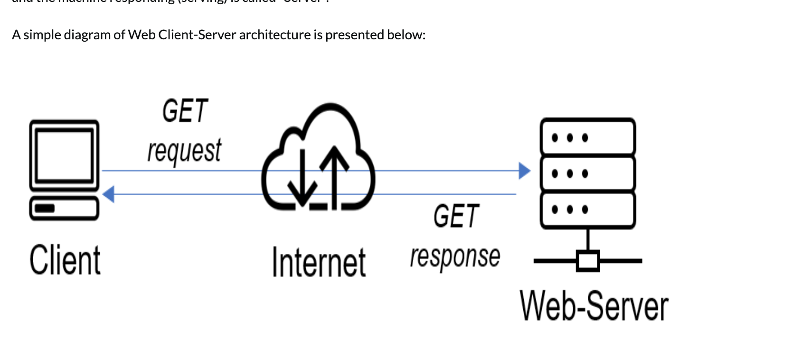

# Demonstrating a Client - Server Architecture using MySQL Server

The Client-Server architecture is a computing model in which tasks or processes are divided between the "client" and the "server" to improve efficiency, scalability, and flexibility in managing network resources. Here's a breakdown of the key components and their roles in a client-server architecture:

1. **Client**:
   - The client is a user interface or application that initiates requests and consumes services or resources from the server.
   - It can be a software application, a web browser, or any device that interacts with the user and sends requests to the server.
2. **Server**:
   - The server is a powerful computer or a network of computers that provide services, resources, or data in response to client requests.
   - It hosts and manages resources, processes requests, and ensures that clients receive the necessary information or services.
3. **Communications / Protocol**:
   - Clients and servers communicate over a network, often using protocols such as HTTP/HHTPs (Hypertext Transfer Protocol) for web applications, SMTP (Simple Mail Transfer Protocol) for email, etc.
   - The client sends a request to the server, and the server responds by providing the requested information or performing the requested action.

The Client-Server architecture is a fundamental concept in distributed computing, and it provides a scalable and efficient way of organising and managing computing resources in various applications and services. Examples are Web Applications (Amazon.com, Twitter, Linkendln), Email (gmail.com, yahoo.com), Relational Database Systems (RBBMS - Postgres, MySQL, Oracle etc).

A client and server architecture in it's simplest form. It can however get more complex when new components such as firewalls, load balancers, router, etc are inroduced.

Let's do an exercise implementing this using MySQL database.

For this exercise, we will need two separate computers on the same network
