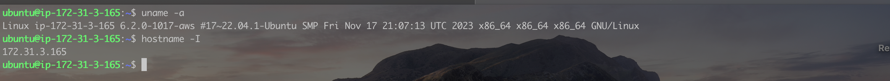
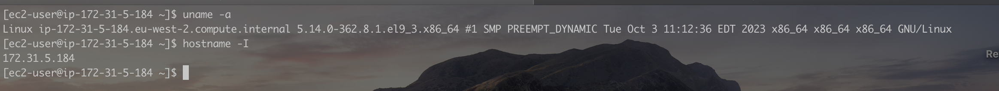
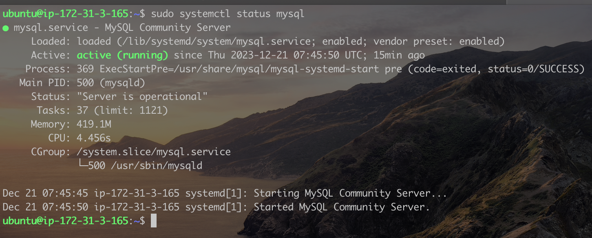
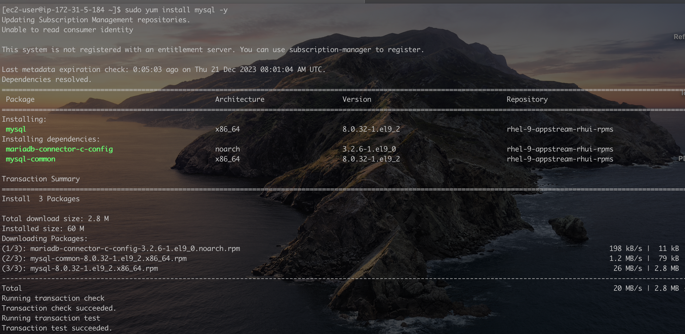
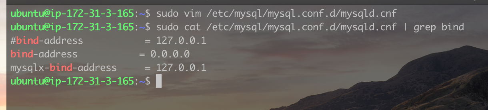
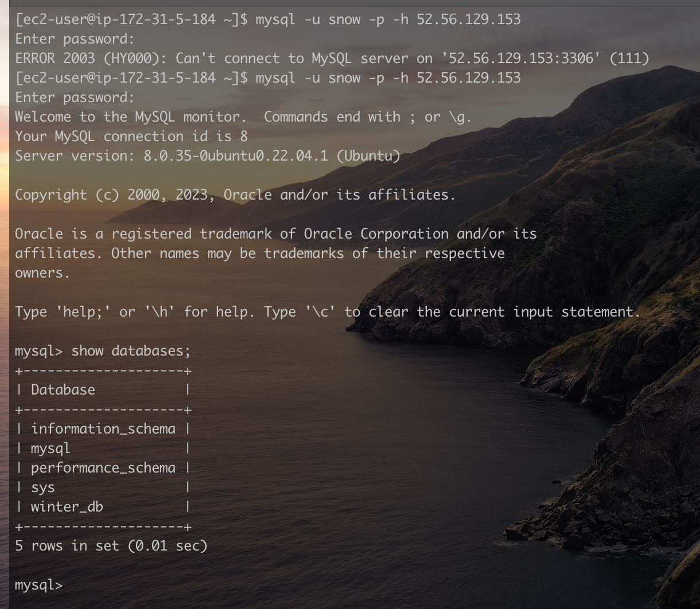

# Demonstrating a Client - Server Architecture using MySQL Server

The Client-Server architecture is a computing model in which tasks or processes are divided between the "client" and the "server" to improve efficiency, scalability, and flexibility in managing network resources. Here's a breakdown of the key components and their roles in a client-server architecture:

1. **Client**:
   - The client is a user interface or application that initiates requests and consumes services or resources from the server.
   - It can be a software application, a web browser, or any device that interacts with the user and sends requests to the server.
2. **Server**:
   - The server is a powerful computer or a network of computers that provide services, resources, or data in response to client requests.
   - It hosts and manages resources, processes requests, and ensures that clients receive the necessary information or services.
3. **Communications / Protocol**:
   - Clients and servers communicate over a network, often using protocols such as HTTP/HHTPs (Hypertext Transfer Protocol) for web applications, SMTP (Simple Mail Transfer Protocol) for email, etc.
   - The client sends a request to the server, and the server responds by providing the requested information or performing the requested action.

The Client-Server architecture is a fundamental concept in distributed computing, and it provides a scalable and efficient way of organising and managing computing resources in various applications and services. Examples are Web Applications (Amazon.com, Twitter, Linkendln), Email (gmail.com, yahoo.com), Relational Database Systems (RBBMS - Postgres, MySQL, Oracle etc).

A client and server architecture in it's simplest form. It can however get more complex when new components such as firewalls, load balancers, router, etc are inroduced.

Let's do an exercise implementing this using MySQL database.

For this exercise, we will need two separate computers on the same network

This is my MySQL Sever running on Linux ubuntu with an ip-address of 172.31.3.165

While this is my MySQL Client running on Linux Redhat with an ip-address of 172.31.5.184

From the image above, we can see the `mysql server` is running on my linux ubuntu.

Now, lets install the `mysql client` on our client machine.


`mysql` Client has been sucessfully installed. However, we need to first modify the `mysqld.cnf` file on the `mysql server` to enable remote connection.

On the server machine, using root access, navigate to the config file and then make the modification.

> `sudo vim /etc/mysql/mysql.conf.d/mysqld.cnf`

Then modify the line below by adding a # in front of the binding directive, and the writing a new line without the # but with a new ip.

> ```cnf
> #binding-address    =  127.0.0.1
> binding-address     =  0.0.0.0
> ```

NB: In production enviroments, we will want to be as specific as possible on providing the address our server can accept connections from instead of allowing all connections using `0.0.0.0`

Save the file, and the output should be like what's in the image below when you run the command below:  
`sudo cat /etc/mysql/mysql.conf.d/mysqld.cnf | grep bind`


The above command printed out the content of the config file, showing only lines that has the word `bind`. You can restart the `mysql server` in the server machine my running the commands below:  
`sudo systemctl stop mysql`  
`sudo systemctl start mysql`

Now, let's connect to the mysql server from our client machine by using the command below:

`mysql -u snow -p -h [your-ip-address]`

- `-u`: This tells the mysql server the username that's connecting.
- `-p`: This tells the mysql server to ask for a password.
- `-h`: This is the `ip-address` of where `mysql server is running`. I provided the Public ip-address of my `mysql server` as I'm not using a local network, but AWS EC2 instances.
- We also need to ensure port `3306` is opened to allow outside traffic on the mysql server.



**There you have it. I'm connected to `mysql server` which could be miles away from my client machine. The error shown in the image above was before the Server was configured to accept connections from a remote host**
