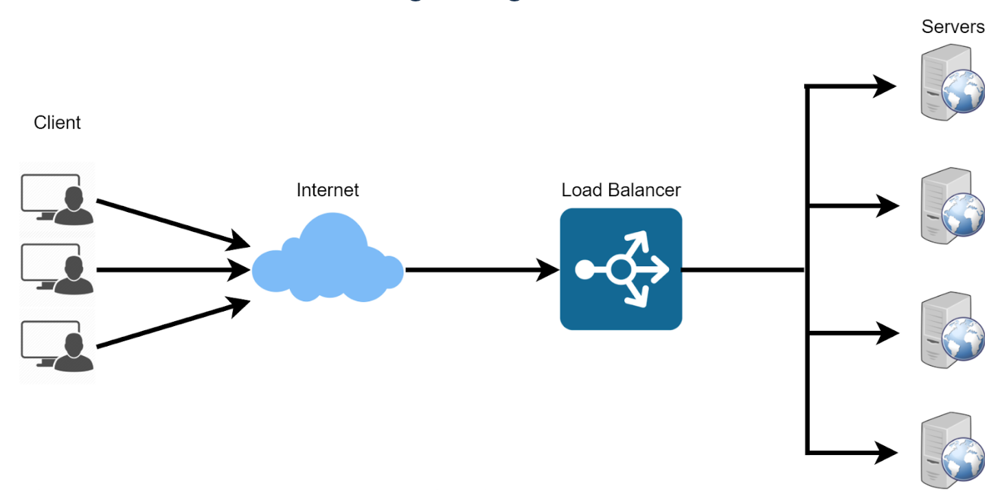

# Designing a Load Balancer using Nginx

A load balancer is a device or software application that distributes network or application traffic across multiple servers or resources. The primary purpose of a load balancer is to ensure that no single server becomes overwhelmed with too much traffic, thereby optimizing resource utilization, enhancing reliability, and improving the overall performance of an application.

Load balancers can be implemented using both hardware devices or software solutions. They are commonly used in web applications that generates lots of traffic.

Nginx Web Server is very popular because of it dual functionality as a high-performance web server and a load balancer. Its ability to efficiently handle concurrent connections and distribute traffic across mulitple servers makes it a popular choice in modern web infrastructure architectures.

In this execise, we will be using the below architecture to demonstrate how Nginx can be confirgued to act as a load balancer.

We will provision to systems and install apache websers on them. The apache web servers will be confirgured to run on port 8080. We will also deploy a simple web application on each webserver. The web application would display the ip address of the server to demonstrate load balancing in action.

Another system would be provisioned, and Nginx would be installed. We will then configure Nginx to act as a load balancer by distributing traffic to each web server.

The systems can be physical or virtual. I'll be using AWS in provisioning the servers. Let's begin.

#### Step 1: Installing Apache on Web Server 1 and 2.

I have already created two EC2 instances running Linux Ubuntu 20, allowed access to port 8080 as that's the port we will configure the apache webserver to run from.
