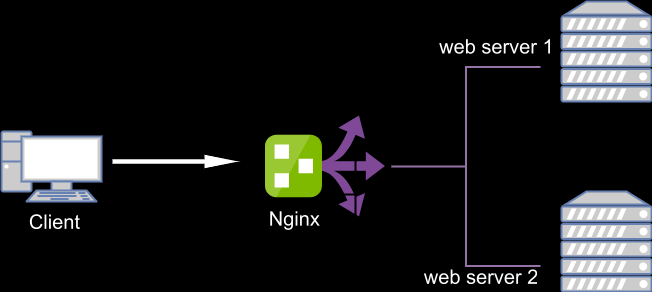
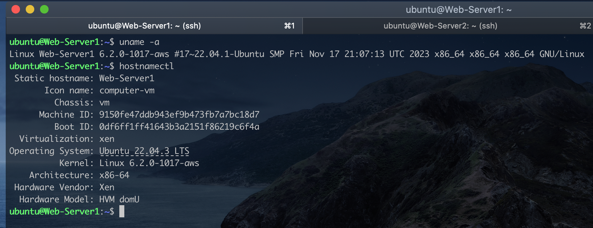
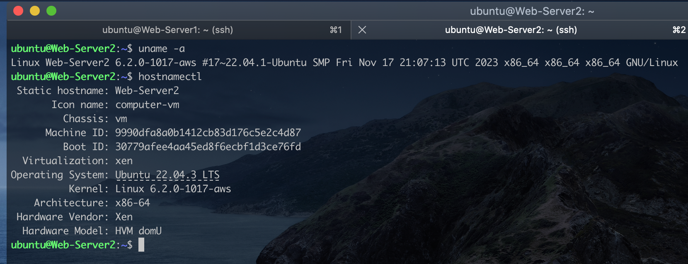
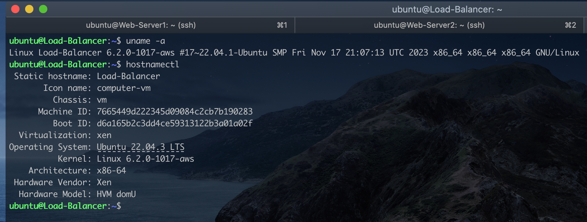
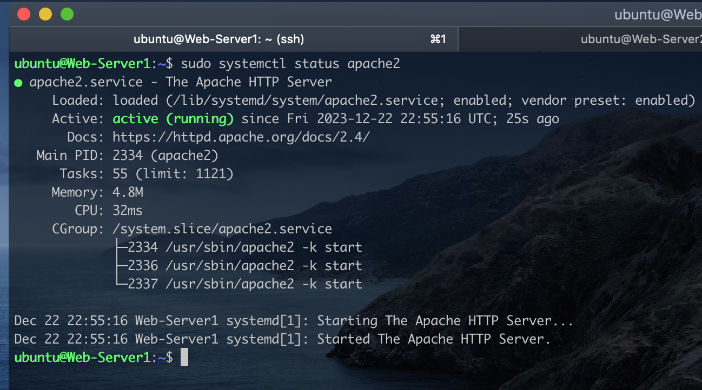
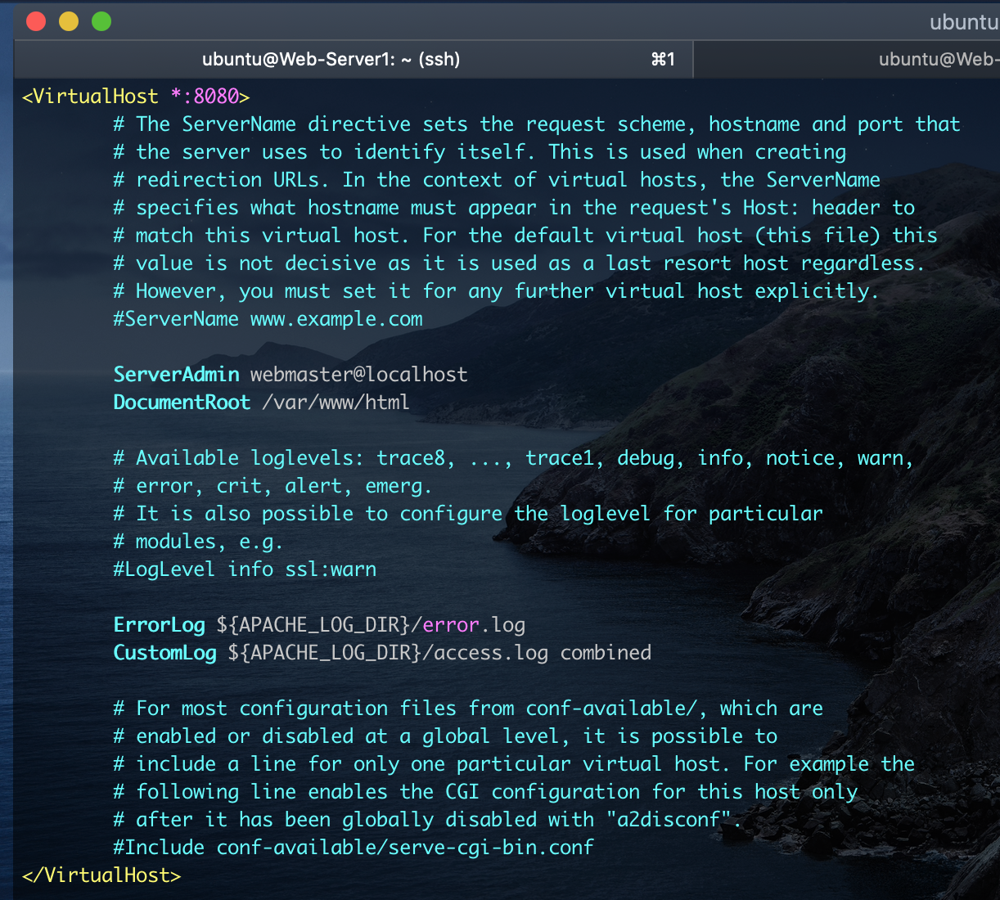
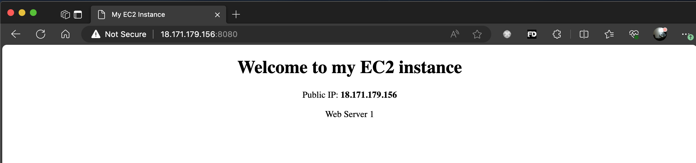
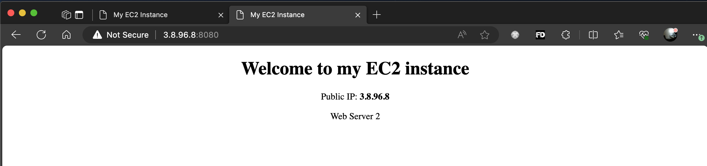
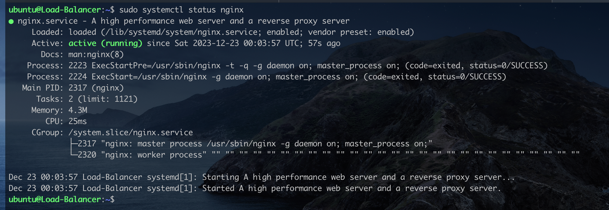

# Designing a Load Balancer using Nginx

A load balancer is a device or software application that distributes network or application traffic across multiple servers or resources. The primary purpose of a load balancer is to ensure that no single server becomes overwhelmed with too much traffic, thereby optimizing resource utilization, enhancing reliability, and improving the overall performance of an application.


Load balancers can be implemented using both hardware devices or software solutions. They are commonly used in web applications that generates lots of traffic.

Nginx Web Server is very popular because of it dual functionality as a high-performance web server and a load balancer. Its ability to efficiently handle concurrent connections and distribute traffic across mulitple servers makes it a popular choice in modern web infrastructure architectures.

In this execise, we will be using the below architecture to demonstrate how Nginx can be confirgued to act as a load balancer.


We will provision to systems and install apache websers on them. The apache web servers will be confirgured to run on port 8080. We will also deploy a simple web application on each webserver. The web application would display the ip address of the server to demonstrate load balancing in action.

Another system would be provisioned, and Nginx would be installed. We will then configure Nginx to act as a load balancer by distributing traffic to each web server.

The systems can be physical or virtual. I'll be using AWS in provisioning the servers. Let's begin.

### Step 1: Installing Apache on Web Server 1 and 2.

I have already created two EC2 instances running Linux Ubuntu 22, allowed access to port 8080 as that's the port we will configure the apache webserver to run from. I also created a third EC2 instance, also running Ubuntu 22 for the Load balance. Here are the system details below.  
`Web-Server1`

`Web-Server2`

`Load-Balancer` (Nginx)


We will start by installing Apache on both `Web-Server1` and `Web-Server2` by running the commands below on both instances:  
`sudo apt update -y && sudo apt install apache2 -y`

After installing `apache2`, we confirm its running by checking the service status  
`sudo systemctl status apache2`


Next, we will configure `Apache` to run on port 8080 instead of the default port 80.  
`sudo vim /etc/apache2/ports.conf`

> ```nginx
> #Listen 80
> # Comment the line above and the line below to allow apache listen at port 8080
> Listen 8080
>
> <IfModule ssl_module>
>       Listen 443
> </IfModule>
>
> <IfModule mod_gnutls.c>
>        Listen 443
> </IfModule>
>
> ```

Open the apache default configuration file and modify the port of the virtual host also to 8080  
`sudo vim /etc/apache2/sites-available/000-default.conf`  
Change the port number from _:80 to _:8080 as seen in the image below

Save the file using :wq! command in the text editor. This is necessary as the file won't allow changes.

The next step will be to create a simple web page that would be display the ip address of the server when the page loads.

Rename the default apache webpage to `file.html  `  
`sudo mv /var/www/html/index.html file.html`

Create a new `index.html` file in the same directory  
`sudo vim /var/www/html/index.html`

> ```html
> <!DOCTYPE html>
> <html>
>   <head>
>     <title>My EC2 Instance</title>
>   </head>
>   <body>
>     <center>
>       <h1>Welcome to my EC2 instance</h1>
>       <p>Public IP: <strong>18.171.179.156</strong></p>
>       <p>Web Server 1</p>
>     </center>
>   </body>
> </html>
> ```

Restart the `apache2` service  
`sudo systemctl restart apache2`  
Open a web browser, enter your pubic ip and port 8080


The same steps should be repeated on `Web-server2`, and it shoudl also display its own web page


### Step 2: Configuring the Load Balancer

In the third EC2 Instance i provision earlier, I'll install Nginx server by running the code below  
`sudo apt update -y && sudo apt install nginx -y`

After installation is complete, verify the nginx server is running properly  
`sudo systemctl status nginx`


Good. The next step is to configure the nginx load balancer. Create a file `loadbalancer.conf` with the code below.  
` sudo vim /etc/nginx/conf.d/loadbalancer.conf`

> ```nginx
>
>   upstream backend_servers {
>
>        # your are to replace the public IP and Port to that of your webservers
>        server 18.171.179.156:8000; # public IP and port for webserser 1
>        server 3.8.96.8:8000; # public IP and port for webserver 2
>
>    }
>
>   server {
>        listen 80;
>        server_name 13.40.137.30; # provide your load balancers public IP address
>
>        location / {
>            proxy_pass http://backend_servers;
>            proxy_set_header Host $host;
>            proxy_set_header X-Real-IP $remote_addr;
>            proxy_set_header X-Forwarded-For $proxy_add_x_forwarded_for;
>        }
>    }
>
> ```

- The _upstream_ block named **backend_servers** defines a group of backend servers. In this case, they are the public ip address and port of the two webserver created earlier.
- The _Server_ block defines the name of the nginx server and the port it listens on.
- The _Location_ block defines a set of rules on how nginx shold handle requests from the root URL
  - The first line `proxy_pass http://backend_servers;` directs all traffic to the upsteam group named backend_servers
  - ` proxy_set_header Host $host;` This sets the value of the host. It is particularly important when nginx is acting as a reverse_proxy, and forwarding requests to the webservers
  - `proxy_set_header X-Real-IP $remote_addr;` Since the request to the sever is not coming directly from the client, but from the load balancer, the application will se only the ip of the load balancer. This is used to set the real ip of the client that is connecting to the application.
  - ` proxy_set_header X-Forwarded-For $proxy_add_x_forwarded_for;`This is what provides or unmask the client's ip address to the application.

Save the file `loadbalancer.conf` file and lets test to ensure there are no errors.

`sudo nginx -t`


Restart the nginx server by running `sudo restart nginx`. Now copy and paste the load balancer's public ip into a browser and the traffic would be automatically redirected to the web servers.


Refresh the browser and watch the load balancer redirect the next traffic to the second webserver.


There you have it. We have sucessfully configure our Nginx to server to act as a load balancer and distribute traffic across two different servers.
