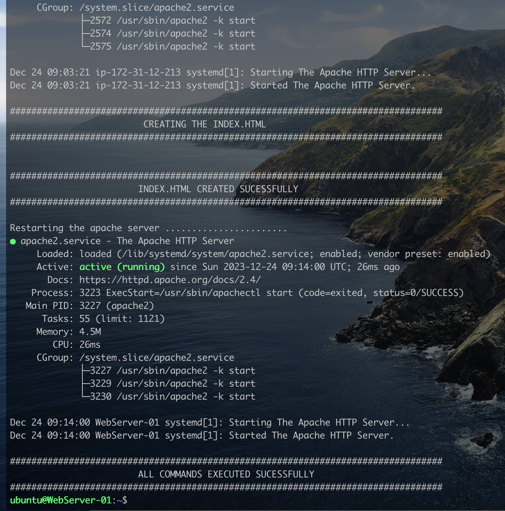

# Automating the configuration of a Load Balancer in Nginx using Shell Script

In the previous project [Designing a Load Balancer using Nginx](https://github.com/iamYole/DIO-Projects/tree/main/Project%207%20-%20Designing%20a%20Load%20Balancer%20using%20Nginx%20), we went throug the steps of configuring three (3) Linux Ubuntu system, two (2) activing as application servers, and one (1) a load balancer. The process was very manual, writing commands and editing text files.

We will be implementing the excat same thing in this project, but with the help of a bash scrit which can be reused over and over again.

### Part 1 - Bash Sctipt for the Backend Web Servers Automation.

The script below contains all the commands required to get our webservers up and running. Open your favorite text editor copy and paste the script below into a text files, then save it as `webapp.sh`

> ```bash
> #! /bin/bash
>
> ######################################################################################################################
> ##### This automates the deployment of a Web Application running on Apache Web Server.
> ##### Usage: The script is designed to run on a Linux Debian Distribution.
> ##### It was designed using Ubuntu 22.04.3 TLC
> #####
> ##### An example of how to call the script is shown below:
> ##### ./webapp.sh
> #############################################################################################################
>
>
> #set -x # debug mode
> set -e # exit the script if there is an error
> set -o pipefail # exit the script when there is a pipe failure
>
> sudo apt update -y
>
> echo "#################################################################################"
> echo "                     INSTALLING APACHE WEB SERVER                                 "
> echo "#################################################################################"
> echo " "
> sudo apt install apache2 -y
> echo " "
> echo "#################################################################################"
> echo "                     APACHE WEB SERVER INSTALLED SUCESSFULLY                      "
> echo "#################################################################################"
> echo " "
> sudo systemctl status apache2
>
> # Configure Apache to run on port 8080 instead of the default port 80.
> sudo sed -i 's/Listen 80/Listen 8080/' /etc/apache2/ports.conf
>
> sudo systemctl stop apache2
>
> # Configure the defual Virtual Host to also run on port 8080.
> sudo sed -i 's/<VirtualHost *:80>/<VirtualHost *:8080>/' /etc/apache2/sites-available/000-default.conf
> #sudo vim -c 's%/<VirtualHost *:80>/<VirtualHost *:8080>/g' -c "wq!" /etc/apache2/sites-available/000-default.conf
>
> echo " "
> echo "#################################################################################"
> echo "                         CREATING THE INDEX.HTML                                 "
> echo "#################################################################################"
> echo " "
>
> # Define the content for the index.html file
> server_info=$(hostnamectl)
> html_content=$(cat <<EOF
> <!DOCTYPE html>
> <html>
>  <head>
>    <title>My EC2 Instance</title>
>  </head>
>  <body>
>    <center>
>      <h1>Welcome to my EC2 instance</h1>
>      <h3>Server Information: </h3>
>       <h4>${server_info}</h4>
>    </center>
>  </body>
> </html>
> EOF
> )
> # delete the exiting index.html
> #cd /var/www/html/
> #sudo rm index.html
>
> #Write the content to index.html
> echo "$html_content" > index.html
> sudo mv index.html /var/www/html/
>
> echo " "
> echo "#################################################################################"
> echo "                        INDEX.HTML CREATED SUCESSFULLY                           "
> echo "#################################################################################"
> echo " "
> echo "Restarting the apache server ......................."
> sudo systemctl start apache2
> sudo systemctl status apache2
>
> echo ""
> echo "#################################################################################"
> echo "                        ALL COMMANDS EXECUTED SUCESSFULLY                        "
> echo "#################################################################################"
>
>
> 
> If all goes well we should see the output in the image above.
> ```
