# Deploying a WordPress website integrated with Logical Volume Management (LVM) storage.

We've seen how to install and configure both Apache and Nginx web servers. We've also seen how to setup a web application using the LAMP and LEMP Stack. In this project, we will be using the LAMP Stack to deploy a WordPress application. However, the focus will be on using LVM for storing application data rather than the conventional hard disk. Some of the benefits of using LVM includes:

- **Dynamic Volume Resizing**: LVM allows for easy resizing of logical volumes, providing flexibility to adjust storage allocation without disrupting data or services.
- **Ease of Management**: LVM simplifies storage management tasks, such as adding or removing storage devices, reallocating space, and managing logical volumes.
- **Snapshot Support**: LVM supports the creation of snapshots, which are point-in-time copies of logical volumes. This is useful for backups or testing without affecting the original data.

The setup for this project includes a Laptop of PC to serve as a client, two (2) AWS EC2 instances, one to serve as the WebServer, and the Other, the Database server. We will also need to attach three (3) additional logical volumes to our sever to configure the LVM storage. Let's get right into it.

### Part 1 - Implementing LVN on Linux using AWS

1.  To begin we need to first provision two(2) EC2 Instances. One for our Web Server, and the other for the Database Server.
    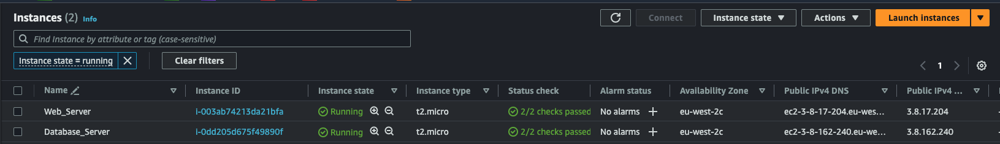
    I'll be using the `Red Hat` Linux distribution in this project.

2.  The next step will be the creation of the volumes. In the left corner of your AWS console, click on the volumes menu under Elastic Block Store. Click on create volume and provide the information below:

    - `Volume type`: Select - General Purpose SSD (gp3)
    - `Size`: Select - 1Gib
    - `Availabilty Zone` - Select the AZ your Web Server was provisioned in. Mine is `eu-west-2c`.
    - `Tags` - Click on add tag ang give it a label. I will be labelling my `dio-webserver-lvm1`

    Click create, and repeat the same steps to create two(2) other volumnes.

        For the other options not specified above, feel free to use the default value.

    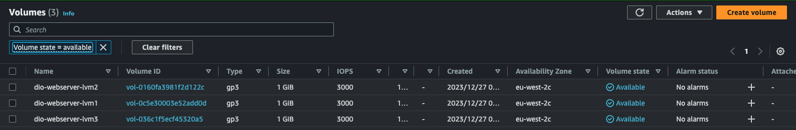
    Our volumes have been created, and they are currently in an available state. Meaning they are available, but not in use.

3.  Next, we will be attaching these volumes to our Web Server to configure LVM. To do this, click on the checkbok before the Name of the volumne to select it, then click on the Action dropdown menu above and select attach volume.
    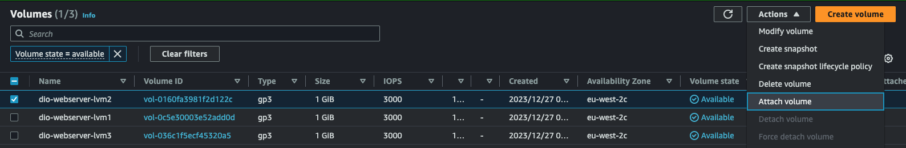
    In the attach volume page, click on the Instance dropdown menu and select the `ID` of your Web Server instance and the attach. Repeat this step to add all the volumnes to the Web Server.
    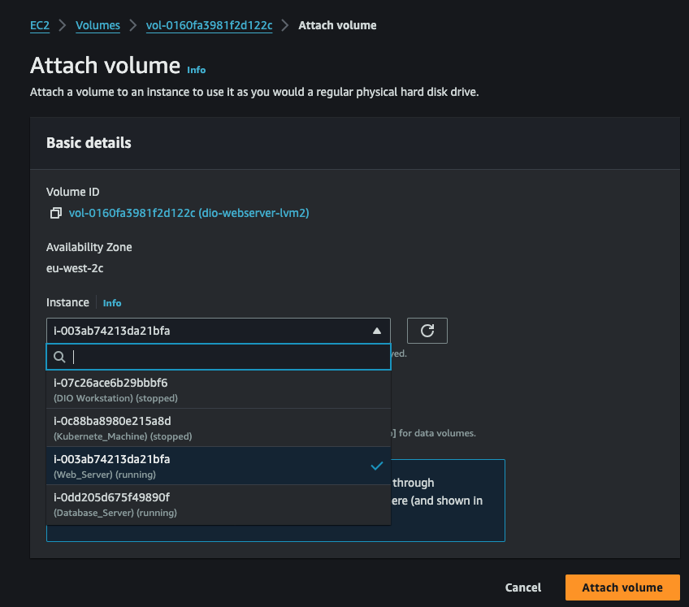
    Note that if the Web Server was created in a different availablity zone from the volume, it won't be listed in the drop down list. So it is important the volumnes are created in the same AZ as the Instance.

        Once all volumes have been attached, the volumes state should change from available to In-use.

    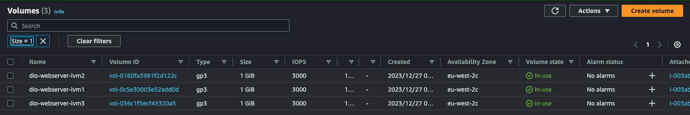

    At this point, we've sucessfully created and attached three (3) volumes to our EC2 Instance.

4.  Having attached the volumes to our Web Server, we need to configure the Linux OS to use the newly attached volumes as they aren't automatically ready for use. There are several disk utitlity tools in Linux. We will be exploring few of them that would be needed for this project.

    Let's connect to our Web Server and explore these commands as well as confirgure the LVM.

    - `lsblk`: This tool is used to list block devices. A `Block device` in Linux is a type of device that stores or supports data in fixed-size blocks or sectors. Example, HDDs, SDDs, USB etc.
      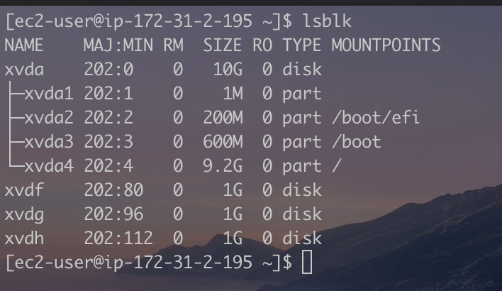
      From the image above, we can see the newly attached volumes. The can be easly recognised based on the sizes.
    - `df -h`: This is used to display information about the disk usage and available space.
    - `gdisk`: A command-line utility for disk partitioning. It allows you to create, delete, and manage partitions on a disk. To use this tool, run `sudo gdisk /dev/xvdf`. The command will display some information and a prompt `Command (? for help)`. You can type ? and enter to see the available options.

      - Type `n`: This will instruct the tool to create a new partition. Hit the `enter` key to start from 1. Keep hitting the `enter` key to accept the default configurations until you see the `Command (? for help)` prompt again.
      - This time, type `w`: This will write the entries into the partition table.

        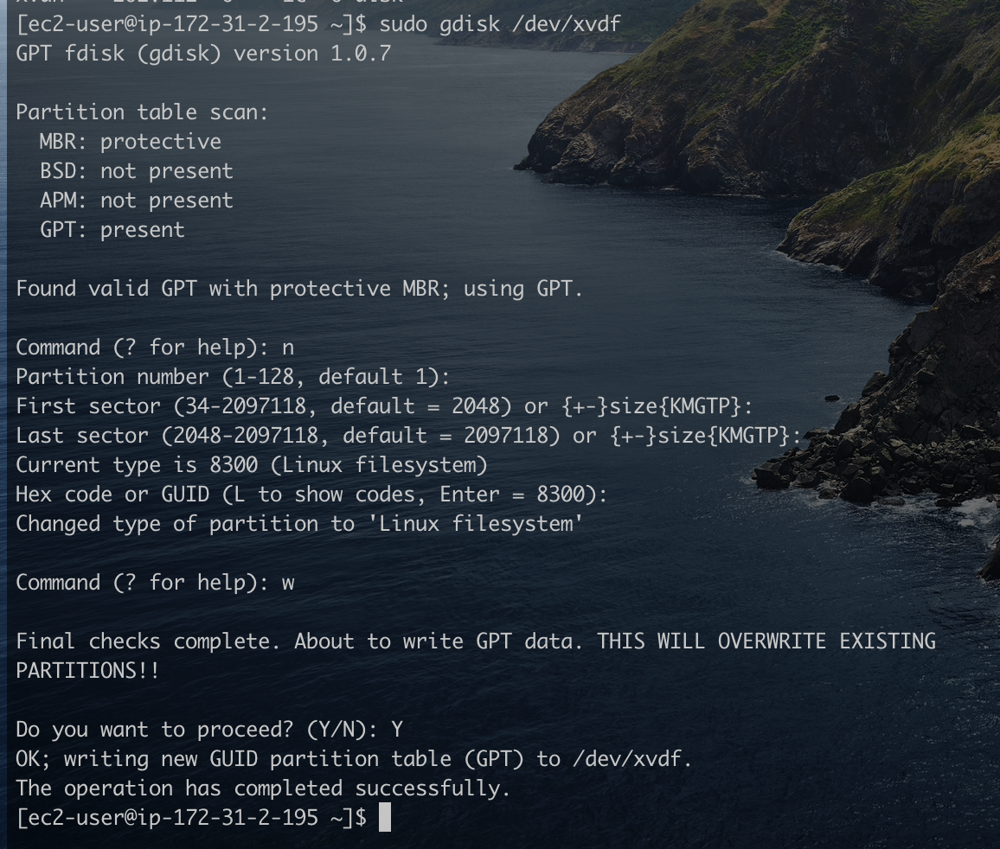

        `xvdf` is the name of our first volume as seen from the lsblk command. The other two (2) are `xvdg` and `xvdh`.

      Repeat the steps above for the other two (2) volumes. Run the `lsblk` command again and see the changes. New partitions have been created from the disk.

      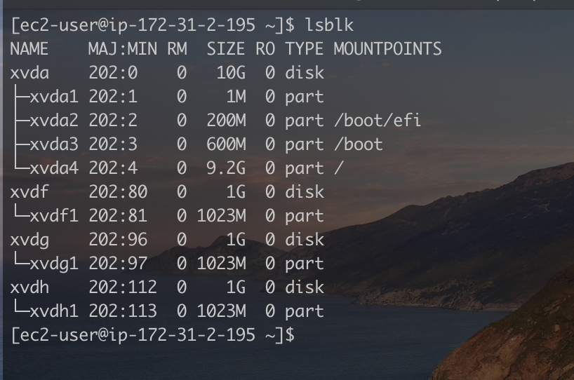

    - `lvmdiskscan`: This command is used in Linux to scan for all available block devices and display information about them. It isn't installed by default in most Linux distributions so we have to first intall it before using it. To install in, run the command `sudo yum update && sudo yum install lvm2`.

      To use this tool, run `sudo lvmdiskcan`

      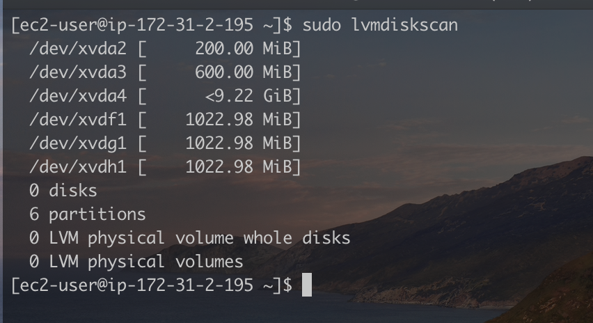

    - `pvcreate`: This command is used to initialize a physical volume for use with Logical Volume Management (LVM). LVM allows for dynamic volume management, such as creating logical volumes, resizing them, and managing storage resources efficiently. Let's use this tool by running the command below:

      `sudo pvcreate /dev/xvdf1`
      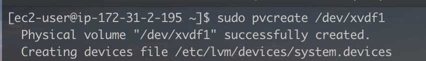
      Run this for the other two partitions, and then `sudo pvs` to verify the lvm partitions have been created successfully.
      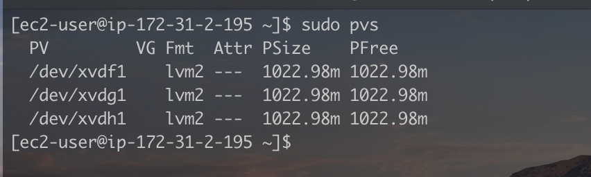

    - `vgcreate`: This command is used to create or group volumes together. Run the code below to create a group called webdata-vg, and `sudo vgs` to verify it's been created.  
       `sudo vgcreate webdata-vg /dev/xvdg1 /dev/xvdh1 /dev/xvdf1`
      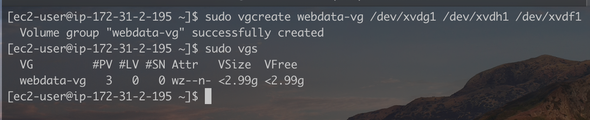
      From the image above, we can see the three (3) volumes have been grouped together and this also reflects the size.
    - `lvcreate`: This command is used to create logical volumes within a volume group managed by LVM. We will be creating two (2) logical volumes: `apps-lv` and `logs-lv`. The `apps-lv` would be used to store data for the WordPress site while the `logs-lv` would be used to store application log data. Run the commands below individually to create the lvs.  
       `sudo lvcreate -n apps-lv -L 1.4G webdata-vg`  
       `sudo lvcreate -n logs-lv -L 1.4G webdata-vg`

            - `-n` is used to indicate a new lv
            - `-L` is used to specify the size of the volume. Our `webdata-vg` has just 2.9GB so the lvs above were created with 1.4GB each.

      To verify, run `sudo lvs`. You can also run `sudo vgdisplay - v` to view all the information on the Logical and Physical volumes.
      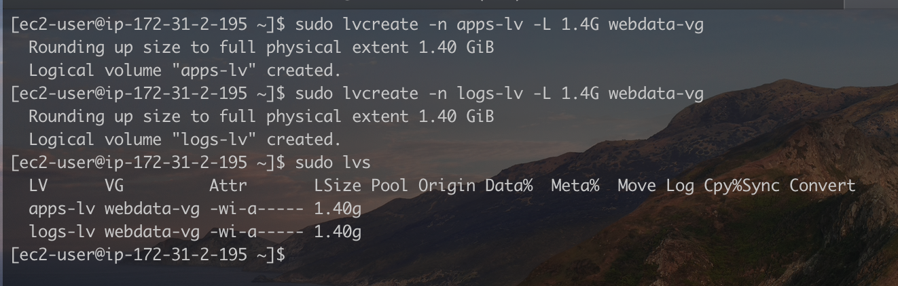

      Run the `lsblk` command again to see how far we've gone in configuring our volumes.
      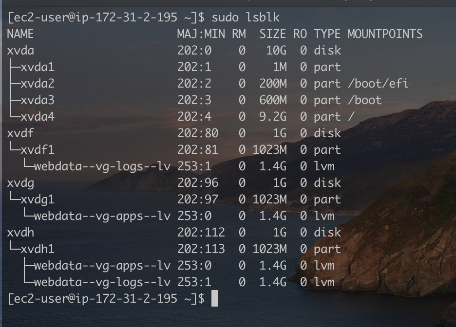

    - `mkfs`: The "make file system" command as the name suggests is used to create a file system on a specific block device. The commands below would format the logical volumes, and then create the `ext4` file system on the formated volumes.  
      `sudo mkfs -t ext4 /dev/webdata-vg/apps-lv`  
      `sudo mkfs -t ext4 /dev/webdata-vg/logss-lv`

5.  Now, lets create a directory and then mount the created directory to the file system. This directory would be where our WordPress site stores it's data.

    - Create the `/var/www/html` directory to store website files.  
      `sudo mkdir -p /var/www/html`

    - Create the `/home/recovery/logs` directory to store backup of log data  
      `sudo mkdir -p /home/recovery/logs`

    - Now, lets mount the `/var/www/html` directory to the `apps-lv`.  
      `sudo mount /dev/webdata-vg/apps-lv /var/www/html`
    - We will do the same for the `/home/recovery/logs` directory to `logs-lv`. However, we need to create a backup of the exiting files before mounting the directory. That's because all exiting data in the directory would be deleted before mounting. We will use the `rsync` to create the backup.  
      `sudo rsync -av /var/log/ /home/recovery/logs/`.
    - Now, we can safely mount the `/var/log` directory to the `logs-lv` volume as we have our files backedup.  
      `sudo mount /dev/webdata-vg/logs-lv /var/log`
    - Restore the log files from the backup by running the `rsync` again. This time, we are restoring from the back up location the the original location.  
      `sudo rsync -av /home/recovery/logs/ /var/log/`

6.  The next step will be to update the `/etc/fstab`. This file contains information about the disk drives and partitions on the system. It is used by the operating system to automatically mount these file systems at startup. We will be using the `UUID` of block devices to update this file. Run the `sudo blkid`command get the `UUID`. Copy and save the `UUID` for both the `webdata-vg/apps-lv` and `webdata-vg/logs-lv` to notepad or something as we will be referencing them in the `fstab` file.

    > ```bash
    > #Mounts for the WordPress Site
    >
    > UUID=c11927fc-9f64-432a-9f3d-913957e8ae3d /var/www/html ext4 defaults 0 0
    > UUID=e37111ba-8e5a-4285-a474-b25858eacb9b /var/log ext4 defaults 0 0
    >
    > ```

    Test the configuration by running `sudo mount -a` and `sudo systemctl daemon-reload`. if all goes well, the command will mount all the files system in the `fstab`, and instructs the system to mount all file systems in the file at every startup. If all was done correctly, you should see a similar file structure to the image below when you run the command `df -h`.
    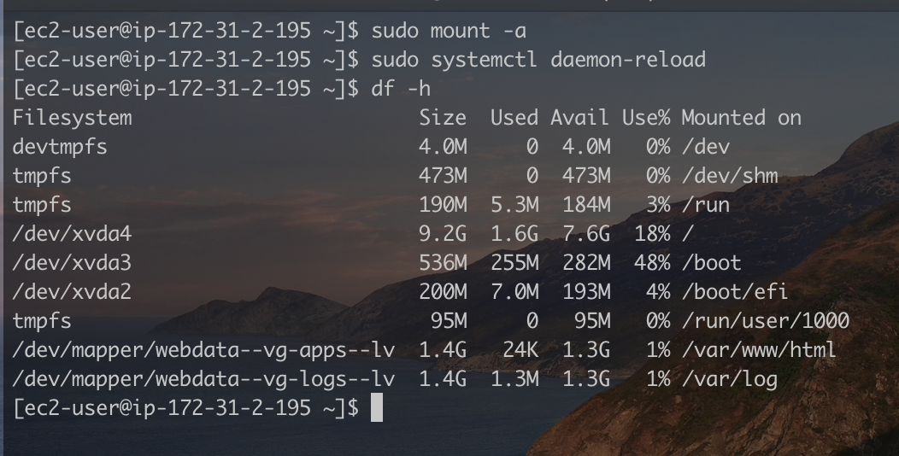
