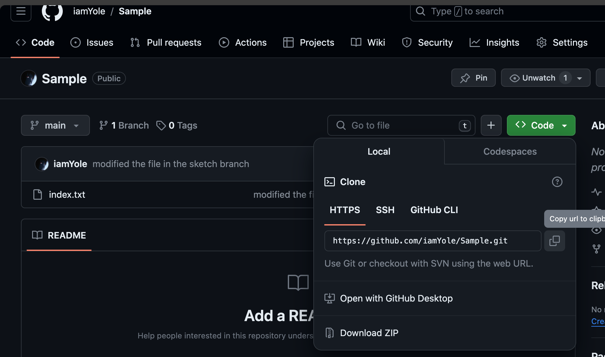

# Basic Git Operations

### Part 1 - Initialising a Repository

- **Initialising a git repository**  
   After installing `git`, create and fold and run the command `git init` to initialise a repository
  
- **Making your first commit**
  Create a file, and some contents then run the following commands:

  - `git status`: To check any untracked files
  - `git add .`: To add all untracked files to the staging area
  - `git commit -m `: To commit the changes. This command must be accompanied with the `-m` flag and a message describing the commit.

  

### Part 2 - Working with Branches

A Branch in git can be likened to a sketch where all our rough works are done, before moving the finished project to the main document or in this case main branch.

- **Creating your first branch**
  Using the `git chechout -b "name_branch"` command, with can create a new branch and switch to the newly created branch
  
  In the above image a new branch was created called _sketch_, and we can see the new branch contains all the information from the main/master branch ready to be edited without altering the content of the main branch
- **Making changes and committing the changes to the new branch**  
   We can make any number of changes to the file in the new branch, including adding or deleting new files, commit the changes when we are satisfied and then merge the changes to the main branch to have an updated version of our work.
  
  In the image above, we added new contents to the file this can be seen with the `git diff` command. The text in red shows the old content, while the text in green shows the added or modified content. We can commit the changes made to the branch without affect the content of the file in the main branch
  
  From the image above, we commited the changes in the _sktch_ branch, and then switch to the _main_ branch where we noticed the file in the main branch was still in it's original form. To change that, we can run the `git merge` command to move the changes we've made in the _sketch_ branch to the _main_ branch
  
  In order to `merge` the content from the _sketch_ branch to the _main_ branch, we first checkout or switch to the _main_ branch then run the `git merge sketch` command.
- **Deleting a Branch**  
   After merging the content of the _sketch_ branch to the main branch, we are now satisfied with the content of our file, so we can safely delete the _sketch_ branch by running the command `git branch -d sketch`.
  

### Part 3 - Collaboration and Remote Repository

The powers of git comes to life when used in a collaborative enviroment, where multiple people are working on a project and modifing several files at the same time.  
For this, we need to create a **GitHub** account and then create a repository, or move our local repository to the **GitHub** account. If we are creating a new repository from **GitHub** account, we simply clone to repository to our local machine. However, since we've already initialised a local **git** repository, we will be adding our local repository to _GitHub_ using the `git remote` command

- **Pushing a local repository to GitHub**  
   The first step would be to create a new repository from **GitHub**
  
  Once the repository is created, **GitHub** provides a sameple set of instructs to initialise a local repository and the push the repo to **GitHub**.
  
  We've already done the first part, so now, we will be pushing our local repository to **GitHub**
  
  `git remote add origin https://github.com/iamYole/Sample.git`: This commend was used to link our local repository to **GitHub**  
   `git branch -M main`: This command was used to change the name of our branch from _master_ to _main_  
   `git push -u origin main`: And finally, this command was used to push the contents of our local repository to **GitHub**. In order to push contents to a remote repository, the login credentials to the remote repository needs to be provided.  
   If we refresh the **GitHub** repo, we should be able to see all the contents from our local repository
  .
- **Cloning a Git Repository**  
   Having pushed our files to **GitHub**, in order for other memeber of our team to contribute to the project, they have to first clone the repository and the commit and puch any changes they make to the central repo in **GitHub**
  

  - The first step is to copy the repo's url as seen above
  - The second step would be for all team members to create a new folder or directory, and the run the `git clone` command.

  
  As we can see, the structure and state of all the files are copied to each team members local system and _git_ would be traking all changes made in real time  
   **GitHub** tracks changes as well as the name or the team members responsible for each changes. This can be done using the `git log` command as seen below.
  
